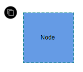
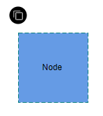
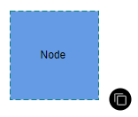
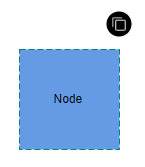
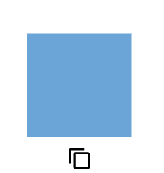
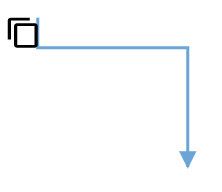
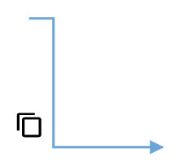
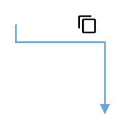

# User Handles in Blazor Diagram Component

User handles are customizable handles that can be used to perform custom actions and default clipboard actions.

## Initialization an userhandle

The user handle can enables for the selected nodes/connectors by setting a [`SelectorConstraints`](https://help.syncfusion.com/cr/blazor/Syncfusion.Blazor.Diagrams.SelectorConstraints.html) as `UserHandle` and then use the [`DiagramUserHandle`](https://help.syncfusion.com/cr/blazor/Syncfusion.Blazor.Diagrams.DiagramUserHandle.html) class to create an object for the user handles. The following code example used to enable and create an user handles for the diagram nodes/connectors.

```cshtml
@using Syncfusion.Blazor.Diagrams
@using System.Collections.ObjectModel

<SfDiagram Height="600px"
           Nodes="@NodeCollection"
           SelectedItems="@SelectedModel">
</SfDiagram>

@code{
    // Defines diagram's nodes collection
    public ObservableCollection<DiagramNode> NodeCollection { get; set; }
    // Defines diagram's SelectedItems
    public Syncfusion.Blazor.Diagrams.DiagramSelectedItems SelectedModel { get; set; }
    ObservableCollection<DiagramUserHandle> UserHandles { get; set; }
    protected override void OnInitialized()
    {
        //Creating the userhandle for cloning the objects
        DiagramUserHandle cloneHandle = new DiagramUserHandle()
        {
            //Name of the user handle
            Name = "clone",
            //Set pathdata for userhandle
            PathData = "M60.3,18H27.5c-3,0-5.5,2.4-5.5,5.5v38.2h5.5V23.5h32.7V18z M68.5,28.9h-30c-3,0-5.5,2.4-5.5,5.5v38.2c0,3,2.4,5.5,5.5,5.5h30c3,0,5.5-2.4,5.5-5.5V34.4C73.9,31.4,71.5,28.9,68.5,28.9z M68.5,72.5h-30V34.4h30V72.5z",
            //Set visibility for the user handle
            Visible = true,
            //Set the position for the user handle
            Offset = 0,
            //Set side based on the given offset
            Side = Side.Bottom,
            //set margin for the user handle
            Margin = new DiagramUserHandleMargin() { Top = 0, Bottom = 0, Left = 0, Right = 0 }
        };
        //Add user handle to the collection...
        UserHandles = new ObservableCollection<DiagramUserHandle>()
        {
            cloneHandle
        };
        SelectedModel = new Syncfusion.Blazor.Diagrams.DiagramSelectedItems()
        {
            //Enable userhandle for selected items...
            Constraints = SelectorConstraints.UserHandle,
            UserHandles = this.UserHandles
        };

        NodeCollection = new ObservableCollection<DiagramNode>();

        DiagramNode diagramNode = new DiagramNode()
        {
            Id = "node1",
            OffsetX = 100,
            OffsetY = 100,
            Width = 100,
            Height = 100,
            Style = new NodeShapeStyle() { Fill = "#659be5", StrokeColor = "none" },
            Annotations = new ObservableCollection<DiagramNodeAnnotation>() { new DiagramNodeAnnotation() { Content = "Node" } }
        };

        NodeCollection.Add(diagramNode);
    }
}
```


## Customization

If set `false` to the [`DisableConnectors`](https://help.syncfusion.com/cr/blazor/Syncfusion.Blazor.Diagrams.DiagramUserHandle.html#Syncfusion_Blazor_Diagrams_DiagramUserHandle_DisableConnectors) property in userhandle, the userhandle prevents to rendering for the connectors. The following code example is used to show userhandle for the nodes alone.

```cshtml
@using Syncfusion.Blazor.Diagrams
@using System.Collections.ObjectModel

<SfDiagram @ref="@Diagram" Height="600px"
           Nodes="@NodeCollection"
           Connectors="@ConnectorCollection"
           SelectedItems="@SelectedModel">
</SfDiagram>

@code {
    // Reference to diagram
    SfDiagram Diagram;
    // Defines diagram's nodes collection
    public ObservableCollection<DiagramNode> NodeCollection { get; set; }
    // Defines diagram's connector collection
    public ObservableCollection<DiagramConnector> ConnectorCollection { get; set; }
    // Defines diagram's SelectedItems
    public Syncfusion.Blazor.Diagrams.DiagramSelectedItems SelectedModel { get; set; }
    ObservableCollection<DiagramUserHandle> UserHandles { get; set; }
    protected override void OnInitialized()
    {
        //Creating the userhandle for cloning the objects
        DiagramUserHandle cloneHandle = new DiagramUserHandle()
        {
            //Name of the user handle
            Name = "clone",
            //Set pathdata for userhandle
            PathData = "M60.3,18H27.5c-3,0-5.5,2.4-5.5,5.5v38.2h5.5V23.5h32.7V18z M68.5,28.9h-30c-3,0-5.5,2.4-5.5,5.5v38.2c0,3,2.4,5.5,5.5,5.5h30c3,0,5.5-2.4,5.5-5.5V34.4C73.9,31.4,71.5,28.9,68.5,28.9z M68.5,72.5h-30V34.4h30V72.5z",
            //Set visibility for the user handle
            Visible = true,
            //Set the position for the user handle
            Offset = 0,
            //Set side based on the given offset
            Side = Side.Bottom,
            //Disable to render this userhandle for connectors
            DisableConnectors = true,
            //set margin for the user handle
            Margin = new DiagramUserHandleMargin() { Top = 0, Bottom = 0, Left = 0, Right = 0 }
        };

        //Add user handle to the collection...
        UserHandles = new ObservableCollection<DiagramUserHandle>()
        {
            cloneHandle
        };
        SelectedModel = new Syncfusion.Blazor.Diagrams.DiagramSelectedItems()
        {
            //Enable userhandle for selected items...
            Constraints = SelectorConstraints.UserHandle,
            UserHandles = this.UserHandles
        };

        NodeCollection = new ObservableCollection<DiagramNode>();

        DiagramNode diagramNode = new DiagramNode()
        {
            Id = "node1",
            OffsetX = 100,
            OffsetY = 100,
            Width = 100,
            Height = 100,
            Style = new NodeShapeStyle() { Fill = "#659be5", StrokeColor = "none" },
            Annotations = new ObservableCollection<DiagramNodeAnnotation>() { new DiagramNodeAnnotation() { Content = "Node" } }
        };

        NodeCollection.Add(diagramNode);

        ConnectorCollection = new ObservableCollection<DiagramConnector>();

        DiagramConnector diagramConnector = new DiagramConnector()
        {
            SourcePoint = new ConnectorSourcePoint() { X= 300, Y=100},
            TargetPoint = new ConnectorTargetPoint() { X= 300, Y=300}
        };

        ConnectorCollection.Add(diagramConnector);
    }
}
```

>**Note**: Also you can disable the [`DisableNodes`](https://help.syncfusion.com/cr/blazor/Syncfusion.Blazor.Diagrams.DiagramUserHandle.html#Syncfusion_Blazor_Diagrams_DiagramUserHandle_DisableNodes) property in userhandle, the userhandle prevent to rendering for the nodes.

### Position

The [`Offset`](https://help.syncfusion.com/cr/blazor/Syncfusion.Blazor.Diagrams.DiagramUserHandle.html#Syncfusion_Blazor_Diagrams_DiagramUserHandle_Offset) property of userhandle is used to align the userhandles based on fractions. 0 represents Top-Left corner, 1 represents Bottom-Right corner, and 0.5 represents half of Width or Height.

The [`Side`](https://help.syncfusion.com/cr/blazor/Syncfusion.Blazor.Diagrams.DiagramUserHandle.html#Syncfusion_Blazor_Diagrams_DiagramUserHandle_Side) property is used to set how the userhandle is aligned based on the given [`Offset`](https://help.syncfusion.com/cr/blazor/Syncfusion.Blazor.Diagrams.DiagramUserHandle.html#Syncfusion_Blazor_Diagrams_DiagramUserHandle_Offset).

The following table shows all the possible alignments visually shows the userhandle positions.

| Offset | Side | Output |
| -------- | -------- | -------- |
|0|Left||
|0|Right||
|0|Top||
|0|Bottom||
|1|Left||
|1|Right||
|1|Top||
|1|Bottom||

### Size

Diagram allows you set size for userhandles by using the [`Size`](https://help.syncfusion.com/cr/blazor/Syncfusion.Blazor.Diagrams.DiagramUserHandle.html#Syncfusion_Blazor_Diagrams_DiagramUserHandle_Size) property. The default value of the [`Size`](https://help.syncfusion.com/cr/blazor/Syncfusion.Blazor.Diagrams.DiagramUserHandle.html#Syncfusion_Blazor_Diagrams_DiagramUserHandle_Offset) property is 25.

### Style

* You can change the style of the userhandles with the specific properties of PathColor, BorderColor, BackgroundColor and BorderWidth. The following code explains how to customize the appearance of the userhandles.

* The userhandle's [`PathColor`](https://help.syncfusion.com/cr/blazor/Syncfusion.Blazor.Diagrams.DiagramUserHandle.html#Syncfusion_Blazor_Diagrams_DiagramUserHandle_PathColor) property used to change the color of the given [`PathData`](https://help.syncfusion.com/cr/blazor/Syncfusion.Blazor.Diagrams.DiagramUserHandle.html#Syncfusion_Blazor_Diagrams_DiagramUserHandle_PathData) of the userhandle.

* The userhandle [`BorderColor`](https://help.syncfusion.com/cr/blazor/Syncfusion.Blazor.Diagrams.DiagramUserHandle.html#Syncfusion_Blazor_Diagrams_DiagramUserHandle_BorderColor), [`BackgroundColor`](https://help.syncfusion.com/cr/blazor/Syncfusion.Blazor.Diagrams.DiagramUserHandle.html#Syncfusion_Blazor_Diagrams_DiagramUserHandle_BackgroundColor) properties are used to define the background color and border color of the userhandle and the [`BorderWidth`](https://help.syncfusion.com/cr/blazor/Syncfusion.Blazor.Diagrams.DiagramUserHandle.html#Syncfusion_Blazor_Diagrams_DiagramUserHandle_BorderWidth) property is used to define the border width of the userhandles.

*The [`Visible`](https://help.syncfusion.com/cr/blazor/Syncfusion.Blazor.Diagrams.DiagramUserHandle.html#Syncfusion_Blazor_Diagrams_DiagramUserHandle_Visible) property of the userhandle enables or disables the visibility of userhandle.

The following code explains how to customize the appearance of the userhandle.

```csharp
//Creating the userhandle for cloning the objects
DiagramUserHandle cloneHandle = new DiagramUserHandle()
{
    //Name of the user handle
    Name = "clone",
    //Set pathdata for userhandle
    PathData = "M60.3,18H27.5c-3,0-5.5,2.4-5.5,5.5v38.2h5.5V23.5h32.7V18z M68.5,28.9h-30c-3,0-5.5,2.4-5.5,5.5v38.2c0,3,2.4,5.5,5.5,5.5h30c3,0,5.5-2.4,5.5-5.5V34.4C73.9,31.4,71.5,28.9,68.5,28.9z M68.5,72.5h-30V34.4h30V72.5z",
    //Set visibility for the user handle
    Visible = true,
    //Set the position for the user handle
    Offset = 1,
    //Set side based on the given offset
    Side = Side.Bottom,
    //Disable to render this userhandle for connectors
    DisableConnectors = true,
    //set margin for the user handle
    Margin = new DiagramUserHandleMargin() { Top = 0, Bottom = 0, Left = 0, Right = 0 },
    //Set size of the user handle
    Size = 50,
    //Set pathcolor for given pathdata
    PathColor = "yellow",
    //Set Border color of the user handle
    BorderColor = "red",
    //Set Background Color of the user handle
    BackgroundColor = "green",
    //Set Border Width Color of the user handle
    BorderWidth = 3,
};
```


## Events

The Diagram control provides following list of events for the userhandle.

| Event Name | Event Type | Description |
| -------- | -------- | -------- |
| [`OnUserHandleMouseDown`](https://help.syncfusion.com/cr/blazor/Syncfusion.Blazor.Diagrams.DiagramEvents.html#Syncfusion_Blazor_Diagrams_DiagramEvents_OnUserHandleMouseDown) | [`UserHandleEventsArgs`](https://help.syncfusion.com/cr/blazor/Syncfusion.Blazor.Diagrams.UserHandleEventsArgs.html) | Triggered when the mouse pointer is over the userhandle and mouse button is down. |
| [`OnUserHandleMouseUp`](https://help.syncfusion.com/cr/blazor/Syncfusion.Blazor.Diagrams.DiagramEvents.html#Syncfusion_Blazor_Diagrams_DiagramEvents_OnUserHandleMouseUp) | [`UserHandleEventsArgs`](https://help.syncfusion.com/cr/blazor/Syncfusion.Blazor.Diagrams.UserHandleEventsArgs.html) | Triggered when the mouse pointer is over the userhandle and mouse button is released. |
| [`OnUserHandleMouseEnter`](https://help.syncfusion.com/cr/blazor/Syncfusion.Blazor.Diagrams.DiagramEvents.html#Syncfusion_Blazor_Diagrams_DiagramEvents_OnUserHandleMouseEnter) | [`UserHandleEventsArgs`](https://help.syncfusion.com/cr/blazor/Syncfusion.Blazor.Diagrams.UserHandleEventsArgs.html) | Triggered when mouse enter into the userhandle. |
| [`OnUserHandleMouseLeave`](https://help.syncfusion.com/cr/blazor/Syncfusion.Blazor.Diagrams.DiagramEvents.html#Syncfusion_Blazor_Diagrams_DiagramEvents_OnUserHandleMouseLeave) | [`UserHandleEventsArgs`](https://help.syncfusion.com/cr/blazor/Syncfusion.Blazor.Diagrams.UserHandleEventsArgs.html) | Triggered when mouse leaves the userhandle. |

The following code explains how to use the `OnUserHandleMouseUp` event for an userhandle.

```cshtml
@using Syncfusion.Blazor.Diagrams
@using System.Collections.ObjectModel

<SfDiagram @ref="@Diagram" Height="600px"
           Nodes="@NodeCollection"
           Connectors="@ConnectorCollection"
           SelectedItems="@SelectedModel">
    <DiagramEvents OnUserHandleMouseUp="@OnUserHandleMouseUp"></DiagramEvents>
</SfDiagram>

@code {
    // Reference to diagram
    SfDiagram Diagram;

    // Defines diagram's nodes collection
    public ObservableCollection<DiagramNode> NodeCollection { get; set; }
    // Defines diagram's connector collection
    public ObservableCollection<DiagramConnector> ConnectorCollection { get; set; }

    // Defines diagram's SelectedItems
    public Syncfusion.Blazor.Diagrams.DiagramSelectedItems SelectedModel { get; set; }

    ObservableCollection<DiagramUserHandle> UserHandles { get; set; }

    protected override void OnInitialized()
    {
        //Creating the userhandle for cloning the objects
        DiagramUserHandle cloneHandle = new DiagramUserHandle()
        {
            //Name of the user handle
            Name = "clone",
            //Set pathdata for userhandle
            PathData = "M60.3,18H27.5c-3,0-5.5,2.4-5.5,5.5v38.2h5.5V23.5h32.7V18z M68.5,28.9h-30c-3,0-5.5,2.4-5.5,5.5v38.2c0,3,2.4,5.5,5.5,5.5h30c3,0,5.5-2.4,5.5-5.5V34.4C73.9,31.4,71.5,28.9,68.5,28.9z M68.5,72.5h-30V34.4h30V72.5z",
            //Set visibility for the user handle
            Visible = true,
            //Set the position for the user handle
            Offset = 0,
            //Set side based on the given offset
            Side = Side.Bottom,
            //Disable to render this userhandle for connectors
            DisableConnectors = true,
            //set margin for the user handle
            Margin = new DiagramUserHandleMargin() { Top = 0, Bottom = 0, Left = 0, Right = 0 }
        };

        //Add user handle to the collection...
        UserHandles = new ObservableCollection<DiagramUserHandle>()
        {
            cloneHandle
        };
        SelectedModel = new Syncfusion.Blazor.Diagrams.DiagramSelectedItems()
        {
            //Enable userhandle for selected items...
            Constraints = SelectorConstraints.UserHandle,
            UserHandles = this.UserHandles
        };

        NodeCollection = new ObservableCollection<DiagramNode>();

        DiagramNode diagramNode = new DiagramNode()
        {
            Id = "node1",
            OffsetX = 100,
            OffsetY = 100,
            Width = 100,
            Height = 100,
            Style = new NodeShapeStyle() { Fill = "#659be5", StrokeColor = "none" },
            Annotations = new ObservableCollection<DiagramNodeAnnotation>() { new DiagramNodeAnnotation() { Content = "Node" } }
        };

        NodeCollection.Add(diagramNode);

        ConnectorCollection = new ObservableCollection<DiagramConnector>();

        DiagramConnector diagramConnector = new DiagramConnector()
        {
            SourcePoint = new ConnectorSourcePoint() { X= 300, Y=100},
            TargetPoint = new ConnectorTargetPoint() { X=300,Y=300}
        };

        ConnectorCollection.Add(diagramConnector);
    }
    /// <summary>
    /// mouse up event for the userhandles...
    /// </summary>
    public async Task OnUserHandleMouseUp(UserHandleEventsArgs args)
    {
        if (Diagram.SelectedItems.Nodes.Count > 0)
        {
            await Diagram.Copy();
            await Diagram.Paste();
        }
    }
}
```

## Fixed user handles

 The fixed user handles are used to add some frequently used commands around the node and connector even without selecting it.

## Initialization an fixed user handles

To create the fixed user handles, define and add them to the collection of nodes and connectors property. The following code example used to create an fixed user handles for the  nodes and connectors.

```csharp

@using Syncfusion.Blazor.Diagrams
@using System.Collections.ObjectModel

<SfDiagram Height="600px" Nodes="@NodeCollection">
</SfDiagram>

@code{
    public ObservableCollection<DiagramNode> NodeCollection = new ObservableCollection<DiagramNode>() { };
    protected override void OnInitialized()
    {
        DiagramNode node1 = new DiagramNode()
        {
            OffsetX = 250,
            OffsetY = 250,
            Width = 100,
            Height = 100,
            Style = new NodeShapeStyle() { Fill = "#6BA5D7", StrokeColor = "white" },
            // A fixed user handle is created and stored in fixed user handle collection of Node.
            FixedUserHandles = new ObservableCollection<DiagramNodeFixedUserHandle>()
        {
         new DiagramNodeFixedUserHandle() { Id = "user1",Height = 20, Width = 20, Visibility = true,Padding = new IconPadding{Bottom=1,Left=1,Right=1,Top=1 }, Margin = new UserHandleMargin(){ Right = 20},Offset = new UserHandleOffset() { X =0 , Y = 0 }, PathData = "M60.3,18H27.5c-3,0-5.5,2.4-5.5,5.5v38.2h5.5V23.5h32.7V18z M68.5,28.9h-30c-3,0-5.5,2.4-5.5,5.5v38.2c0,3,2.4,5.5,5.5,5.5h30c3,0,5.5-2.4,5.5-5.5V34.4C73.9,31.4,71.5,28.9,68.5,28.9z M68.5,72.5h-30V34.4h30V72.5z" },}
        };
        NodeCollection.Add(node1);
    }
}

```

## Customization the fixed user handle

* The id property of fixed user handle is used to define the unique identification of the fixed user handle and it is further used to add custom events to the fixed user handle.

* The fixed user handle can be positioned relative to the node and connector boundaries. It has offset, padding and cornerRadius settings. It is used to position and customize the fixed user handle.

* The `Padding` is used to leave the space that is inside the fixed user handle between the icon and border.

* The corner radius allows to create fixed user handles with rounded corners. The radius of the rounded corner is set with the `cornerRadius` property.

> The PathData needs to be provided to render fixed user handle.

### Size

 Diagram allows you set size for the fixed user handles by using the `width` and `height` property. The default value of the width and height property is 10.

### Style

* You can change the style of the fixed user handles with the specific properties of borderColor, borderWidth, and background color using the handleStrokeColor, handleStrokeWidth, and fill properties, and the icon borderColor, and borderWidth using the iconStrokeColor and iconStrokeWidth.

* The fixed user handle's `iconStrokeColor` and `iconStrokeWidth` property used to change the stroke color and stroke width of the given `pathData`.

* The fixed user handle `handleStrokeColor` and `fill` properties are used to define the background color and border color of the userhandle and the `handleStrokeWidth` property is used to define the border width of the fixed user handle.

* The `visible` property of the fixed user handle enables or disables the visibility of fixed user handle.

The following code explains how to customize the appearance of the fixed user handles.

```cshtml
@using Syncfusion.Blazor.Diagrams
@using System.Collections.ObjectModel
<SfDiagram Height="600px" Nodes="@NodeCollection" Connectors="@ConnectorCollection">
</SfDiagram>
@code
{
    public ObservableCollection<DiagramConnector> ConnectorCollection { get; set; }
    public ObservableCollection<DiagramNode> NodeCollection { get; set; }
    protected override void OnInitialized()
    {
        NodeCollection = new ObservableCollection<DiagramNode>();
        DiagramNode node = new DiagramNode()
        {
            Width = 100,
            Height = 100,
            OffsetX = 100,
            OffsetY = 100,
            Style = new NodeShapeStyle() { Fill = "#6BA5D7", StrokeColor = "white" },
            // A fixed user handle is created and stored in fixed user handle collection of Node.
            FixedUserHandles = new ObservableCollection<DiagramNodeFixedUserHandle>(){
         new DiagramNodeFixedUserHandle() { Id = "user1",Height = 20, Width = 20, Visibility = true,Padding = new IconPadding{Bottom=1,Left=1,Right=1,Top=1 }, Margin = new UserHandleMargin(){ Right = 20},Offset = new UserHandleOffset() { X =0 , Y = 0 }, PathData = "M60.3,18H27.5c-3,0-5.5,2.4-5.5,5.5v38.2h5.5V23.5h32.7V18z M68.5,28.9h-30c-3,0-5.5,2.4-5.5,5.5v38.2c0,3,2.4,5.5,5.5,5.5h30c3,0,5.5-2.4,5.5-5.5V34.4C73.9,31.4,71.5,28.9,68.5,28.9z M68.5,72.5h-30V34.4h30V72.5z"  },}
        };
        NodeCollection.Add(node);
        ConnectorCollection = new ObservableCollection<DiagramConnector>();
        DiagramConnector connector = new DiagramConnector()
        {
          SourcePoint = new ConnectorSourcePoint() { X = 300, Y = 40 },
            TargetPoint = new ConnectorTargetPoint() { X = 400, Y = 160 },
            Type = Segments.Orthogonal,
            Style = new ConnectorShapeStyle() { StrokeColor = "#6BA5D7" },
            // A fixed user handle is created and stored in fixed user handle collection of Connector.
            FixedUserHandles = new ObservableCollection<DiagramConnectorFixedUserHandle>()
            {
              new DiagramConnectorFixedUserHandle() { Id = "user1",Height = 25, Width = 25, Offset = 0.5,Visibility = true,Padding = new IconPadding{Bottom=1,Left=1,Right=1,Top=1 },Alignment = FixedUserHandleAlignment.After,Displacement = new ConnectorDisplacementPoint{X = 5, Y = 5 }, PathData = "M60.3,18H27.5c-3,0-5.5,2.4-5.5,5.5v38.2h5.5V23.5h32.7V18z M68.5,28.9h-30c-3,0-5.5,2.4-5.5,5.5v38.2c0,3,2.4,5.5,5.5,5.5h30c3,0,5.5-2.4,5.5-5.5V34.4C73.9,31.4,71.5,28.9,68.5,28.9z M68.5,72.5h-30V34.4h30V72.5z" }
            },
        };
        ConnectorCollection.Add(connector);
    }
}
```

> The fixed user handle id need to be unique.

## Customizing the node fixed user handle

* The node fixed user handle can be aligned relative to the node boundaries. It has `margin` and `offset` settings. It is quite useful to position the node fixed userhandle and used together and gives you more control over the node fixed user handle positioning.

### Margin for the node fixed user handle

Margin is an absolute value used to add some blank space in any one of its four sides. The fixed user handle can be displaced with the `margin` property.

### Offset for the node fixed user handle

The `offset` property of fixed user handle is used to align the user handle based on the `x` and `y` points. (0,0) represents the top or left corner and (1,1) represents the bottom or right corner.

The following table shows all the possible alignments visually shows the fixed user handle positions.

| Offset | Margin | Output |
| -------- | -------- | -------- |
| (0,0) | Right = 20 ||
| (0.5,0) | Bottom = 20 ||
| (1,0) | Left = 20 ||
| (0,0.5) | Right = 20 ||
| (0,1) | Left = 20 ||
| (0,1) | Right = 20 ||
| (0.5,1) | Top = 20 ||
| (1,1) | Left = 20 ||

The following code explains how to customize the node fixed user handle.

```cshtml
@using Syncfusion.Blazor.Diagrams
@using System.Collections.ObjectModel

<SfDiagram Height="600px" Nodes="@NodeCollection">
</SfDiagram>

@code{
    public ObservableCollection<DiagramNode> NodeCollection = new ObservableCollection<DiagramNode>() { };
    protected override void OnInitialized()
    {
        DiagramNode node1 = new DiagramNode()
        {
            OffsetX = 250,
            OffsetY = 250,
            Width = 100,
            Height = 100,
            Style = new NodeShapeStyle() { Fill = "#6BA5D7", StrokeColor = "white" },
            // A fixed user handle is created and stored in fixed user handle collection of Node.
            FixedUserHandles = new ObservableCollection<DiagramNodeFixedUserHandle>(){
         new DiagramNodeFixedUserHandle() { Id = "user1",Height = 20, Width = 20, Visibility = true,Padding = new IconPadding{Bottom=1,Left=1,Right=1,Top=1 }, Margin = new UserHandleMargin(){ Right = 20},Offset = new UserHandleOffset() { X =0 , Y = 0 }, PathData = "M60.3,18H27.5c-3,0-5.5,2.4-5.5,5.5v38.2h5.5V23.5h32.7V18z M68.5,28.9h-30c-3,0-5.5,2.4-5.5,5.5v38.2c0,3,2.4,5.5,5.5,5.5h30c3,0,5.5-2.4,5.5-5.5V34.4C73.9,31.4,71.5,28.9,68.5,28.9z M68.5,72.5h-30V34.4h30V72.5z"  },}
        };
        NodeCollection.Add(node1);
    }
}
```

## Customizing the connector fixed user handle

* The connector fixed user handle can be aligned relative to the connector boundaries. It has alignment, displacement and offset settings. It is useful to position the connector fixed user handle and used together and gives you more control over the connector fixed user handle positioning.

* The `offset` and `alignment` properties of fixed user handle allows you to align the connector fixed user handles to the segments.

### Offset for the connector fixed user handle

The `offset` property of connector fixed user handle is used to align the user handle based on fractions. 0 represents the connector source point, 1 represents the connector target point, and 0.5 represents the center point of the connector segment.

### Alignment

The connector’s fixed user handle can be aligned over its segment path using the `alignment` property of fixed user handle.

The following table shows all the possible alignments visually shows the fixed user handle positions.

| Offset | Alignment | Output |
| -------- | -------- | -------- |
| 0 | Before ||
| 0.5 | Center ||
| 1 | After ||

### Displacement

* The `displacement` property allows you to specify the space to be left from the connector segment based on the x and y value provided.

The following table shows all the possible alignments visually shows the fixed user handle positions.

| Displacement | Alignment | Output |
| -------- | -------- | -------- |
| x=10 | Before ||
| x=10 | After ||
| y=10 | Before ||
| y=10 | After ||

> Displacement will not be done if the alignment is set to be center.

The following code explains how to customize the connector fixed user handle.

```cshtml
@using Syncfusion.Blazor.Diagrams
@using System.Collections.ObjectModel

<SfDiagram Height="600px" Connectors="@ConnectorCollection">
</SfDiagram>

@code
{
    public ObservableCollection<DiagramConnector> ConnectorCollection = new ObservableCollection<DiagramConnector>();
    protected override void OnInitialized()
    {
        DiagramConnector diagramConnector = new DiagramConnector()
        {
            SourcePoint = new ConnectorSourcePoint() { X = 100, Y = 100 },
            TargetPoint = new ConnectorTargetPoint() { X = 200, Y = 200 },
            Type = Segments.Orthogonal,
            // A fixed user handle is created and stored in fixed user handle collection of Connector.
            FixedUserHandles = new ObservableCollection<DiagramConnectorFixedUserHandle>()
            {
              new DiagramConnectorFixedUserHandle() { Id = "user1",Height = 25, Width = 25, Offset = 0.5,Visibility = true,Padding = new IconPadding{Bottom=1,Left=1,Right=1,Top=1 },Alignment = FixedUserHandleAlignment.After,Displacement = new ConnectorDisplacementPoint{X = 5, Y = 5 }, PathData = "M60.3,18H27.5c-3,0-5.5,2.4-5.5,5.5v38.2h5.5V23.5h32.7V18z M68.5,28.9h-30c-3,0-5.5,2.4-5.5,5.5v38.2c0,3,2.4,5.5,5.5,5.5h30c3,0,5.5-2.4,5.5-5.5V34.4C73.9,31.4,71.5,28.9,68.5,28.9z M68.5,72.5h-30V34.4h30V72.5z" }
            },
        };
        ConnectorCollection.Add(diagramConnector);
    }
}
```

## FixedUserHandle Event

The Diagram control provides following event for the fixed user handle.

| Event Name | Event Type | Description |
| -------- | -------- | -------- |
| FixedUserHandleClick | FixedUserHandleClickEventArgs | Triggered when the mouse pointer is over the userhandle and mouse button is up. |

```cshtml
@using Syncfusion.Blazor.Diagrams
@using System.Collections.ObjectModel

<SfDiagram Height="600px" Nodes="@NodeCollection"  @ref="diagram">
  <DiagramEvents FixedUserHandleClick="Changed"></DiagramEvents>
</SfDiagram>

@code{
    SfDiagram diagram;
    public async void Changed(FixedUserHandleClickEventArgs args)
    {
        if (args.Element.Node.Id == "node1" && args.FixedUserHandle.NodeFixedUserHandle.Id == "user1")
        {
            await diagram.Copy();
            await diagram.Paste();
        }
    }
    public ObservableCollection<DiagramNode> NodeCollection = new ObservableCollection<DiagramNode>() { };
    protected override void OnInitialized()
    {
        DiagramNode node1 = new DiagramNode()
        {
            OffsetX = 250,
            OffsetY = 250,
            Id = "node1",
            Width = 100,
            Height = 100,
            Style = new NodeShapeStyle() { Fill = "#6BA5D7", StrokeColor = "white" },
            // A fixed user handle is created and stored in fixed user handle collection of Node.
            FixedUserHandles = new ObservableCollection<DiagramNodeFixedUserHandle>()
        {
         new DiagramNodeFixedUserHandle() { Id = "user1",Height = 20, Width = 20, Visibility = true,Padding = new IconPadding{Bottom=1,Left=1,Right=1,Top=1 }, Margin = new UserHandleMargin(){ Right = 20},Offset = new UserHandleOffset() { X =0 , Y = 0 }, PathData = "M60.3,18H27.5c-3,0-5.5,2.4-5.5,5.5v38.2h5.5V23.5h32.7V18z M68.5,28.9h-30c-3,0-5.5,2.4-5.5,5.5v38.2c0,3,2.4,5.5,5.5,5.5h30c3,0,5.5-2.4,5.5-5.5V34.4C73.9,31.4,71.5,28.9,68.5,28.9z M68.5,72.5h-30V34.4h30V72.5z"  },}
        };
        NodeCollection.Add(node1);
    }
}
```