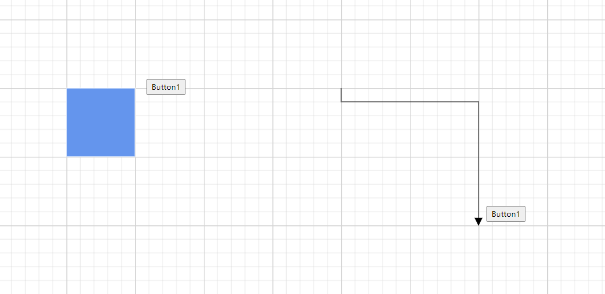

# User Handles for Node and Connector in Blazor Diagram Component

User handles are customizable interactive elements that enhance diagram functionality. They can be utilized to execute custom-defined actions as well as perform standard clipboard operations, providing a versatile and user-friendly interface for diagram manipulation.

## How to Initialize the User Handle

The user handle can be enabled for the selected nodes/connectors by setting a [SelectorConstraints](https://help.syncfusion.com/cr/blazor/Syncfusion.Blazor.Diagram.SelectorConstraints.html) as [UserHandle](https://help.syncfusion.com/cr/blazor/Syncfusion.Blazor.Diagram.SelectorConstraints.html#Syncfusion_Blazor_Diagram_SelectorConstraints_UserHandle) and then use the [UserHandle](https://help.syncfusion.com/cr/blazor/Syncfusion.Blazor.Diagram.UserHandle.html) class to define the userhandle object and add that to [UserHandles](https://help.syncfusion.com/cr/blazor/Syncfusion.Blazor.Diagram.DiagramSelectionSettings.html#Syncfusion_Blazor_Diagram_DiagramSelectionSettings_UserHandles) collection of the DiagramSelectionSettings. The following code example is used to enable and create user handles for the diagram nodes/connectors.

```csharp
@using Syncfusion.Blazor.Diagram

<SfDiagramComponent Height="600px"
                    Nodes="@nodes"
                    SelectionSettings="@SelectedModel">
    <SnapSettings>
        <HorizontalGridLines LineColor="White" LineDashArray="2,2" />
        <VerticalGridLines LineColor="White" LineDashArray="2,2" />
    </SnapSettings>
</SfDiagramComponent>

@code
{
    // Defines diagram's nodes collection.
    DiagramObjectCollection<Node> nodes = new DiagramObjectCollection<Node>();
    // Defines diagram's SelectionSettings.
    DiagramSelectionSettings SelectedModel = new DiagramSelectionSettings();
    DiagramObjectCollection<UserHandle> UserHandles = new DiagramObjectCollection<UserHandle>();
    protected override void OnInitialized()
    {
        //Creating the userhandle for cloning the objects.
        UserHandle cloneHandle = new UserHandle()
        {
            //Name of the user handle.
            Name = "clone",
            //Set path data for userhandle.
            PathData = "M60.3,18H27.5c-3,0-5.5,2.4-5.5,5.5v38.2h5.5V23.5h32.7V18z M68.5,28.9h-30c-3,0-5.5,2.4-5.5,5.5v38.2c0,3,2.4,5.5,5.5,5.5h30c3,0,5.5-2.4,5.5-5.5V34.4C73.9,31.4,71.5,28.9,68.5,28.9z M68.5,72.5h-30V34.4h30V72.5z",
            //Set visibility for the user handle.
            Visible = true,
            //Set the position for the user handle.
            Offset = 0,
            //Set side based on the given offset.
            Side = Direction.Bottom,
            //Set margin for the user handle.
            Margin = new DiagramThickness() { Top = 0, Bottom = 0, Left = 0, Right = 0 }
        };
        //Add user handle to the collection.
        UserHandles = new DiagramObjectCollection<UserHandle>()
        {
            cloneHandle
        };
        SelectedModel = new DiagramSelectionSettings()
        {
            //Enable userhandle for selected model.
            Constraints = SelectorConstraints.UserHandle,
            UserHandles = this.UserHandles
        };
        nodes = new DiagramObjectCollection<Node>();
        Node diagramNode = new Node()
        {
            ID = "node1",
            OffsetX = 100,
            OffsetY = 100,
            Width = 100,
            Height = 100,
            Style = new ShapeStyle() { Fill = "#6495ED", StrokeColor = "none" },
            Annotations = new DiagramObjectCollection<ShapeAnnotation>() { new ShapeAnnotation { Content = "Node" } }
        };
        nodes.Add(diagramNode);
    }
}
```
You can download a complete working sample from [GitHub](https://github.com/SyncfusionExamples/Blazor-Diagram-Examples/tree/master/UG-Samples/UserHandle/InitializeUserHandle)


## How to Customize User Handle Actions
User handles in the Syncfusion Blazor Diagram component can be customized to perform specific actions when clicked. By default, user handles provide basic functionality, but you can configure them to execute custom logic such as cloning, deleting, or triggering other actions.

### How to Handle User Handle Click Actions
To customize user handle actions in the Syncfusion Blazor Diagram component, you need to define a custom tool that implements the required behavior and map the user handle to this tool using the [GetCustomTool](https://help.syncfusion.com/cr/blazor/Syncfusion.Blazor.Diagram.SfDiagramComponent.html#Syncfusion_Blazor_Diagram_SfDiagramComponent_GetCustomTool) method, ensuring that the appropriate action is executed when the handle is clicked.

The following code explains how to customize the User Handle click Actions.

```csharp
@using System.Collections.ObjectModel
@using Syncfusion.Blazor.Diagram

<div>
    <SfDiagramComponent @ref="Diagram" Height="500px"
                        Nodes="@nodes"
                        Connectors="@connectors"
                        SelectionSettings="@SelectedModel"
                        GetCustomTool="GetCustomTool">
    </SfDiagramComponent>
</div>

@code
{
    public SfDiagramComponent Diagram;
    public DiagramObjectCollection<Node> nodes { get; set; }
    public DiagramObjectCollection<Connector> connectors { get; set; }
    // Defines diagram's SelectionSettings.
    DiagramSelectionSettings SelectedModel = new DiagramSelectionSettings();
    DiagramObjectCollection<UserHandle> UserHandles = new DiagramObjectCollection<UserHandle>();

    protected override void OnInitialized()
    {
        nodes = new DiagramObjectCollection<Node>();
        connectors = new DiagramObjectCollection<Connector>();
        InitDiagramModel();
    }

    public InteractionControllerBase GetCustomTool(DiagramElementAction action, string id)
    {
        return id == "clone" ? new CloneTool(Diagram) : new DeleteTool(Diagram);
    }

    public class DeleteTool : InteractionControllerBase
    {
        SfDiagramComponent diagram;
        public DeleteTool(SfDiagramComponent diagram) : base(diagram) { this.diagram = diagram; }
        public override void OnMouseUp(DiagramMouseEventArgs args)
        {
            diagram.Delete();
            base.OnMouseUp(args);
        }
    }

    public class CloneTool : DragController
    {
        SfDiagramComponent diagram;
        public CloneTool(SfDiagramComponent diagram) : base(diagram) { this.diagram = diagram; }
        public override void OnMouseDown(DiagramMouseEventArgs args)
        {
            diagram.Copy();
            diagram.Paste();
            base.OnMouseDown(args);
        }
    }

    private void InitDiagramModel()
    {
        var node = new Node()
        {
            ID = "Node1",
            OffsetX = 300,
            OffsetY = 200,
            Width = 100,
            Height = 100,
            Style = new ShapeStyle() { Fill = "#6495ED", StrokeColor = "none" },
            Annotations = new DiagramObjectCollection<ShapeAnnotation>()
            {
                new ShapeAnnotation() { Content = "Node" }
            }
        };
        nodes.Add(node);

        var connector = new Connector()
        {
            ID = "Connector1",
            SourcePoint = new DiagramPoint() { X = 500, Y = 150 },
            TargetPoint = new DiagramPoint() { X = 600, Y = 250 },
            Type = ConnectorSegmentType.Orthogonal,
            Annotations = new DiagramObjectCollection<PathAnnotation>()
            {
                new PathAnnotation(){ Content = "Connector" }
            }
        };
        connectors.Add(connector);
        var cloneHandle = new UserHandle()
        {
            Name = "clone",
            PathData = "M60.3,18H27.5c-3,0-5.5,2.4-5.5,5.5v38.2h5.5V23.5h32.7V18z M68.5,28.9h-30c-3,0-5.5,2.4-5.5,5.5v38.2c0,3,2.4,5.5,5.5,5.5h30c3,0,5.5-2.4,5.5-5.5V34.4C73.9,31.4,71.5,28.9,68.5,28.9z M68.5,72.5h-30V34.4h30V72.5z",
            Offset = 0,
            Side = Direction.Right,
            Visible = true,
            VisibleTarget = VisibleTarget.Node | VisibleTarget.Connector
        };
        var deleteHandle = new UserHandle()
        {
            Name = "delete",
            PathData = "M0.54700077,2.2130003 L7.2129992,2.2130003 7.2129992,8.8800011 C7.2129992,9.1920013 7.1049975,9.4570007 6.8879985,9.6739998 6.6709994,9.8910007 6.406,10 6.0939997,10 L1.6659999,10 C1.3539997,10 1.0890004,9.8910007 0.87200136,9.6739998 0.65500242,9.4570007 0.54700071,9.1920013 0.54700077,8.8800011 z M2.4999992,0 L5.2600006,0 5.8329986,0.54600048 7.7599996,0.54600048 7.7599996,1.6660004 0,1.6660004 0,0.54600048 1.9270014,0.54600048 z",
            Offset = 1,
            Side = Direction.Bottom,
            VisibleTarget = VisibleTarget.Node | VisibleTarget.Connector,
            Visible = true
        };
        UserHandles = new DiagramObjectCollection<UserHandle>()
        {
            cloneHandle, deleteHandle
        };
        SelectedModel = new DiagramSelectionSettings()
        {
            //Enable userhandle for selected model.
            Constraints = SelectorConstraints.UserHandle,

            UserHandles = this.UserHandles
        };
    }
}
```
You can download a complete working sample from [GitHub](https://github.com/SyncfusionExamples/Blazor-Diagram-Examples/tree/master/UG-Samples/UserHandle/UserHandleClickEvents)


## Customization

### How to Position User Handles

The [Offset](https://help.syncfusion.com/cr/blazor/Syncfusion.Blazor.Diagram.UserHandle.html#Syncfusion_Blazor_Diagram_UserHandle_Offset) property of user handles allows precise positioning based on fractional values. A value of 0 represents the Top-Left corner, 1 represents the Bottom-Right corner, and 0.5 represents the midpoint of either the Width or Height. The [Side](https://help.syncfusion.com/cr/blazor/Syncfusion.Blazor.Diagram.UserHandle.html#Syncfusion_Blazor_Diagram_UserHandle_Side) property determines the alignment orientation of the user handle relative to the specified `Offset`. Together, these properties offer flexible and accurate placement of user handles within the diagram.

The following table shows all the possible alignments visually shows the user handle positions.

| Offset | Side | Output |
| -------- | -------- | -------- |
|0|Left||
|0|Right||
|0|Top||
|0|Bottom||
|1|Left||
|1|Right||
|1|Top||
|1|Bottom||

### How to Customize User Handle Size

The [Displacement](https://help.syncfusion.com/cr/blazor/Syncfusion.Blazor.Diagram.UserHandle.html#Syncfusion_Blazor_Diagram_UserHandle_Displacement)  property of user handles is applicable only for connectors allows you to set the margin or spacing between the user handle and the node's boundary. The Displacement property enables you to define the precise positioning of the user handle relative to the connector segment. By specifying x and y values, you can control the offset distance between the handle and the connector, allowing for fine-tuned placement and improved visual clarity.

The following code explains how to customize displacement(margin) of the User Handle.

```csharp
@using Syncfusion.Blazor.Diagram

<SfDiagramComponent Height="600px" Connectors="@connectors" SelectionSettings="@SelectedModel">
</SfDiagramComponent>

@code
{
    //Intialize diagram's connectors collection
    DiagramObjectCollection<Connector> connectors = new DiagramObjectCollection<Connector>();
    // Defines diagram's SelectionSettings.
    DiagramSelectionSettings SelectedModel = new DiagramSelectionSettings();
    DiagramObjectCollection<UserHandle> UserHandles = new DiagramObjectCollection<UserHandle>();
    protected override void OnInitialized()
    {
        //Creating the userhandle for cloning the objects.
        UserHandle cloneHandle = new UserHandle()
        {
            //Name of the user handle.
            Name = "clone",
            //Set path data for userhandle.
            PathData = "M60.3,18H27.5c-3,0-5.5,2.4-5.5,5.5v38.2h5.5V23.5h32.7V18z M68.5,28.9h-30c-3,0-5.5,2.4-5.5,5.5v38.2c0,3,2.4,5.5,5.5,5.5h30c3,0,5.5-2.4,5.5-5.5V34.4C73.9,31.4,71.5,28.9,68.5,28.9z M68.5,72.5h-30V34.4h30V72.5z",
            //Set visibility for the user handle.
            Visible = true,
            //Set the position for the user handle.
            Offset = 0,
            //Set side based on the given offset.
            Side = Direction.Bottom,
            //Set displacement of the userhandle
            Displacement = 50,
            //Set margin for the user handle.
            Margin = new DiagramThickness() { Top = 0, Bottom = 0, Left = 0, Right = 0 },
            //Set target of the userhandle
            VisibleTarget = VisibleTarget.Connector,
        };
        //Add user handle to the collection.
        UserHandles = new DiagramObjectCollection<UserHandle>()
        {
            cloneHandle
        };
        SelectedModel = new DiagramSelectionSettings()
        {
            //Enable userhandle for selected model.
            Constraints = SelectorConstraints.All,
            UserHandles = this.UserHandles,

        };
        Connector connector = new Connector()
        {
            SourcePoint = new DiagramPoint() { X = 100, Y = 100 },
            TargetPoint = new DiagramPoint() { X = 200, Y = 200 },
            Type = ConnectorSegmentType.Orthogonal,
            Style = new ShapeStyle() { StrokeColor = "#6495ED" },
        };
        connectors.Add(connector);
    }
}
```
You can download a complete working sample from [GitHub](https://github.com/SyncfusionExamples/Blazor-Diagram-Examples/tree/master/UG-Samples/UserHandle/UserHandleDisplacement)

### How to align the user handle using horizontal and vertical alignment properties
The HorizontalAlignment property of user handles is used to set how the user handle is horizontally aligned at the position based on the Offset. The VerticalAlignment property is used to set how the user handle is vertically aligned at the position. These alignment properties provide precise control over the user handle positioning relative to the calculated offset position, allowing for fine-tuned placement and improved visual consistency.

The following code explains how to customize horizontal and vertical alignment of the User Handle.


```csharp
@using Syncfusion.Blazor.Diagram

<SfDiagramComponent Height="600px" Nodes="@nodes" SelectionSettings="@SelectedModel">
</SfDiagramComponent>

@code
{
    //Initialize diagram's nodes collection
    DiagramObjectCollection<Node> nodes = new DiagramObjectCollection<Node>();
    // Defines diagram's SelectionSettings.
    DiagramSelectionSettings SelectedModel = new DiagramSelectionSettings();
    DiagramObjectCollection<UserHandle> UserHandles = new DiagramObjectCollection<UserHandle>();
    

    
    protected override void OnInitialized()
    {
        CreateUserHandle();
        CreateSelectionSettings();
        CreateNode();
    }
    
    private void CreateUserHandle()
    {
        //Creating the userhandle for cloning the objects.
        UserHandle cloneHandle = new UserHandle()
        {
            //Name of the user handle.
            Name = "clone",
            //Set path data for userhandle.
            PathData = "M60.3,18H27.5c-3,0-5.5,2.4-5.5,5.5v38.2h5.5V23.5h32.7V18z M68.5,28.9h-30c-3,0-5.5,2.4-5.5,5.5v38.2c0,3,2.4,5.5,5.5,5.5h30c3,0,5.5-2.4,5.5-5.5V34.4C73.9,31.4,71.5,28.9,68.5,28.9z M68.5,72.5h-30V34.4h30V72.5z",
            //Set visibility for the user handle.
            Visible = true,
            //Set the position for the user handle.
            //Set horizontal alignment for the user handle.
            HorizontalAlignment = HorizontalAlignment.Left,
            //Set vertical alignment for the user handle.
            VerticalAlignment = VerticalAlignment.Top,
            //Set margin for the user handle.
            Margin = new DiagramThickness() { Top = 0, Bottom = 0, Left = 0, Right = 0 },
            //Set target of the userhandle
            VisibleTarget = VisibleTarget.Node,
        };
        //Add user handle to the collection.
        UserHandles = new DiagramObjectCollection<UserHandle>()
        {
            cloneHandle
        };
    }
    
    private void CreateSelectionSettings()
    {
        SelectedModel = new DiagramSelectionSettings()
        {
            //Enable userhandle for selected model.
            Constraints = SelectorConstraints.All,
            UserHandles = this.UserHandles,
        };
    }
    
    private void CreateNode()
    {
        Node node = new Node()
        {
            Width = 100,
            Height = 100,
            OffsetX = 100,
            OffsetY = 100,
            Style = new ShapeStyle() { Fill = "#6495ED", StrokeColor = "#6495ED" },
        };
        nodes.Add(node);
    }

}
```
You can download a complete working sample from [GitHub](https://github.com/SyncfusionExamples/Blazor-Diagram-Examples/tree/master/UG-Samples/UserHandle/UserHandleAlignment)

### How to change the size of the user handle

The Diagram component enables customization of user handle dimensions through the [Size](https://help.syncfusion.com/cr/blazor/Syncfusion.Blazor.Diagram.UserHandle.html#Syncfusion_Blazor_Diagram_UserHandle_Size) property. This property allows you to specify the width and height of user handles in pixels. If not explicitly set, the `Size` property defaults to 25 pixels, providing a standard visual representation. Adjusting this value lets you create user handles that are appropriately sized for your specific diagram requirements.

### How to Style User Handles

You can enhance the visual appeal of user handles by customizing their appearance using specific properties such as PathColor, BorderColor, BackgroundColor, and BorderWidth. The following code demonstrates how to effectively modify the style of user handles to align with your design preferences and improve overall user interface aesthetics.


* The [PathColor](https://help.syncfusion.com/cr/blazor/Syncfusion.Blazor.Diagram.UserHandle.html#Syncfusion_Blazor_Diagram_UserHandle_PathColor) property of the user handle allows you to customize the color of the icon defined by the [PathData](https://help.syncfusion.com/cr/blazor/Syncfusion.Blazor.Diagram.UserHandle.html#Syncfusion_Blazor_Diagram_UserHandle_PathData) property.

* To enhance the visual appearance of user handles, you can use the [BorderColor](https://help.syncfusion.com/cr/blazor/Syncfusion.Blazor.Diagram.UserHandle.html#Syncfusion_Blazor_Diagram_UserHandle_BorderColor) and [BackgroundColor](https://help.syncfusion.com/cr/blazor/Syncfusion.Blazor.Diagram.UserHandle.html#Syncfusion_Blazor_Diagram_UserHandle_BackgroundColor) properties to set the border and background colors respectively. Additionally, the [BorderWidth](https://help.syncfusion.com/cr/blazor/Syncfusion.Blazor.Diagram.UserHandle.html#Syncfusion_Blazor_Diagram_UserHandle_BorderWidth) property allows you to adjust the thickness of the user handle's border.

* The [Visible](https://help.syncfusion.com/cr/blazor/Syncfusion.Blazor.Diagram.UserHandle.html#Syncfusion_Blazor_Diagram_UserHandle_Visible) property controls the visibility of the user handle in the diagram. Set it to `true` to display the handle, or `false` to hide it from view.

The following code explains how to customize the appearance of the user handle.

```csharp
@using Syncfusion.Blazor.Diagram

<SfDiagramComponent Height="600px" Nodes="@nodes" SelectionSettings="@SelectedModel">
    <SnapSettings>
        <HorizontalGridLines LineColor="White" LineDashArray="2,2"/>
        <VerticalGridLines LineColor="White" LineDashArray="2,2"/>
    </SnapSettings>
</SfDiagramComponent>

@code
{
    // Defines diagram's nodes collection.
    DiagramObjectCollection<Node> nodes = new DiagramObjectCollection<Node>();
    // Defines diagram's SelectionSettings.
    DiagramSelectionSettings SelectedModel = new DiagramSelectionSettings();
    DiagramObjectCollection<UserHandle> UserHandles = new DiagramObjectCollection<UserHandle>();

    protected override void OnInitialized()
    {
        //Creating the userhandle for cloning the objects.
        UserHandle cloneHandle = new UserHandle()
        {
            //Name of the user handle.
            Name = "clone",
            //Set path data for userhandle.
            PathData = "M60.3,18H27.5c-3,0-5.5,2.4-5.5,5.5v38.2h5.5V23.5h32.7V18z M68.5,28.9h-30c-3,0-5.5,2.4-5.5,5.5v38.2c0,3,2.4,5.5,5.5,5.5h30c3,0,5.5-2.4,5.5-5.5V34.4C73.9,31.4,71.5,28.9,68.5,28.9z M68.5,72.5h-30V34.4h30V72.5z",
            //Set visibility for the user handle.
            Visible = true,
            //Set the position for the user handle.
            Offset = 1,
            //Set side based on the given offset.
            Side = Direction.Bottom,
            //Set margin for the user handle.
            Margin = new DiagramThickness() { Top = 0, Bottom = 0, Left = 0, Right = 0 },
            //Set size of the user handle.
            Size = 50,
            //Set path color for given path data.
            PathColor = "yellow",
            //Set Border color of the user handle.
            BorderColor = "red",
            //Set Background Color of the user handle.
            BackgroundColor = "green",
            //Set Border Width Color of the user handle.
            BorderWidth = 3,
        };
        //Add user handle to the collection.
        UserHandles = new DiagramObjectCollection<UserHandle>()
        {
            cloneHandle
        };
        SelectedModel = new DiagramSelectionSettings()
        {
            //Enable userhandle for selected model.
            Constraints = SelectorConstraints.UserHandle,
            UserHandles = this.UserHandles
        };
        nodes = new DiagramObjectCollection<Node>();
        Node diagramNode = new Node()
        {
            ID = "node1",
            OffsetX = 100,
            OffsetY = 100,
            Width = 100,
            Height = 100,
            Style = new ShapeStyle() { Fill = "#6495ED", StrokeColor = "none" },
            Annotations = new DiagramObjectCollection<ShapeAnnotation>() { new ShapeAnnotation { Content = "Node" } }
        };
        nodes.Add(diagramNode);
    }
}
```
You can download a complete working sample from [GitHub](https://github.com/SyncfusionExamples/Blazor-Diagram-Examples/tree/master/UG-Samples/UserHandle/Style)


### How to Change the Userhandle's Visible Target

The [VisibleTarget](https://help.syncfusion.com/cr/blazor/Syncfusion.Blazor.Diagram.VisibleTarget.html) property determines the visibility of the user handle for specific diagram elements. It allows you to control whether the user handle is displayed for Nodes, Connectors, or both. By configuring this property, you can customize the user interaction experience and ensure that handles are only visible for the desired elements in your diagram.

| VisibleTarget | Node | Connector | Description |
| -------- | -------- | -------- |-------- |
|Node|||When the VisibleTarget is set as the node, the userhandle only renders for nodes, not for connectors. |
|Connector|||When VisibleTarget is set as the connector, the userhandle only renders for the connector, not for nodes. |
|Both|||When the VisibleTarget is set as both, then the userhandle renders for both nodes and connectors |

The following code example shows how to change the VisibleTarget in the userhandle.

```cshtml
@using Syncfusion.Blazor.Diagram
@using System.Collections.ObjectModel
@using Syncfusion.Blazor.Buttons

<SfDiagramComponent @ref="@Diagram" Width="1200px" Height="600px" Nodes="@nodes" GetCustomTool="@tools" GetCustomCursor="@cursor" Connectors="@connectors" SelectionSettings="@SelectedModel">
</SfDiagramComponent>

<SfButton Content="VisibilityNode" OnClick="@VisibilityNode" />
<SfButton Content="VisibilityConnector" OnClick="@VisibilityConnector" />
<SfButton Content="VisibilityBoth" OnClick="@VisibilityBoth" />

@code
{
    //Reference the diagram
    public SfDiagramComponent Diagram;
    //Intialize diagram's nodes collection
    DiagramObjectCollection<Node> nodes = new DiagramObjectCollection<Node>();
    NodeGroup groupNode = new NodeGroup();
    //Intialize diagram's nodes collection
    DiagramObjectCollection<Connector> connectors = new DiagramObjectCollection<Connector>();
    //Intialize diagram's selectionsettings
    DiagramSelectionSettings SelectedModel = new DiagramSelectionSettings();
    //Intialize diagram's userhandle
    DiagramObjectCollection<UserHandle> UserHandles = new DiagramObjectCollection<UserHandle>();
    public string cursor(DiagramElementAction action, bool active, string handle)
    {
        string cursors = null;
        if (handle == "changeCursor")
        {
            cursors = "crosshair";
        }
        return cursors;
    }
    public InteractionControllerBase tools(DiagramElementAction action, string id)
    {
        InteractionControllerBase tool = null;
        if (id == "clone")
        {
            tool = new CloneTool(Diagram);
        }
        else if (id == "nodeDelete")
        {
            tool = new AddDeleteTool(Diagram);
        }
        return tool;
    }
    public class AddDeleteTool : DragController
    {
        SfDiagramComponent sfDiagram;
        public AddDeleteTool(SfDiagramComponent Diagram) : base(Diagram)
        {
            sfDiagram = Diagram;
        }
        public override void OnMouseUp(DiagramMouseEventArgs args)
        {
            bool GroupAction = false;
            sfDiagram.BeginUpdate();
            if (sfDiagram.SelectionSettings.Nodes.Count > 1 || sfDiagram.SelectionSettings.Connectors.Count > 1 ||
                ((sfDiagram.SelectionSettings.Nodes.Count + sfDiagram.SelectionSettings.Connectors.Count) > 1))
            {
                GroupAction = true;
            }
            if (GroupAction)
            {
                sfDiagram.StartGroupAction();
            }
            if (sfDiagram.SelectionSettings.Nodes.Count != 0)
            {
                for (var i = sfDiagram.SelectionSettings.Nodes.Count - 1; i >= 0; i--)
                {
                    Node deleteNode = sfDiagram.SelectionSettings.Nodes[i];
                    sfDiagram.Nodes.Remove(deleteNode);
                }
            }
            if (sfDiagram.SelectionSettings.Connectors.Count != 0)
            {
                for (var i = sfDiagram.SelectionSettings.Connectors.Count - 1; i >= 0; i--)
                {
                    Connector deleteConnector = sfDiagram.SelectionSettings.Connectors[i];
                    sfDiagram.Connectors.Remove(deleteConnector);
                }
            }
            if (GroupAction)
            {
                sfDiagram.EndGroupAction();
            }
            _ = sfDiagram.EndUpdateAsync();
            base.OnMouseUp(args);
            this.InAction = true;
        }
    }
    public class CloneTool : DragController
    {
        SfDiagramComponent sfDiagram;
        public CloneTool(SfDiagramComponent Diagram) : base(Diagram)
        {
            sfDiagram = Diagram;
        }
        public override void OnMouseDown(DiagramMouseEventArgs args)
        {
            NodeBase newObject;
            if (sfDiagram.SelectionSettings.Nodes.Count > 0)
            {
                newObject = (sfDiagram.SelectionSettings.Nodes[0]).Clone() as Node;
            }
            else
            {
                newObject = (sfDiagram.SelectionSettings.Connectors[0]).Clone() as Connector;
            }
            newObject.ID += sfDiagram.Nodes.Count.ToString();
            sfDiagram.Copy();
            sfDiagram.Paste();
            ObservableCollection<IDiagramObject> obj = new ObservableCollection<IDiagramObject>() { sfDiagram.Nodes[sfDiagram.Nodes.Count - 1] as IDiagramObject };
            sfDiagram.Select(obj);
            base.OnMouseDown(args);
            this.InAction = true;
        }
    }
    protected override void OnInitialized()
    {
        UserHandle cloneHandle = new UserHandle()
            {
                Name = "clone",
                PathData = "M60.3,18H27.5c-3,0-5.5,2.4-5.5,5.5v38.2h5.5V23.5h32.7V18z M68.5,28.9h-30c-3,0-5.5,2.4-5.5,5.5v38.2c0,3,2.4,5.5,5.5,5.5h30c3,0,5.5-2.4,5.5-5.5V34.4C73.9,31.4,71.5,28.9,68.5,28.9z M68.5,72.5h-30V34.4h30V72.5z",
                Offset = 0,
                Visible = true,
                Side = Direction.Top,
                Margin = new DiagramThickness { Top = 0, Bottom = 0, Left = 0, Right = 0 },
                Size = 30,
                PathColor = "yellow",
                BorderColor = "red",
                BackgroundColor = "green",
                BorderWidth = 3,
            };
        UserHandle nodeDelete = new UserHandle()
            {
                Name = "nodeDelete",
                PathData = "M 33.986328 15 A 1.0001 1.0001 0 0 0 33 16 L 33 71.613281 A 1.0001 1.0001 0 0 0 34.568359 72.435547 L 47.451172 63.53125 L 56.355469 85.328125 A 1.0001 1.0001 0 0 0 57.667969 85.871094 L 66.191406 82.298828 A 1.0001 1.0001 0 0 0 66.730469 80.998047 L 57.814453 59.171875 L 73.195312 56.115234 A 1.0001 1.0001 0 0 0 73.708984 54.429688 L 34.708984 15.294922 A 1.0001 1.0001 0 0 0 33.986328 15 z M 35 18.419922 L 70.972656 54.517578 L 56.234375 57.447266 A 1.0001 1.0001 0 0 0 55.503906 58.806641 L 64.503906 80.835938 L 57.826172 83.636719 L 48.832031 61.623047 A 1.0001 1.0001 0 0 0 47.337891 61.177734 L 35 69.707031 L 35 18.419922 z M 37.494141 23.970703 A 0.50005 0.50005 0 0 0 37 24.470703 L 37 58.5 A 0.50005 0.50005 0 1 0 38 58.5 L 38 25.679688 L 51.123047 38.849609 A 0.50005 0.50005 0 1 0 51.832031 38.144531 L 37.853516 24.117188 A 0.50005 0.50005 0 0 0 37.494141 23.970703 z M 53.496094 40.021484 A 0.50005 0.50005 0 0 0 53.146484 40.878906 L 64.898438 52.671875 L 61.359375 53.373047 A 0.50005 0.50005 0 1 0 61.552734 54.353516 L 66.007812 53.470703 A 0.50005 0.50005 0 0 0 66.263672 52.626953 L 53.853516 40.173828 A 0.50005 0.50005 0 0 0 53.496094 40.021484 z M 58.521484 53.941406 A 0.50005 0.50005 0 0 0 58.4375 53.951172 L 51.482422 55.330078 A 0.50005 0.50005 0 0 0 51.117188 56.009766 L 51.794922 57.666016 A 0.50016022 0.50016022 0 1 0 52.720703 57.287109 L 52.273438 56.193359 L 58.632812 54.931641 A 0.50005 0.50005 0 0 0 58.521484 53.941406 z M 53.089844 59.017578 A 0.50005 0.50005 0 0 0 52.630859 59.714844 L 53.037109 60.708984 A 0.50005 0.50005 0 1 0 53.962891 60.332031 L 53.556641 59.335938 A 0.50005 0.50005 0 0 0 53.089844 59.017578 z M 54.300781 61.984375 A 0.50005 0.50005 0 0 0 53.841797 62.679688 L 60.787109 79.679688 A 0.50016068 0.50016068 0 0 0 61.712891 79.300781 L 54.767578 62.302734 A 0.50005 0.50005 0 0 0 54.300781 61.984375 z",
                Offset = 1,
                Visible = true,
                Side = Direction.Left,
                Margin = new DiagramThickness { Top = 0, Bottom = 0, Left = 0, Right = 0 },
                Size = 30,
                PathColor = "yellow",
                BorderColor = "red",
                BackgroundColor = "green",
                BorderWidth = 3,
            };
        UserHandle changeCursor = new UserHandle()
            {
                Name = "changeCursor",
                Offset = 0.5,
                Source = "https://www.w3schools.com/images/w3schools_green.jpg",
                Visible = true,
                Side = Direction.Bottom,
                Margin = new DiagramThickness { Top = 0, Bottom = 0, Left = 0, Right = 0 },
                Size = 30,
                PathColor = "yellow",
                BorderColor = "red",
                BackgroundColor = "green",
                BorderWidth = 3,
            };
        UserHandles = new DiagramObjectCollection<UserHandle>()
        {
            cloneHandle,nodeDelete,changeCursor
        };
        SelectedModel.UserHandles = UserHandles;
        nodes = new DiagramObjectCollection<Node>();
        Node DiagramNode = new Node()
            {
                ID = "node1",
                OffsetX = 100,
                OffsetY = 100,
                Width = 100,
                Height = 100,
                Style = new ShapeStyle() { Fill = "#6495ED", StrokeColor = "black" },
                Annotations = new DiagramObjectCollection<ShapeAnnotation>() { new ShapeAnnotation { Content = "Node" } }
            };
        connectors = new DiagramObjectCollection<Connector>();
        Connector Connector1 = new Connector()
            {
                ID = "connector1",
                SourcePoint = new DiagramPoint() { X = 250, Y = 250 },
                TargetPoint = new DiagramPoint() { X = 350, Y = 350 },
                Annotations = new DiagramObjectCollection<PathAnnotation>()
            {
                    new PathAnnotation()
                    {
                        ID = "connector1",
                        Offset = 0,
                        Visibility = true,
                        Style = new TextStyle(){ Color ="red", FontSize =12, TextAlign = TextAlign.Right,
                        },
                    }
            },
                Type = ConnectorSegmentType.Bezier
            };
        nodes.Add(DiagramNode);
        connectors.Add(Connector1);
    }
    //Method to sepcifies the userhandle is visible for node
    public void VisibilityNode()
    {
        foreach (UserHandle userHandle in UserHandles)
        {
            userHandle.VisibleTarget = VisibleTarget.Node;
        }
    }
    //Method to sepcifies the userhandle is visible for connector
    public void VisibilityConnector()
    {
        foreach (UserHandle userHandle in UserHandles)
        {
            userHandle.VisibleTarget = VisibleTarget.Connector;
        }
    }
    //Method to sepcifies the userhandle is visible for connector and node
    public void VisibilityBoth()
    {
        foreach (UserHandle userHandle in UserHandles)
        {
            userHandle.VisibleTarget = VisibleTarget.Node | VisibleTarget.Connector;
        }
    }
}

```
You can download a complete working sample from [GitHub](https://github.com/SyncfusionExamples/Blazor-Diagram-Examples/tree/master/UG-Samples/UserHandle/VisibleofUserhandle)


### How to define the type of user handle
The Blazor Diagram component provides support to render different types of user handles, giving you flexibility in how they appear and function. There are three main types of user handles you can define:

#### 1. PathData Type
This type renders a user handle using custom SVG path data. You define the shape and appearance using SVG path commands through the PathData property. This is the most flexible option for creating custom icons and shapes.

The following code demonstrates how to create a user handle using PathData:

```cshtml
@using Syncfusion.Blazor.Diagram

<SfDiagramComponent @ref="@Diagram" Width="1200px" Height="600px" Nodes="@nodes" Connectors="@connectors" SelectionSettings="@SelectedModel"> 
</SfDiagramComponent>

@code
{
    SfDiagramComponent Diagram;
    DiagramObjectCollection<Node> nodes = new DiagramObjectCollection<Node>();
    DiagramObjectCollection<Connector> connectors = new DiagramObjectCollection<Connector>();
    // Defines diagram's SelectionSettings.
    DiagramSelectionSettings SelectedModel = new DiagramSelectionSettings();
    DiagramObjectCollection<UserHandle> UserHandles = new DiagramObjectCollection<UserHandle>();
    protected override void OnInitialized()
    {
        //Creating the userhandle for cloning the objects.
        UserHandle cloneHandle = new UserHandle()
            {
                Name = "user1",
                //Set path data for userhandle.
                PathData = "M60.3,18H27.5c-3,0-5.5,2.4-5.5,5.5v38.2h5.5V23.5h32.7V18z M68.5,28.9h-30c-3,0-5.5,2.4-5.5,5.5v38.2c0,3,2.4,5.5,5.5,5.5h30c3,0,5.5-2.4,5.5-5.5V34.4C73.9,31.4,71.5,28.9,68.5,28.9z M68.5,72.5h-30V34.4h30V72.5z",
                Visible = true,
                Offset = 0,
                Size = 30,
                Side = Direction.Right,
                Margin = new DiagramThickness() { Top = 0, Bottom = 0, Left = 0, Right = 0 },
                VisibleTarget=VisibleTarget.Node
            };
        //Add user handle to the collection.
        UserHandles = new DiagramObjectCollection<UserHandle>()
        {
            cloneHandle
        };
        SelectedModel = new DiagramSelectionSettings()
            {
                //Enable userhandle for the selected model.
                Constraints = SelectorConstraints.UserHandle,
                UserHandles = this.UserHandles
            };
        nodes = new DiagramObjectCollection<Node>();
        Node diagramNode = new Node()
            {
                ID = "node1",
                OffsetX = 300,
                OffsetY = 200,
                Width = 130,
                Height = 130,
                Style = new ShapeStyle() { Fill = "#6495ED", StrokeColor = "none" },
                Annotations = new DiagramObjectCollection<ShapeAnnotation>() { new ShapeAnnotation { Content = "Node" } }
            };
        nodes.Add(diagramNode);

        Connector connector1 = new Connector()
        {
            ID = "connector1",
            SourcePoint = new DiagramPoint() { X = 600, Y = 120 },
            TargetPoint = new DiagramPoint() { X = 750, Y = 270 },
            Type = ConnectorSegmentType.Orthogonal
        };
        connectors.Add(connector1);
    }
}
```
You can download a complete working sample from [GitHub](https://github.com/SyncfusionExamples/Blazor-Diagram-Examples/tree/master/UG-Samples/UserHandle/CustomizeUserHandle)

#### 2. ImageUrl Type
This type renders an image as a user handle using an image URL through the Source property. You can specify any web-accessible image URL or base64 encoded image data. This is ideal when you want to use existing icons or images.

The following code demonstrates how to create a user handle using an image URL:

```cshtml
@using Syncfusion.Blazor.Diagram

<SfDiagramComponent @ref="@Diagram" Width="1200px" Height="600px" Nodes="@nodes" Connectors="@connectors" SelectionSettings="@SelectedModel"> 
</SfDiagramComponent>

@code
{
    SfDiagramComponent Diagram;
    DiagramObjectCollection<Node> nodes = new DiagramObjectCollection<Node>();
    DiagramObjectCollection<Connector> connectors = new DiagramObjectCollection<Connector>();
    // Defines diagram's SelectionSettings.
    DiagramSelectionSettings SelectedModel = new DiagramSelectionSettings();
    DiagramObjectCollection<UserHandle> UserHandles = new DiagramObjectCollection<UserHandle>();
    protected override void OnInitialized()
    {
        //Creating the userhandle for cloning the objects.
        UserHandle cloneHandle = new UserHandle()
        {
            //Name of the user handle.
            Name = "clone",
            ImageUrl = "https://www.w3schools.com/images/w3schools_green.jpg",
            //Set visibility for the user handle.
            Visible = true,
            //Set the position for the user handle.
            Offset = 1,
            //Set the side for the user handle.
            Side = Direction.Left,
            //Set target of the userhandle
            VisibleTarget = VisibleTarget.Node,
        };
        //Add user handle to the collection.
        UserHandles = new DiagramObjectCollection<UserHandle>()
        {
            cloneHandle
        };
        SelectedModel = new DiagramSelectionSettings()
            {
                //Enable userhandle for the selected model.
                Constraints = SelectorConstraints.UserHandle,
                UserHandles = this.UserHandles
            };
        nodes = new DiagramObjectCollection<Node>();
        Node diagramNode = new Node()
            {
                ID = "node1",
                OffsetX = 300,
                OffsetY = 200,
                Width = 130,
                Height = 130,
                Style = new ShapeStyle() { Fill = "#6495ED", StrokeColor = "none" },
                Annotations = new DiagramObjectCollection<ShapeAnnotation>() { new ShapeAnnotation { Content = "Node" } }
            };
        nodes.Add(diagramNode);

        Connector connector1 = new Connector()
        {
            ID = "connector1",
            SourcePoint = new DiagramPoint() { X = 600, Y = 120 },
            TargetPoint = new DiagramPoint() { X = 750, Y = 270 },
            Type = ConnectorSegmentType.Orthogonal
        };
        connectors.Add(connector1);
    }
}
```
You can download a complete working sample from [GitHub](https://github.com/SyncfusionExamples/Blazor-Diagram-Examples/tree/master/UG-Samples/UserHandle/CustomizeUserHandle)

#### 3. Template Type
This type renders a user handle using a predefined template defined in the UserHandleTemplate section of the diagram. This allows for completely custom HTML content. You can customize the appearance of user handles by defining a template in the [UserHandleTemplate](https://help.syncfusion.com/cr/blazor/Syncfusion.Blazor.Diagram.DiagramTemplates.html#Syncfusion_Blazor_Diagram_DiagramTemplates_UserHandleTemplate) at the tag level. This template will be rendered when neither the PathData nor ImageUrl properties of the user handle are specified. However, if either PathData or ImageUrl is defined, they take precedence, and the template will not be rendered. This allows for flexible styling options while maintaining a clear hierarchy of visual representations for user handles. 

The following code explains how to define a template for the [UserHandle](https://help.syncfusion.com/cr/blazor/Syncfusion.Blazor.Diagram.FixedUserHandle.html).

```cshtml
@using Syncfusion.Blazor.Diagram

<SfDiagramComponent @ref="@Diagram" Width="1200px" Height="600px" Nodes="@nodes" Connectors="@connectors" SelectionSettings="@SelectedModel"> 
<DiagramTemplates>
        <UserHandleTemplate>
            @{
                if((context as UserHandle).Name=="user1")
                {
                    <div style="height: 100%; width: 100%">
                        <input type="button" value="Button1" />
                    </div>
                       
                }
            }
        </UserHandleTemplate>
    </DiagramTemplates>
</SfDiagramComponent>

@code
{
    SfDiagramComponent Diagram;
    DiagramObjectCollection<Node> nodes = new DiagramObjectCollection<Node>();
    DiagramObjectCollection<Connector> connectors = new DiagramObjectCollection<Connector>();
    // Defines diagram's SelectionSettings.
    DiagramSelectionSettings SelectedModel = new DiagramSelectionSettings();
    DiagramObjectCollection<UserHandle> UserHandles = new DiagramObjectCollection<UserHandle>();
    protected override void OnInitialized()
    {
        //Creating the userhandle for cloning the objects.
        UserHandle cloneHandle = new UserHandle()
            {
                Name = "user1",
                Visible = true,
                Offset = 0,
                Size = 30,
                Side = Direction.Right,
                Margin = new DiagramThickness() { Top = 0, Bottom = 0, Left = 0, Right = 0 },
                VisibleTarget=VisibleTarget.Node | VisibleTarget.Connector
            };
        //Add user handle to the collection.
        UserHandles = new DiagramObjectCollection<UserHandle>()
        {
            cloneHandle
        };
        SelectedModel = new DiagramSelectionSettings()
            {
                //Enable userhandle for the selected model.
                Constraints = SelectorConstraints.UserHandle,
                UserHandles = this.UserHandles
            };
        nodes = new DiagramObjectCollection<Node>();
        Node diagramNode = new Node()
            {
                ID = "node1",
                OffsetX = 300,
                OffsetY = 200,
                Width = 130,
                Height = 130,
                Style = new ShapeStyle() { Fill = "#6495ED", StrokeColor = "none" },
                Annotations = new DiagramObjectCollection<ShapeAnnotation>() { new ShapeAnnotation { Content = "Node" } }
            };
        nodes.Add(diagramNode);

        Connector connector1 = new Connector()
        {
            ID = "connector1",
            SourcePoint = new DiagramPoint() { X = 600, Y = 120 },
            TargetPoint = new DiagramPoint() { X = 750, Y = 270 },
            Type = ConnectorSegmentType.Orthogonal
        };
        connectors.Add(connector1);
    }
}
```
You can download a complete working sample from [GitHub](https://github.com/SyncfusionExamples/Blazor-Diagram-Examples/tree/master/UG-Samples/UserHandle/CustomizeUserHandle)


Precedence Order
The user handle types follow a specific precedence order when multiple options are defined:

* PathData (Highest precedence)
* ImageUrl (Medium precedence)
* UserHandleTemplate (Lowest precedence)
This means that if you specify multiple options for the same user handle, the one with higher precedence will be rendered. For example, if both PathData and Source are provided, the PathData will be used and the image will be ignored.

## Fixed User Handles

The [FixedUserHandle](https://help.syncfusion.com/cr/blazor/Syncfusion.Blazor.Diagram.FixedUserHandle.html) feature allows you to add customizable, readily accessible commands around nodes and connectors without requiring selection. This enhances user interaction and streamlines frequently used operations within the diagram.

## How to Initialize the Fixed User Handles

To create the fixed user handles, define and add them to the collection of nodes and connectors property. The following code example is used to create an fixed user handles for the nodes and connectors.

```csharp
@using Syncfusion.Blazor.Diagram

<SfDiagramComponent Height="600px" Nodes="@nodes" />

@code
{
    // Defines diagram's nodes collection.
    DiagramObjectCollection<Node> nodes = new DiagramObjectCollection<Node>();

    protected override void OnInitialized()
    {
        nodes = new DiagramObjectCollection<Node>();
        Node node1 = new Node()
        {
            OffsetX = 250,
            OffsetY = 250,
            Width = 100,
            Height = 100,
            Style = new ShapeStyle() { Fill = "#6495ED", StrokeColor = "white" },
            // A fixed user handle is created and stored in fixed user handle collection of Node.
            FixedUserHandles = new DiagramObjectCollection<NodeFixedUserHandle>()
            {
                new NodeFixedUserHandle() 
                { 
                    ID = "user1",
                    Height = 20, 
                    Width = 20, 
                    Visibility = true,
                    Padding = new DiagramThickness() { Bottom = 1, Left = 1, Right = 1, Top = 1 }, 
                    Margin = new DiagramThickness() { Right = 20 }, Offset = new DiagramPoint() { X = 0 , Y = 0 }, 
                    PathData = "M60.3,18H27.5c-3,0-5.5,2.4-5.5,5.5v38.2h5.5V23.5h32.7V18z M68.5,28.9h-30c-3,0-5.5,2.4-5.5,5.5v38.2c0,3,2.4,5.5,5.5,5.5h30c3,0,5.5-2.4,5.5-5.5V34.4C73.9,31.4,71.5,28.9,68.5,28.9z M68.5,72.5h-30V34.4h30V72.5z" 
                },
            }
        };
        nodes.Add(node1);
    }
}
```
You can download a complete working sample from [GitHub](https://github.com/SyncfusionExamples/Blazor-Diagram-Examples/tree/master/UG-Samples/UserHandle/FixedUserHandle)

## How to Customize the Fixed User Handle

* The [ID](https://help.syncfusion.com/cr/blazor/Syncfusion.Blazor.Diagram.FixedUserHandle.html#Syncfusion_Blazor_Diagram_FixedUserHandle_ID) property of a fixed user handle is essential for defining its unique identification. This ID is crucial for adding custom events to the fixed user handle and distinguishing it from others.

* Fixed user handles can be positioned relative to node and connector boundaries. They offer customization options through `Offset`, `Padding`, and `CornerRadius` settings. These properties allow for precise positioning and styling of the fixed user handle.

* The [Padding](https://help.syncfusion.com/cr/blazor/Syncfusion.Blazor.Diagram.FixedUserHandle.html#Syncfusion_Blazor_Diagram_FixedUserHandle_Padding) property is used to create space inside the fixed user handle, specifically between the icon and the border. This enhances the visual appeal and improves readability.

* [CornerRadius](https://help.syncfusion.com/cr/blazor/Syncfusion.Blazor.Diagram.FixedUserHandle.html#Syncfusion_Blazor_Diagram_FixedUserHandle_CornerRadius) enables the creation of fixed user handles with rounded corners. By adjusting the `CornerRadius` value, you can control the curvature of the corners, allowing for a more polished appearance.

N> The [PathData](https://help.syncfusion.com/cr/blazor/Syncfusion.Blazor.Diagram.FixedUserHandle.html#Syncfusion_Blazor_Diagram_FixedUserHandle_PathData) property is mandatory for rendering a fixed user handle. It defines the shape and appearance of the handle using SVG path commands.

### How to Customize Fixed User Handle Size

Diagram enables customization of fixed user handle dimensions through the [Width](https://help.syncfusion.com/cr/blazor/Syncfusion.Blazor.Diagram.FixedUserHandle.html#Syncfusion_Blazor_Diagram_FixedUserHandle_Width) and [Height](https://help.syncfusion.com/cr/blazor/Syncfusion.Blazor.Diagram.FixedUserHandle.html#Syncfusion_Blazor_Diagram_FixedUserHandle_Height) properties. These properties allow precise control over the size of fixed user handles. By default, both `Width` and `Height` are set to 10 units. Adjusting these values provides flexibility in designing user handles that align with your diagram's visual style and functional requirements.

### How to Style Fixed User Handle

* You can change the style of the fixed user handles with the specific properties of borderColor, borderWidth, and backgroundColor by using the [Stroke](https://help.syncfusion.com/cr/blazor/Syncfusion.Blazor.Diagram.FixedUserHandle.html#Syncfusion_Blazor_Diagram_FixedUserHandle_Stroke), [StrokeThickness](https://help.syncfusion.com/cr/blazor/Syncfusion.Blazor.Diagram.FixedUserHandle.html#Syncfusion_Blazor_Diagram_FixedUserHandle_StrokeThickness), and [Fill](https://help.syncfusion.com/cr/blazor/Syncfusion.Blazor.Diagram.FixedUserHandle.html#Syncfusion_Blazor_Diagram_FixedUserHandle_Fill) properties, and the icon BorderColor, and BorderWidth by using the `IconStroke` and `IconStrokeThickness` properties.

* The fixed user handle's [IconStroke](https://help.syncfusion.com/cr/blazor/Syncfusion.Blazor.Diagram.FixedUserHandle.html#Syncfusion_Blazor_Diagram_FixedUserHandle_IconStroke) and [IconStrokeThickness](https://help.syncfusion.com/cr/blazor/Syncfusion.Blazor.Diagram.FixedUserHandle.html#Syncfusion_Blazor_Diagram_FixedUserHandle_IconStrokeThickness) properties are used to change the stroke color and stroke width of the given `PathData`.

* The fixed user handle `Stroke` and `Fill` properties are used to define the background color and border color of the user handle and the `StrokeThickness` property is used to define the border width of the fixed user handle.

* The [Visibility](https://help.syncfusion.com/cr/blazor/Syncfusion.Blazor.Diagram.FixedUserHandle.html#Syncfusion_Blazor_Diagram_FixedUserHandle_Visibility) property indicates whether the fixed user handle is visible in the user interface.

The following code explains how to customize the appearance of the fixed user handles.

```csharp
@using Syncfusion.Blazor.Diagram

<SfDiagramComponent Height="600px" Connectors="@connectors">
    <SnapSettings>
        <HorizontalGridLines LineColor="White" LineDashArray="2,2"/>
        <VerticalGridLines LineColor="White" LineDashArray="2,2"/>
    </SnapSettings>
</SfDiagramComponent>

@code
{
    DiagramObjectCollection<Connector> connectors = new DiagramObjectCollection<Connector>();

    protected override void OnInitialized()
    {
        connectors = new DiagramObjectCollection<Connector>();
        Connector connector = new Connector()
        {
            SourcePoint = new DiagramPoint() { X = 100, Y = 100 },
            TargetPoint = new DiagramPoint() { X = 200, Y = 200 },
            Type = ConnectorSegmentType.Orthogonal,
            Style = new ShapeStyle() { StrokeColor = "#6495ED" },
            // A fixed user handle is created and stored in fixed user handle collection of Connector.
            FixedUserHandles = new DiagramObjectCollection<ConnectorFixedUserHandle>()
            {
                new ConnectorFixedUserHandle() 
                { 
                    ID = "user1",
                    Height = 25, 
                    Width = 25,
                    Offset = 0.5,
                    Alignment = FixedUserHandleAlignment.After,
                    Displacement = new DiagramPoint() { Y = 10 },
                    Visibility = true, Padding = new DiagramThickness() { Bottom = 1, Left = 1, Right = 1, Top = 1 },
                    PathData = "M60.3,18H27.5c-3,0-5.5,2.4-5.5,5.5v38.2h5.5V23.5h32.7V18z M68.5,28.9h-30c-3,0-5.5,2.4-5.5,5.5v38.2c0,3,2.4,5.5,5.5,5.5h30c3,0,5.5-2.4,5.5-5.5V34.4C73.9,31.4,71.5,28.9,68.5,28.9z M68.5,72.5h-30V34.4h30V72.5z"
                }
            },
        };
        connectors.Add(connector);
    }
}
```
You can download a complete working sample from [GitHub](https://github.com/SyncfusionExamples/Blazor-Diagram-Examples/tree/master/UG-Samples/UserHandle/ConnectorFixedUserHandle)

N> The fixed user handle id need to be unique.

## How to Customize Node Fixed User Handle

The node fixed user handle can be precisely aligned relative to the node boundaries using two key properties: [Margin](https://help.syncfusion.com/cr/blazor/Syncfusion.Blazor.Diagram.NodeFixedUserHandle.html#Syncfusion_Blazor_Diagram_NodeFixedUserHandle_Margin) and [Offset](https://help.syncfusion.com/cr/blazor/Syncfusion.Blazor.Diagram.NodeFixedUserHandle.html#Syncfusion_Blazor_Diagram_NodeFixedUserHandle_Offset). These settings work in tandem to provide enhanced control over the positioning of node fixed user handles. By utilizing these properties, developers can achieve precise placement and fine-tune the user handle's position relative to the node, offering greater flexibility in designing intuitive user interfaces.

### How to Adjust Margin for Node Fixed User Handle

[Margin](https://help.syncfusion.com/cr/blazor/Syncfusion.Blazor.Diagram.NodeFixedUserHandle.html#Syncfusion_Blazor_Diagram_NodeFixedUserHandle_Margin) is a property that allows you to add precise spacing around a fixed user handle. By specifying an absolute value, you can create blank space on any of its four sides. This property enables you to fine-tune the position of the fixed user handle, effectively displacing it from its default location.

### How to Position Node Fixed User Handle Using Offset

The [Offset](https://help.syncfusion.com/cr/blazor/Syncfusion.Blazor.Diagram.NodeFixedUserHandle.html#Syncfusion_Blazor_Diagram_NodeFixedUserHandle_Offset) property of a fixed user handle is used to position the handle relative to the node. It accepts `X` and `Y` coordinates, where (0,0) represents the top-left corner of the node, and (1,1) represents the bottom-right corner. This allows for precise alignment and placement of the user handle on the node.

The following table shows all the possible alignments visually shows the fixed user handle positions.

| Offset | Margin | Output |
| -------- | -------- | -------- |
| (0,0) | Right = 20 ||
| (0.5,0) | Bottom = 20 ||
| (1,0) | Left = 20 ||
| (0,0.5) | Right = 20 ||
| (1,0.5) | Left = 20 ||
| (0,1) | Right = 20 ||
| (0.5,1) | Top = 20 ||
| (1,1) | Left = 20 ||

The following code explains how to customize the node fixed user handle.

```csharp
@using Syncfusion.Blazor.Diagram

<SfDiagramComponent Height="600px" Nodes="@nodes">
    <SnapSettings>
        <HorizontalGridLines LineColor="White" LineDashArray="2,2"/>
        <VerticalGridLines LineColor="White" LineDashArray="2,2"/>
    </SnapSettings>
</SfDiagramComponent>

@code
{
    // Defines diagram's nodes collection.
    DiagramObjectCollection<Node> nodes = new DiagramObjectCollection<Node>();

    protected override void OnInitialized()
    {
        //Creating the userhandle for cloning the objects.
        nodes = new DiagramObjectCollection<Node>();
        Node diagramNode = new Node()
        {
            OffsetX = 250,
            OffsetY = 250,
            Width = 100,
            Height = 100,
            Style = new ShapeStyle() { Fill = "#6495ED", StrokeColor = "white" },
            // A fixed user handle is created and stored in fixed user handle collection of Node.
            FixedUserHandles = new DiagramObjectCollection<NodeFixedUserHandle>()
            {
                new NodeFixedUserHandle() 
                { 
                    ID = "user1",
                    Height = 20, 
                    Width = 20, 
                    Visibility = true,
                    Padding = new DiagramThickness() { Bottom = 1, Left = 1, Right = 1, Top = 1 },
                    Margin = new DiagramThickness() { Left = 20 },
                    Offset = new DiagramPoint() { Y = 0 },
                    PathData = "M60.3,18H27.5c-3,0-5.5,2.4-5.5,5.5v38.2h5.5V23.5h32.7V18z M68.5,28.9h-30c-3,0-5.5,2.4-5.5,5.5v38.2c0,3,2.4,5.5,5.5,5.5h30c3,0,5.5-2.4,5.5-5.5V34.4C73.9,31.4,71.5,28.9,68.5,28.9z M68.5,72.5h-30V34.4h30V72.5z"  
                },
            }
        };
        nodes.Add(diagramNode);
    }
}
```
You can download a complete working sample from [GitHub](https://github.com/SyncfusionExamples/Blazor-Diagram-Examples/tree/master/UG-Samples/UserHandle/Offset)

## How to Customize Connector Fixed User Handle

* The connector fixed user handle can be precisely positioned relative to the connector boundaries using a combination of alignment, displacement, and offset settings. This versatility provides enhanced control over the placement of connector fixed user handles, allowing for more precise and customized positioning.

* The [Offset](https://help.syncfusion.com/cr/blazor/Syncfusion.Blazor.Diagram.ConnectorFixedUserHandle.html#Syncfusion_Blazor_Diagram_ConnectorFixedUserHandle_Offset) and [Alignment](https://help.syncfusion.com/cr/blazor/Syncfusion.Blazor.Diagram.ConnectorFixedUserHandle.html#Syncfusion_Blazor_Diagram_ConnectorFixedUserHandle_Alignment) properties of the ConnectorFixedUserHandle class offer fine-grained control for aligning fixed user handles to specific connector segments. These properties work in tandem to achieve the desired positioning along the connector's path.

### How to Position Connector Fixed User Handle Using Offset

The [Offset](https://help.syncfusion.com/cr/blazor/Syncfusion.Blazor.Diagram.ConnectorFixedUserHandle.html#Syncfusion_Blazor_Diagram_ConnectorFixedUserHandle_Offset) property of the connector fixed user handle allows precise positioning along the connector's length. It uses a fractional value where:
* 0 represents the connector's source point
* 1 represents the connector's target point
* 0.5 represents the midpoint of the connector segment

This fractional system enables flexible and accurate alignment of user handles on connectors.

### How to Align Connector Fixed User Handle

The connector's fixed user handle can be precisely positioned along its segment path using the [Alignment](https://help.syncfusion.com/cr/blazor/Syncfusion.Blazor.Diagram.ConnectorFixedUserHandle.html#Syncfusion_Blazor_Diagram_ConnectorFixedUserHandle_Alignment) property of the ConnectorFixedUserHandle class. This property allows for fine-tuned control over the handle's placement, enhancing the user interface and interaction capabilities of the diagram.

The following table shows all the possible alignments visually shows the fixed user handle positions.

| Offset | Alignment | Output |
| -------- | -------- | -------- |
| 0 | Before ||
| 0.5 | Center ||
| 1 | After ||

### How to Adjust Connector Fixed User Handle Position Using Displacement 

* The [Displacement](https://help.syncfusion.com/cr/blazor/Syncfusion.Blazor.Diagram.ConnectorFixedUserHandle.html#Syncfusion_Blazor_Diagram_ConnectorFixedUserHandle_Displacement) property enables you to define the precise positioning of the user handle relative to the connector segment. By specifying x and y values, you can control the offset distance between the handle and the connector, allowing for fine-tuned placement and improved visual clarity.

The following table shows all the possible alignments visually shows the fixed user handle positions.

| Displacement | Alignment | Output |
| -------- | -------- | -------- |
| y = 10 | Before ||
| y = 10 | After ||

N> Displacement will not be done if the alignment is set to center.

The following code explains how to customize the connector fixed user handle.

```csharp
@using Syncfusion.Blazor.Diagram

<SfDiagramComponent Height="600px" Connectors="@connectors">
    <SnapSettings>
        <HorizontalGridLines LineColor="White" LineDashArray="2,2"/>
        <VerticalGridLines LineColor="White" LineDashArray="2,2"/>
    </SnapSettings>
</SfDiagramComponent>

@code
{
    DiagramObjectCollection<Connector> connectors = new DiagramObjectCollection<Connector>();

    protected override void OnInitialized()
    {
        connectors = new DiagramObjectCollection<Connector>();
        Connector connector = new Connector()
        {
            SourcePoint = new DiagramPoint() { X = 100, Y = 100 },
            TargetPoint = new DiagramPoint() { X = 200, Y = 200 },
            Type = ConnectorSegmentType.Orthogonal,
            Style = new ShapeStyle() { StrokeColor = "#6495ED" },
            // A fixed user handle is created and stored in fixed user handle collection of Connector.
            FixedUserHandles = new DiagramObjectCollection<ConnectorFixedUserHandle>()
            {
                new ConnectorFixedUserHandle()
                {
                    ID = "user1",
                    Height = 25,
                    Width = 25,
                    Offset = 0.5,
                    Alignment = FixedUserHandleAlignment.After,
                    Displacement = new DiagramPoint { Y = 10 },
                    Visibility = true, Padding = new DiagramThickness() { Bottom = 1, Left = 1, Right = 1, Top = 1 },
                    PathData = "M60.3,18H27.5c-3,0-5.5,2.4-5.5,5.5v38.2h5.5V23.5h32.7V18z M68.5,28.9h-30c-3,0-5.5,2.4-5.5,5.5v38.2c0,3,2.4,5.5,5.5,5.5h30c3,0,5.5-2.4,5.5-5.5V34.4C73.9,31.4,71.5,28.9,68.5,28.9z M68.5,72.5h-30V34.4h30V72.5z"
                }
            }
        };
        connectors.Add(connector);
    }
}
```
You can download a complete working sample from [GitHub](https://github.com/SyncfusionExamples/Blazor-Diagram-Examples/tree/master/UG-Samples/UserHandle/ConnectorFixedUserHandle)

## How to Provide a Template to Fixed User handle

You can define a custom style for fixed user handles using a template in the [FixedUserHandleTemplate] at the tag level. This allows you to create unique templates for each node and connector by distinguishing them based on their ID property. The template will be rendered when the PathData property of the fixeduserhandle is not specified. However, if both PathData and template are defined, PathData takes precedence, and the template will not be rendered. The following code demonstrates how to define a template for a fixed user handle.

```csharp
@using Syncfusion.Blazor.Diagram
<SfDiagramComponent @ref="@diagram" Height="600px" Nodes = "@nodes" Connectors="@connectors">
    <DiagramTemplates>
        <FixedUserHandleTemplate>
            @if ((context as FixedUserHandle).ID == "user1" || (context as FixedUserHandle).ID == "user2")
            {
                <div id="button" style="height: 100%; width: 100%;">
                    <input type="button" value="Button1" />
                </div>
            }
        </FixedUserHandleTemplate>
    </DiagramTemplates>
</SfDiagramComponent>
@code
{
    public SfDiagramComponent diagram;
    DiagramObjectCollection<Node> nodes = new DiagramObjectCollection<Node>();
    DiagramObjectCollection<Connector> connectors = new DiagramObjectCollection<Connector>();
    protected override void OnInitialized()
    {
        Node node1 = new Node()
        {
            ID="node1",
            OffsetX = 250,
            OffsetY = 250,
            Width = 100,
            Height = 100,
            Style = new ShapeStyle() { Fill = "#6495ED", StrokeColor = "white" },
            FixedUserHandles = new DiagramObjectCollection<NodeFixedUserHandle>()
        {
            new NodeFixedUserHandle()
            {
                ID = "user1",
                    Height = 30,
                    Width = 30,
                    Visibility = true,
                    Padding = new DiagramThickness() { Bottom = 1, Left = 1, Right = 1, Top = 1 },
                    Margin = new DiagramThickness() { Left = 30 }, Offset = new DiagramPoint() { X = 1 , Y = 0 }
                },
             }
            };
        nodes.Add(node1);
        Connector connector = new Connector
        {
            ID = "connector1",
            Type = ConnectorSegmentType.Orthogonal,
            SourcePoint = new DiagramPoint() { X = 600, Y = 200 },
            TargetPoint = new DiagramPoint() { X = 800, Y = 400 },
            FixedUserHandles = new DiagramObjectCollection<ConnectorFixedUserHandle>() { new ConnectorFixedUserHandle() { 
                ID="user2",
                Offset = 1, 
                Alignment = FixedUserHandleAlignment.After, 
                Displacement = new DiagramPoint() { X = 10}, 
                Padding = new DiagramThickness() { Bottom = 1, Left = 1, Right = 1, Top = 1 }, 
                Width = 30, 
                Height = 30, 
            }
            }
        };
        connectors.Add(connector);
    }
}
```
You can download a complete working sample from [GitHub](https://github.com/SyncfusionExamples/Blazor-Diagram-Examples/tree/master/UG-Samples/UserHandle/CustomizeFixedUserHandle)


## How to Handle Fixed User Handle Events

The Diagram control provides the following event for the fixed user handle.

| Event Name | Event Type | Description |
| -------- | -------- | -------- |
| [FixedUserHandleClick](https://help.syncfusion.com/cr/blazor/Syncfusion.Blazor.Diagram.SfDiagramComponent.html#Syncfusion_Blazor_Diagram_SfDiagramComponent_FixedUserHandleClick) | [FixedUserHandleClickEventArgs](https://help.syncfusion.com/cr/blazor/Syncfusion.Blazor.Diagram.FixedUserHandleClickEventArgs.html) | Triggered when the mouse pointer is over the user handle and mouse button is up. |

```csharp
@using Syncfusion.Blazor.Diagram

<SfDiagramComponent Height="600px"
                    FixedUserHandleClick="Changed" Nodes="@nodes" @ref="diagram">
</SfDiagramComponent>

@code
{
    SfDiagramComponent diagram;

    public void Changed(FixedUserHandleClickEventArgs args)
    {
        if ((args.Element as Node).ID == "node1" && args.FixedUserHandle.ID == "user1")
        {
            diagram.Copy();
            diagram.Paste();
        }
    }

    DiagramObjectCollection<Node> nodes = new DiagramObjectCollection<Node>();

    protected override void OnInitialized()
    {
        nodes = new DiagramObjectCollection<Node>();
        Node node1 = new Node()
        {
            OffsetX = 250,
            OffsetY = 250,
            ID = "node1",
            Width = 100,
            Height = 100,
            Style = new ShapeStyle() { Fill = "#6BA5D7", StrokeColor = "white" },
            // A fixed user handle is created and stored in fixed user handle collection of Node.
            FixedUserHandles = new DiagramObjectCollection<NodeFixedUserHandle>()
            {
                new NodeFixedUserHandle()
                {
                    ID = "user1",
                    Height = 20,
                    Width = 20,
                    Visibility = true,
                    Padding = new DiagramThickness() { Bottom = 1, Left = 1, Right = 1, Top = 1 },
                    Margin = new DiagramThickness() { Right = 20 },
                    Offset = new DiagramPoint() { X = 0 , Y = 0 },
                    PathData = "M60.3,18H27.5c-3,0-5.5,2.4-5.5,5.5v38.2h5.5V23.5h32.7V18z M68.5,28.9h-30c-3,0-5.5,2.4-5.5,5.5v38.2c0,3,2.4,5.5,5.5,5.5h30c3,0,5.5-2.4,5.5-5.5V34.4C73.9,31.4,71.5,28.9,68.5,28.9z M68.5,72.5h-30V34.4h30V72.5z"
                },
            }
        };
        nodes.Add(node1);
    }
}
```
You can download a complete working sample from [GitHub](https://github.com/SyncfusionExamples/Blazor-Diagram-Examples/tree/master/UG-Samples/UserHandle/FixedUserHandleEvent)

## See also

* [How to Add Fixed Handle to Diagram from the Palette in Blazor Diagram](https://support.syncfusion.com/kb/article/18707/how-to-add-fixed-handle-to-diagram-from-the-palette-in-blazor-diagram)