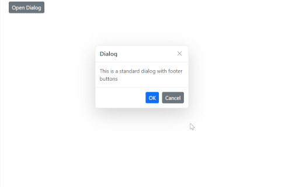
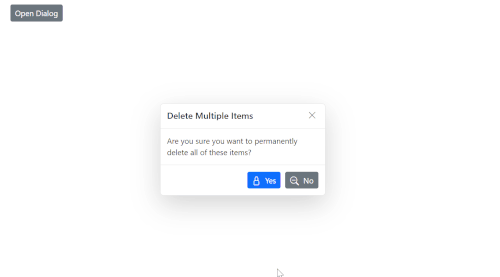

# Dialog Buttons in Blazor Dialog Component

The Syncfusion<sup style="font-size:70%">&reg;</sup> Blazor Dialog component supports rendering one or more action buttons in its footer using the [DialogButtons](https://help.syncfusion.com/cr/blazor/Syncfusion.Blazor.Popups.DialogButtons.html) element. Each button is defined using the [DialogButton](https://help.syncfusion.com/cr/blazor/Syncfusion.Blazor.Popups.DialogButton.html) element. These buttons can be customized with the following properties:

DialogButtonOptions     | Description
------------ | -------------
  [ChildContent](https://help.syncfusion.com/cr/blazor/Syncfusion.Blazor.Popups.DialogButton.html#Syncfusion_Blazor_Popups_DialogButton_ChildContent)       | Defines custom content (for example, HTML or string) inside the button.
  [Content](https://help.syncfusion.com/cr/blazor/Syncfusion.Blazor.Popups.DialogButton.html#Syncfusion_Blazor_Popups_DialogButton_Content)     | Sets the text displayed on the button.
  [CssClass](https://help.syncfusion.com/cr/blazor/Syncfusion.Blazor.Popups.DialogButton.html#Syncfusion_Blazor_Popups_DialogButton_CssClass)      | Applies one or more custom CSS classes to style the button.
  [Disabled](https://help.syncfusion.com/cr/blazor/Syncfusion.Blazor.Popups.DialogButton.html#Syncfusion_Blazor_Popups_DialogButton_Disabled)       | Disables the button and prevents user interaction.
  [EnableRtl](https://help.syncfusion.com/cr/blazor/Syncfusion.Blazor.Popups.DialogButton.html#Syncfusion_Blazor_Popups_DialogButton_EnableRtl)       | Enables right-to-left (RTL) rendering for languages such as Arabic or Hebrew.
  [IconCss](https://help.syncfusion.com/cr/blazor/Syncfusion.Blazor.Popups.DialogButton.html#Syncfusion_Blazor_Popups_DialogButton_IconCss)         | Specifies the CSS class for an icon to display inside the button.
  [IconPosition](https://help.syncfusion.com/cr/blazor/Syncfusion.Blazor.Popups.DialogButton.html#Syncfusion_Blazor_Popups_DialogButton_IconPosition)     | Determines the icon position (for example, Left, Right, Top, Bottom).
  [IsFlat](https://help.syncfusion.com/cr/blazor/Syncfusion.Blazor.Popups.DialogButton.html#Syncfusion_Blazor_Popups_DialogButton_IsFlat)           | Renders the button with a flat style (no background or border).
  [IsPrimary](https://help.syncfusion.com/cr/blazor/Syncfusion.Blazor.Popups.DialogButton.html#Syncfusion_Blazor_Popups_DialogButton_IsPrimary)         | Highlights the button as the primary action in the dialog.
  [IsToggle](https://help.syncfusion.com/cr/blazor/Syncfusion.Blazor.Popups.DialogButton.html#Syncfusion_Blazor_Popups_DialogButton_IsToggle)           | Enables toggle behavior to switch between active and inactive states.
  [OnClick](https://help.syncfusion.com/cr/blazor/Syncfusion.Blazor.Popups.DialogButton.html#Syncfusion_Blazor_Popups_DialogButton_OnClick)             | Assigns a callback method that executes when the button is clicked.
  [Type](https://help.syncfusion.com/cr/blazor/Syncfusion.Blazor.Popups.DialogButton.html#Syncfusion_Blazor_Popups_DialogButton_Type)               | Specifies the button type (for example, Button, Submit, Reset).

The following example demonstrates how to define basic action buttons in the Blazor Dialog.

```cshtml
@using Syncfusion.Blazor.Popups
@using Syncfusion.Blazor.Buttons

<div id="target">
    <SfButton @onclick="@OpenDialog">Open Dialog</SfButton>

    <SfDialog Target="#target" Width="250px" ShowCloseIcon="true" @bind-Visible="@IsVisible">
        <DialogTemplates>
            <Header> Dialog </Header>
             <Content>This is a standard dialog with footer buttons</Content>
        </DialogTemplates>
        <DialogButtons>
            <DialogButton Content="OK" IsPrimary="true" OnClick="@OnOkClick" />
            <DialogButton Content="Cancel" OnClick="@OnCancelClick" />
        </DialogButtons>
    </SfDialog>
</div>

<style>
    #target {
        min-height: 400px;
        height: 100%;
        position: relative;
    }
</style>

@code {
    private bool IsVisible { get; set; } = true;

    private void OpenDialog()
    {
        this.IsVisible = true;
    }

    private void OnOkClick()
    {
        // Place your OK logic here
        this.IsVisible = false;
    }

    private void OnCancelClick()
    {
        // Place your Cancel logic here
        this.IsVisible = false;
    }
}
```




## Add Icons to Dialog Buttons in Blazor Dialog Component

You can enhance the appearance of dialog footer buttons by adding icons using either the [DialogButton](https://help.syncfusion.com/cr/blazor/Syncfusion.Blazor.Popups.DialogButton.html) element or the [FooterTemplate](https://help.syncfusion.com/cr/blazor/Syncfusion.Blazor.Popups.SfDialog.html#Syncfusion_Blazor_Popups_SfDialog_FooterTemplate) property.

## Using DialogButton Element

Use the DialogButton element to define action buttons in the dialog footer with built-in icon support. Assign icon classes using the [IconCss](https://help.syncfusion.com/cr/blazor/Syncfusion.Blazor.Popups.DialogButton.html#Syncfusion_Blazor_Popups_DialogButton_IconCss) property and customize appearance with additional CSS as needed.

```cshtml

@using Syncfusion.Blazor.Popups
@using Syncfusion.Blazor.Buttons

<SfButton @onclick="@OpenDialog">Open Dialog</SfButton>

<SfDialog Width="300px" ShowCloseIcon="true" CloseOnEscape="true" @bind-Visible="@IsVisible">
    <DialogTemplates>
        <Header>
            <div>Delete Multiple Items</div>
        </Header>
        <Content>
            <div>Are you sure you want to permanently delete all of these items?</div>
        </Content>
    </DialogTemplates>
    <DialogButtons>
        <DialogButton Content="Yes" IsPrimary="true" IconCss="e-icons e-ok-icon" OnClick="@CloseDialog" />
        <DialogButton Content="No" IconCss="e-icons e-close-icon" OnClick="@CloseDialog" />
    </DialogButtons>
</SfDialog>

<style>
    a, a:hover, .highcontrast #dialog a, .highcontrast #dialog a:hover {
        color: inherit;
        text-decoration: none;
    }

    .e-btn-icon.e-icons.e-ok-icon.e-icon-left:before {
        content: '\e7ff';
    }

    .e-btn-icon.e-icons.e-close-icon.e-icon-left:before {
        content: '\e825';
    }
</style>

@code {
    private bool IsVisible { get; set; } = true;

    private void OpenDialog()
    {
        this.IsVisible = true;
    }

    private void CloseDialog()
    {
        this.IsVisible = false;
    }
}

```




## Using FooterTemplate Property

Alternatively, use the [FooterTemplate](https://help.syncfusion.com/cr/blazor/Syncfusion.Blazor.Popups.SfDialog.html#Syncfusion_Blazor_Popups_SfDialog_FooterTemplate) property to fully customize the footer layout and include buttons with icons manually using Syncfusion<sup style="font-size:70%">&reg;</sup> Button.

```cshtml

@using Syncfusion.Blazor.Popups
@using Syncfusion.Blazor.Buttons

<SfButton @onclick="@OpenDialog">Open Dialog</SfButton>

<SfDialog Width="300px" ShowCloseIcon="true" CloseOnEscape="true" @bind-Visible="@IsVisible">
    <DialogTemplates>
        <Header> Delete Multiple Items </Header>
        <Content> Are you sure you want to permanently delete all of these items? </Content>
        <FooterTemplate>
            <SfButton CssClass="e-primary e-flat" @onclick="@CloseDialog">
                <span class='e-btn-icon e-icons e-ok-icon e-icon-left'></span>Yes
            </SfButton>
            <SfButton CssClass="e-flat" @onclick="@CloseDialog">
                <span class='e-btn-icon e-icons e-close-icon e-icon-left'></span>No
            </SfButton>
        </FooterTemplate>
    </DialogTemplates>
</SfDialog>

<style>
    a, a:hover, .highcontrast #dialog a, .highcontrast #dialog a:hover {
        color: inherit;
        text-decoration: none;
    }

    .e-btn-icon.e-icons.e-ok-icon.e-icon-left:before {
        content: '\e7ff';
    }

    .e-btn-icon.e-icons.e-close-icon.e-icon-left:before {
        content: '\e825';
    }
</style>

@code {
    private bool IsVisible { get; set; } = true;

    private void OpenDialog()
    {
        this.IsVisible = true;
    }

    private void CloseDialog()
    {
        this.IsVisible = false;
    }
}

```


