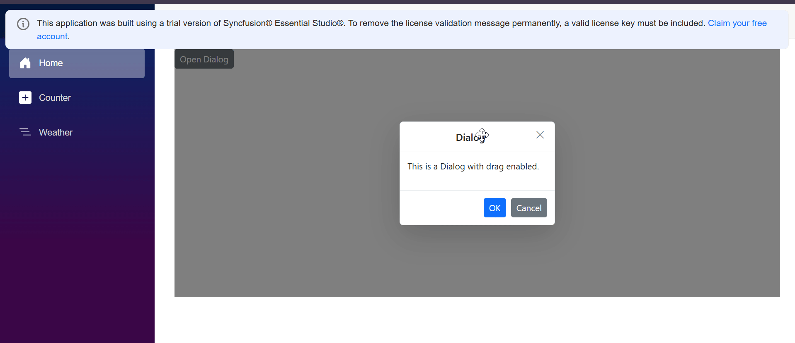
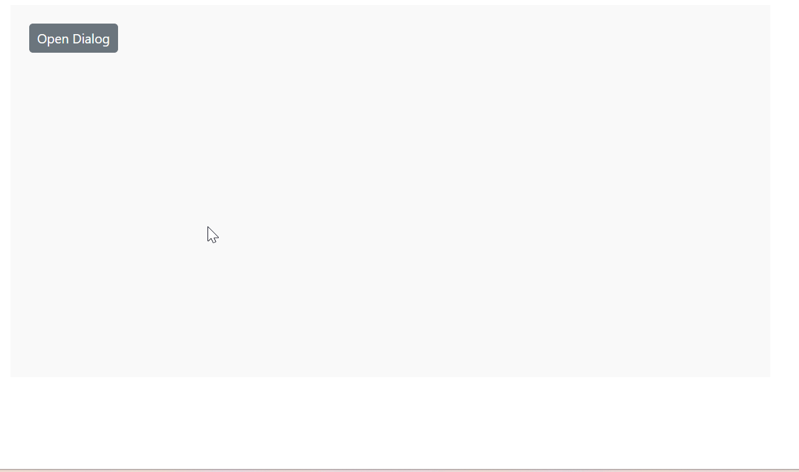

# Draggable in Blazor Dialog Component

The [Blazor Dialog](https://www.syncfusion.com/blazor-components/blazor-modal-dialog) allows users to drag and reposition the dialog within its target container by grabbing the dialog header, enabling dynamic placement and improved user interaction.

To enable dragging, set the [`AllowDragging`](https://help.syncfusion.com/cr/blazor/Syncfusion.Blazor.Popups.SfDialog.html#Syncfusion_Blazor_Popups_SfDialog_AllowDragging) property to true on the Blazor Dialog component.

To get started quickly with draggable in Blazor Dialog Component, you can check the video below.



```cshtml

@using Syncfusion.Blazor.Popups
@using Syncfusion.Blazor.Buttons

<div id="target">
    <SfButton @onclick="@OpenDialog">Open Dialog</SfButton>

    <SfDialog Target="#target" Width="250px" AllowDragging="true" ShowCloseIcon="true" @bind-Visible="@IsVisible">
        <DialogTemplates>
            <Header> Dialog </Header>
            <Content> This is a Dialog with drag enabled </Content>
        </DialogTemplates>
        <DialogButtons>
            <DialogButton Content="OK" IsPrimary="true" OnClick="@CloseDialog" />
            <DialogButton Content="Cancel" OnClick="@CloseDialog" />
        </DialogButtons>
    </SfDialog>
</div>

<style>
    #target {
        min-height: 400px;
        height: 100%;
        position: relative;
    }
</style>

@code {
    private bool IsVisible { get; set; } = true;

    private void OpenDialog()
    {
        this.IsVisible = true;
    }

    private void CloseDialog()
    {
        this.IsVisible = false;
    }
}

```



>**Note:** Draggable functionality is supported in both standard dialog and modal dialog.

# Draggable Events in Blazor Dialog Component

The Dialog component provides three key events to track and respond to drag actions:

## OnDragStart

[`OnDragStart`](https://help.syncfusion.com/cr/blazor/Syncfusion.Blazor.Popups.DragStartEventArgs.html) event triggers when the user begins dragging the dialog.

## OnDrag

[`OnDrag`](https://help.syncfusion.com/cr/blazor/Syncfusion.Blazor.Popups.DragEventArgs.html) event is continuously triggered while the user is actively dragging the dialog, from the moment the drag starts until it stops.

## OnDragStop

[`OnDragStop`](https://help.syncfusion.com/cr/blazor/Syncfusion.Blazor.Popups.DragStopEventArgs.html) event triggers when the user stop dragging the dialog.


```cshtml

@using Syncfusion.Blazor.Buttons
@using Syncfusion.Blazor.Popups

<div id="target">
    <SfButton @onclick="OpenDialog">Open Dialog</SfButton>

    <SfDialog Target="#target"
              Width="300px"
              AllowDragging="true"
              ShowCloseIcon="true"
              @bind-Visible="IsVisible">
        <DialogTemplates>
            <Header>Draggable Dialog</Header>
            <Content>
                <p>This dialog can be dragged within its container.</p>
                <p style="color: blue; font-weight: bold;">Status: @DragStatus</p>
                <p style="color: green; font-weight: bold;">Activity: @Dragging</p>
            </Content>
        </DialogTemplates>

        <DialogButtons>
            <DialogButton Content="OK" IsPrimary="true" OnClick="CloseDialog" />
            <DialogButton Content="Cancel" OnClick="CloseDialog" />
        </DialogButtons>

        <DialogEvents OnDragStart="DragStartHandler" OnDrag="DragHandler" OnDragStop="DragStopHandler" />
    </SfDialog>
</div>

<style>
    #target {
        min-height: 400px;
        height: 100%;
        position: relative;
        padding: 20px;
        background-color: #f9f9f9;
    }
</style>

@code {
    private bool IsVisible { get; set; } = false;
    private string DragStatus { get; set; } = string.Empty;
    private string Dragging { get; set; } = string.Empty;

    private void OpenDialog()
    {
        IsVisible = true;
    }

    private void CloseDialog()
    {
        IsVisible = false;
    }

    private void DragStartHandler(Syncfusion.Blazor.Popups.DragStartEventArgs args)
    {
        DragStatus = "Drag started";
    }

    private void DragHandler(Syncfusion.Blazor.Popups.DragEventArgs args)
    {
        Dragging = "Dragging...";
    }

    private void DragStopHandler(Syncfusion.Blazor.Popups.DragStopEventArgs args)
    {
        DragStatus = "Drag stopped";
        Dragging = string.Empty;
    }
}

```





