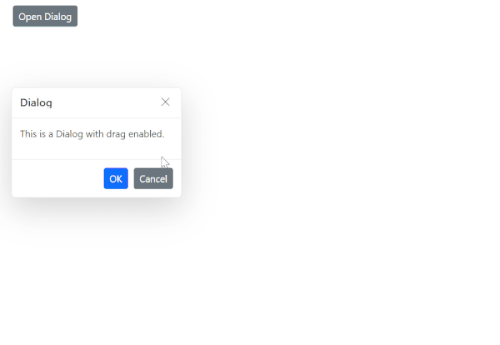

# Draggable in Blazor Dialog Component

The [Blazor Dialog](https://www.syncfusion.com/blazor-components/blazor-modal-dialog) component supports draggable functionality, allowing users to reposition dialogs within their target container by clicking and dragging the dialog header. This feature enhances user experience by providing flexible dialog placement, particularly useful in applications with multiple dialogs or when users need to access content beneath the dialog while keeping it visible.

The dragging operation is constrained to the boundaries of the target container, ensuring the dialog remains within the designated area and maintains proper visual hierarchy.

## Enable Draggable Functionality

To enable dragging capabilities, set the [`AllowDragging`](https://help.syncfusion.com/cr/blazor/Syncfusion.Blazor.Popups.SfDialog.html#Syncfusion_Blazor_Popups_SfDialog_AllowDragging) property to `true` on the Dialog component. When enabled, users can drag the dialog by clicking and holding the dialog header area.

To get started quickly with draggable in Blazor Dialog Component, you can check the video below.



```cshtml

@using Syncfusion.Blazor.Popups
@using Syncfusion.Blazor.Buttons

<div id="target">
    <SfButton @onclick="@OpenDialog">Open Dialog</SfButton>

    <SfDialog Target="#target" Width="250px" AllowDragging="true" ShowCloseIcon="true" @bind-Visible="@IsVisible">
        <DialogTemplates>
            <Header> Dialog </Header>
            <Content> This is a Dialog with drag enabled </Content>
        </DialogTemplates>
        <DialogButtons>
            <DialogButton Content="OK" IsPrimary="true" OnClick="@CloseDialog" />
            <DialogButton Content="Cancel" OnClick="@CloseDialog" />
        </DialogButtons>
    </SfDialog>
</div>

<style>
    #target {
        min-height: 400px;
        height: 100%;
        position: relative;
    }
</style>

@code {
    private bool IsVisible { get; set; } = true;

    private void OpenDialog()
    {
        this.IsVisible = true;
    }

    private void CloseDialog()
    {
        this.IsVisible = false;
    }
}

```



>**Note:** Draggable functionality is supported in both standard dialog and modal dialog configurations. The drag operation is limited to the dialog header area only.

## Draggable Events in Blazor Dialog Component

The Dialog component provides three essential events to monitor and respond to drag interactions. These events enable developers to implement custom logic during different phases of the drag operation, such as validation, logging, or UI updates.

### OnDragStart Event

The [`OnDragStart`](https://help.syncfusion.com/cr/blazor/Syncfusion.Blazor.Popups.DragStartEventArgs.html) event fires when the user initiates dragging by clicking and holding the dialog header. This event is ideal for performing initial setup, validation, or preparing the application state for the drag operation.

### OnDrag Event

The [`OnDrag`](https://help.syncfusion.com/cr/blazor/Syncfusion.Blazor.Popups.DragEventArgs.html) event triggers continuously throughout the drag operation, providing real-time updates as the user moves the dialog. This event is useful for implementing dynamic feedback, position tracking, or live validation of the dialog's new position.

### OnDragStop Event

The [`OnDragStop`](https://help.syncfusion.com/cr/blazor/Syncfusion.Blazor.Popups.DragStopEventArgs.html) event fires when the user releases the dialog and completes the drag operation. This event is perfect for finalizing position changes, saving state, or performing cleanup operations.

```cshtml

@using Syncfusion.Blazor.Buttons
@using Syncfusion.Blazor.Popups

<div id="target">
    <SfButton @onclick="OpenDialog">Open Dialog</SfButton>

    <SfDialog Target="#target"
              Width="300px"
              AllowDragging="true"
              ShowCloseIcon="true"
              @bind-Visible="IsVisible">
        <DialogTemplates>
            <Header>Draggable Dialog</Header>
            <Content>
                <p>This dialog can be dragged within its container.</p>
                <p style="color: blue; font-weight: bold;">Status: @DragStatus</p>
                <p style="color: green; font-weight: bold;">Activity: @Dragging</p>
            </Content>
        </DialogTemplates>

        <DialogButtons>
            <DialogButton Content="OK" IsPrimary="true" OnClick="CloseDialog" />
            <DialogButton Content="Cancel" OnClick="CloseDialog" />
        </DialogButtons>

        <DialogEvents OnDragStart="DragStartHandler" OnDrag="DragHandler" OnDragStop="DragStopHandler" />
    </SfDialog>
</div>

<style>
    #target {
        min-height: 400px;
        height: 100%;
        position: relative;
        padding: 20px;
        background-color: #f9f9f9;
    }
</style>

@code {
    private bool IsVisible { get; set; } = false;
    private string DragStatus { get; set; } = string.Empty;
    private string Dragging { get; set; } = string.Empty;

    private void OpenDialog()
    {
        IsVisible = true;
    }

    private void CloseDialog()
    {
        IsVisible = false;
    }

    private void DragStartHandler(Syncfusion.Blazor.Popups.DragStartEventArgs args)
    {
        DragStatus = "Drag started";
    }

    private void DragHandler(Syncfusion.Blazor.Popups.DragEventArgs args)
    {
        Dragging = "Dragging...";
    }

    private void DragStopHandler(Syncfusion.Blazor.Popups.DragStopEventArgs args)
    {
        DragStatus = "Drag stopped";
        Dragging = string.Empty;
    }
}

```




## Important Considerations

**Container Constraints:** The dialog movement is restricted to the boundaries of its target container. Ensure the target container has sufficient dimensions to accommodate dialog repositioning.

**Touch Support:** Draggable functionality is fully supported on touch devices, allowing users to drag dialogs using touch gestures.