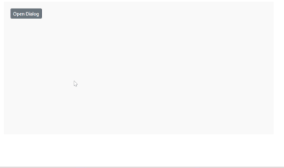

# Draggable in Blazor Dialog Component

The [Blazor Dialog](https://www.syncfusion.com/blazor-components/blazor-modal-dialog) supports to `drag` within its target container by grabbing the Dialog header, which allows the user to reposition the Dialog dynamically.

To get started quickly with draggable in Blazor Dialog Component, you can check the video below.



```cshtml

@using Syncfusion.Blazor.Popups
@using Syncfusion.Blazor.Buttons

<div id="target">
    <SfButton @onclick="@OpenDialog">Open Dialog</SfButton>

    <SfDialog Target="#target" Width="250px" AllowDragging="true" IsModal="true" ShowCloseIcon="true" @bind-Visible="@IsVisible">
        <DialogTemplates>
            <Header> Dialog </Header>
            <Content> This is a Dialog with drag enabled </Content>
        </DialogTemplates>
        <DialogButtons>
            <DialogButton Content="OK" IsPrimary="true" OnClick="@CloseDialog" />
            <DialogButton Content="Cancel" OnClick="@CloseDialog" />
        </DialogButtons>
    </SfDialog>
</div>

<style>
    #target {
        min-height: 400px;
        height: 100%;
        position: relative;
    }
</style>

@code {
    private bool IsVisible { get; set; } = true;

    private void OpenDialog()
    {
        this.IsVisible = true;
    }

    private void CloseDialog()
    {
        this.IsVisible = false;
    }
}

```


# Draggable Events in Blazor Dialog Component

The Dialog component provides three key events to track and respond to drag actions:

## OnDrag

[`OnDrag`](https://help.syncfusion.com/cr/blazor/Syncfusion.Blazor.Popups.DragEventArgs.html) event triggers when the user drags the dialog.

## OnDragStart

[`OnDragStart`](https://help.syncfusion.com/cr/blazor/Syncfusion.Blazor.Popups.DragStartEventArgs.html) event triggers when the user begins dragging the dialog.

## OnDragStop

[`OnDragStop`](https://help.syncfusion.com/cr/blazor/Syncfusion.Blazor.Popups.DragStopEventArgs.html) event triggers when the user stop dragging the dialog.

@using Syncfusion.Blazor.Buttons
@using Syncfusion.Blazor.Popups

```cshtml

<div id="target">
    <SfButton @onclick="@OpenDialog">Open Dialog</SfButton>
    <SfDialog Target="#target" Width="250px" AllowDragging="true" IsModal="true" ShowCloseIcon="true" @bind-Visible="@IsVisible">
        <DialogTemplates>
            <Header> Dialog </Header>
            <Content>
                <p>This is a Dialog with drag enabled.</p>
                <p style="color: blue; font-weight: bold;">@DragStatus</p>
            </Content>
        </DialogTemplates>
        <DialogButtons>
            <DialogButton Content="OK" IsPrimary="true" OnClick="@CloseDialog" />
            <DialogButton Content="Cancel" OnClick="@CloseDialog" />
        </DialogButtons>
        <DialogEvents OnDrag="DragHandler" OnDragStart="DragStartHandler" OnDragStop="DragStopHandler"></DialogEvents>
    </SfDialog>

</div>

<style>
    #target {
        min-height: 400px;
        height: 100%;
        position: relative;
    }
</style>

@code {
    private bool IsVisible { get; set; } = true;
    private string DragStatus { get; set; } = "";

    private void OpenDialog()
    {
        IsVisible = true;
    }

    private void CloseDialog()
    {
        IsVisible = false;
    }

    private void DragHandler(Syncfusion.Blazor.Popups.DragEventArgs args)
    {
        DragStatus = "Dragging...";
    }

    private void DragStartHandler(Syncfusion.Blazor.Popups.DragStartEventArgs args)
    {
        DragStatus = "Drag started";
    }

    private void DragStopHandler(Syncfusion.Blazor.Popups.DragStopEventArgs args)
    {
        DragStatus = "Drag stopped";
    }
}

```




