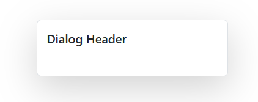

# Getting Started with Blazor Dialog Component in Web App

This section explains how to include the [Blazor Dialog](https://www.syncfusion.com/blazor-components/blazor-modal-dialog) component in a Blazor Web App using [Visual Studio](https://visualstudio.microsoft.com/vs/) and Visual Studio Code.





## Prerequisites

* [System requirements for Blazor components](https://blazor.syncfusion.com/documentation/system-requirements)

## Create a new Blazor Web App in Visual Studio

Create a **Blazor Web App** using Visual Studio 2022 via [Microsoft Templates](https://learn.microsoft.com/en-us/aspnet/core/blazor/tooling?view=aspnetcore-8.0&pivots=vs) or the [Syncfusion<sup style="font-size:70%">&reg;</sup> Blazor Extension](https://blazor.syncfusion.com/documentation/visual-studio-integration/template-studio).

Configure the appropriate [interactive render mode](https://learn.microsoft.com/en-us/aspnet/core/blazor/components/render-modes?view=aspnetcore-8.0#render-modes) and [interactivity location](https://learn.microsoft.com/en-us/aspnet/core/blazor/tooling?view=aspnetcore-8.0&pivots=vs) when creating the Blazor Web App.

## Install Syncfusion<sup style="font-size:70%">&reg;</sup> Blazor Popups and Themes NuGet in the Blazor Web App

To add the **Blazor Dialog** component, open NuGet Package Manager in Visual Studio (Tools → NuGet Package Manager → Manage NuGet Packages for Solution), then search for and install [Syncfusion.Blazor.Popups](https://www.nuget.org/packages/Syncfusion.Blazor.Popups/) and [Syncfusion.Blazor.Themes](https://www.nuget.org/packages/Syncfusion.Blazor.Themes/).

If using `WebAssembly` or `Auto` render modes, install the Syncfusion<sup style="font-size:70%">&reg;</sup> Blazor component NuGet packages in the client project.

Alternatively, use the following Package Manager commands:




Install-Package Syncfusion.Blazor.Popups -Version {{ site.releaseversion }}
Install-Package Syncfusion.Blazor.Themes -Version {{ site.releaseversion }}




N> Syncfusion<sup style="font-size:70%">&reg;</sup> Blazor components are available on [nuget.org](https://www.nuget.org/packages?q=syncfusion.blazor). For the list of available packages and component details, see [NuGet packages](https://blazor.syncfusion.com/documentation/nuget-packages).





## Prerequisites

* [System requirements for Blazor components](https://blazor.syncfusion.com/documentation/system-requirements)

## Create a new Blazor Web App in Visual Studio Code

Create a **Blazor Web App** using Visual Studio Code via [Microsoft templates](https://learn.microsoft.com/en-us/aspnet/core/blazor/tooling?view=aspnetcore-8.0&pivots=vsc) or the [Syncfusion<sup style="font-size:70%">&reg;</sup> Blazor Extension](https://blazor.syncfusion.com/documentation/visual-studio-code-integration/create-project).

Configure the appropriate [interactive render mode](https://learn.microsoft.com/en-us/aspnet/core/blazor/components/render-modes?view=aspnetcore-8.0#render-modes) and [interactivity location](https://learn.microsoft.com/en-us/aspnet/core/blazor/tooling?view=aspnetcore-8.0&pivots=vsc) when creating the Blazor Web App.

For example, in a Blazor Web App with the `Auto` interactive render mode, use the following commands.




dotnet new blazor -o BlazorWebApp -int Auto
cd BlazorWebApp
cd BlazorWebApp.Client




N> For more information on creating a **Blazor Web App** with various interactive modes and locations, see [Getting started with Blazor Web App](https://blazor.syncfusion.com/documentation/getting-started/blazor-web-app?tabcontent=visual-studio-code#render-interactive-modes).

## Install Syncfusion<sup style="font-size:70%">&reg;</sup> Blazor Popups and Themes NuGet in the App

If using `WebAssembly` or `Auto` render modes in a Blazor Web App, install Syncfusion<sup style="font-size:70%">&reg;</sup> Blazor component NuGet packages in the client project.

* Press <kbd>Ctrl</kbd>+<kbd>`</kbd> to open the integrated terminal in Visual Studio Code.
* Ensure the current directory contains the project’s `.csproj` file.
* Run the following commands to install [Syncfusion.Blazor.Popups](https://www.nuget.org/packages/Syncfusion.Blazor.Popups) and [Syncfusion.Blazor.Themes](https://www.nuget.org/packages/Syncfusion.Blazor.Themes/), and then restore packages.





dotnet add package Syncfusion.Blazor.Popups -v {{ site.releaseversion }}
dotnet add package Syncfusion.Blazor.Themes -v {{ site.releaseversion }}
dotnet restore





N> Syncfusion<sup style="font-size:70%">&reg;</sup> Blazor components are available on [nuget.org](https://www.nuget.org/packages?q=syncfusion.blazor). For the list of available packages and component details, see [NuGet packages](https://blazor.syncfusion.com/documentation/nuget-packages).





## Register Syncfusion<sup style="font-size:70%">&reg;</sup> Blazor Service

| Interactive Render Mode | Description |
| -- | -- |
| WebAssembly or Auto | Open **~/_Imports.razor** from the client project. |
| Server | Open **~/_Imports.razor** located in the `Components` folder. |

Import the `Syncfusion.Blazor` and `Syncfusion.Blazor.Popups` namespaces.




@using Syncfusion.Blazor
@using Syncfusion.Blazor.Popups




Now, register the Syncfusion<sup style="font-size:70%">&reg;</sup> Blazor service in the **~/Program.cs** file(s) of the Blazor Web App.

If the interactive render mode is `WebAssembly` or `Auto`, register the Syncfusion<sup style="font-size:70%">&reg;</sup> Blazor service in both **~/Program.cs** files (Server and Client).




...
...
using Syncfusion.Blazor;

var builder = WebApplication.CreateBuilder(args);

// Add services to the container.
builder.Services.AddRazorComponents()
    .AddInteractiveServerComponents()
    .AddInteractiveWebAssemblyComponents();
builder.Services.AddSyncfusionBlazor();

var app = builder.Build();
....




...
using Syncfusion.Blazor;

var builder = WebAssemblyHostBuilder.CreateDefault(args);
builder.Services.AddSyncfusionBlazor();

await builder.Build().RunAsync();




If the **Interactive Render Mode** is set to `Server`, your project will contain a single **~/Program.cs** file. So, you should register the Syncfusion<sup style="font-size:70%">&reg;</sup> Blazor Service only in that **~/Program.cs** file.




...
using Syncfusion.Blazor;

var builder = WebApplication.CreateBuilder(args);

// Add services to the container.
builder.Services.AddRazorComponents()
    .AddInteractiveServerComponents();
builder.Services.AddSyncfusionBlazor();

var app = builder.Build();
....




## Add stylesheet and script resources

The theme stylesheet and script are provided via NuGet using [Static Web Assets](https://blazor.syncfusion.com/documentation/appearance/themes#static-web-assets). Add the stylesheet reference in the `<head>` section and the script reference at the end of the `<body>` in **~/Components/App.razor** as shown below:

```html
<head>
    ....
    <link href="_content/Syncfusion.Blazor.Themes/bootstrap5.css" rel="stylesheet" />
</head>
....
<body>
    ....
    <script src="_content/Syncfusion.Blazor.Core/scripts/syncfusion-blazor.min.js" type="text/javascript"></script>
</body>
```

N> For theme options, see [Blazor Themes](https://blazor.syncfusion.com/documentation/appearance/themes) and learn different reference methods: [Static Web Assets](https://blazor.syncfusion.com/documentation/appearance/themes#static-web-assets), [CDN](https://blazor.syncfusion.com/documentation/appearance/themes#cdn-reference), and [CRG](https://blazor.syncfusion.com/documentation/common/custom-resource-generator). For script reference approaches, see [Adding script references](https://blazor.syncfusion.com/documentation/common/adding-script-references).

## Add Syncfusion<sup style="font-size:70%">&reg;</sup> Blazor Dialog component

Add the Syncfusion<sup style="font-size:70%">&reg;</sup> Blazor Dialog component in a `.razor` file inside the `Pages` folder. If the interactivity location is `Per page/component`, define the render mode at the top of the component, as follows:

| Interactivity location | RenderMode | Code |
| --- | --- | --- |
| Per page/component | Auto | @rendermode InteractiveAuto |
|  | WebAssembly | @rendermode InteractiveWebAssembly |
|  | Server | @rendermode InteractiveServer |
|  | None | --- |

N> If an **Interactivity Location** is set to `Global` and the **Render Mode** is set to `Auto` or `WebAssembly` or `Server`, the render mode is configured in the `App.razor` file by default.




@* desired render mode define here *@
@rendermode InteractiveAuto







<SfDialog Width="250px">
    <DialogTemplates>
        <Content> This is a Dialog with content </Content>
    </DialogTemplates>
</SfDialog>




* Press <kbd>Ctrl</kbd>+<kbd>F5</kbd> (Windows) or <kbd>⌘</kbd>+<kbd>F5</kbd> (macOS) to launch the application. This renders the Syncfusion<sup style="font-size:70%">&reg;</sup> Blazor Dialog component in the default web browser.




N> * In the dialog control, max-height is calculated based on the dialog target element height. If the **Target** property is not configured, the **document.body** is considered as a target. Therefore, to show a dialog in proper height, you need to add min-height to the target element.

N> * If the dialog is rendered based on the body, then the dialog will get the height based on its body element height. If the height of the dialog is larger than the body height, then the dialog's height will not be set. For this scenario, you can set the CSS style for the html and body to get the dialog height.




html, body {
   height: 100%;
}




## Created and Destroyed Events

- The [Created](https://help.syncfusion.com/cr/blazor/Syncfusion.Blazor.Popups.DialogEvents.html#Syncfusion_Blazor_Popups_DialogEvents_Created) event fires when the dialog is initialized and rendered in the DOM.

- The [Destroyed](https://help.syncfusion.com/cr/blazor/Syncfusion.Blazor.Popups.DialogEvents.html#Syncfusion_Blazor_Popups_DialogEvents_Destroyed) event triggers when the dialog component is removed from the DOM. These lifecycle events help execute custom code at specific points in the component lifecycle.

```cshtml

@using Syncfusion.Blazor.Popups

<SfDialog>
    <DialogEvents Created="@CreatedHandler" Destroyed="@DestroyedHandler"></DialogEvents>
</SfDialog>
@code {

    public void CreatedHandler(Object args)
    {
        // Here, you can customize your code.
    }

    private void DestroyedHandler()
    {
        // Here, you can customize your code.
    }
}

```

## Prerender the Dialog

The [AllowPrerender](https://help.syncfusion.com/cr/blazor/Syncfusion.Blazor.Popups.SfDialog.html#Syncfusion_Blazor_Popups_SfDialog_AllowPrerender) property controls how the dialog’s DOM elements are handled when the dialog is hidden, which affects performance characteristics.

* By default, AllowPrerender is false. In this mode, dialog elements are removed from the DOM when the dialog is hidden and recreated each time it is shown. This reduces memory usage but requires re-rendering on each display.
* When AllowPrerender is true, dialog elements remain in the DOM even when hidden. This improves performance for frequently accessed dialogs at the cost of higher memory usage.

```cshtml

@using Syncfusion.Blazor.Popups
@using Syncfusion.Blazor.Buttons

<div id="target">
    <div>
        <button class="e-btn" @onclick="@OnBtnClick">Open</button>
    </div>
    <SfDialog Target="#target" Width="300px" ShowCloseIcon="true" @bind-Visible="Visibility" AllowPrerender="true" Header="AllowPrerender Dialog" Content="This is a dialog with content">
    </SfDialog>
</div>
<style>
    #target {
        height: 500px;
    }
</style>
@code {
    private bool Visibility { get; set; } = false;
    private void OnBtnClick()
    {
        this.Visibility = true;
    }
}

```



## Set Header to Dialog

The [Header](https://help.syncfusion.com/cr/blazor/Syncfusion.Blazor.Popups.DialogTemplates.html#Syncfusion_Blazor_Popups_DialogTemplates_Header) property renders a dialog with a custom text header.

```cshtml

@using Syncfusion.Blazor.Popups

<SfDialog Width="250px" Header="Dialog Header"></SfDialog>

```




## Set Content to Dialog 

The [Content](https://help.syncfusion.com/cr/blazor/Syncfusion.Blazor.Popups.SfDialog.html#Syncfusion_Blazor_Popups_SfDialog_Content) property renders a dialog with custom text content.

```cshtml

@using Syncfusion.Blazor.Popups

<SfDialog Width="250px" Content="This is a dialog with Content property."></SfDialog>

```




N> [View sample in GitHub](https://github.com/SyncfusionExamples/Blazor-Getting-Started-Examples/tree/main/Dialog).

## See also

1. [Getting started with Syncfusion<sup style="font-size:70%">&reg;</sup> Blazor for client-side in .NET Core CLI](https://blazor.syncfusion.com/documentation/getting-started/blazor-webassembly-dotnet-cli)
2. [Getting started with Syncfusion<sup style="font-size:70%">&reg;</sup> Blazor for client-side in Visual Studio](https://blazor.syncfusion.com/documentation/getting-started/blazor-webassembly-visual-studio)
3. [Getting started with Syncfusion<sup style="font-size:70%">&reg;</sup> Blazor for server-side in .NET Core CLI](https://blazor.syncfusion.com/documentation/getting-started/blazor-server-side-dotnet-cli)