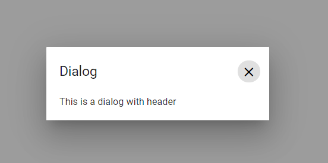

# Getting Started with Blazor Dialog Component

This section briefly explains about how to include [Blazor Dialog](https://www.syncfusion.com/blazor-components/blazor-modal-dialog) component in your Blazor Server App and Blazor WebAssembly App using Visual Studio.

To get start quickly with Blazor Dialog component, you can check on this video:


## Prerequisites

* [System requirements for Blazor components](https://blazor.syncfusion.com/documentation/system-requirements)

## Create a new Blazor App in Visual Studio

You can create **Blazor Server App** or **Blazor WebAssembly App** using Visual Studio in one of the following ways,

* [Create a Project using Microsoft Templates](https://docs.microsoft.com/en-us/aspnet/core/blazor/tooling?pivots=windows)

* [Create a Project using Syncfusion Blazor Extension](https://blazor.syncfusion.com/documentation/visual-studio-integration/vs2019-extensions/create-project)

## Install Syncfusion Blazor Popups NuGet in the App

Syncfusion Blazor components are available in [nuget.org](https://www.nuget.org/packages?q=syncfusion.blazor). To use Syncfusion Blazor components in the application, add reference to the corresponding NuGet. Refer to [NuGet packages topic](https://blazor.syncfusion.com/documentation/nuget-packages) for available NuGet packages list with component details.

To add Blazor Dialog component in the app, open the NuGet package manager in Visual Studio (*Tools → NuGet Package Manager → Manage NuGet Packages for Solution*), search for [Syncfusion.Blazor.Popups](https://www.nuget.org/packages/Syncfusion.Blazor.Popups) and then install it.

## Register Syncfusion Blazor Service

Open **~/_Imports.razor** file and import the Syncfusion.Blazor namespace.




@using Syncfusion.Blazor




Now, register the Syncfusion Blazor Service in the Blazor Server App or Blazor WebAssembly App. Here, Syncfusion Blazor Service is registered by setting [IgnoreScriptIsolation](https://help.syncfusion.com/cr/blazor/Syncfusion.Blazor.GlobalOptions.html#Syncfusion_Blazor_GlobalOptions_IgnoreScriptIsolation) property as true to load the scripts externally in the [next steps](#add-script-reference).

### Blazor Server App

* For **.NET 6** app, open the **~/Program.cs** file and register the Syncfusion Blazor Service.

* For **.NET 5 and .NET 3.X** app, open the **~/Startup.cs** file and register the Syncfusion Blazor Service.




using Microsoft.AspNetCore.Components;
using Microsoft.AspNetCore.Components.Web;
using Syncfusion.Blazor;

var builder = WebApplication.CreateBuilder(args);

// Add services to the container.
builder.Services.AddRazorPages();
builder.Services.AddServerSideBlazor();
builder.Services.AddSyncfusionBlazor(options => { options.IgnoreScriptIsolation = true; });

var app = builder.Build();
....





using Syncfusion.Blazor;

namespace BlazorApplication
{
    public class Startup
    {
        ...
        public void ConfigureServices(IServiceCollection services)
        {
            services.AddRazorPages();
            services.AddServerSideBlazor();
            services.AddSyncfusionBlazor(options => { options.IgnoreScriptIsolation = true; });
        }
        ...
    }
}




### Blazor WebAssembly App

Open **~/Program.cs** file and register the Syncfusion Blazor Service in the client web app.




using Microsoft.AspNetCore.Components.Web;
using Microsoft.AspNetCore.Components.WebAssembly.Hosting;
using Syncfusion.Blazor;

var builder = WebAssemblyHostBuilder.CreateDefault(args);
builder.RootComponents.Add<App>("#app");
builder.RootComponents.Add<HeadOutlet>("head::after");

builder.Services.AddScoped(sp => new HttpClient { BaseAddress = new Uri(builder.HostEnvironment.BaseAddress) });

builder.Services.AddSyncfusionBlazor(options => { options.IgnoreScriptIsolation = true; });
await builder.Build().RunAsync();
....





using Syncfusion.Blazor;

namespace WebApplication1
{
    public class Program
    {
        public static async Task Main(string[] args)
        {
            ....
            builder.Services.AddSyncfusionBlazor(options => { options.IgnoreScriptIsolation = true; });
            await builder.Build().RunAsync();
        }
    }
}




## Add Style Sheet

Checkout the [Blazor Themes topic](https://blazor.syncfusion.com/documentation/appearance/themes) to learn different ways ([Static Web Assets](https://blazor.syncfusion.com/documentation/appearance/themes#static-web-assets), [CDN](https://blazor.syncfusion.com/documentation/appearance/themes#cdn-reference) and [CRG](https://blazor.syncfusion.com/documentation/common/custom-resource-generator)) to refer themes in Blazor application, and to have the expected appearance for Syncfusion Blazor components. Here, the theme is referred using [Static Web Assets](https://blazor.syncfusion.com/documentation/appearance/themes#static-web-assets).

To add theme to the app, open the NuGet package manager in Visual Studio (*Tools → NuGet Package Manager → Manage NuGet Packages for Solution*), search for [Syncfusion.Blazor.Themes](https://www.nuget.org/packages/Syncfusion.Blazor.Themes/) and then install it. Then, the theme style sheet from NuGet can be referred as follows,

### Blazor Server App

* For .NET 6 app, add the Syncfusion bootstrap5 theme in the `<head>` of the **~/Pages/_Layout.cshtml** file.

* For .NET 5 and .NET 3.X app, add the Syncfusion bootstrap5 theme in the `<head>` of the **~/Pages/_Host.cshtml** file.




<head>
    <link href="_content/Syncfusion.Blazor.Themes/bootstrap5.css" rel="stylesheet" />
</head>





<head>
    <link href="_content/Syncfusion.Blazor.Themes/bootstrap5.css" rel="stylesheet" />
</head>




### Blazor WebAssembly App

For Blazor WebAssembly App, Refer the theme style sheet from NuGet in the `<head>` of **wwwroot/index.html** file in the client web app.




<head>
    <link href="_content/Syncfusion.Blazor.Themes/bootstrap5.css" rel="stylesheet" />
</head>




## Add Script Reference

Checkout [Adding Script Reference topic](https://blazor.syncfusion.com/documentation/common/adding-script-references) to learn different ways to add script reference in Blazor Application. In this getting started walk-through, the required scripts are referred using [Static Web Assets](https://blazor.syncfusion.com/documentation/common/adding-script-references#static-web-assets) externally inside the `<head>` as follows,

### Blazor Server App

* For **.NET 6** app, Refer script in the `<head>` of the **~/Pages/_Layout.cshtml** file.

* For **.NET 5 and .NET 3.X** app, Refer script in the `<head>` of the **~/Pages/_Host.cshtml** file.




<head>
    ....
    <link href="_content/Syncfusion.Blazor.Themes/bootstrap5.css" rel="stylesheet" />
    
</head>





<head>
    ....
    <link href="_content/Syncfusion.Blazor.Themes/bootstrap5.css" rel="stylesheet" />
    
</head>




### Blazor WebAssembly App

For Blazor WebAssembly App, Refer script in the `<head>` of the **~/index.html** file.




<head>
    ....
    <link href="_content/Syncfusion.Blazor.Themes/bootstrap5.css" rel="stylesheet" />
    
</head>




> Syncfusion recommends to reference scripts using [Static Web Assets](https://blazor.syncfusion.com/documentation/common/adding-script-references#static-web-assets), [CDN](https://blazor.syncfusion.com/documentation/common/adding-script-references#cdn-reference) and [CRG](https://blazor.syncfusion.com/documentation/common/custom-resource-generator) by [disabling JavaScript isolation](https://blazor.syncfusion.com/documentation/common/adding-script-references#disable-javascript-isolation) for better loading performance of the Blazor application.

## Add Blazor Dialog component

* Open **~/_Imports.razor** file or any other page under the `~/Pages` folder where the component is to be added and import the **Syncfusion.Blazor.Popups** namespace.




@using Syncfusion.Blazor
@using Syncfusion.Blazor.Popups




* Now, add the Syncfusion Dialog component in razor file. Here, the Dialog component is added in the **~/Pages/Index.razor** file under the **~/Pages** folder.




<SfDialog Width="250px">
    <DialogTemplates>
        <Content> This is a Dialog with content </Content>
    </DialogTemplates>
</SfDialog>




* Press <kbd>Ctrl</kbd>+<kbd>F5</kbd> (Windows) or <kbd>⌘</kbd>+<kbd>F5</kbd> (macOS) to run the application. Then, the Syncfusion `Blazor Dialog` component will be rendered in the default web browser.

> * In the dialog control, max-height is calculated based on the dialog target element height. If the **Target** property is not configured, the **document.body** is considered as a target. Therefore, to show a dialog in proper height, you need to add min-height to the target element.
> * If the dialog is rendered based on the body, then the dialog will get the height based on its body element height. If the height of the dialog is larger than the body height, then the dialog's height will not be set. For this scenario, we can set the CSS style for the html and body to get the dialog height.




html, body {
   height: 100%;
}




## Prerender the dialog

The dialog component is maintained in the DOM after hiding the dialog when the [AllowPrerender](https://help.syncfusion.com/cr/blazor/Syncfusion.Blazor.Popups.SfDialog.html#Syncfusion_Blazor_Popups_SfDialog_AllowPrerender) property is set to `true`.

* By default, the [AllowPrerender](https://help.syncfusion.com/cr/blazor/Syncfusion.Blazor.Popups.SfDialog.html#Syncfusion_Blazor_Popups_SfDialog_AllowPrerender) is set to `false` where the dialog DOM elements are destroyed while hiding the dialog and each time the dialog will be re-rendered when showing the dialog. The [@bind-Visible](https://help.syncfusion.com/cr/blazor/Syncfusion.Blazor.Popups.SfDialog.html#Syncfusion_Blazor_Popups_SfDialog_Visible) property of dialog also works based on the [AllowPrerender](https://help.syncfusion.com/cr/blazor/Syncfusion.Blazor.Popups.SfDialog.html#Syncfusion_Blazor_Popups_SfDialog_AllowPrerender) property.
* If the [AllowPrerender](https://help.syncfusion.com/cr/blazor/Syncfusion.Blazor.Popups.SfDialog.html#Syncfusion_Blazor_Popups_SfDialog_AllowPrerender) property is set to `true`, the dialog elements are maintained in the DOM when hiding the dialog.




@using Syncfusion.Blazor.Buttons






## Modal dialog

A `modal` shows an overlay behind the Dialog. So, the users should interact the Dialog compulsory before interacting with the remaining content in an application.

While the user clicks the overlay, the action can be handled through the [OnOverlayClick](https://help.syncfusion.com/cr/blazor/Syncfusion.Blazor.Popups.DialogEvents.html#Syncfusion_Blazor_Popups_DialogEvents_OnOverlayClick) event. In the following code, it explains the Dialog close action performed while clicking the overlay.




@using Syncfusion.Blazor.Buttons

<SfButton @onclick="@OpenDialog">Open Modal Dialog</SfButton>

<SfDialog Width="250px" IsModal="true" @bind-Visible="@IsVisible">
    <DialogEvents OnOverlayClick="@OnOverlayclick">
    </DialogEvents>
    <DialogTemplates>
        <Content> This is a modal dialog </Content>
    </DialogTemplates>
</SfDialog>

@code {
    private bool IsVisible { get; set; } = true;

    private void OpenDialog()
    {
        this.IsVisible = true;
    }

    private void OnOverlayclick(MouseEventArgs arg)
    {
        this.IsVisible = false;
    }
}




## Enable header

The Dialog header can be enabled by adding the header content as text or HTML content using the [Header](https://help.syncfusion.com/cr/blazor/Syncfusion.Blazor.Popups.DialogTemplates.html#Syncfusion_Blazor_Popups_DialogTemplates_Header) template of the dialog.




@using Syncfusion.Blazor.Buttons

<SfButton @onclick="@OpenDialog">Open Dialog</SfButton>

<SfDialog Width="250px" ShowCloseIcon="true" IsModal="true" @bind-Visible="@IsVisible">
    <DialogTemplates>
        <Header> Dialog </Header>
        <Content> This is a dialog with header </Content>
    </DialogTemplates>
</SfDialog>

@code {
    private bool IsVisible { get; set; } = true;

    private void OpenDialog()
    {
        this.IsVisible = true;
    }
}




## Render Dialog with buttons

By adding the [DialogButtons](https://help.syncfusion.com/cr/blazor/Syncfusion.Blazor.Popups.DialogButtons.html) can render a Dialog with buttons in Razor page.




@using Syncfusion.Blazor.Buttons

<SfButton @onclick="@OpenDialog">Open Dialog</SfButton>

<SfDialog Width="250px" ShowCloseIcon="true" IsModal="true" @bind-Visible="@IsVisible">
    <DialogTemplates>
        <Header> Dialog </Header>
        <Content> This is a Dialog with button and primary button </Content>
    </DialogTemplates>
    <DialogButtons>
        <DialogButton Content="OK" IsPrimary="true" OnClick="@CloseDialog" />
        <DialogButton Content="Cancel" OnClick="@CloseDialog" />
    </DialogButtons>
</SfDialog>

@code {
    private bool IsVisible { get; set; } = true;

    private void OpenDialog()
    {
        this.IsVisible = true;
    }

    private void CloseDialog()
    {
        this.IsVisible = false;
    }
}




## See Also

* [Getting Started with Syncfusion Blazor for client-side in .NET Core CLI](../getting-started/blazor-webassembly-dotnet-cli/)

* [Getting Started with Syncfusion Blazor for server-side in Visual Studio](../getting-started/blazor-server-side-visual-studio/)

* [Getting Started with Syncfusion Blazor for server-side in .NET Core CLI](../getting-started/blazor-server-side-dotnet-cli/)