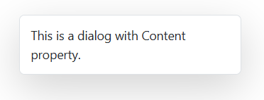

# Getting Started with Blazor Dialog Component

This section briefly explains about how to include [Blazor Dialog](https://www.syncfusion.com/blazor-components/blazor-modal-dialog) component in your Blazor WebAssembly App using Visual Studio and Visual Studio Code.

To get start quickly with Blazor Dialog component, you can check on this video or [GitHub](https://github.com/SyncfusionExamples/Blazor-Getting-Started-Examples/tree/main/Dialog) sample.






## Prerequisites

* [System requirements for Blazor components](https://blazor.syncfusion.com/documentation/system-requirements)

## Create a new Blazor App in Visual Studio

You can create a **Blazor WebAssembly App** using Visual Studio via [Microsoft Templates](https://learn.microsoft.com/en-us/aspnet/core/blazor/tooling?view=aspnetcore-7.0&pivots=vs) or the [Syncfusion<sup style="font-size:70%">&reg;</sup> Blazor Extension](https://blazor.syncfusion.com/documentation/visual-studio-integration/template-studio).

## Install Syncfusion<sup style="font-size:70%">&reg;</sup> Blazor Popups and Themes NuGet in the App

To add **Blazor Dialog** component in the app, open the NuGet package manager in Visual Studio (*Tools → NuGet Package Manager → Manage NuGet Packages for Solution*), search and install [Syncfusion.Blazor.Popups](https://www.nuget.org/packages/Syncfusion.Blazor.Popups) and [Syncfusion.Blazor.Themes](https://www.nuget.org/packages/Syncfusion.Blazor.Themes/). Alternatively, you can utilize the following package manager command to achieve the same.




Install-Package Syncfusion.Blazor.Popups -Version {{ site.releaseversion }}
Install-Package Syncfusion.Blazor.Themes -Version {{ site.releaseversion }}




N> Syncfusion<sup style="font-size:70%">&reg;</sup> Blazor components are available in [nuget.org](https://www.nuget.org/packages?q=syncfusion.blazor). Refer to [NuGet packages](https://blazor.syncfusion.com/documentation/nuget-packages) topic for available NuGet packages list with component details.





## Prerequisites

* [System requirements for Blazor components](https://blazor.syncfusion.com/documentation/system-requirements)

## Create a new Blazor App in Visual Studio Code

You can create a **Blazor WebAssembly App** using Visual Studio Code via [Microsoft Templates](https://learn.microsoft.com/en-us/aspnet/core/blazor/tooling?view=aspnetcore-7.0&pivots=vsc) or the [Syncfusion<sup style="font-size:70%">&reg;</sup> Blazor Extension](https://blazor.syncfusion.com/documentation/visual-studio-code-integration/create-project).

Alternatively, you can create a WebAssembly application using the following command in the terminal(<kbd>Ctrl</kbd>+<kbd>`</kbd>).





dotnet new blazorwasm -o BlazorApp
cd BlazorApp





## Install Syncfusion<sup style="font-size:70%">&reg;</sup> Blazor Popups and Themes NuGet in the App

* Press <kbd>Ctrl</kbd>+<kbd>`</kbd> to open the integrated terminal in Visual Studio Code.
* Ensure you’re in the project root directory where your `.csproj` file is located.
* Run the following command to install a [Syncfusion.Blazor.Popups](https://www.nuget.org/packages/Syncfusion.Blazor.Popups) and [Syncfusion.Blazor.Themes](https://www.nuget.org/packages/Syncfusion.Blazor.Themes/) NuGet package and ensure all dependencies are installed.





dotnet add package Syncfusion.Blazor.Popups -v {{ site.releaseversion }}
dotnet add package Syncfusion.Blazor.Themes -v {{ site.releaseversion }}
dotnet restore





N> Syncfusion<sup style="font-size:70%">&reg;</sup> Blazor components are available in [nuget.org](https://www.nuget.org/packages?q=syncfusion.blazor). Refer to [NuGet packages](https://blazor.syncfusion.com/documentation/nuget-packages) topic for available NuGet packages list with component details.





## Register Syncfusion<sup style="font-size:70%">&reg;</sup> Blazor Service

Open **~/_Imports.razor** file and import the `Syncfusion.Blazor` and `Syncfusion.Blazor.Popups` namespace.




@using Syncfusion.Blazor
@using Syncfusion.Blazor.Popups




Now, register the Syncfusion<sup style="font-size:70%">&reg;</sup> Blazor Service in the **~/Program.cs** file of your Blazor WebAssembly App.




using Microsoft.AspNetCore.Components.Web;
using Microsoft.AspNetCore.Components.WebAssembly.Hosting;
using Syncfusion.Blazor;

var builder = WebAssemblyHostBuilder.CreateDefault(args);
builder.RootComponents.Add<App>("#app");
builder.RootComponents.Add<HeadOutlet>("head::after");

builder.Services.AddScoped(sp => new HttpClient { BaseAddress = new Uri(builder.HostEnvironment.BaseAddress) });

builder.Services.AddSyncfusionBlazor();
await builder.Build().RunAsync();
....




## Add stylesheet and script resources

The theme stylesheet and script can be accessed from NuGet through [Static Web Assets](https://blazor.syncfusion.com/documentation/appearance/themes#static-web-assets). Include the stylesheet and script references in the `<head>` section of the **~/index.html** file.

```html
<head>
    ....
    <link href="_content/Syncfusion.Blazor.Themes/bootstrap5.css" rel="stylesheet" />
    <script src="_content/Syncfusion.Blazor.Core/scripts/syncfusion-blazor.min.js" type="text/javascript"></script>
</head>
```
N> Check out the [Blazor Themes](https://blazor.syncfusion.com/documentation/appearance/themes) topic to discover various methods ([Static Web Assets](https://blazor.syncfusion.com/documentation/appearance/themes#static-web-assets), [CDN](https://blazor.syncfusion.com/documentation/appearance/themes#cdn-reference), and [CRG](https://blazor.syncfusion.com/documentation/common/custom-resource-generator)) for referencing themes in your Blazor application. Also, check out the [Adding Script Reference](https://blazor.syncfusion.com/documentation/common/adding-script-references) topic to learn different approaches for adding script references in your Blazor application.

## Add Blazor Dialog component

Add the Syncfusion<sup style="font-size:70%">&reg;</sup> Blazor Dialog component in the **~/Pages/Index.razor** file.




<SfDialog Width="250px">
    <DialogTemplates>
        <Content> This is a Dialog with content </Content>
    </DialogTemplates>
</SfDialog>




* Press <kbd>Ctrl</kbd>+<kbd>F5</kbd> (Windows) or <kbd>⌘</kbd>+<kbd>F5</kbd> (macOS) to launch the application. This will render the Syncfusion<sup style="font-size:70%">&reg;</sup> Blazor Dialog component in your default web browser.




N> * In the dialog control, max-height is calculated based on the dialog target element height. If the **Target** property is not configured, the **document.body** is considered as a target. Therefore, to show a dialog in proper height, you need to add min-height to the target element.

N> * If the dialog is rendered based on the body, then the dialog will get the height based on its body element height. If the height of the dialog is larger than the body height, then the dialog's height will not be set. For this scenario, you can set the CSS style for the html and body to get the dialog height.




html, body {
   height: 100%;
}




## Created and Destroyed Events

- The [Created](https://help.syncfusion.com/cr/blazor/Syncfusion.Blazor.Popups.DialogEvents.html#Syncfusion_Blazor_Popups_DialogEvents_Created) event fires when the dialog is initialized and rendered in the DOM.

- The [Destroyed](https://help.syncfusion.com/cr/blazor/Syncfusion.Blazor.Popups.DialogEvents.html#Syncfusion_Blazor_Popups_DialogEvents_Destroyed) event triggers when the dialog component is removed from the DOM. These lifecycle events allow executing custom code at specific points in the component's existence.




@using Syncfusion.Blazor.Popups

<SfDialog Width="250px" Header="Dialog Header" Content="Dialog Created & Destroyed">
    <DialogEvents Created="@CreatedHandler" Destroyed="@DestroyedHandler"></DialogEvents>
</SfDialog>

@code{
    private void CreatedHandler()
    {
        // Here, you can customize your code.
    }
    private void DestroyedHandler()
    {
        // Here, you can customize your code.
    }
}




@using Syncfusion.Blazor.Popups

<SfDialog Width="250px" Header="Dialog Header" Content="Dialog Created & Destroyed">
    <DialogEvents Created="@CreatedHandler" Destroyed="@DestroyedHandler"></DialogEvents>
</SfDialog>

@code{
    private void CreatedHandler()
    {
        // Here, you can customize your code.
    }
    private void DestroyedHandler()
    {
        // Here, you can customize your code.
    }
}




## Prerender the Dialog

The [AllowPrerender](https://help.syncfusion.com/cr/blazor/Syncfusion.Blazor.Popups.SfDialog.html#Syncfusion_Blazor_Popups_SfDialog_AllowPrerender) property controls how the dialog DOM elements are handled when the dialog is hidden. Understanding this property is crucial for optimizing performance in your application.

* By default, AllowPrerender is set to false. In this mode, dialog DOM elements are completely removed from the DOM when the dialog is hidden, and recreated each time the dialog is shown. This approach saves memory but requires re-rendering on each display.
* When AllowPrerender is set to true, the dialog elements remain in the DOM even when hidden, which improves performance for frequently accessed dialogs but uses more memory.











## Set Header to Dialog

The [Header](https://help.syncfusion.com/cr/blazor/Syncfusion.Blazor.Popups.DialogTemplates.html#Syncfusion_Blazor_Popups_DialogTemplates_Header) property allows rendering a dialog with custom text header.




@using Syncfusion.Blazor.Popups

<SfDialog Width="250px" Header="Dialog Header"></SfDialog>







## Set Content to Dialog 

The [Content](https://help.syncfusion.com/cr/blazor/Syncfusion.Blazor.Popups.SfDialog.html#Syncfusion_Blazor_Popups_SfDialog_Content) property allows rendering a dialog with custom text content.




@using Syncfusion.Blazor.Popups

<SfDialog Width="250px" Content="This is a dialog with Content property."></SfDialog>







## See also

* [Getting Started with Syncfusion<sup style="font-size:70%">&reg;</sup> Blazor for client-side in .NET Core CLI](../getting-started/blazor-webassembly-dotnet-cli)

* [Getting Started with Syncfusion<sup style="font-size:70%">&reg;</sup> Blazor for server-side in Visual Studio](../getting-started/blazor-server-side-visual-studio)

* [Getting Started with Syncfusion<sup style="font-size:70%">&reg;</sup> Blazor for server-side in .NET Core CLI](../getting-started/blazor-server-side-dotnet-cli)

N> You can also explore our [Blazor Dialog example](https://blazor.syncfusion.com/demos/dialog/default-functionalities?theme=fluent) that shows you how to render and configure the Dialog.
