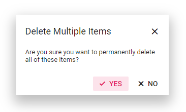

# Add an icons to Dialog buttons in Blazor Dialog Component

You can add icons to the dialog buttons using the `DialogButton` property or `FooterTemplate` property.

In the following code, dialog footer buttons are customized with icons using `DialogButton` property.

```cshtml

@using Syncfusion.Blazor.Popups
@using Syncfusion.Blazor.Buttons

<SfButton @onclick="@OpenDialog">Open Dialog</SfButton>

<SfDialog Width="300px" ShowCloseIcon="true" CloseOnEscape="true" @bind-Visible="@IsVisible">
    <DialogTemplates>
        <Header>
            <div>Delete Multiple Items</div>
        </Header>
        <Content>
            <div>Are you sure you want to permanently delete all of these items?</div>
        </Content>
    </DialogTemplates>
    <DialogButtons>
        <DialogButton Content="Yes" IsPrimary="true" IconCss="e-icons e-ok-icon" OnClick="@CloseDialog" />
        <DialogButton Content="No" IconCss="e-icons e-close-icon" OnClick="@CloseDialog" />
    </DialogButtons>
</SfDialog>

<style>
    a, a:hover, .highcontrast #dialog a, .highcontrast #dialog a:hover {
        color: inherit;
        text-decoration: none;
    }

    .e-btn-icon.e-icons.e-ok-icon.e-icon-left:before {
        content: '\e7ff';
    }

    .e-btn-icon.e-icons.e-close-icon.e-icon-left:before {
        content: '\e825';
    }
</style>

@code {
    private bool IsVisible { get; set; } = true;

    private void OpenDialog()
    {
        this.IsVisible = true;
    }

    private void CloseDialog()
    {
        this.IsVisible = false;
    }
}

```

In the following code, dialog footer buttons are customized with icons using `FooterTemplate` template property.

```cshtml

@using Syncfusion.Blazor.Popups
@using Syncfusion.Blazor.Buttons

<SfButton @onclick="@OpenDialog">Open Dialog</SfButton>

<SfDialog Width="300px" ShowCloseIcon="true" CloseOnEscape="true" @bind-Visible="@IsVisible">
    <DialogTemplates>
        <Header> Delete Multiple Items </Header>
        <Content> Are you sure you want to permanently delete all of these items? </Content>
        <FooterTemplate>
            <SfButton CssClass="e-primary e-flat" @onclick="@CloseDialog">
                <span class='e-btn-icon e-icons e-ok-icon e-icon-left'></span>Yes
            </SfButton>
            <SfButton CssClass="e-flat" @onclick="@CloseDialog">
                <span class='e-btn-icon e-icons e-close-icon e-icon-left'></span>No
            </SfButton>
        </FooterTemplate>
    </DialogTemplates>
</SfDialog>

<style>
    a, a:hover, .highcontrast #dialog a, .highcontrast #dialog a:hover {
        color: inherit;
        text-decoration: none;
    }

    .e-btn-icon.e-icons.e-ok-icon.e-icon-left:before {
        content: '\e7ff';
    }

    .e-btn-icon.e-icons.e-close-icon.e-icon-left:before {
        content: '\e825';
    }
</style>

@code {
    private bool IsVisible { get; set; } = true;

    private void OpenDialog()
    {
        this.IsVisible = true;
    }

    private void CloseDialog()
    {
        this.IsVisible = false;
    }
}

```

The output will be as follows.

