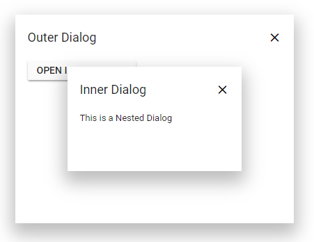

# Create nested Dialog in Blazor Dialog Component

A Dialog can be nested within another Dialog. The following sample contains parent and child Dialog (inner Dialog).

**Step 1**:

Create two dialog elements with ID `#dialog` and `#innerDialog`.

**Step 2**:

Initialize the Dialog as mentioned in the below sample.

**Step 3**:

Set the inner Dialog target as `#dialog`.

```csharp

@using Syncfusion.Blazor.Popups
@using Syncfusion.Blazor.Buttons

<SfButton @onclick="@OpenParentDialog">Open Parent Dialog</SfButton>

<SfDialog ID="innerDialog" Width="250px" MinHeight="150px" ShowCloseIcon="true" Target="@Target" @bind-Visible="@IsVisibleChild">
    <DialogTemplates>
        <Header> Inner Dialog </Header>
        <Content> This is a Nested Dialog </Content>
    </DialogTemplates>
    <DialogPositionData X="center" Y="center"></DialogPositionData>
</SfDialog>

<SfDialog ID="dialog" Width="400px" Height="300px" ShowCloseIcon="true" @bind-Visible="@IsVisibleParent">
    <DialogTemplates>
        <Header> Outer Dialog </Header>
        <Content>
            <SfButton @onclick="@OpenChildDialog">Open Inner Dialog</SfButton>
        </Content>
    </DialogTemplates>
    <DialogPositionData X="center" Y="center"></DialogPositionData>
</SfDialog>

<style>
    .content {
        padding: 10px;
    }
</style>

@code {
    private string Target { get; set; } = "body";
    private bool IsVisibleParent { get; set; } = true;
    private bool IsVisibleChild { get; set; } = false;

    private void OpenParentDialog()
    {
        this.IsVisibleParent = true;
    }

    private void OpenChildDialog()
    {
        this.Target = "#dialog.e-dialog";
        this.IsVisibleChild = true;
    }
}

```

The output will be as follows.

