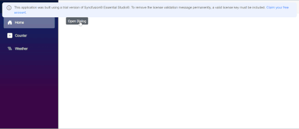

# Add minimize and maximize buttons to the Dialog header

Blazor Dialog allows end users to either minimize or maximize the Dialog component. You can add minimize and maximize custom buttons near the close icon in the Dialog header using the [`headerTemplate`](https://help.syncfusion.com/cr/blazor/Syncfusion.Blazor.Popups.DialogTemplates.html#Syncfusion_Blazor_Popups_DialogTemplates_Header) property and handle the actions in the button click events, as shown in the following sample.

Index.razor

```razor
@using Syncfusion.Blazor.Popups
@using Syncfusion.Blazor.Buttons
@inject IJSRuntime JsRuntime
@using System

<SfButton @onclick="@OpenDialog">Open Dialog</SfButton>

<SfDialog @ref="@DialogObj" Width="50%" ShowCloseIcon="true" IsModal="true" @bind-Visible="@IsVisible" CssClass="@dialogClass">
    <DialogTemplates>
        <Header>
            Dialog
            @if (!IsMaximized)
            {
                <span class="e-icons sf-icon-Maximize" title="Maximize" @onclick="@maximize"></span>
            }
            else
            {
                <span class="e-icons sf-icon-Restore" title="Restore" @onclick="@maximize"></span>
            }
            @if (!IsMinimized)
            {
                <span class="e-icons sf-icon-Minimize" title="Minimize" @onclick="@minimize"></span>
            }
            else
            {
                <span class="e-icons sf-icon-Restore" title="Restore" @onclick="@minimize"></span>
            }
        </Header>
        <Content>
            <p>This is a dialog with minimize and maximize buttons</p>
        </Content>
    </DialogTemplates>
    <DialogButtons>
        <DialogButton Content="Ok" IsPrimary="true" OnClick="@CloseDialog" />
        <DialogButton Content="Cancel" OnClick="@CloseDialog" />
    </DialogButtons>
</SfDialog>

<style>
    .e-dialog .e-dlg-header {
        width: auto;
    }

    .e-dialog .e-dlg-header .e-icons.sf-icon-Maximize::before,
    .e-dialog .e-dlg-header .e-icons.sf-icon-Minimize::before,
    .e-dialog .e-dlg-header .e-icons.sf-icon-Restore::before {
        position: relative;
    }

    .e-dialog .e-dlg-header .e-icons.sf-icon-Minimize,
    .e-dialog .e-dlg-header .e-icons.sf-icon-Maximize,
    .e-dialog .e-dlg-header .e-icons.sf-icon-Restore {
        font-size: 12px;
        width: 30px;
        height: 30px;
        line-height: 16px;
        float: right;
        position: relative;
        text-align: center;
        cursor: pointer;
        color: grey;
    }

    .e-dialog .e-dlg-header .e-icons.sf-icon-Minimize:hover, .e-dialog .e-dlg-header .e-icons.sf-icon-Maximize:hover,
    .e-dialog .e-dlg-header .e-icons.sf-icon-Restore:hover {
        /*    background-color: #e0e0e0;
            border-color: transparent;
            box-shadow: 0 0 0 transparent;
            border-radius: 50%;*/
        color: black;
    }

    .e-dialog .e-dlg-header .e-icons.sf-icon-Minimize,
    .e-dialog .e-dlg-header .e-icons.sf-icon-Restore {
        padding-left: 5px;
        padding-right: 5px;
    }

    .e-dialog .e-dlg-header {
        position: relative;
        top: 1px;
    }

    .e-dialog .e-dlg-content.hide-content, .e-dialog .e-footer-content.hide-content {
        display: none;
    }

    .e-dialog .e-dlg-header span.title {
        width: 60px;
        display: inline-block;
    }


    @@font-face {
        font-family: 'Min-Max_FONT';
        src: url(data:application/x-font-ttf;charset=utf-8;base64,AAEAAAAKAIAAAwAgT1MvMj1tSfUAAAEoAAAAVmNtYXDnE+dkAAABlAAAADxnbHlmQCkX6AAAAdwAAADkaGVhZBK7D5EAAADQAAAANmhoZWEIVQQGAAAArAAAACRobXR4FAAAAAAAAYAAAAAUbG9jYQBaAJwAAAHQAAAADG1heHABEgAgAAABCAAAACBuYW1l8Rnd5AAAAsAAAAJhcG9zdDbKxecAAAUkAAAATwABAAAEAAAAAFwEAAAAAAAD+AABAAAAAAAAAAAAAAAAAAAABQABAAAAAQAAK4KTXV8PPPUACwQAAAAAANfSZU4AAAAA19JlTgAAAAAD+AP4AAAACAACAAAAAAAAAAEAAAAFABQAAwAAAAAAAgAAAAoACgAAAP8AAAAAAAAAAQQAAZAABQAAAokCzAAAAI8CiQLMAAAB6wAyAQgAAAIABQMAAAAAAAAAAAAAAAAAAAAAAAAAAAAAUGZFZABA5wDnAwQAAAAAXAQAAAAAAAABAAAAAAAABAAAAAQAAAAEAAAABAAAAAQAAAAAAAACAAAAAwAAABQAAwABAAAAFAAEACgAAAAEAAQAAQAA5wP//wAA5wD//wAAAAEABAAAAAEAAgADAAQAAAAAAA4AKgBMAHIAAQAAAAADkwIyAAMAABMhNSFtAyb82gHOZAAAAAMAAAAAA/gD+AADAAcACwAAAREhESUVITUDIREhA5P82gMm/NplA/D8EALK/aMCXcllZfx1A/AAAQAAAAADkwOSAAsAABMJARcJATcJAScJAWwBTf6zRwFNAU1H/rMBTUf+s/6zA0v+tf61RwFL/rVHAUsBS0f+tQFLAAADAAAAAAP4A/gABQALABMAABMzIREhESURIxEhNQcjESE1MxEh0mQBlP2jAyZl/ghkygMmyvzaAsr9owJdyf2jAfhlZfzaygMmAAAAAAASAN4AAQAAAAAAAAABAAAAAQAAAAAAAQAMAAEAAQAAAAAAAgAHAA0AAQAAAAAAAwAMABQAAQAAAAAABAAMACAAAQAAAAAABQALACwAAQAAAAAABgAMADcAAQAAAAAACgAsAEMAAQAAAAAACwASAG8AAwABBAkAAAACAIEAAwABBAkAAQAYAIMAAwABBAkAAgAOAJsAAwABBAkAAwAYAKkAAwABBAkABAAYAMEAAwABBAkABQAWANkAAwABBAkABgAYAO8AAwABBAkACgBYAQcAAwABBAkACwAkAV8gTWluLU1heF9GT05UUmVndWxhck1pbi1NYXhfRk9OVE1pbi1NYXhfRk9OVFZlcnNpb24gMS4wTWluLU1heF9GT05URm9udCBnZW5lcmF0ZWQgdXNpbmcgU3luY2Z1c2lvbiBNZXRybyBTdHVkaW93d3cuc3luY2Z1c2lvbi5jb20AIABNAGkAbgAtAE0AYQB4AF8ARgBPAE4AVABSAGUAZwB1AGwAYQByAE0AaQBuAC0ATQBhAHgAXwBGAE8ATgBUAE0AaQBuAC0ATQBhAHgAXwBGAE8ATgBUAFYAZQByAHMAaQBvAG4AIAAxAC4AMABNAGkAbgAtAE0AYQB4AF8ARgBPAE4AVABGAG8AbgB0ACAAZwBlAG4AZQByAGEAdABlAGQAIAB1AHMAaQBuAGcAIABTAHkAbgBjAGYAdQBzAGkAbwBuACAATQBlAHQAcgBvACAAUwB0AHUAZABpAG8AdwB3AHcALgBzAHkAbgBjAGYAdQBzAGkAbwBuAC4AYwBvAG0AAAAAAgAAAAAAAAAKAAAAAAAAAAAAAAAAAAAAAAAAAAAAAAAFAQIBAwEEAQUBBgAITWluaW1pemUITWF4aW1pemUFQ2xvc2UHUmVzdG9yZQAAAA==) format('truetype');
        font-weight: normal;
        font-style: normal;
    }

    [class^="sf-icon-"], [class*=" sf-icon-"] {
        font-family: 'Min-Max_FONT' !important;
        speak: none;
        font-size: 55px;
        font-style: normal;
        font-weight: normal;
        font-variant: normal;
        text-transform: none;
        line-height: 1;
        -webkit-font-smoothing: antialiased;
        -moz-osx-font-smoothing: grayscale;
    }

    .sf-icon-Minimize:before {
        content: "\e700";
    }

    .sf-icon-Maximize:before {
        content: "\e701";
    }

    .sf-icon-Close:before {
        content: "\e702";
    }

    .sf-icon-Restore:before {
        content: "\e703";
    }


    .e-dialog.hide-content .e-dlg-content, .e-dialog.hide-content .e-footer-content {
        display: none;
    }
</style>

@code {
    public bool IsMaximized { get; set; } = false;
    public bool IsMinimized { get; set; } = false;
    private SfDialog DialogObj;
    private bool IsVisible { get; set; } = false;
    public string dialogClass = "";

    private void OpenDialog() => IsVisible = true;
    private void CloseDialog() => IsVisible = false;

    private async Task maximize()
    {
        IsMaximized = !IsMaximized;
        if (IsMaximized)
        {
            await JsRuntime.InvokeVoidAsync("Dialog.maximize");
        }

    }

    private async Task minimize()
    {
        IsMinimized = !IsMinimized;
        if (IsMinimized)
        {
            await JsRuntime.InvokeVoidAsync("Dialog.minimize");
        }
    }
}
```

App.razor

```
 <script>
     window.Dialog = {
         minimize: function () {
             var dialogElem = document.querySelector('.e-dialog');
             if (dialogElem) {
                 dialogElem.classList.remove('e-dlg-fullscreen');
             }
         },
         maximize: function () {
             var dialogElem = document.querySelector('.e-dialog');
             if (dialogElem) {
                 dialogElem.classList.add('e-dlg-fullscreen');
             }
         }
     }
 </script>
```

The output will be as follows.

