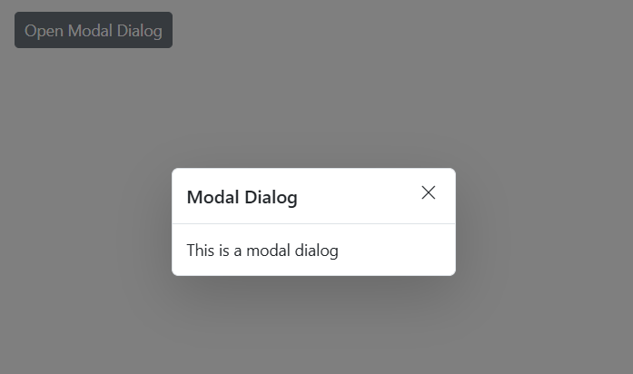

# Modal in Blazor Dialog Component

Enabling the [IsModal](https://help.syncfusion.com/cr/blazor/Syncfusion.Blazor.Popups.SfDialog.html#Syncfusion_Blazor_Popups_SfDialog_IsModal) property shows an overlay behind the Dialog. So, the users must interact with the Dialog before interacting with the remaining content in an application.

```cshtml

@using Syncfusion.Blazor.Popups

<SfDialog Width="250px" IsModal="true" Content="This is a modal dialog"></SfDialog>

```




## Overlay Modal Click Event 

The [OnOverlayModalClick](https://help.syncfusion.com/cr/blazor/Syncfusion.Blazor.Popups.DialogEvents.html#Syncfusion_Blazor_Popups_DialogEvents_OnOverlayModalClick) event triggers when the dialog’s overlay area is clicked. This event can be used to perform actions such as closing the dialog or running custom logic when the user clicks outside the dialog popup.

### Close Dialog When Clicking Outside of Its Region

While the user clicks the overlay, the action can be handled through the `OnOverlayClick` event. In the following code, it explains the Dialog close action performed while clicking the overlay.




@using Syncfusion.Blazor.Buttons
@using Syncfusion.Blazor.Popups

<SfButton @onclick="@OpenDialog">Open Modal Dialog</SfButton>

<SfDialog Width="250px" IsModal="true" @bind-Visible="@IsVisible" Content="This is a modal dialog">
    <DialogEvents OnOverlayModalClick="@OnOverlayclick"></DialogEvents>
</SfDialog>

@code {
    private bool IsVisible { get; set; } = true;

    private void OpenDialog()
    {
        this.IsVisible = true;
    }

    private void OnOverlayclick(OverlayModalClickEventArgs arg)
    {
        this.IsVisible = false;
    }
}





