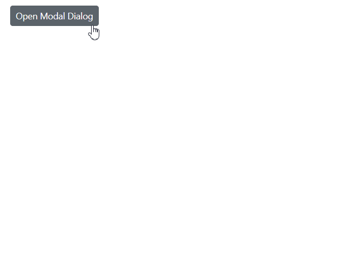

# Modal in Blazor Dialog Component

A modal dialog prevents users from interacting with the rest of the application until the dialog is closed. The [IsModal](https://help.syncfusion.com/cr/blazor/Syncfusion.Blazor.Popups.SfDialog.html#Syncfusion_Blazor_Popups_SfDialog_IsModal) property enables modal behavior by displaying an overlay behind the Dialog, ensuring users must complete their interaction with the Dialog before accessing other application content.

```cshtml

@using Syncfusion.Blazor.Popups
@using Syncfusion.Blazor.Buttons

<div id="target">
    <div>
        <SfButton @onclick="@OpenDialog">Open Modal Dialog</SfButton>
    </div>
    <SfDialog Target="#target" Width="250px" IsModal="true" @bind-Visible="@IsVisible" Header="Modal Dialog" Content="This is a modal dialog" ShowCloseIcon="true"></SfDialog>
</div>

<style>
    #target {
        height: 500px;
    }
</style>

@code {
    private bool IsVisible { get; set; } = false;

    private void OpenDialog()
    {
        this.IsVisible = true;
    }
}

```




## Handling Overlay Click Events

The [OnOverlayModalClick](https://help.syncfusion.com/cr/blazor/Syncfusion.Blazor.Popups.DialogEvents.html#Syncfusion_Blazor_Popups_DialogEvents_OnOverlayModalClick) event triggers when users click on the dialog's overlay area. This event provides access to the [OverlayModalClickEventArgs](https://help.syncfusion.com/cr/blazor/Syncfusion.Blazor.Popups.OverlayModalClickEventArgs.html) object, enabling custom functionality such as closing the dialog when users click outside the dialog content or implementing validation before allowing the dialog to close.

### Close Dialog When Clicking Outside of Its Region

The following example demonstrates how to close a modal dialog when the user clicks on the overlay area outside the dialog content. This provides an intuitive way for users to dismiss the dialog without requiring explicit close button interaction.

```cshtml

@using Syncfusion.Blazor.Popups
@using Syncfusion.Blazor.Buttons

<div id="target">
    <div>
        <SfButton @onclick="@OpenDialog">Open Modal Dialog</SfButton>
    </div>
    <SfDialog Target="#target" Width="250px" IsModal="true" @bind-Visible="@IsVisible" Header="Overlay Modal Dialog" Content="This is a modal dialog">
        <DialogEvents OnOverlayModalClick="@OnOverlayClick"></DialogEvents>
    </SfDialog>
</div>

@code {
    private bool IsVisible { get; set; } = false;

    private void OpenDialog()
    {
        this.IsVisible = true;
    }

    private void OnOverlayClick(OverlayModalClickEventArgs arg)
    {
        this.IsVisible = false;
    }
}


<style>
    #target {
        height: 500px;
    }
</style>

```


