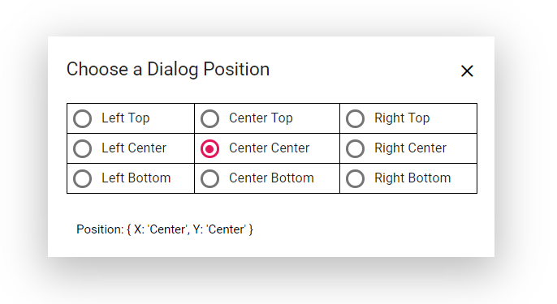

# Positioning in Blazor Dialog Component

The [Blazor Dialog](https://www.syncfusion.com/blazor-components/blazor-modal-dialog) can be positioned using the `DialogPositionData` property by providing the X and Y coordinates. It can be positioned inside the target of the `container` or `<body>` of the element based on the given X and Y values.

## DialogPositionData Properties

The DialogPositionData class sets the dialog's X and Y coordinates. The position is relative to a specified Target or the page body if no target is defined.

For X is: left, center, right (or) any offset value
For Y is: top, center, bottom (or) any offset value

## RefreshPositionAsync Method

The [RefreshPositionAsync](https://help.syncfusion.com/cr/blazor/Syncfusion.Blazor.Popups.SfDialog.html#Syncfusion_Blazor_Popups_SfDialog_RefreshPositionAsync) method is used to programmatically recalculate and update the dialog's position. It is useful for re-centering the dialog after events like browser window resizing or dynamic content changes that might affect its alignment.

The following code demonstrates the different Dialog positions.

```cshtml

@using Syncfusion.Blazor.Popups
@using Syncfusion.Blazor.Buttons

<div id="target">
    <div>
        @if (this.ShowButton)
        {
            <SfButton Content="Open Dialog" @onclick="@OpenDialog"></SfButton>
        }
    </div>
    <SfDialog @ref="@DialogObj" ID="defaultDialog" Target="#target" Width="445px" ShowCloseIcon="true" @bind-Visible="@Visibility">
        <DialogTemplates>
            <Header>
                <div>Choose a Dialog Position</div>
            </Header>
            <Content>
                <table style="width:405px;" id="poschange">
                    <tr>
                        <td>
                            <SfRadioButton Name="xy" Label="Left Top" Value="left top" @bind-Checked="@Checked" @onchange="OnChangeHandler"></SfRadioButton>
                        </td>
                        <td>
                            <SfRadioButton Name="xy" Label="Center Top" Value="center top" @bind-Checked="@Checked" @onchange="OnChangeHandler"></SfRadioButton>
                        </td>
                        <td>
                            <SfRadioButton Name="xy" Label="Right Top" Value="right top" @bind-Checked="@Checked" @onchange="OnChangeHandler"></SfRadioButton>
                        </td>
                    </tr>
                    <tr>
                        <td>
                            <SfRadioButton Name="xy" Label="Left Center" Value="left center" @bind-Checked="@Checked" @onchange="OnChangeHandler"></SfRadioButton>
                        </td>
                        <td>
                            <SfRadioButton Name="xy" Label="Center Center" Value="center center" @bind-Checked="@Checked" @onchange="OnChangeHandler"></SfRadioButton>
                        </td>
                        <td>
                            <SfRadioButton Name="xy" Label="Right Center" Value="right center" @bind-Checked="@Checked" @onchange="OnChangeHandler"></SfRadioButton>
                        </td>
                    </tr>
                    <tr>
                        <td>
                            <SfRadioButton Name="xy" Label="Left Bottom" Value="left bottom" @bind-Checked="@Checked" @onchange="OnChangeHandler"></SfRadioButton>
                        </td>
                        <td>
                            <SfRadioButton Name="xy" Label="Center Bottom" Value="center bottom" @bind-Checked="@Checked" @onchange="OnChangeHandler"></SfRadioButton>
                        </td>
                        <td>
                            <SfRadioButton Name="xy" Label="Right Bottom" Value="right bottom" @bind-Checked="@Checked" @onchange="OnChangeHandler"></SfRadioButton>
                        </td>
                    </tr>
                </table>
            </Content>
            <FooterTemplate><span>Position : { X: '@Xvalue', Y: '@Yvalue' }</span></FooterTemplate>
        </DialogTemplates>
        <DialogPositionData X="@Xvalue" Y="@Yvalue"></DialogPositionData>
        <DialogEvents OnOpen="@BeforeDialogOpen" Closed="@DialogClosed"></DialogEvents>
    </SfDialog>
</div>

<style>
    #defaultDialog table,
    #defaultDialog th,
    #defaultDialog td {
    border: 1px solid #D8D8D8;
    border-collapse: collapse;
    }

    #defaultDialog.e-dialog .e-footer-content {
    padding: 0px 10px 10px;
    text-align: center;
    }

    #target {
    min-height: 450px;
    height: 100%;
    }

    .e-dialog .e-dlg-content {
    padding: 10px 16px 10px;
    }

    .e-radio + label .e-label {
    line-height: 18px;
    }

    td {
    padding: 4px;
    }
</style>

@code {
    private string Xvalue = "center";
    private string Yvalue = "center";
    private bool Visibility { get; set; } = true;
    private bool ShowButton { get; set; } = false;
    private string Checked { get; set; } = "center center";
    private SfDialog DialogObj { get; set; }

    private void BeforeDialogOpen(BeforeOpenEventArgs args)
    {
        this.ShowButton = false;
    }

    private void DialogClosed(CloseEventArgs args)
    {
        this.ShowButton = true;
    }

    private void OpenDialog()
    {
        this.Visibility = true;
    }

    private async void OnChangeHandler(ChangeEventArgs arg)
    {
        this.Xvalue = arg.Value.ToString().Split(' ')[0];
        this.Yvalue = arg.Value.ToString().Split(' ')[1];
        await DialogObj.RefreshPositionAsync();
    }
}

```





## See also

* [Positioning in Blazor Dialog Component](https://blazor.syncfusion.com/demos/dialog/positioning)