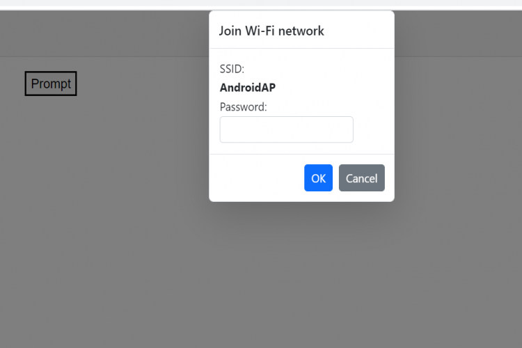

# Predefined dialogs in Blazor Dialog componen

The dialog component is used to render the alert, confirm and prompt dialogs with the minimal code. The alert, confirm and prompt dialogs are shown using DialogServices.

## Configuration

### Blazor Server App

* For **.NET 6** app, open the **~/Program.cs** file and import Syncfusion.Blazor.Popups.

* For **.NET 5 and .NET 3.X** app, open the **~/Startup.cs** file and import Syncfusion.Blazor.Popups.




@using Syncfusion.Blazor.Popups

// Add services to the container.
builder.Services.AddRazorPages();
builder.Services.AddServerSideBlazor();
builder.Services.AddScoped<SfDialogService>();
builder.Services.AddSyncfusionBlazor(options => { options.IgnoreScriptIsolation = true; });

var app = builder.Build();
....





@using Syncfusion.Blazor.Popups

namespace BlazorApplication
{
    public class Startup
    {
        ...
        public void ConfigureServices(IServiceCollection services)
        {
         	services.AddRazorPages();
    		services.AddServerSideBlazor();
    		services.AddScoped<SfDialogService>();
            services.AddSyncfusionBlazor(options => { options.IgnoreScriptIsolation = true; });
    		services.AddServerSideBlazor().AddCircuitOptions(options => { options.DetailedErrors = true; });
    		services.AddServerSideBlazor().AddHubOptions(o =>
        }
        ...
    }
}




### Blazor WebAssembly App

Open **~/Program.cs** file and register the Syncfusion Blazor Service in the client web app.




@using Syncfusion.Blazor.Popups

// Add services to the container.

builder.Services.AddScoped(sp => new HttpClient { BaseAddress = new Uri(builder.HostEnvironment.BaseAddress) });
builder.Services.AddScoped<SfDialogService>();
builder.Services.AddSyncfusionBlazor(options => { options.IgnoreScriptIsolation = true; });
await builder.Build().RunAsync();
....





@using Syncfusion.Blazor.Popups

namespace WebApplication1
{
    public class Program
    {
        public static async Task Main(string[] args)
        {
            ....
            builder.Services.AddSyncfusionBlazor(options => { options.IgnoreScriptIsolation = true; });
            builder.Services.AddScoped<SfDialogService>();
            await builder.Build().RunAsync();
        }
    }
}




open  **~/_MainLayout.razor** file and add SfDialogProvider




<Syncfusion.Blazor.Popups.SfDialogProvider/>




## Available Predefined dialogs

There are three available predefined dialogs:

        * Alert
        * Confirm
        * Prompt

### Alert

An alert dialog box is used to display errors, warnings, and information that needs user awareness.

Use the following code to render a simple alert dialog in an application.









### Confirm

A confirm dialog displays a specified message along with ‘OK’ and ‘Cancel’ button. Used to get approval from user that appears before any critical action.

Use the following code to render a simple confirm dialog in an application.









### Prompt

Used to get input from the user. When the user enters "OK", the input value is returned. When they click "Cancel", the null value  returned.

Use the following code to render a simple prompt dialog in an application.









## Dragging

The Dialog supports to `Drag` within its target container by grabbing the Dialog header, which allows the user to reposition the Dialog dynamically.

















## Animations

The predefined ialog can be animated during the open and close actions. Also, users can customize animation’s `Delay`, `Duration` and `Effect` by using the `DialogAnimationSettings` property.

In the following sample, `Zoom` effect is enabled. So, The Dialog will open with `ZoomIn` and close with `ZoomOut` effects.

















## Position

You can customize the dialog position by using `Position` property. Use the following code to customize the dialog position.

















## Dimension

You can customize the dialog dimensions using `Height` and `Width` properties. Use the following code to customize the dialog dimensions.

















## Close Button Dialog

You can customize the close icon using `ShowCloseIcon` property. If the `ShowCloseIcon` property is set to `true` then the close icon will appear. Use the following code to enable the `ShowCloseIcon`.

























## Customization of Action Buttons

You can customize the predefined dialog buttons by using `PrimaryButtonOptions` property. Use the following code to customize the predefined dialog buttons.













## Customization of Dialog Content

You can customize the predefined dialogs using `childContent` property. Use the following code, to render the textbox component inside `Prompt` dialog.









