# Predefined dialogs in the Blazor Dialog component

The dialog component is used to render the `Alert`, `Confirm`, and `Prompt` dialogs with minimal code. The alert, confirm, and prompt dialogs are shown using [DialogServices](https://help.syncfusion.com/cr/blazor/Syncfusion.Blazor.Popups.SfDialogService.html).

## Configuration

### Blazor Server App

* For **.NET 6** app, open the **~/Program.cs** file and import Syncfusion.Blazor.Popups.

* For **.NET 5 and .NET 3.X** app, open the **~/Startup.cs** file and import Syncfusion.Blazor.Popups.




@using Syncfusion.Blazor.Popups

// Add services to the container.
builder.Services.AddRazorPages();
builder.Services.AddServerSideBlazor();
builder.Services.AddScoped<SfDialogService>();
builder.Services.AddSyncfusionBlazor(options => { options.IgnoreScriptIsolation = true; });

var app = builder.Build();
....





@using Syncfusion.Blazor.Popups

namespace BlazorApplication
{
    public class Startup
    {
        ...
        public void ConfigureServices(IServiceCollection services)
        {
         	services.AddRazorPages();
    		services.AddServerSideBlazor();
    		services.AddScoped<SfDialogService>();
            services.AddSyncfusionBlazor(options => { options.IgnoreScriptIsolation = true; });
    		services.AddServerSideBlazor().AddCircuitOptions(options => { options.DetailedErrors = true; });
    		services.AddServerSideBlazor().AddHubOptions(o =>
        }
        ...
    }
}




### Blazor WebAssembly App

Open **~/Program.cs** file and register the Syncfusion Blazor Service in the client web app.




@using Syncfusion.Blazor.Popups

// Add services to the container.

builder.Services.AddScoped(sp => new HttpClient { BaseAddress = new Uri(builder.HostEnvironment.BaseAddress) });
builder.Services.AddScoped<SfDialogService>();
builder.Services.AddSyncfusionBlazor(options => { options.IgnoreScriptIsolation = true; });
await builder.Build().RunAsync();
....





@using Syncfusion.Blazor.Popups

namespace WebApplication1
{
    public class Program
    {
        public static async Task Main(string[] args)
        {
            ....
            builder.Services.AddSyncfusionBlazor(options => { options.IgnoreScriptIsolation = true; });
            builder.Services.AddScoped<SfDialogService>();
            await builder.Build().RunAsync();
        }
    }
}




open  **~/_MainLayout.razor** file and add SfDialogProvider




<Syncfusion.Blazor.Popups.SfDialogProvider/>




## Available Predefined dialogs

There are three available predefined dialogs:

        * Alert
        * Confirm
        * Prompt

### Show alert dialog

An [Alert](https://help.syncfusion.com/cr/blazor/Syncfusion.Blazor.Popups.SfDialogService.html#Syncfusion_Blazor_Popups_SfDialogService_AlertAsync_System_String_System_String_Syncfusion_Blazor_Popups_DialogOptions_) dialog box is used to display errors, warnings, and information that needs user awareness by using `DialogService.AlertAsync` method. The `Alert` dialog display along with ‘Ok’ button.But, it does not have any specific return type. When you click on ‘Ok’ button then the `Alert` method will complete.

Use the following code to render a simple alert dialog in an application:









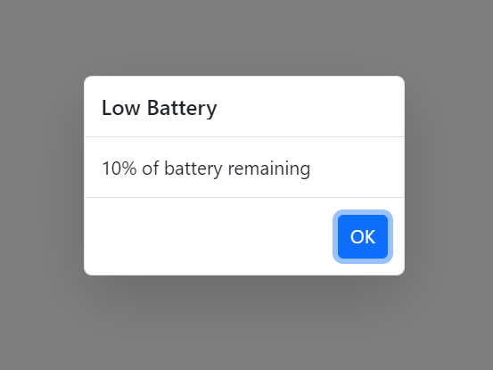

### Show confirm dialog

A [Confirm](https://help.syncfusion.com/cr/blazor/Syncfusion.Blazor.Popups.SfDialogService.html#Syncfusion_Blazor_Popups_SfDialogService_ConfirmAsync_System_String_System_String_Syncfusion_Blazor_Popups_DialogOptions_) dialog displays a specified message along with ‘OK’ and ‘Cancel’ button where it returns a boolean value according to the user's click action by using `DialogService.ConfirmAsync` method. It is used to get approval from a user and it appears before any critical action.

Use the following code to render a simple confirm dialog in an application:









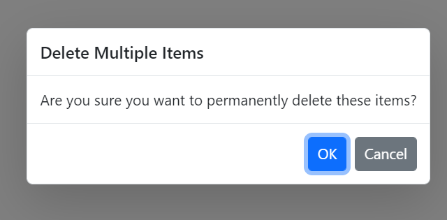

### Show prompt dialog

A [Prompt](https://help.syncfusion.com/cr/blazor/Syncfusion.Blazor.Popups.SfDialogService.html#Syncfusion_Blazor_Popups_SfDialogService_PromptAsync_System_String_System_String_Syncfusion_Blazor_Popups_DialogOptions_) dialog is used to get input from user by using `DialogService.PromptAsync` method. When the user enters ‘OK’, the input value is returned. When they click ‘Cancel’, the null value is returned.

Use the following code to render a simple prompt dialog in an application:









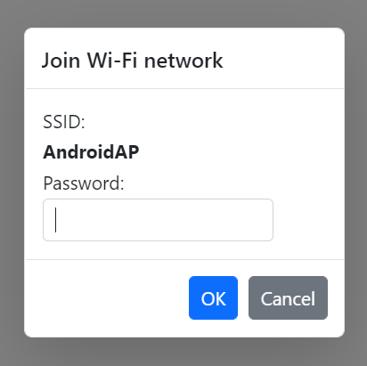

## Dragging

The Dialog supports dragging within its target container by grabbing the Dialog header, which allows the user to reposition the Dialog dynamically by using the [DialogOptions.AllowDragging](https://help.syncfusion.com/cr/blazor/Syncfusion.Blazor.Popups.DialogOptions.html#Syncfusion_Blazor_Popups_DialogOptions_AllowDragging) property.

















## Animations

The predefined dialogs can be animated during the open and close actions. Also, users can customize animation’s `Delay`, `Duration` and `Effect` by using the [DialogOptions.AnimationSettings](https://help.syncfusion.com/cr/blazor/Syncfusion.Blazor.Popups.DialogOptions.html#Syncfusion_Blazor_Popups_DialogOptions_AnimationSettings) property.
In the following sample, the `Zoom` effect is enabled. So, the Dialog will open with `ZoomIn` and close with `ZoomOut` effects.

















## Position

You can customize the dialog position by using the [DialogOptions.Position](https://help.syncfusion.com/cr/blazor/Syncfusion.Blazor.Popups.DialogOptions.html#Syncfusion_Blazor_Popups_DialogOptions_Position)  property. Use the following code to customize the dialog position:

















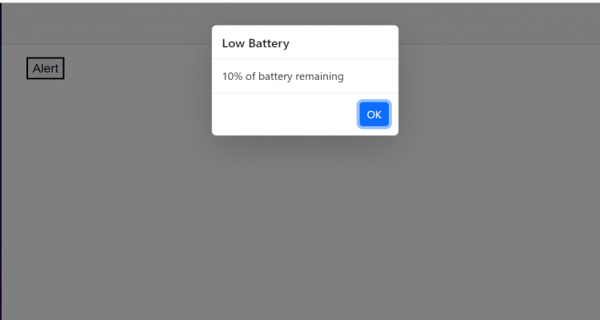

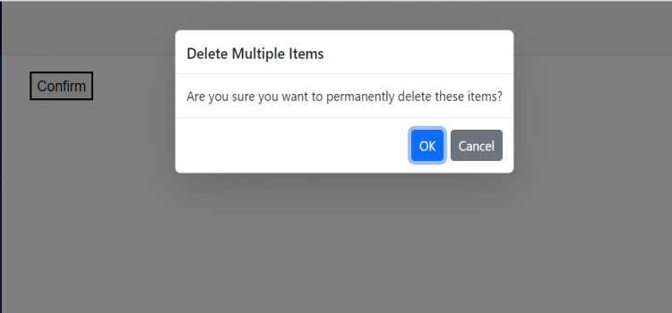

## Dimension

You can customize the dialog dimensions using [DialogOptions.Height](https://help.syncfusion.com/cr/blazor/Syncfusion.Blazor.Popups.DialogOptions.html#Syncfusion_Blazor_Popups_DialogOptions_Height) and `DialogOptions.Width` properties. Use the following code to customize the dialog dimensions:

















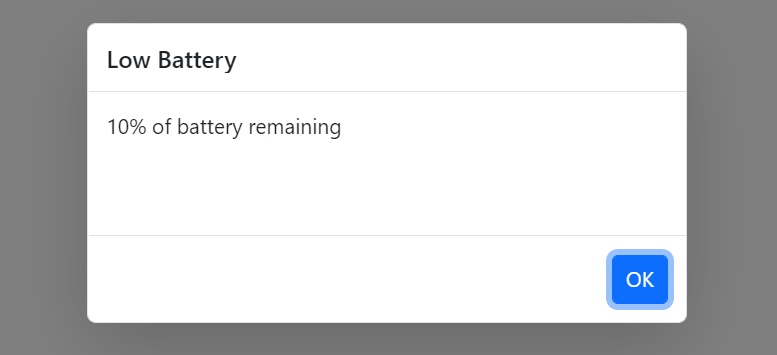

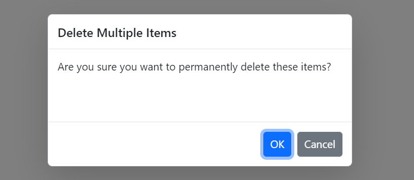

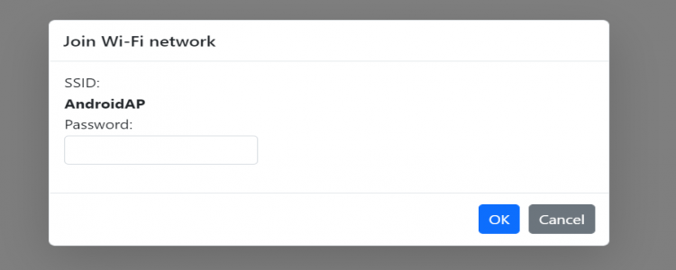

## Close Button Dialog

You can customize the close icon using [DialogOptions.ShowCloseIcon](https://help.syncfusion.com/cr/blazor/Syncfusion.Blazor.Popups.DialogOptions.html#Syncfusion_Blazor_Popups_DialogOptions_ShowCloseIcon) property. If the ShowCloseIcon property is set to true then the close icon will appear. Use the following code to enable the ShowCloseIcon:

















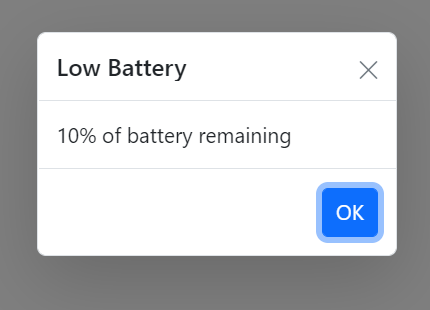

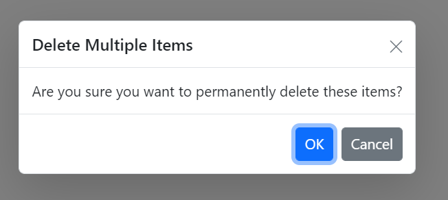

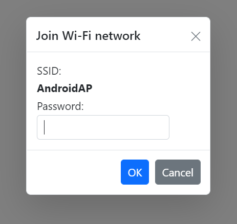

## Customization of Action Buttons

You can customize the predefined dialog buttons by using the [DialogOptions.PrimaryButtonOptions](https://help.syncfusion.com/cr/blazor/Syncfusion.Blazor.Popups.DialogOptions.html#Syncfusion_Blazor_Popups_DialogOptions_PrimaryButtonOptions) property. Use the following code to customize the predefined dialog buttons:

















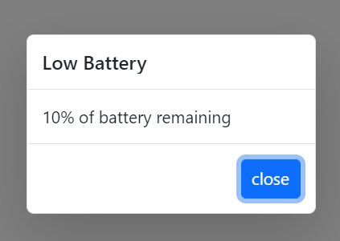

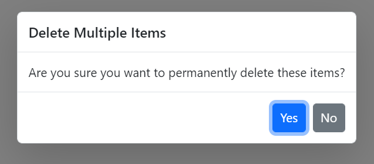

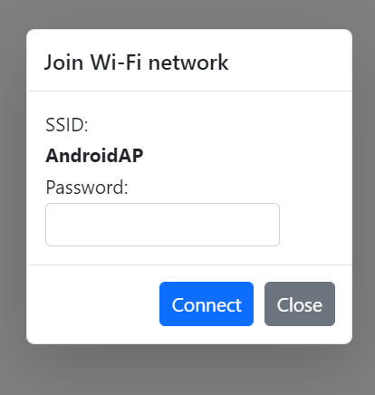

## Customization of Dialog Content

You can customize the predefined dialogs using the [DialogOptions.childContent](https://help.syncfusion.com/cr/blazor/Syncfusion.Blazor.Popups.DialogOptions.html#Syncfusion_Blazor_Popups_DialogOptions_ChildContent) property. Use the following code to render the textbox component inside `Prompt` dialog:









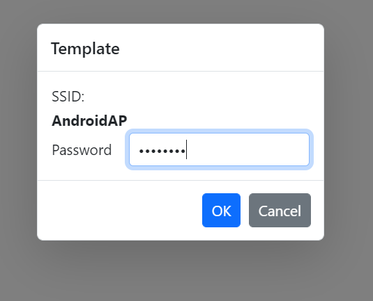

