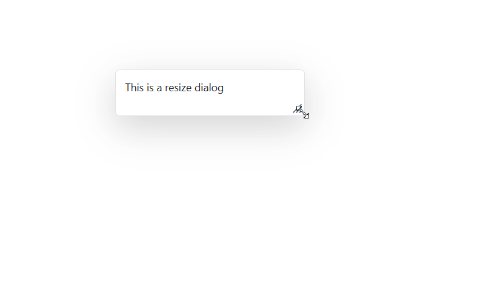
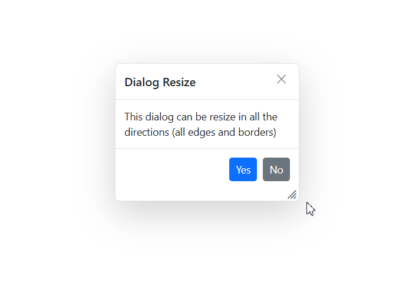

# Resizing in Blazor Dialog Component

The [Blazor Dialog](https://www.syncfusion.com/blazor-components/blazor-modal-dialog) supports resizing feature. To resize the dialog, select and resize it by using its handle (grip) or hovering on any of the edges or borders of the dialog within the sample container.

To get started quickly with resizing in Blazor Dialog Component, Refer the video below.



## EnableResize

The resizable dialog can be created by setting the [EnableResize](https://help.syncfusion.com/cr/blazor/Syncfusion.Blazor.Popups.SfDialog.html#Syncfusion_Blazor_Popups_SfDialog_EnableResize) property to true, which is used to change the size of a dialog dynamically and view its content with expanded mode.

```cshtml

@using Syncfusion.Blazor.Popups
@using Syncfusion.Blazor.Buttons

<SfButton @onclick="@OpenDialog">Open Modal Dialog</SfButton>

<SfDialog Width="250px" EnableResize="true" @bind-Visible="@IsVisible" Content="This is a resize dialog"></SfDialog>

@code {
    private bool IsVisible { get; set; } = false;

    private void OpenDialog()
    {
        this.IsVisible = true;
    }
}

```




## ResizeHandles

The [ResizeHandles](https://help.syncfusion.com/cr/blazor/Syncfusion.Blazor.Popups.SfDialog.html#Syncfusion_Blazor_Popups_SfDialog_ResizeHandles) property can also be configured for all the directions in which the dialog should be resized. When you configure the target property along with the `EnableResize` property, the dialog can be resized within its specified target container.

```cshtml

@using Syncfusion.Blazor.Popups
@using Syncfusion.Blazor.Buttons

<div id="target">
    <SfButton @onclick="@OpenDialog">Open Dialog</SfButton>

    <SfDialog Target="#target" Width="250px" EnableResize="true" AllowDragging="true" ResizeHandles="@dialogResizeDirections" ShowCloseIcon="true" @bind-Visible="@IsVisible">
        <DialogTemplates>
            <Header> Dialog </Header>
            <Content> This is a Dialog with drag enabled </Content>
        </DialogTemplates>
        <DialogButtons>
            <DialogButton Content="OK" IsPrimary="true" OnClick="@CloseDialog" />
            <DialogButton Content="Cancel" OnClick="@CloseDialog" />
        </DialogButtons>
    </SfDialog>
</div>

<style>
    #target {
        min-height: 400px;
        height: 100%;
        position: relative;
    }
</style>

@code {
    private bool IsVisible { get; set; } = true;

    private ResizeDirection[] dialogResizeDirections { get; set; } = new ResizeDirection[] { ResizeDirection.All };

    private void OpenDialog()
    {
        this.IsVisible = true;
    }

    private void CloseDialog()
    {
        this.IsVisible = false;
    }
}

```




## Related Events

### OnResizeStart

The [OnResizeStart](https://help.syncfusion.com/cr/blazor/Syncfusion.Blazor.Popups.DialogEvents.html#Syncfusion_Blazor_Popups_DialogEvents_OnResizeStart) event triggers when the user begins to resize a dialog.

## Resizing

The [Resizing](https://help.syncfusion.com/cr/blazor/Syncfusion.Blazor.Popups.DialogEvents.html#Syncfusion_Blazor_Popups_DialogEvents_Resizing) event triggers when the user resize the dialog.

## OnResizeStop

The [OnResizeStop](https://help.syncfusion.com/cr/blazor/Syncfusion.Blazor.Popups.DialogEvents.html#Syncfusion_Blazor_Popups_DialogEvents_OnResizeStop) event triggers when the user stop to resize a dialog.




@using Syncfusion.Blazor.Buttons
@using Syncfusion.Blazor.Popups

<SfButton @onclick="@OpenDialog">Open Modal Dialog</SfButton>

<span>Visible state: @IsVisible</span>

<div style="display: grid; float: right;">
    @foreach (string evt in EventList)
    {
        <span>@evt "Event Triggered"</span>
    }
</div>

<SfDialog Width="250px" EnableResize="true" @bind-Visible="@IsVisible" Content="Dialog with resize events" Header="Resize Events" ShowCloseIcon="true">
    <DialogEvents OnResizeStart="OnResizeStart" Resizing="Resizing"  OnResizeStop="OnResizeStop"></DialogEvents>
</SfDialog>

@code {
    private bool IsVisible { get; set; } = true;
    private List<string> EventList = new List<string>();

    private void OpenDialog()
    {
        this.IsVisible = true;
    }

    private void OnResizeStart(MouseEventArgs args)
    {
        EventList.Add("OnResizeStart");
    }

    private void Resizing(MouseEventArgs args)
    {
        EventList.Add("Resizing");
    }

    private void OnResizeStop(MouseEventArgs args)
    {
        EventList.Add("OnResizeStop");
    }
}






