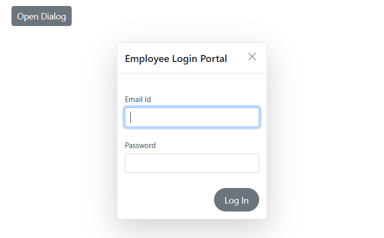

# Templates in Blazor Dialog Component

The [Blazor Dialog](https://www.syncfusion.com/blazor-components/blazor-modal-dialog) component provides comprehensive template support for header, content, and footer sections. This feature enables developers to create highly customized dialog experiences by incorporating custom HTML content, interactive components, and dynamic data binding within each section.

Templates offer flexibility to transform standard dialogs into rich, interactive user interfaces that can include forms, multimedia content, custom styling, and complex layouts tailored to specific application requirements.

To get started quickly with templates in Blazor Dialog Component, you can check the video below.



## Header Template

The Dialog header content can be customized through the `Header` property within the `DialogTemplates` section. This property accepts both plain text and HTML content, allowing for rich header designs including icons, images, user information, and custom styling.

```cshtml

@using Syncfusion.Blazor.Popups

<div id="target" class="col-lg-12 control-section" style="height:100%">
    <div>
        <button class="e-btn" @onclick="@OpenDialog">Open Dialog</button>
    </div>
    <SfDialog Width="435px" Target="#target" ShowCloseIcon="true" @bind-Visible="Visibility" Content="Greetings Nancy! When will you share me the source files of the project?">
        <DialogTemplates>
            <Header>
                <span class="e-avatar template-image e-avatar-xsmall e-avatar-circle"></span>
                <div id="template" title="Nancy" class="e-icon-settings">Nancy</div>
            </Header>
        </DialogTemplates>
    </SfDialog>
</div>

@code {
    private bool Visibility { get; set; } = true;

    private void OpenDialog()
    {
        this.Visibility = true;
    }
}

<style>
    #target {
        min-height: 400px;
    }

    .e-dialog .e-dlg-header-content {
        background-color: #3f51b5;
    }

    .e-dialog .e-dlg-header-content .e-btn.e-dlg-closeicon-btn {
        top: 5px;
        left: -11px;
    }

    .e-dialog .e-dlg-header {
        position: relative;
    }

    .e-dialog .e-dlg-header-content {
        padding: 6px;
    }

    #template {
        display: inline-block;
        padding: 0px 10px;
        vertical-align: middle;
        height: 40px;
        line-height: 40px;
    }

    .e-dlg-header .e-icon-settings, 
    .e-icon-btn,
    .e-dlg-header-content .e-icon-dlg-close {
        color: #fff;
    }

    .e-dialog .e-dlg-header-content .e-dlg-header .e-avatar.template-image {
        background-image: url("https://ej2.syncfusion.com/demos/src/dialog/images/1.png");
        vertical-align: middle;
        display: inline-block;
        width: 36px;
        height: 36px;
    }
</style>

```




## Content Template

The Dialog content area supports extensive customization through the `Content` property within the `DialogTemplates` section. This section can accommodate any HTML content, including forms, media elements, data grids, charts, and other Blazor components.

```cshtml

@using Syncfusion.Blazor.Popups
@using Syncfusion.Blazor.Buttons
@using Syncfusion.Blazor.DataForm
@using System.ComponentModel.DataAnnotations

<div id="target" class="col-lg-12 control-section" style="height:100%">
    <div>
        <button class="e-btn" @onclick="@OpenDialog">Open Dialog</button>
    </div>
    <SfDialog Width="20%" Target="#target" Header="Employee Login Portal" ShowCloseIcon="true" @bind-Visible="Visibility">
        <DialogTemplates>
            <Content>
                <div class="dialogContent">
                    <SfDataForm ID="MyForm" Model="@LogInModel" ButtonsAlignment="FormButtonsAlignment.Right">
                        <FormItems>
                            <FormItem Field="@nameof(LogInModel.Email)" LabelText="Email Id"> </FormItem>
                            <FormItem Field="@nameof(LogInModel.Password)" LabelText="Password" EditorType="FormEditorType.Password"> </FormItem>
                        </FormItems>
                        <FormButtons>
                            <SfButton>Log In</SfButton>
                        </FormButtons>
                    </SfDataForm>
                </div>
            </Content>
        </DialogTemplates>
    </SfDialog>
</div>

@code {
    private bool Visibility { get; set; } = true;

    private void OpenDialog()
    {
        this.Visibility = true;
    }

    public class LogInDetails
    {
        public string Password { get; set; }
        public string Email { get; set; }
    }

    private LogInDetails LogInModel = new LogInDetails();
}

<style>
    #target {
        min-height: 400px;
    }
</style>

```




## Footer Template

The Dialog footer can be customized using either built-in `DialogButton` components or custom HTML through the `FooterTemplate` property. These approaches are mutually exclusive and cannot be used simultaneously within the same dialog instance.


```cshtml

@using Syncfusion.Blazor.Popups
@using Syncfusion.Blazor.Inputs
@using Syncfusion.Blazor.Buttons

<div id="target" class="col-lg-12 control-section" style="height:100%">
    <div>
        <SfButton OnClick="@OpenDialog">Open Dialog</SfButton>
    </div>
    <SfDialog Width="435px" Target="#target" Header="Customer Name: 'Nancy'" Content="Please confirm you are received the OTP sent to your registered mobile number" ShowCloseIcon="true" @bind-Visible="Visibility">
        <DialogTemplates>
            <FooterTemplate>
                <SfTextBox ID="inVal" Type="Syncfusion.Blazor.Inputs.InputType.Password" Placeholder="Enter your OTP number here!" />
                <SfButton IsPrimary="true">Send</SfButton>
            </FooterTemplate>
        </DialogTemplates>
    </SfDialog>
</div>

@code {
    private bool Visibility { get; set; } = true;

    private void OpenDialog()
    {
        this.Visibility = true;
    }
}

<style>
    .e-footer-content .e-input-group {
        width: 75%;
        float: left;
    }

    #target {
        min-height: 200px;
    }

    .e-dialog .e-footer-content {
        padding: 15px;
        border-top: 0.5px solid rgba(0, 0, 0, 0.42);
    }
</style>

```




N> The `DialogButton` and `FooterTemplate` properties cannot be used together. Choose the approach that best fits the dialog's functional requirements.

## See also

* [How to add an icon to dialog buttons](./how-to/add-an-icons-to-dialog-buttons)
* [How to customize the dialog appearance](./how-to/customize-the-dialog-appearance)