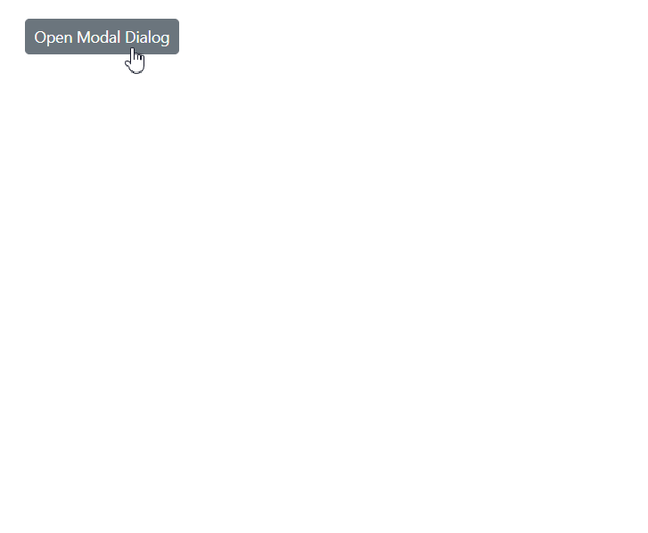
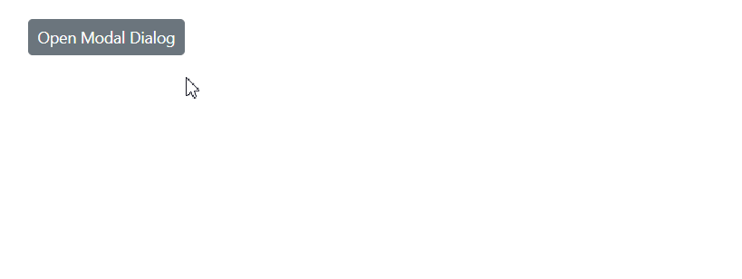

# Visibility in Blazor Dialog Component

The [Visible](https://help.syncfusion.com/cr/blazor/Syncfusion.Blazor.Popups.SfDialog.html#Syncfusion_Blazor_Popups_SfDialog_Visible) property controls whether the dialog is shown or hidden on the page. Setting it to true displays the dialog, while setting it to false hides the dialog from view.

## Visible Property Binding

### One-Way Binding

One-way binding sets a fixed visibility state for the dialog. This approach is useful when the dialog's visibility should remain constant throughout the component lifecycle or be controlled entirely by the parent component.

```cshtml

@using Syncfusion.Blazor.Popups

<SfDialog Width="250px" Visible="false"></SfDialog>

```

### Two-Way Binding

Two-way binding using the @bind-Visible syntax enables dynamic visibility control, allowing the dialog's state to be updated both programmatically and through user interactions. This approach automatically synchronizes the dialog's visibility with the bound variable, making it ideal for interactive scenarios where the dialog needs to respond to various user actions.

```cshtml

@using Syncfusion.Blazor.Popups
@using Syncfusion.Blazor.Buttons

<div id="target">
    <div>
        <SfButton @onclick="@OpenDialog">Open Modal Dialog</SfButton>
        <span>Visible state: @IsVisible</span>
    </div>
    <SfDialog Target="#target" Width="250px" @bind-Visible="@IsVisible" Header="Two-way Binding" Content="This is a Two way binding visible property of dialog" ShowCloseIcon="true">
    </SfDialog>
</div>

@code {
    private bool IsVisible { get; set; } = false;

    private void OpenDialog()
    {
        this.IsVisible = true;
    }
}

<style>
    #target {
        height: 500px;
    }
</style>

```




## ShowAsync Method

The [ShowAsync](https://help.syncfusion.com/cr/blazor/Syncfusion.Blazor.Popups.SfDialog.html#Syncfusion_Blazor_Popups_SfDialog_ShowAsync_System_Nullable_System_Boolean__) method provides programmatic control to display the dialog asynchronously. This method is particularly useful for scenarios requiring conditional logic or validation before showing the dialog, and it works independently of the Visible property state.

```cshtml

@using Syncfusion.Blazor.Popups
@using Syncfusion.Blazor.Buttons

<div id="target">
    <div>
        <SfButton @onclick="@OpenDialog">Open Modal Dialog</SfButton>
    </div>
    <SfDialog Target="#target" @ref="@DialogObj" Width="250px" Visible="false" Header="ShowAsync" Content="Dialog Opened by ShowAsync method" ShowCloseIcon="true">
    </SfDialog>
</div>

@code {
    private SfDialog DialogObj { get; set; }
    private async void OpenDialog()
    {
        await DialogObj.ShowAsync();
    }
}

<style>
    #target {
        height: 500px;
    }
</style>

```




## HideAsync Method

The [HideAsync](https://help.syncfusion.com/cr/blazor/Syncfusion.Blazor.Popups.SfDialog.html#Syncfusion_Blazor_Popups_SfDialog_HideAsync) method programmatically closes the dialog asynchronously. This method is ideal for implementing custom close logic, validation scenarios, or closing the dialog based on specific user interactions or business rules.

```cshtml

@using Syncfusion.Blazor.Popups
@using Syncfusion.Blazor.Buttons

<div id="target">
    <div>
        <SfButton @onclick="@OpenDialog">Open Modal Dialog</SfButton>
    </div>
    <SfDialog @ref="@DialogObj" Target="#target" Width="250px" IsModal="true" Content="This is a modal dialog">
        <DialogEvents OnOverlayModalClick="@OnOverlayClick"></DialogEvents>
    </SfDialog>
</div>

@code {
    private SfDialog DialogObj { get; set; }
    private async void OpenDialog()
    {
        await DialogObj.ShowAsync();
    }

    private async void OnOverlayClick(OverlayModalClickEventArgs arg)
    {
        await DialogObj.HideAsync();
    }
}

<style>
    #target {
        height: 500px;
    }
</style>

```




## CloseOnEscape Action

The [CloseOnEscape](https://help.syncfusion.com/cr/blazor/Syncfusion.Blazor.Popups.SfDialog.html#Syncfusion_Blazor_Popups_SfDialog_CloseOnEscape) property enables or disables closing the dialog when the Escape key is pressed. This feature enhances user experience by providing a standard keyboard shortcut for dismissing dialogs, particularly useful for accessibility and power users.

```cshtml

@using Syncfusion.Blazor.Popups
@using Syncfusion.Blazor.Buttons

<div id="target">
    <div>
        <SfButton @onclick="@OpenDialog">Open Modal Dialog</SfButton>
    </div>
    <SfDialog @ref="@DialogObj" Target="#target" Width="250px" CloseOnEscape="true" Content="Click on ESC key"></SfDialog>
</div>

@code {
    private SfDialog DialogObj { get; set; }
    private async void OpenDialog()
    {
        await DialogObj.ShowAsync();
    }
}

<style>
    #target {
        height: 500px;
    }
</style>

```



## Visibility Events

Dialog visibility events provide hooks for executing custom logic during different phases of the dialog's show/hide lifecycle. These events are essential for implementing validation, animations, data loading, or cleanup operations.

### OnOpen

The [OnOpen](https://help.syncfusion.com/cr/blazor/Syncfusion.Blazor.Popups.DialogEvents.html#Syncfusion_Blazor_Popups_DialogEvents_OnOpen) event fires before the dialog begins to open, allowing for validation or data preparation.

### Opened

The [Opened](https://help.syncfusion.com/cr/blazor/Syncfusion.Blazor.Popups.DialogEvents.html#Syncfusion_Blazor_Popups_DialogEvents_Opened) event fires after the dialog has completely opened and is visible to the user.

### OnClose

The [OnClose](https://help.syncfusion.com/cr/blazor/Syncfusion.Blazor.Popups.DialogEvents.html#Syncfusion_Blazor_Popups_DialogEvents_OnClose) event fires before the dialog begins to close, enabling validation or confirmation prompts.

### Closed

The [Closed](https://help.syncfusion.com/cr/blazor/Syncfusion.Blazor.Popups.DialogEvents.html#Syncfusion_Blazor_Popups_DialogEvents_Closed) event fires after the dialog has completely closed and is no longer visible.

```cshtml

@using Syncfusion.Blazor.Popups
@using Syncfusion.Blazor.Buttons

<div id="target">
    <div>
        <SfButton @onclick="@OpenDialog">Open Modal Dialog</SfButton>
        <span>Visible state: @IsVisible</span>
    </div>
    <div style="display: grid; float: right;">
        @foreach (string evt in EventList)
        {
            <span>@evt "Event Triggered"</span>
        }
    </div>
</div>

<SfDialog Width="250px" Target="target" @bind-Visible="@IsVisible" Content="Dialog with events" Header="Events" ShowCloseIcon="true">
    <DialogEvents OnOpen="OnOpen" Opened="Opened" OnClose="OnClose" Closed="Closed"></DialogEvents>
</SfDialog>

@code {
    private bool IsVisible { get; set; } = false;
    private List<string> EventList = new List<string>();
    private void OpenDialog()
    {
        this.IsVisible = true;
    }

    private void OnOpen(BeforeOpenEventArgs args)
    {
        EventList.Add("OnOpen");
    }

    private void Opened(OpenEventArgs args)
    {
        EventList.Add("Opened");
    }

    private void OnClose(BeforeCloseEventArgs args)
    {
        EventList.Add("OnClose");
    }

    private void Closed(CloseEventArgs args)
    {
        EventList.Add("Closed");
    }
}

<style>
    #target {
        height: 500px;
    }
</style>

```




N> Use property binding for simple visibility control and programmatic methods (ShowAsync/HideAsync) when you need to implement complex logic, validation, or asynchronous operations before showing or hiding the dialog.