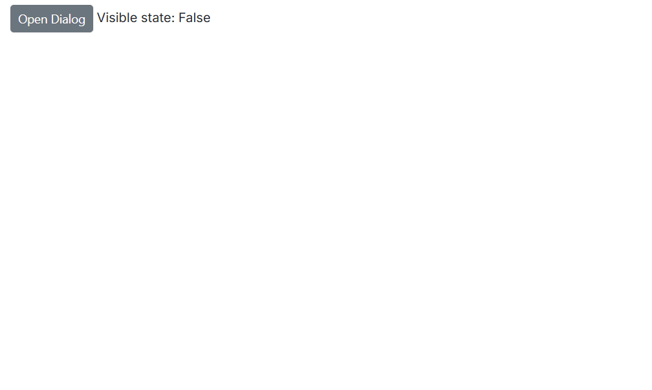
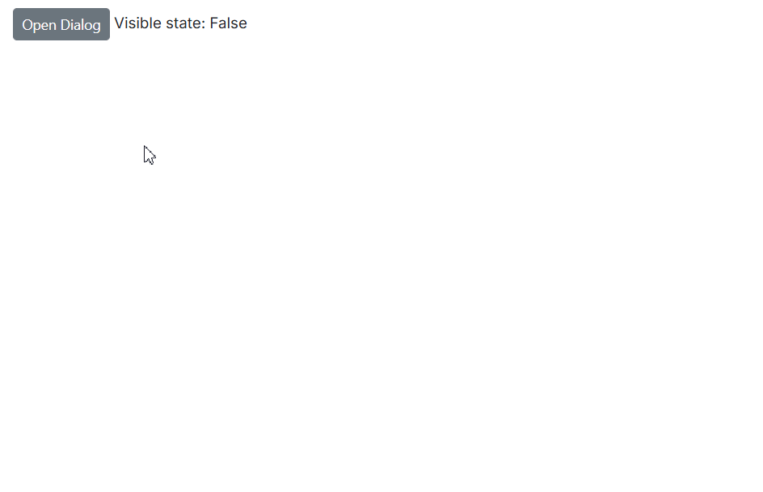

# Visibility

The [Visible](https://help.syncfusion.com/cr/blazor/Syncfusion.Blazor.Popups.SfDialog.html#Syncfusion_Blazor_Popups_SfDialog_Visible) property controls whether the dialog is shown or hidden on the page. Setting it to true displays the dialog, while setting it to false hides the dialog from view.

## Visibile

### One-Way Binding

One-way binding of the Visible property assigns a fixed value, so the dialog’s visibility cannot change at runtime.

```cshtml

@using Syncfusion.Blazor.Popups

<SfDialog Width="250px" Visible="false"></SfDialog>

```

### Two-Way Binding

Two-way binding of the Visible property uses the @bind-Visible syntax, allowing the dialog’s visibility to be updated both from code and user actions. When the value changes, the UI and the underlying variable stay in sync.

```cshtml

@using Syncfusion.Blazor.Buttons
@using Syncfusion.Blazor.Popups

<SfButton @onclick="@OpenDialog">Open Modal Dialog</SfButton>

<span>Visible state: @IsVisible</span>

<SfDialog Width="250px" @bind-Visible="@IsVisible" Content="This is a Two way binding visible property of dialog" ShowCloseIcon="true">
</SfDialog>

@code {
    private bool IsVisible { get; set; } = true;

    private void OpenDialog()
    {
        this.IsVisible = true;
    }
}

```




## ShowAsync Method

The [ShowAsync](https://help.syncfusion.com/cr/blazor/Syncfusion.Blazor.Popups.SfDialog.html#Syncfusion_Blazor_Popups_SfDialog_ShowAsync_System_Nullable_System_Boolean__) method is used to programmatically open the dialog. Calling this method displays the dialog regardless of the Visible property or current state.

```cshtml

@using Syncfusion.Blazor.Buttons
@using Syncfusion.Blazor.Popups

<SfButton @onclick="@OpenDialog">Open Modal Dialog</SfButton>

<SfDialog @ref="@DialogObj" Width="250px" Visible="false" Header="ShowAsync" Content="Dialog Opened by ShowAsync method" ShowCloseIcon="true">
</SfDialog>

@code {
    private SfDialog DialogObj { get; set; }
    private async void OpenDialog()
    {
        await DialogObj.ShowAsync();
    }
}

```

## HideAsync Method

The [HideAsync](https://help.syncfusion.com/cr/blazor/Syncfusion.Blazor.Popups.SfDialog.html#Syncfusion_Blazor_Popups_SfDialog_HideAsync) method is used to programmatically close the dialog. Calling this method will hide the dialog, regardless of its current visibility state.

```cshtml

@using Syncfusion.Blazor.Buttons
@using Syncfusion.Blazor.Popups

<SfButton @onclick="@OpenDialog">Open Modal Dialog</SfButton>

<SfDialog @ref="@DialogObj" Width="250px" IsModal="true" Content="This is a modal dialog">
    <DialogEvents OnOverlayModalClick="@OnOverlayclick"></DialogEvents>
</SfDialog>

@code {
    private SfDialog DialogObj { get; set; }
    private async void OpenDialog()
    {
        await DialogObj.ShowAsync();
    }

    private async void OnOverlayclick(OverlayModalClickEventArgs arg)
    {
        await DialogObj.HideAsync();
    }
}

```

## CloseOnEscape Action

The [CloseOnEscape](https://help.syncfusion.com/cr/blazor/Syncfusion.Blazor.Popups.SfDialog.html#Syncfusion_Blazor_Popups_SfDialog_CloseOnEscape) property determines whether the dialog will close when the Escape key is pressed. Setting this property to true enables closing the dialog with the Escape key; setting it to false disables this behavior.

```cshtml

@using Syncfusion.Blazor.Popups

<SfDialog Width="250px" CloseOnEscape="true" Content="Click on ESC key"></SfDialog>

```

## Related Events

### OnOpen

The [OnOpen](https://help.syncfusion.com/cr/blazor/Syncfusion.Blazor.Popups.DialogEvents.html#Syncfusion_Blazor_Popups_DialogEvents_OnOpen) event triggers when the dialog is being opened.

### Opened

The [Opened](https://help.syncfusion.com/cr/blazor/Syncfusion.Blazor.Popups.DialogEvents.html#Syncfusion_Blazor_Popups_DialogEvents_Opened) event triggers when a dialog is opened.

### OnClose

The [OnClose](https://help.syncfusion.com/cr/blazor/Syncfusion.Blazor.Popups.DialogEvents.html#Syncfusion_Blazor_Popups_DialogEvents_OnClose) event triggers before the dialog is closed.

### Closed

The [Closed](https://help.syncfusion.com/cr/blazor/Syncfusion.Blazor.Popups.DialogEvents.html#Syncfusion_Blazor_Popups_DialogEvents_Closed) event triggers after the dialog has been closed.




@using Syncfusion.Blazor.Buttons
@using Syncfusion.Blazor.Popups

<SfButton @onclick="@OpenDialog">Open Modal Dialog</SfButton>

<span>Visible state: @IsVisible</span>

<div style="display: grid;">
    @foreach (string evt in EventList)
    {
        <span>@evt "Event Triggered"</span>
    }
</div>

<SfDialog Width="250px" @bind-Visible="@IsVisible" Content="Dialog with events" Header="Events" ShowCloseIcon="true">
    <DialogEvents OnOpen="OnOpen" Opened="Opened" OnClose="OnClose" Closed="Closed"></DialogEvents>
</SfDialog>

@code {
    private bool IsVisible { get; set; } = true;
    private List<string> EventList = new List<string>();
    private void OpenDialog()
    {
        this.IsVisible = true;
    }

    private void OnOpen(BeforeOpenEventArgs args)
    {
        EventList.Add("OnOpen");
    }

    private void Opened(OpenEventArgs args)
    {
        EventList.Add("Opened");
    }

    private void OnClose(BeforeCloseEventArgs args)
    {
        EventList.Add("OnClose");
    }

    private void Closed(CloseEventArgs args)
    {
        EventList.Add("Closed");
    }
}





