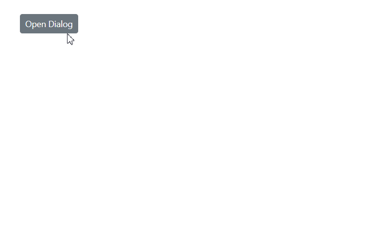
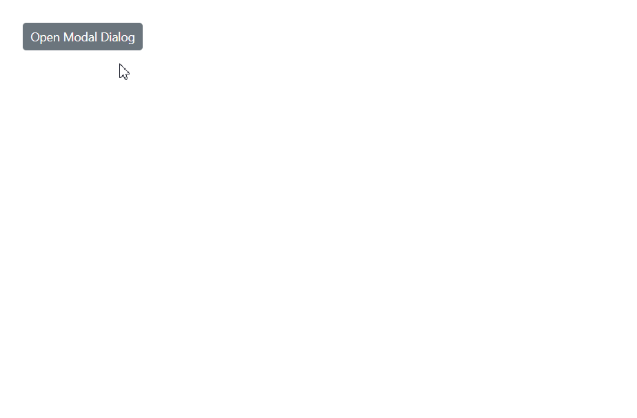

# Visibility in Blazor Dialog Component

The [Visible](https://help.syncfusion.com/cr/blazor/Syncfusion.Blazor.Popups.SfDialog.html#Syncfusion_Blazor_Popups_SfDialog_Visible) property determines whether the dialog is rendered on the page. Setting Visible to true displays the dialog, while false hides it. The following sections explain different patterns for managing visibility, including property binding, programmatic show/hide calls, keyboard interactions, and lifecycle events.

## Visible Property Binding

### One-way binding

One-way binding sets a fixed visibility state for the dialog. This approach is useful when the dialog's visibility should remain constant throughout the component lifecycle or be controlled entirely by the parent component.

```cshtml

@using Syncfusion.Blazor.Popups
@using Syncfusion.Blazor.Buttons

<div class="control-section">
    <SfButton @onclick="ToggleDialog">Toggle Dialog</SfButton>
    
    <SfDialog Width="300px" Visible="@IsDialogVisible">
        <DialogTemplates>
            <Header>Dialog!</Header>
            <Content>This is a simple dialog using one-way binding.</Content>
        </DialogTemplates>
        <DialogButtons>
            <DialogButton Content="Close" IsPrimary="true" @onclick="ToggleDialog" />
        </DialogButtons>
    </SfDialog>
</div>

@code {
    private bool IsDialogVisible { get; set; } = false;

    private void ToggleDialog()
    {
        IsDialogVisible = !IsDialogVisible;
    }
}

```




### Two-way binding

Two-way binding using the @bind-Visible syntax enables dynamic visibility control, allowing the dialog's state to be updated both programmatically and through user interactions. This approach automatically synchronizes the dialog's visibility with the bound variable, making it ideal for interactive scenarios where the dialog needs to respond to various user actions.

```cshtml

@using Syncfusion.Blazor.Popups
@using Syncfusion.Blazor.Buttons

<div id="target">
    <div>
        <SfButton @onclick="@OpenDialog">Open Dialog</SfButton>
        <span>Visible state: @IsVisible</span>
    </div>
    <SfDialog Target="#target" Width="250px" @bind-Visible="@IsVisible" Header="Two-way Binding" Content="This is a Two way binding visible property of dialog" ShowCloseIcon="true">
    </SfDialog>
</div>

@code {
    private bool IsVisible { get; set; } = false;

    private void OpenDialog()
    {
        this.IsVisible = true;
    }
}

<style>
    #target {
        height: 500px;
    }
</style>

```




## ShowAsync Method

Use [ShowAsync](https://help.syncfusion.com/cr/blazor/Syncfusion.Blazor.Popups.SfDialog.html#Syncfusion_Blazor_Popups_SfDialog_ShowAsync_System_Nullable_System_Boolean__) to open the dialog asynchronously. This method is helpful when you must perform validation, load data, or apply conditional logic before showing the dialog. ShowAsync can also force fullscreen mode by passing `true`.

```cshtml

@using Syncfusion.Blazor.Popups
@using Syncfusion.Blazor.Buttons

<div id="target" class="control-section">
    <SfButton @onclick="OpenDialog">Open Dialog</SfButton>
    
    <SfDialog Target="#target" @ref="DialogObj" Width="300px" Visible="false" ShowCloseIcon="true">
        <DialogTemplates>
            <Header>Async Dialog</Header>
            <Content>@DialogContent</Content>
        </DialogTemplates>
    </SfDialog>
</div>

@code {
    private SfDialog DialogObj { get; set; }
    private string DialogContent { get; set; } = "Loading...";

    private async Task OpenDialog()
    {
        // Add validation or data loading logic here
        DialogContent = "Content loaded successfully!";
        await DialogObj.ShowAsync();
    }
}

<style>
    #target {
        min-height: 300px;
        padding: 20px;
    }
</style>

```




## HideAsync Method

The [HideAsync](https://help.syncfusion.com/cr/blazor/Syncfusion.Blazor.Popups.SfDialog.html#Syncfusion_Blazor_Popups_SfDialog_HideAsync) method programmatically closes the dialog asynchronously. This method is ideal for implementing custom close logic, validation scenarios, or closing the dialog based on specific user interactions or business rules.

```cshtml

@using Syncfusion.Blazor.Popups
@using Syncfusion.Blazor.Buttons

<div id="target" class="control-section">
    <SfButton @onclick="OpenDialog">Open Modal Dialog</SfButton>
    
    <SfDialog @ref="DialogObj" Target="#target" Width="300px" IsModal="true" ShowCloseIcon="true">
        <DialogTemplates>
            <Header>Modal Dialog</Header>
            <Content>@DialogMessage</Content>
        </DialogTemplates>
        <DialogButtons>
            <DialogButton Content="Save & Close" IsPrimary="true" @onclick="SaveAndClose" />
        </DialogButtons>
        <DialogEvents OnOverlayModalClick="OnOverlayClick" />
    </SfDialog>
</div>

@code {
    private SfDialog DialogObj { get; set; }
    private string DialogMessage { get; set; } = "Content loaded successfully!";

    private async Task OpenDialog()
    {
        await DialogObj.ShowAsync();
    }

    private async Task SaveAndClose()
    {
        // Simulate async save operation
        await DialogObj.HideAsync();
    }

    private async Task OnOverlayClick(OverlayModalClickEventArgs arg)
    {
        // Add validation or data loading logic here
        await DialogObj.HideAsync();
    }
}

<style>
    #target {
        min-height: 300px;
        padding: 20px;
    }
</style>

```




## CloseOnEscape action

Set [CloseOnEscape](https://help.syncfusion.com/cr/blazor/Syncfusion.Blazor.Popups.SfDialog.html#Syncfusion_Blazor_Popups_SfDialog_CloseOnEscape) to true so users can dismiss the dialog by pressing the Esc key. This familiar keyboard shortcut enhances accessibility and usability, especially for power users navigating with a keyboard.

```cshtml

@using Syncfusion.Blazor.Popups
@using Syncfusion.Blazor.Buttons

<div id="target" class="control-section">
    <SfButton @onclick="OpenDialog">Open Dialog</SfButton>
    
    <SfDialog @ref="DialogObj" Target="#target" Width="300px" CloseOnEscape="true" ShowCloseIcon="true">
        <DialogTemplates>
            <Header>Keyboard Accessible Dialog!</Header>
            <Content>Press ESC key to close this dialog!</Content>
        </DialogTemplates>
        <DialogButtons>
            <DialogButton Content="OK" IsPrimary="true" @onclick="CloseDialog" />
        </DialogButtons>
    </SfDialog>
</div>

@code {
    private SfDialog DialogObj { get; set; }

    private async Task OpenDialog()
    {
        await DialogObj.ShowAsync();
    }

    private async Task CloseDialog()
    {
        await DialogObj.HideAsync();
    }
}

<style>
    #target {
        min-height: 300px;
        padding: 20px;
    }
</style>

```



## Visibility events

Dialog visibility events provide hooks for executing custom logic during different phases of the dialog's show/hide lifecycle. These events are essential for implementing validation, animations, data loading, or cleanup operations.

### OnOpen

The [OnOpen](https://help.syncfusion.com/cr/blazor/Syncfusion.Blazor.Popups.DialogEvents.html#Syncfusion_Blazor_Popups_DialogEvents_OnOpen) event fires before the dialog begins to open, allowing for validation or data preparation.

### Opened

The [Opened](https://help.syncfusion.com/cr/blazor/Syncfusion.Blazor.Popups.DialogEvents.html#Syncfusion_Blazor_Popups_DialogEvents_Opened) event fires after the dialog has completely opened and is visible to the user.

### OnClose

The [OnClose](https://help.syncfusion.com/cr/blazor/Syncfusion.Blazor.Popups.DialogEvents.html#Syncfusion_Blazor_Popups_DialogEvents_OnClose) event fires before the dialog begins to close, enabling validation or confirmation prompts.

### Closed

The [Closed](https://help.syncfusion.com/cr/blazor/Syncfusion.Blazor.Popups.DialogEvents.html#Syncfusion_Blazor_Popups_DialogEvents_Closed) event fires after the dialog has completely closed and is no longer visible.

```cshtml

@using Syncfusion.Blazor.Popups
@using Syncfusion.Blazor.Buttons

<div id="target">
    <div>
        <SfButton @onclick="@OpenDialog">Open Dialog</SfButton>
        <span>Visible state: @IsVisible</span>
    </div>
    <div style="display: grid; float: right;">
        @foreach (string evt in EventList)
        {
            <span>@evt "Event Triggered"</span>
        }
    </div>
</div>

<SfDialog Width="250px" Target="target" @bind-Visible="@IsVisible" Content="Dialog with events" Header="Events" ShowCloseIcon="true">
    <DialogEvents OnOpen="OnOpen" Opened="Opened" OnClose="OnClose" Closed="Closed"></DialogEvents>
</SfDialog>

@code {
    private bool IsVisible { get; set; } = false;
    private List<string> EventList = new List<string>();
    private void OpenDialog()
    {
        this.IsVisible = true;
    }

    private void OnOpen(BeforeOpenEventArgs args)
    {
        EventList.Add("OnOpen");
    }

    private void Opened(OpenEventArgs args)
    {
        EventList.Add("Opened");
    }

    private void OnClose(BeforeCloseEventArgs args)
    {
        EventList.Add("OnClose");
    }

    private void Closed(CloseEventArgs args)
    {
        EventList.Add("Closed");
    }
}

<style>
    #target {
        height: 500px;
    }
</style>

```




N> Use property binding for simple visibility control and programmatic methods (ShowAsync/HideAsync) when you need to implement complex logic, validation, or asynchronous operations before showing or hiding the dialog.