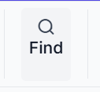
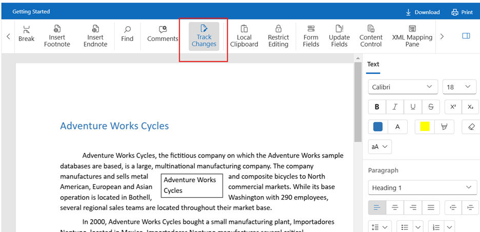
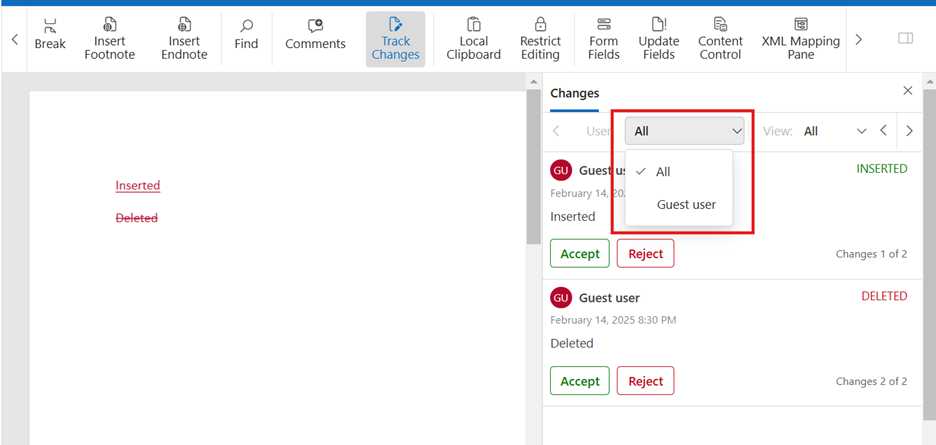
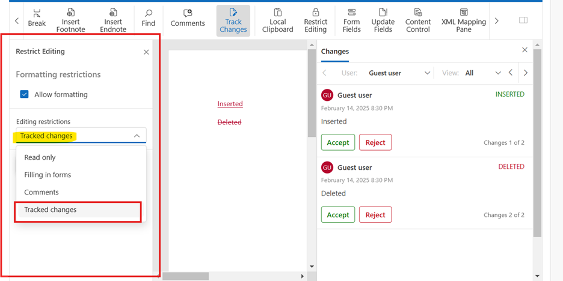

# End User Manual for Document Editor

## Contents
* [Document Editor](../document-editor/end-user-manual/#document-editor)
* [Document Editor Container Component](../document-editor/end-user-manual/#document-editor-container-component)
    * [Toolbar](../document-editor/end-user-manual/#toolbar)
        * [File Operations Group](../document-editor/end-user-manual/#file-operations-group)
        * [Editing Group](../document-editor/end-user-manual/#editing-group)
        * [Insert Group](../document-editor/end-user-manual/#insert-group)
        * [References Group](../document-editor/end-user-manual/#references-group)
        * [Review Group](../document-editor/end-user-manual/#review-group)
        * [Content Control group](../document-editor/end-user-manual/#content-control-group)
        * [Customizing the Toolbar](../document-editor/end-user-manual/#customizing-the-toolbar)
    * [Properties pane](../document-editor/end-user-manual/#properties-pane)
        * [Text Formatting](../document-editor/end-user-manual/#text-formatting)
        * [Paragraph Formatting](../document-editor/end-user-manual/#paragraph-formatting)
        * [Table Properties](../document-editor/end-user-manual/#table-properties)
        * [Image Properties](../document-editor/end-user-manual/#image-properties)
        * [Header & Footer Properties](../document-editor/end-user-manual/#header--footer-properties)
        * [Table of Contents (TOC) Pane](../document-editor/end-user-manual/#table-of-contents-toc-pane)
        * [Restrict Editing Pane](../document-editor/end-user-manual/#restrict-editing-pane)
        * [Comments Pane](../document-editor/end-user-manual/#comments-pane)
        * [Track Changes Pane](../document-editor/end-user-manual/#track-changes-pane)
        * [Navigation Pane](../document-editor/end-user-manual/#navigation-pane)
    * [Dialogs](../document-editor/end-user-manual/#dialogs)
        * [Bookmark Dialog](../document-editor/end-user-manual/#bookmark-dialog)
        * [Table Dialog](../document-editor/end-user-manual/#table-dialog)
        * [Hyperlink Dialog](../document-editor/end-user-manual/#hyperlink-dialog)
        * [Page Setup Dialog](../document-editor/end-user-manual/#page-setup-dialog)
        * [Styles Dialog](../document-editor/end-user-manual/#styles-dialog)
        * [Modify Style Dialog](../document-editor/end-user-manual/#contents)
        * [Font Dialog](../document-editor/end-user-manual/#font-dialog)
        * [Paragraph Dialog](../document-editor/end-user-manual/#paragraph-dialog)
        * [Tabs Dialog](../document-editor/end-user-manual/#tabs-dialog)
        * [Table Properties Dialog](../document-editor/end-user-manual/#table-properties-dialog)
        * [Borders and Shading Dialog](../document-editor/end-user-manual/#borders-and-shading-dialog)
    * [Status Bar](../document-editor/end-user-manual/#status-bar)
    * [Track Changes in Document Editor Component](../document-editor/end-user-manual/#track-changes-in-document-editor-component)
        * [Enable track changes in Document Editor](../document-editor/end-user-manual/#enable-track-changes-in-document-editor)
        * [Show/Hide Revisions Pane](../document-editor/end-user-manual/#showhide-revisions-pane)
        * [Insertion and Deletion](../document-editor/end-user-manual/#insertion-and-deletion)
        * [Accept and Reject](../document-editor/end-user-manual/#contents)
        * [Selection / Navigation between the tracked changes](../document-editor/end-user-manual/#selection--navigation-between-the-tracked-changes)
        * [Protect the document in track changes only mode](../document-editor/end-user-manual/#protect-the-document-in-track-changes-only-mode)

## Document Editor 
## Document Editor Container Component

Document Editor Container is a predefined component which wraps Document Editor, Toolbar, Properties pane, and Status bar into a single component. The Toolbar and Properties pane are used to view and modify the document in Document Editor through public APIs available in it.

### Toolbar

The **toolbar** in Syncfusion's Document Editor is a key part of the user interface that allows users to interact with and control the document.
It provides grouped buttons and dropdowns for editing, formatting, inserting elements, and managing document structure.

The Toolbar items as follows.

#### File Operations Group

##### New

**New**: Opens a blank document

The Toolbar Open as follows.

##### Open

**Open**: Upload and open .docx or .sfdt files from your system.

The Toolbar Open as follows.

#### Editing Group

##### Undo / Redo

**Undo / Redo**: Undo or redo recent changes.

The Toolbar Undo / Redo as follows.

##### Find / Replace

**Find / Replace**: Find words or phrases and replace them with other text.

The Toolbar Find / Replace as follows.

#### Insert Group

##### Table

**Table**: Insert and format tables.

The Toolbar Table as follows.

##### Image

**Image**: Upload images from local storage or via URL.

The Toolbar Image as follows.

##### Hyperlink

**Hyperlink**: Insert clickable hyperlinks.

The Toolbar Hyperlink as follows.

##### Bookmark

**Bookmark**: Add bookmarks to specific parts of the document.

The Toolbar Bookmark as follows.

##### Page Break

**Page Break**: Insert a new page.

The Toolbar Break as follows.

* **Page Break** 

    * **Usage**: Moves the content after the break to the top of the next page.
    * **When to Use**: To start a new chapter or section on a new page.
    
    The Toolbar Break as follows.

    
* **Section Breaks** 

    These breaks divide the document into sections so that each section can have independent formatting (e.g., different headers/footers, orientation, margins, etc.).

    *  **Section Break (Next Page)**
        * **Usage**: Starts a new section on the next page.
        * **When to Use**:
            * To change page orientation (portrait to landscape).
            * To apply different headers/footers in a new section.
            * To restart page numbering.
    * **Section Break (Continuous)**
        * **Usage**: Starts a new section on the same page.
        * **When to Use**:
            * To change the number of columns for part of a page.
            * To apply different formatting without a page break.

    The Toolbar Break as follows.

    

* **Line Break (Manual Line Break)**
    * **Usage**: Moves text to the next line without starting a new paragraph.
    * **When to Use**:
        * To add a soft return (e.g., in addresses or poetry).
        * When you don't want extra spacing between lines (as in a new paragraph).
        * Shortcut: Shift + Enter
##### Header & Footer

**Header & Footer**: Add and customize headers and footers.

The Toolbar Header & Footer as follows.

##### Page Numbers

**Page Numbers**: Insert page numbers in headers or footers.

The Toolbar Page Numbers as follows.

#### References Group

##### Table of Contents

**Table of Contents**: Insert and update TOC based on headings.

The Toolbar Table of Contents as follows.

##### Update Fields

**Update Fields**: Update fields like TOC, page numbers.

The Toolbar Update Fields as follows.

##### Footnotes

**Footnotes**: A footnote provides additional information or citations at the bottom of the page where the reference is made.

**Usage Example**:
* Explaining terms.
* Providing source references in research papers.
* A superscript number is added at the cursor; the note appears at the bottom of the page.

**Notes**:
* Automatically numbered.
* Updates dynamically as more footnotes are added or removed.

The Toolbar Footnotes as follows.

##### Endnotes

**Endnotes**: Similar to footnotes but appear at the end of the document instead of at the bottom of the page.

**Usage Example**
* Collecting all citations at the end for readability.
* Superscript reference added, and the note appears at the end.

The Toolbar Endnotes as follows.

#### Review Group

##### Track Changes

**Track Changes**: Enable/disable tracking of changes in the document.

The Toolbar Track Changes as follows.

##### Comments

**Comments**: Add new comments, reply, or delete comments.

The Toolbar Comments as follows.

#### Content Control group

##### Form Fields

**Form Fields**: Form fields are placeholders used in form-based documents for user input.

**Supported Form Fields:**
1. **Text Input** – Allows users to enter a single line of text. 
2.	**Check Box** – Allows selection/deselection.
3.	**Drop-Down List** – Lets users pick from predefined options.

**Usage Examples:**
    * Contracts
    * Feedback forms
    * Survey templates

**Form Fill Mode**:
    * The editor supports switching to form fill mode, where users can only fill fields but not edit document content.

The Toolbar Form Fields as follows.

## Customizing the Toolbar

Developers can:

* Hide/show specific toolbar items - [How to Show/Hide Toolbar](../document-editor/how-to/hide-tool-bar-and-properties-pane/#hide-the-toolbar)
* Add custom buttons - [How to Customise Toolbar](../document-editor/how-to/customize-tool-bar)
* Handle toolbar events to implement custom behavior.

### Properties pane

The **Properties Pane** in Syncfusion Document Editor is a contextual side panel that displays and allows modification of **formatting properties** for the selected element in the document.

The content of the properties pane **changes dynamically** based on the current selection in the document. Here's what it displays for common elements:
     
#### Text Formatting

When text is selected, we can modify 
* Font family & size 
* Bold, Italic, Underline
* Font color & highlight color
* Superscript/Subscript
* Text case (e.g., UPPERCASE)

The Text Properties Pane as follows.

#### Paragraph Formatting

When a paragraph is selected, we can modify 
* Alignment (Left, Right, Center, Justify) 
* Indentation (left, right, first-line)
* Line spacing
* Spacing before/after
* Borders and shading

The Paragrapgh Properties Pane as follows.

#### Table Properties

When a table is selected, we can modify 
* Table background color 
* Border style
* Merge cells
* Insert/delete row or colums
* Cell margins and spacing
* Table cell text alignment

The Table Properties Pane as follows.

 
#### Image Properties

When an image is selected, we can modify 
* Width and height
* Alternative text

The Image Properties Pane as follows.

#### Header & Footer Properties

The checkboxes in the Header & Footer Properties pane allow you to customize how headers and footers appear across different pages:

* **Different First Page**
Enables a unique header/footer for the first page of the document.
Useful for cover pages or title pages where you might want no header/footer or a different one.

* **Different Odd & Even Pages**
Allows different headers/footers for odd and even numbered pages.
Commonly used in printed books or booklets to alternate content (e.g., chapter title on odd, document name on even).

* **Link to Previous (checked)**
Keeps the current section's header/footer linked to the previous section’s content.
Unchecking it allows you to create a unique header/footer for the current section only.
**Note:** This is helpful when using section breaks and you want different headers in each section.

**Position**

This section controls the spacing of header and footer content on the page:
* **Header from Top**: Sets the vertical distance (in points) from the top of the page to the start of the header.
* **Footer from Bottom**: Sets the vertical distance (in points) from the bottom of the page to the start of the footer.

The Header & Footer Properties Pane as follows.

#### Table of Contents (TOC) Pane

The TOC pane enables you to generate a **summary of document headings** with page numbers and clickable links, making it easier for readers to navigate large documents.

**Options in the TOC Pane**

**Levels**
* Determines how many heading levels (e.g., Heading 1, Heading 2, Heading 3) will be included in the TOC.
* **Example:**
    1. Includes only Heading 1
    2. Includes Heading 1 and Heading 2
    3. Includes Heading 1, Heading 2, and Heading 3 (as shown in the preview)

**Show Page Numbers**
* When enabled, displays the page number for each heading entry in the TOC.
* If disabled, only the heading text appears.

**Right Align Page Numbers**
* Aligns page numbers to the right margin of the TOC.
* Typically used with dotted leaders (.....) between heading text and page numbers for readability.

**Use Hyperlinks**
* Makes each TOC entry clickable, allowing users to jump directly to the corresponding section in the document.

The Table of Contents Properties Pane as follows.

#### Restrict Editing Pane

The **Restrict Editing** pane allows you to control the formatting and editing permissions for your document. Below are the sections and options available in this pane:

**Formatting Restrictions**
* Allow formatting: Check this box to permit formatting changes in the document.

**Editing Restrictions**
* **Editing restrictions**: Use the dropdown menu to select the type of editing restriction. Options include:
* **Read only**: Restricts editing to read-only mode.
* **Filling in forms**: Allows users to fill in form fields while preventing other types of editing.
* **Comments**: Permits users to add comments to the document without altering the main content.
* **Tracked changes**: Enables users to make edits that are tracked, allowing you to review and accept or reject changes.

**Exceptions (Optional)**
You can specify parts of the document that certain users are allowed to edit:
* **Everyone**: Check this box to allow all users to edit the selected parts of the document.
* **More users...**: Click this link to select specific users who can edit the selected parts.

**Enforcing Protection**
* **Yes, Start Enforcing Protection**: Click this button to apply the restrictions and start enforcing protection on the document.

The Restrict Editing Pane as follows.

#### Comments Pane

The **Comments** pane allows you to add and manage comments in your document. Below are the options available in this pane:

**Adding a New Comment**
* **New Comment**: Click this option to add a new comment. A comment box will appear where you can type your comment.

**Comment Box**
* **Guest user**: This label indicates the user who is adding the comment.
* **Type your comment here**: Enter your comment in this text box.
* **Arrow button**: Click this button to submit your comment.
* **'X' button**: Click this button to cancel or close the comment box.

The Comments Pane as follows.

#### Track Changes Pane

The **Track Changes** pane allows you to view and manage changes made to your document. Below are the options and features available in this pane:

**Change Entries**
Each change entry includes the following details:
* **User's Name**: The name of the user who made the change (e.g., Andrew Fuller).
* **Date and Time**: The date and time when the change was made (e.g., June 2, 2020, 6:41 PM).
* **Type of Change**: Indicates whether the change was an insertion or deletion (e.g., INSERTED, DELETED). 
* **Changed Text**: The specific text that was changed (e.g., "sp", "NET").

**Managing Changes**
For each change entry, you have the following options:
* **Accept**: Click this button to accept the change and incorporate it into the document.
* **Reject**: Click this button to reject the change and revert to the original text.

The Track Changes Pane as follows.

#### Navigation Pane

The **Navigation** pane allows you to efficiently search for and navigate through specific terms within your document. Below are the options and features available in this pane:

##### Find Tab

**Search Box**: Enter the term you want to search for in the document (e.g., "Adventure"). 

**Match Case**: Check this box to match the exact case of the search term.

**Whole Words**: Check this box to match whole words only.

**Search Results**
The pane displays the search results, showing the occurrences of the search term within the document. For example:
1.	Adventure Works Cycles
2.	Adventure Works
3.	Adventure Works Cycles, the fictitious company on which the Adventure Works sample

**Navigation**
* **Results Count**: Indicates the number of matches found (e.g., 3 out of 6 matches).
* **Result Entries**: Click on a result entry to navigate directly to that location in the document.

The Navigation Pane - Find Tab as follows.

##### Heading Tab

The **Heading** tab in the navigation pane allows you to quickly navigate through the headings in your document. Below are the features available in this tab:

**Heading List**

The pane displays a list of headings present in your document. For example:
1.	Adventure Works Cycles
2.	Product Overview

**Navigation**
* Click on a Heading: Click on any heading in the list to navigate directly to that section in the document.

The Navigation Pane - Heading Tab as follows.

##### Replace Tab

The **Replace** tab allows you to find and replace text within your document efficiently. Below are the features and options available in this tab:

**Find and Replace**
* **Find**: Enter the text you want to search for in the document (e.g., "Adventure").
* **Replace with**: Enter the text you want to replace the found text with (e.g., "Syncfusion").

**Actions**
* **Replace**: Click this button to replace the current instance of the found text.
* **Replace All**: Click this button to replace all instances of the found text in the document.

**Results**
* **Replacement Summary**: Displays a message indicating the number of instances replaced (e.g., "We replaced all 6 instances of 'Adventure' with 'Syncfusion'").

The Navigation Pane - Replace Tab as follows.

### Dialogs

Document Editor provides dialog support to major operations such as insert or edit hyperlink, formatting text, paragraph, style, list and table properties.

#### Bookmark Dialog

The **Bookmark Dialog** allows users to create, navigate to, and manage bookmarks within the document. Bookmarks are invisible tags that mark specific locations or sections in the document, making it easy to **navigate** or **link to content internally**.

**Dialog Overview**

| Field / Button | Description | 
|---|---|
|**Bookmark name**|A text box where you enter a name for the new bookmark. Bookmark names must start with a letter and contain only alphanumeric characters (no spaces).|
|**Add**|Creates a new bookmark at the current cursor position or around the selected content using the name entered.|
|**Delete**|Removes the selected bookmark from the list (and the document).|
|**Go To**|Moves the cursor to the location of the selected bookmark, helping users quickly navigate large documents.|
|**List Box (middle panel)**|Displays all the bookmarks currently available in the document. You can select one for deletion or navigation.|

**Use Cases**
* Create internal links (e.g., for a **Table of Contents** or cross-references).
* Mark important content sections for **review or editing**.
* Quickly **jump to** specific sections while editing long documents.

**Best Practices**
* Use **meaningful names** for bookmarks (e.g., Introduction, SummarySection, ChartDetails).
* Avoid spaces or special characters in bookmark names.
* Combine with hyperlinks to allow in-document navigation.

The Bookmark Dialog as follows.

#### Table Dialog

The **Insert Table** dialog allows you to insert a table into a document or editor. Below are the options available in this dialog:

1.	**Number of columns**: A dropdown where the user can select the number of columns they want the table to have.
2.	**Number of rows**: A dropdown where the user can select the number of rows for the table.

The Table Dialog as follows.

#### Hyperlink Dialog

The **Insert Hyperlink** dialog allows you to create hyperlinks in your document. Below are the fields and options available in this dialog:

**Fields and Options**
1.	**Text to display**: This field shows the text that will be displayed as the hyperlink. By default, it displays the selected text in your document. You can edit this text if needed.
2.	**Address**: Enter the URL or the link address here. This is the destination where the hyperlink will point to when clicked.
3.	**ScreenTip text**: This optional field allows you to add a tooltip that appears when the user hovers over the hyperlink. It can provide additional information about the link.
4.	**Use bookmarks**: If you want to link to a specific part of the document, you can use bookmarks. Check this box to enable bookmark linking.

The Hyperlink Dialog as follows.

#### Page Setup Dialog

The **Page Setup** dialog allows you to configure the layout and formatting of your document pages. Below are the tabs and options available in this dialog:

##### Margins Tab

The **Margin** tab lets you set the margins for your document. You can specify the distance between the text and the edges of the page.

* **Top**: Set the top margin of the page. 
* **Bottom**: Set the bottom margin of the page.
* **Left**: Set the left margin of the page.
* **Right**: Set the right margin of the page.

Each margin is set to 72.00 units by default, but you can adjust these values as needed.
Page Orientation

You can choose the orientation of your page:
* **Portrait**: The page is taller than it is wide.
* **Landscape**: The page is wider than it is tall.

The Page Setup Dialog-Margin tab as follows.

##### Paper Tab

The **Paper** tab allows you to configure the size and dimensions of the paper for your document. Below are the options available in this tab:

**Paper Size**
* **Width**: Set the width of the paper. The default value is 612.00 units. 
* **Height**: Set the height of the paper. The default value is 792.00 units.

**Paper Type**
* **Paper Size Dropdown**: Select the paper size from the dropdown menu. The default selection is "Letter," but you can choose other sizes based on your requirements.

The Page Setup Dialog-Paper tab as follows.

##### Layout Tab

The **Layout** tab allows you to configure the layout settings for your document pages. Below are the options available in this tab:

**Different Page Settings**
* **Different odd and even**: Check this box if you want to have different headers and footers for odd and even pages. 
* **Different first page**: Check this box if you want a different header and footer for the first page of your document.

**Header and Footer Settings**
* **Header distance**: Set the distance between the header and the edge of the page. 
* **Footer distance**: Set the distance between the footer and the edge of the page.

The Page Setup Dialog-Layout tab as follows.

#### Styles Dialog

The **Styles** dialog allows you to manage and apply text styles in your document. Below are the options available in this dialog:

**Style List**

The dialog displays a list of predefined text styles, such as:
* Normal
* Heading 1
* Heading 2
* Heading 3

**Buttons**
* **New...** : Click this button to create a new text style. You can define the formatting and settings for the new style.
* **Modify...** : Click this button to modify an existing text style. You can change the formatting and settings for the selected style. 

The Styles Dialog as follows.

#### Modify Style Dialog

The **Modify Style** dialog allows you to change the properties and formatting of an existing text style. Below are the sections and options available in this dialog:

**Properties Section**
* **Name**: Enter the name of the style in this text input field.
* **Style type**: Select the type of style from the dropdown menu (e.g., Paragraph).
* **Style based on**: Choose the base style from the dropdown menu. The new style will inherit properties from this base style.
* **Style for following paragraph**: Select the style that will be applied to the paragraph following the current one. 

**Formatting Section**
* **Font family**: Choose the font family from the dropdown menu (e.g., Calibri).
* **Font size**: Set the font size in the input field (e.g., 11).
* **Formatting buttons**: Apply text formatting such as bold, italic, underline, and strikethrough using these buttons.
* **Text alignment buttons**: Align text to the left, center, right, or justify using these buttons.
* **Line spacing buttons**: Set the line spacing to single, 1.5 lines, or double.

**Additional Options**
* **Format**: Click this button to access more formatting options, such as font color, borders, and shading.

The Modify Style Dialog as follows.

#### Font Dialog

The **Font** dialog allows you to customize the appearance of your text. Below are the options available in this dialog:

**Font Options**
* **Font**: Select the font family from the dropdown menu (e.g., Calibri).
* **Font style**: Choose the font style from the dropdown menu (e.g., Regular).
* **Size**: Set the font size from the dropdown menu (e.g., 12).

**Underline and Color**
* **Underline style**: Select the underline style from the dropdown menu (e.g., None).
* **Font color**: Choose the font color from the color selection box (e.g., Black).

**Effects**

You can apply various text effects by checking the corresponding boxes:
* **Strikethrough**: Draws a line through the middle of the text.
* **Superscript**: Raises the text above the baseline.
* **Subscript**: Lowers the text below the baseline.
* **Double strikethrough**: Draws two lines through the middle of the text.
* **All caps**: Converts all text to uppercase letters.

The Font Dialog as follows.

#### Paragraph Dialog

The **Paragraph** dialog allows you to customize the formatting and layout of paragraphs in your document. Below are the sections and options available in this dialog:

**Alignment**
* **Alignment**: Set the alignment of the paragraph text. Options include:
    * **Left**: Align the text to the left.
    * **Center**: Center-align the text.
    * **Right**: Align the text to the right.
    * **Justify**: Align the text evenly along both the left and right margins.

**Outline Level**
* **Outline Level**: Choose the outline level for the paragraph (e.g., Body Text).

**Direction**
* **Direction**: Set the text direction. Options include:
    * **Left-to-right**: Text flows from left to right.
    * **Right-to-left**: Text flows from right to left.

**Indentation**
* **Before text**: Set the indentation before the text.
* **After text**: Set the indentation after the text.
* **Special**: Choose a special indentation type (e.g., First line) and set the value (e.g., First line by 36.0 units). 

**Spacing**
* **Before**: Set the space before the paragraph.
* **After**: Set the space after the paragraph (e.g., 6.0 units).
* **Line spacing**: Choose the line spacing option (e.g., Single, 1.5 lines, Double).
* **Don't add space between paragraphs of the same style**: Check this box to prevent additional space between paragraphs of the same style.

**Tabs**
* **Tabs...**: Click this button to set and manage tab stops for the paragraph.

The Paragraph Dialog as follows.

#### Tabs Dialog

The **Tabs** dialog allows you to set and manage tab stops in your document. Below are the options available in this dialog:

**Tab Stop Position**
* **Tab stop position**: Enter the position of the tab stop in this text field.
Default Tab Stops
* **Default tab stops**: Select the default tab stop spacing from the dropdown menu (e.g., 36 pt).
Tab Stops to be Cleared
* **Tab stops to be cleared**: This list area shows the tab stops that can be removed.

**Alignment Options**

Choose the alignment for the tab stop using the radio buttons:
* **Left**: Aligns text to the left of the tab stop.
* **Center**: Centers text at the tab stop.
* **Right**: Aligns text to the right of the tab stop.
* **Decimal**: Aligns numbers at the decimal point.
* **Bar**: Inserts a vertical bar at the tab stop position.

**Leader Options**

Choose the leader style for the tab stop using the radio buttons:
* **None**: No leader.
* **Dots**: Dotted leader.
* **Dashes**: Dashed leader.

**Action Buttons**
* **Set**: Click this button to set the tab stop with the specified settings.
* **Clear**: Click this button to remove the selected tab stop.
* **Clear All**: Click this button to remove all tab stops.

The Tabs Dialog as follows.

#### Table Properties Dialog

The **Table Properties** dialog allows you to customize various aspects of your table. Below are the sections and options available in this dialog:

##### Table Tab

The **Table** tab allows you to customize the properties of table. Below are the options available in this tab:

**Size**
* **Preferred width**: Check this box if you want to set a specific width for the table.
* **Width value**: Enter the width value in the input field (e.g., 0.00).
* **Unit of measurement**: Select the unit of measurement from the dropdown menu (e.g., Points). 

**Alignment**

Choose the alignment for the table:
* **Left**: Align the table to the left.
* **Center**: Center-align the table.
* **Right**: Align the table to the right.

**Indent from Left**
* **Indent value**: Set the indent value from the left margin in the input field (e.g., 0.00).
* **Unit of measurement**: Select the unit of measurement from the dropdown menu (e.g., Points).

**Table Direction**
* **Right-to-left**: Set the table direction from right to left.
* **Left-to-right**: Set the table direction from left to right (selected by default).

**Additional Options**
* **Borders and Shading...**: Click this button to customize the borders and shading of the table.
* **Options...**: Click this button to access more table options.

The Table Properties Dialog - Table tab as follows.

##### Row Tab

The **Row** tab allows you to customize the properties of table rows. Below are the options available in this tab:

**Specify Height**
* **Specify height**: Check this box if you want to set a specific height for the row.
* **Height value**: Enter the height value in the dropdown menu (e.g., 1.00).

**Row Height Is**
* **Row height is**: Select the row height option from the dropdown menu. Options include:
    * **At least**: The row height will be at least the specified value.
    * **Exactly**: The row height will be exactly the specified value.

**Options**
* **Allow row to break across pages**: Check this box to allow the row to break across pages if it doesn't fit on one page.
* **Repeat as header row at the top of each page**: Check this box to repeat the selected row as a header at the top of each page.

The Table Properties Dialog - Row tab as follows.

##### Cell Tab

The **Cell** tab allows you to customize the properties of individual table cells. Below are the options available in this tab:

**Preferred Width**
* **Preferred width**: Check this box if you want to set a specific width for the cell.
* **Width value**: Enter the preferred width value in the input field (e.g., 234.00).
* **Unit of measurement**: Select the unit of measurement from the dropdown menu (e.g., Points).

**Vertical Alignment**

Choose the vertical alignment for the cell content:

* **Top**: Align the content to the top of the cell.
* **Center**: Center-align the content within the cell.
* **Bottom**: Align the content to the bottom of the cell.
Additional Options
* **Options...**: Click this button to access more cell options.

The Table Properties Dialog - Cell tab as follows.

#### Borders and Shading Dialog

The **Borders and Shading** dialog allows you to customize the appearance of borders and shading for selected text or table cells. Below are the sections and options available in this dialog:

**Borders Section**
* **Setting**: Choose the border setting from the options:
    * **None**: No border.
    * **Box**: Border around the entire selection.
    * **All**: Borders on all sides of each cell.
    * **Custom**: Customize the borders as needed.
* **Preview**: Displays a visual representation of the selected border settings.
* **Style**: Select the line style for the border from the dropdown menu.
* **Width**: Choose the width of the border line from the dropdown menu (e.g., 0.50).
* **Color**: Pick the color of the border using the color picker (e.g., Black).

**Shading Section**
* **Fill**: Select the fill color or pattern from the dropdown menu.
* **Apply to**: Specify where the shading should be applied (e.g., Table).

The Borders and Shading Dialog as follows.

### Status Bar

The status bar provides important information about the current state of your document or application. Below are the elements typically found in the status bar:

The Status Bar as follows.

 
**Page Information**
* **Page 1 of 1**: Indicates the current page number and the total number of pages in the document.

**Layout Icons**
* **Web Layout Icon**: Represents the web layout view, allowing you to see how the document will appear in a web browser.
* **Print Layout Icon**: Represents the print layout view, allowing you to see how the document will appear when printed.

**Zoom Level**
* **100%**: Displays the current zoom level or scale of the document. You can adjust the zoom level to view the document at different scales.

### Track Changes in Document Editor Component

Track Changes records document edits, allowing you to accept or reject them. It's useful for managing multiple reviewers changes. With Track Changes enabled, all edits are saved as revisions.

#### Enable track changes in Document Editor

You can enable the Track Changes item in the toolbar. By clicking it, the Track Changes feature will be enabled.

The Enabled TrackChanges shown as follows.

#### Show/Hide Revisions Pane

The Show/Hide Revisions Pane in the Document Editor let the users toggle the revisions pane visibility for managing tracked changes.

##### To show Revision Pane

After inserting a word in the editor after enabling track changes, you can click the inserted word, then the Revision pane will display in the editor.

The Track changes Revision Pane follows.

 
##### To Hide Revision Pane

After inserting a word in the editor after enabling track changes, you can click the close button in the Revision pane. Then, the Revision pane will hide from the editor.

The Track changes Revision Pane closing follows.

#### Insertion and Deletion

After enabling track changes, you can insert or delete content. Adding new text, tables, or images in the editor is referred to as an insertion. Removing text, tables, or images is called a deletion. Both **insertions** and **deletions** are recorded as revisions in the Revision Pane.

The Track changes Insertion/Deletion follows.

#### Accept and Reject

##### Accept/Reject specific Revision

**Accept specific Revision by User interface**

You can accept the inserted or deleted content. This will accept the changes and remove the accepted revision from the Revision pane, respectively.

The Accept changes in Revision follows.

**Reject specific Revision by User interface**

You can reject the inserted or deleted content. This will reject the changes and remove the rejected revision from the Revision pane, respectively.

The Reject Changes in Revision follows.

##### Accept/Reject all Revision

**Accept or Reject all changes by User interface**

You can accept/reject all the inserted and deleted content. So, that will accept/reject all the changes and remove all the accepted/rejected revisions from the revision pane.

The Accept All / Reject All Changes in Revision follows.

#### **Selection / Navigation between the tracked changes**

You can select the inserted and deleted content in the Editor, which will indicate the Inserted/Deleted revision in the Revision pane and vice versa.

The Selection Tracked Changes follows.

In DocumentEditor, we have a built-in review panel in which we provide support for filtering changes based on the user.

The Filtering Changes Based On User follows.

#### Protect the document in track changes only mode

Document Editor allows viewing and correcting with **RevisionsOnly protection** but restricts accepting/rejecting changes; the author manages final changes. Protection is managed with enforceProtection and stopProtection APIs.

**Step 1:** Click the `Restrict Editing` item in the Toolbar and select the Protections button from the dropdown.

**Step 2:** The Restrict Editing Pane will Open, then click the Tracked changes option and allow formatting based on your preferences.

**Step 3:** Click `Yes, Start Enforcing Protection` button to protect the tracked changes.

**Step 4:** Enforce the restriction with a password, so you can secure it.

**Step 5:** Now you can see the document is restricted; you can’t accept/reject (disabled) the changes without stopping the protection.

**Step 6:** Click the `Stop Protection` button to stop protection using the same password that was used to enforce protection earlier.

 

After stopping protection, the document retains its original form, and you can Accept/Reject (enabled) the changes.

