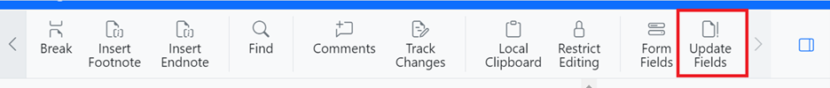

# Fields in Blazor DocumentEditor Component

Document Editor has preservation support for all types of fields in an existing word document without any data loss.

## Adding Fields

You can add a field to the document by using [`InsertFieldAsync`](https://help.syncfusion.com/cr/blazor/Syncfusion.Blazor.DocumentEditor.EditorModule.html#Syncfusion_Blazor_DocumentEditor_EditorModule_InsertFieldAsync_System_String_System_String_) method in [`EditorModule`](https://help.syncfusion.com/cr/blazor/Syncfusion.Blazor.DocumentEditor.EditorModule.html).

The following example code illustrates how to insert merge field programmatically by providing the field code and field result.

```csharp
string fieldCode = "MERGEFIELD  First Name  \\* MERGEFORMAT ";
string fieldResult = "«First Name»";
await container.DocumentEditor.Editor.InsertFieldAsync(fieldCode, fieldResult);
```

N> Document editor does not validate/process the field code/field result. it simply inserts the field with specified field information.

## Update fields

Document Editor provides support for updating bookmark cross reference field. The following example code illustrates how to update bookmark cross reference field.

```csharp
//Update all the bookmark cross reference field in the document.
await container.DocumentEditor.UpdateFieldsAsync();
```

Bookmark cross reference fields can be updated through UI by using update fields option in `Toolbar`.



The following type of fields are automatically updated in Document Editor.

* NUMPAGES
* SECTION
* PAGE

## Get field info

You can get field code and field result of the current selected field by using [`GetFieldInfoAsync`](https://help.syncfusion.com/cr/blazor/Syncfusion.Blazor.DocumentEditor.SelectionModule.html#Syncfusion_Blazor_DocumentEditor_SelectionModule_GetFieldInfoAsync) method in the [`SelectionModule`](https://help.syncfusion.com/cr/blazor/Syncfusion.Blazor.DocumentEditor.SelectionModule.html).

```csharp
//Gets the field information of the selected field.
FieldInfo fieldInfo = await container.DocumentEditor.Selection.GetFieldInfoAsync();
```

N> For nested fields, this method returns combined field code and result.

## Set field info

You can modify the field code and field result of the current selected field by using [`SetFieldInfoAsync`](https://help.syncfusion.com/cr/blazor/Syncfusion.Blazor.DocumentEditor.EditorModule.html#Syncfusion_Blazor_DocumentEditor_EditorModule_SetFieldInfoAsync_Syncfusion_Blazor_DocumentEditor_FieldInfo_) method in the [`EditorModule`](https://help.syncfusion.com/cr/blazor/Syncfusion.Blazor.DocumentEditor.EditorModule.html).

```csharp
//Gets the field information for the selected field.
FieldInfo fieldInfo = await container.DocumentEditor.Selection.GetFieldInfoAsync();

//Modify field code
fieldInfo.Code = "MERGEFIELD  First Name  \\* MERGEFORMAT ";

//Modify field result
fieldInfo.Result = "«First Name»";

//Modify field code and result of the current selected field.
await container.DocumentEditor.Editor.SetFieldInfoAsync(fieldInfo);
```

N> For nested field, entire field gets replaced completely with the specified field information.

## See Also

[Mail merge using DocIO](https://help.syncfusion.com/file-formats/docio/working-with-mail-merge)