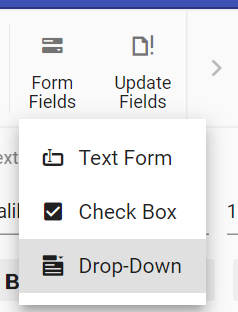

# Form Fields in Blazor DocumentEditor Component

[`Blazor Word Processor`](https://www.syncfusion.com/blazor-components/blazor-word-processor) component (a.k.a Document Editor) component provide support for inserting Text, CheckBox, DropDown form fields through in-built toolbar.



## Insert form field

Form fields can be inserted using [`InsertFormFieldAsync`](https://help.syncfusion.com/cr/blazor/Syncfusion.Blazor.DocumentEditor.EditorModule.html#Syncfusion_Blazor_DocumentEditor_EditorModule_InsertFormFieldAsync_Syncfusion_Blazor_DocumentEditor_FormFieldType_) method in editor module.

```csharp
//Insert Text form field
await container.DocumentEditor.Editor.InsertFormFieldAsync(FormFieldType.Text);
//Insert Checkbox form field
await container.DocumentEditor.Editor.InsertFormFieldAsync(FormFieldType.CheckBox);
//Insert Drop down form field
await container.DocumentEditor.Editor.InsertFormFieldAsync(FormFieldType.DropDown);
```

## Get form field names

All the form fields names form current document can be retrieved using [`GetFormFieldNamesAsync()`](https://help.syncfusion.com/cr/blazor/Syncfusion.Blazor.DocumentEditor.SfDocumentEditor.html#Syncfusion_Blazor_DocumentEditor_SfDocumentEditor_GetFormFieldNamesAsync).

```csharp
Task<List<string>> formFieldsNames = await container.DocumentEditor.GetFormFieldNamesAsync();
```

## Form Field Shading

You can customize form field shading at the application level using the [`formFieldSettings`](https://help.syncfusion.com/cr/blazor/Syncfusion.Blazor.DocumentEditor.FormFieldSettingsModel.html#Syncfusion_Blazor_DocumentEditor_FormFieldSettingsModel_SelectionColor_Syncfusion_Blazor_DocumentEditor_FormFieldSettings_) property.

The example code below demonstrates how to set a custom shading color and how to disable shading (by default, shading is enabled).

```csharp
// Set a custom shading color (for example, white) 
@page "/"
@using Syncfusion.Blazor.DocumentEditor
@inject IJSRuntime JS
<SfDocumentEditorContainer @ref="container" EnableToolbar="true" DocumentEditorSettings="Settings" Height="590px"
    ServiceUrl="https://services.syncfusion.com/react/production/api/documenteditor/">
    <DocumentEditorContainerEvents Created="OnLoad"></DocumentEditorContainerEvents>
</SfDocumentEditorContainer>

@code {
    private SfDocumentEditorContainer? container;
    private DocumentEditorSettingsModel Settings = new DocumentEditorSettingsModel()
    {
        FormFieldSettings = new FormFieldSettingsModel() { ShadingColor = "#ffffff" }
    };
    protected async Task OnLoad(object args)
    {
        // Initialization logic here
    }
}

// Disable form field shading entirely 
@page "/"
@using Syncfusion.Blazor.DocumentEditor
@inject IJSRuntime JS
<SfDocumentEditorContainer @ref="container" EnableToolbar="true" DocumentEditorSettings="Settings" Height="590px"
    ServiceUrl="https://services.syncfusion.com/react/production/api/documenteditor/">
    <DocumentEditorContainerEvents Created="OnLoad"></DocumentEditorContainerEvents>
</SfDocumentEditorContainer>

@code {
    private SfDocumentEditorContainer? container;
    private DocumentEditorSettingsModel Settings = new DocumentEditorSettingsModel()
    {
        FormFieldSettings = new FormFieldSettingsModel() { ApplyShading = false }
    };
    protected async Task OnLoad(object args)
    {
        // Initialization logic here
    }
}

```

N> This customization only affects the application UI and will not be preserved when exporting the document.

## Export form field data

Data of the all the Form fields in the document can be exported using [`ExportFormDataAsync`](https://help.syncfusion.com/cr/blazor/Syncfusion.Blazor.DocumentEditor.SfDocumentEditor.html#Syncfusion_Blazor_DocumentEditor_SfDocumentEditor_ExportFormDataAsync).

```csharp
Task<List<FormFieldData>> formFieldDatas = await container.DocumentEditor.ExportFormDataAsync();
```

## Import form field data

Form fields can be pre-filled with data using [`ImportFormDataAsync`](https://help.syncfusion.com/cr/blazor/Syncfusion.Blazor.DocumentEditor.SfDocumentEditor.html#Syncfusion_Blazor_DocumentEditor_SfDocumentEditor_ImportFormDataAsync_System_Collections_Generic_List_Syncfusion_Blazor_DocumentEditor_FormFieldData__).

```csharp
FormFieldData textformField = new FormFieldData();
textformField.FieldName = "Text1";
textformField.Value = "Hello World";
FormFieldData checkformField = new FormFieldData();
checkformField.FieldName = "Check1";
checkformField.Value = true;
FormFieldData dropdownformField = new FormFieldData();
dropdownformField.FieldName = "Drop1";
dropdownformField.Value = 1;
   
List<FormFieldData> formData = new List<FormFieldData>();
formData.Add(textformField);
formData.Add(checkformField);
formData.Add(dropdownformField);
//import form field data
await container.DocumentEditor.ImportFormDataAsync(formData);
```

## Reset form fields

Reset all the form fields in current document to default value using [`ResetFormFieldsAsync`](https://help.syncfusion.com/cr/blazor/Syncfusion.Blazor.DocumentEditor.SfDocumentEditor.html#Syncfusion_Blazor_DocumentEditor_SfDocumentEditor_ResetFormFieldsAsync_System_String_).

```csharp
await container.DocumentEditor.ResetFormFieldsAsync();
```

## Protect the document in form filling mode

Document Editor provides support for protecting the document with `FormFieldsOnly` protection. In this protection, user can only fill form fields in the document.

Document editor provides an option to protect and unprotect document using [`EnforceProtectionAsync`](https://help.syncfusion.com/cr/blazor/Syncfusion.Blazor.DocumentEditor.EditorModule.html#Syncfusion_Blazor_DocumentEditor_EditorModule_EnforceProtectionAsync_System_String_Syncfusion_Blazor_DocumentEditor_ProtectionType_) and [`StopProtectionAsync`](https://help.syncfusion.com/cr/blazor/Syncfusion.Blazor.DocumentEditor.EditorModule.html#Syncfusion_Blazor_DocumentEditor_EditorModule_StopProtectionAsync_System_String_) API.

The following example code illustrates how to enforce and stop protection in Document editor container.

```csharp
@using Syncfusion.Blazor.DocumentEditor

<button @onclick="protectDocument">Protection</button>
<SfDocumentEditorContainer @ref="container" EnableToolbar=true></SfDocumentEditorContainer>

@code {
    SfDocumentEditorContainer container;
    protected async void protectDocument(object args)
    {
        //enforce protection
        await container.DocumentEditor.Editor.EnforceProtectionAsync("123", ProtectionType.FormFieldsOnly);
        //stop the document protection
        await container.DocumentEditor.Editor.StopProtectionAsync("123");
    }
}
```

N> In enforce Protection method, first parameter denotes password and second parameter denotes protection type. Possible values of protection type are `NoProtection |ReadOnly |FormFieldsOnly | CommentsOnly`. In stop protection method, parameter denotes the password.