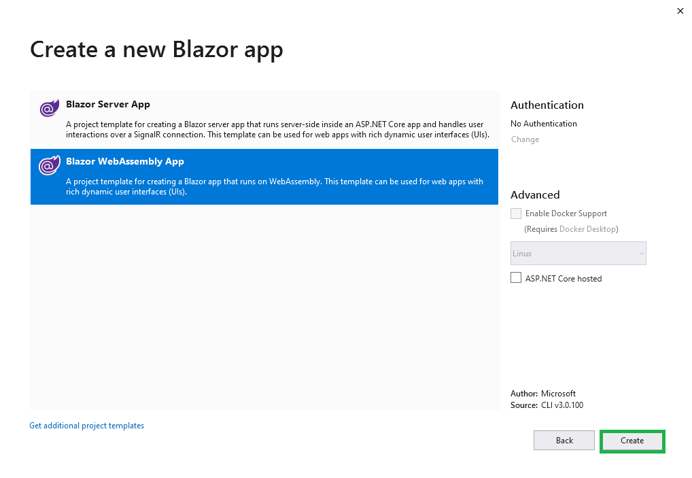

# Create a Word processing application with Blazor WebAssembly app

This article provides the step-by-step instructions to integrate the [`Blazor Word Processor component`](https://www.syncfusion.com/blazor-components/blazor-word-processor) in Blazor WebAssembly application using [Visual Studio 2019](https://visualstudio.microsoft.com/vs/).

Steps to get started with Word processor component for Blazor:

1. Install the essential project templates in the Visual Studio 2019 by running the below command line in the command prompt.

    ```bash
    dotnet new -i Microsoft.AspNetCore.Components.WebAssembly.Templates::3.2.0-preview2.20160.5
    ````

2. Select **Create a new project** from the Visual Studio dashboard.

    

3. Select **Blazor App** from the template and click the **Next** button.

    

4. In the project configuration window, click the **Create** button to create a new project with the default project configuration.

    

5. Select **Blazor WebAssembly App** from the dashboard and click **Create** button to create a new Blazor client-side application. Make sure that **.NET Core** and **ASP.NET Core 3.1** are selected at the top.

    

6. Install the [Syncfusion.Blazor.WordProcessor](https://www.nuget.org/packages/Syncfusion.Blazor.WordProcessor/) NuGet package from NuGet.org to the newly created application by using the **NuGet Package Manager**. Right-click the project and select Manage NuGet Packages.

7. Search **Syncfusion.Blazor.WordProcessor** keyword in the Browse tab and install [Syncfusion.Blazor.WordProcessor](https://www.nuget.org/packages/Syncfusion.Blazor.WordProcessor/) NuGet package in the application.
    

8. Open the **~/_Imports.razor** file and import the ``Syncfusion.Blazor.DocumentEditor``.

    ```csharp
    @using Syncfusion.Blazor.DocumentEditor
    ```

9. Add the Syncfusion Word processor component (a.k.a DocumentEditor) to any web pages (razor) in the `Pages` folder. For example, the DocumentEditorContainer component is added in the **~/Pages/Index.razor** page.

    ```csharp
    <SfDocumentEditorContainer EnableToolbar=true></SfDocumentEditorContainer>
    ```

10. Open the **~/Startup.cs** file and register the Syncfusion Blazor Service.

    ```csharp
     public void ConfigureServices(IServiceCollection services) {
         .......
         .......
         services.AddSyncfusionBlazor();
     }
    ```

11. Add the Syncfusion bootstrap4 theme in the `<head>` element of the **~/wwwroot/index.html** page.

    ```html
    <head>
        ....
        ....
        <link href="_content/Syncfusion.Blazor.Themes/bootstrap4.css" rel="stylesheet" />
    </head>
    ```
    > **Note:** The same theme file can be referred through the CDN version by using [https://cdn.syncfusion.com/blazor/{:version:}/styles/bootstrap4.css](https://cdn.syncfusion.com/blazor/{:version:}/styles/bootstrap4.css).

12. Run the application. The Word processor component will be rendered in the web browser.

    

You can also explore our [`Blazor Word Processor`](https://blazor.syncfusion.com/demos/document-editor/default-functionalities) example to know how to render and configure the document editor.