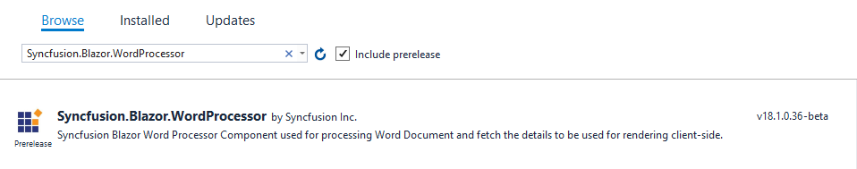

# Blazor DocumentEditor Component in Server-Side App

This article provides the step-by-step instructions to integrate the Word processor in Blazor server app using [Visual Studio 2019](https://visualstudio.microsoft.com/vs/).

Steps to get started with Word processor component for Blazor:

1. Select **Create a new project** from the Visual Studio dashboard.

    

2. Select **Blazor App** from the template and click the **Next** button.

    

3. In the project configuration window, click the **Create** button to create a new project with the default project configuration.

    

4. Select **Blazor Server App** from the dashboard and click the **Create** button to create a new Blazor Server application. Make sure that **.NET Core** and **ASP.NET Core 3.1** are selected at the top.

    

5. Install the [Syncfusion.Blazor.WordProcessor](https://www.nuget.org/packages/Syncfusion.Blazor.WordProcessor/) NuGet package to the newly created application by using the **NuGet Package Manager**. Right-click the project and select Manage NuGet Packages.

6. Search **Syncfusion.Blazor.WordProcessor** keyword in the Browse tab and install [Syncfusion.Blazor.WordProcessor](https://www.nuget.org/packages/Syncfusion.Blazor.WordProcessor/) NuGet package in the application.

    

7. Open the **~/_Imports.razor** file and import the `Syncfusion.Blazor.DocumentEditor`.

    ```cshtml
    @using Syncfusion.Blazor.DocumentEditor
    ```

8. Add the Syncfusion Word processor component (a.k.a DocumentEditor) to any webpages (razor) in the `Pages` folder. For example, the DocumentEditorContainer component is added to the **~/Pages/Index.razor** page.

    ```cshtml
    <SfDocumentEditorContainer EnableToolbar=true></SfDocumentEditorContainer>
    ```

9. Add the SyncfusionBlazor service in `ConfigureServices` method of **Startup.cs** file.

    ```csharp
    public void ConfigureServices(IServiceCollection services) {
        .......
        .......
        services.AddSyncfusionBlazor();
    }
    ```

10. To import or export content, Document editor requires some memory. Please refer code snippet required for increasing the message size within `ConfigureServices` method in **Startup.cs** file.

    ``` csharp
    // To increase the size of the buffer   
    services.AddServerSideBlazor().AddHubOptions(o => 
    { 
        o.MaximumReceiveMessageSize = 102400000; 
    }); 
    ```

11. Add the client-side resources through [CDN](https://blazor.syncfusion.com/documentation/appearance/themes#cdn-reference) or from [NuGet](https://blazor.syncfusion.com/documentation/appearance/themes#static-web-assets) package in the `<head>` element of the **~/Pages/_Host.cshtml** page.

    ```html
    <head>
        ....
        ....
        <link href="https://cdn.syncfusion.com/blazor/{{ site.blazorversion }}/styles/material.css" rel="stylesheet" />
    </head>
    ```

12. Run the application. The Word processor component will be rendered in the web browser.

    

13. To load an existing document during control initialization, use the following code example, which opens a Word document. Convert it to SFDT and load in the editor.

    ```cshtml
    @using System.IO;
    @using Syncfusion.Blazor.DocumentEditor;

    <SfDocumentEditorContainer @ref="container" EnableToolbar=true>
        <DocumentEditorContainerEvents Created="OnCreated"></DocumentEditorContainerEvents>
    </SfDocumentEditorContainer>

    @code {
        SfDocumentEditorContainer container;

        public void OnCreated(object args)
        {
            string filePath = "wwwroot/data/GettingStarted.docx";
            using (FileStream fileStream = new FileStream(filePath, System.IO.FileMode.Open, System.IO.FileAccess.Read))
            {
                WordDocument document = WordDocument.Load(fileStream, ImportFormatType.Docx);
                string json = Newtonsoft.Json.JsonConvert.SerializeObject(document);
                document.Dispose();
                //To observe the memory go down, null out the reference of document variable.
                document = null;
                SfDocumentEditor editor = container.DocumentEditor;
                editor.Open(json);
                //To observe the memory go down, null out the reference of json variable.
                json = null;
            }
        }
    }
    ```

> As per the discussion thread [#30064](https://github.com/dotnet/aspnetcore/issues/30064), please null out the reference of streams and other instances when they are no longer required. Using this approach you'll observe the memory go down and become stable.

