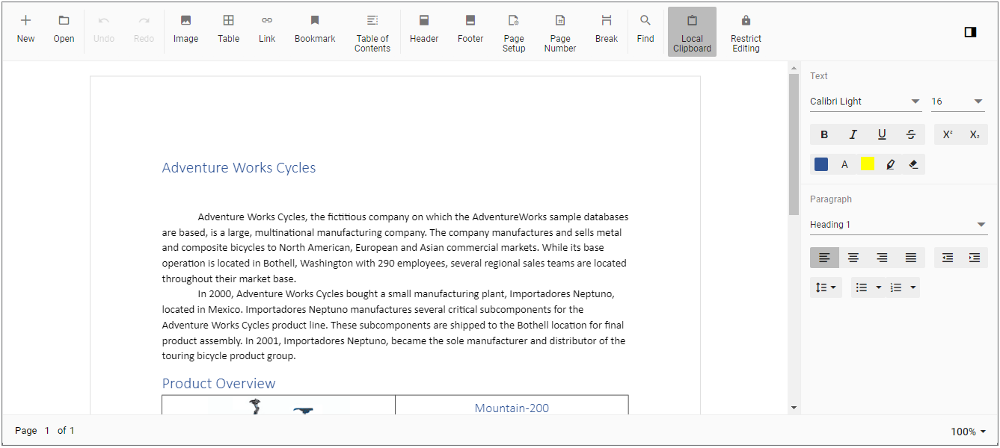

# Getting Started with Blazor DocumentEditor Component in Blazor Server

This section briefly explains about how to include [Blazor DocumentEditor](https://www.syncfusion.com/blazor-components/blazor-word-processor) component in your Blazor Server App using Visual Studio.

## Prerequisites

* [System requirements for Blazor components](https://blazor.syncfusion.com/documentation/system-requirements)

## Create a new Blazor App in Visual Studio

You can create a **Blazor Server App** using Visual Studio via [Microsoft Templates](https://learn.microsoft.com/en-us/aspnet/core/blazor/tooling?view=aspnetcore-7.0&pivots=windows) or the [Syncfusion Blazor Extension](https://blazor.syncfusion.com/documentation/visual-studio-integration/template-studio).

## Install Syncfusion Blazor WordProcessor and Themes NuGet in the App

To add **Blazor DocumentEditor** component in the app, open the NuGet package manager in Visual Studio (*Tools → NuGet Package Manager → Manage NuGet Packages for Solution*), search and install [Syncfusion.Blazor.WordProcessor](https://www.nuget.org/packages/Syncfusion.Blazor.WordProcessor) and [Syncfusion.Blazor.Themes](https://www.nuget.org/packages/Syncfusion.Blazor.Themes/). Alternatively, you can utilize the following package manager command to achieve the same.




Install-Package Syncfusion.Blazor.WordProcessor -Version {{ site.releaseversion }}
Install-Package Syncfusion.Blazor.Themes -Version {{ site.releaseversion }}




N> Syncfusion Blazor components are available in [nuget.org](https://www.nuget.org/packages?q=syncfusion.blazor). Refer to [NuGet packages](https://blazor.syncfusion.com/documentation/nuget-packages) topic for available NuGet packages list with component details.

## Register Syncfusion Blazor Service

Open **~/_Imports.razor** file and import the `Syncfusion.Blazor` and `Syncfusion.Blazor.DocumentEditor` namespace.




@using Syncfusion.Blazor
@using Syncfusion.Blazor.DocumentEditor




Now, register the Syncfusion Blazor Service in the **~/Program.cs** file of your Blazor Server App.




using Microsoft.AspNetCore.Components;
using Microsoft.AspNetCore.Components.Web;
using Syncfusion.Blazor;

var builder = WebApplication.CreateBuilder(args);

// Add services to the container.
builder.Services.AddRazorPages();
builder.Services.AddServerSideBlazor().AddHubOptions(o => { o.MaximumReceiveMessageSize = 102400000; });

// Add Syncfusion Blazor service to the container.
builder.Services.AddSyncfusionBlazor();

var app = builder.Build();




## Add stylesheet and script resources

Add the following stylesheet and script to the head section. The theme stylesheet and script can be accessed from NuGet through [Static Web Assets](https://blazor.syncfusion.com/documentation/appearance/themes#static-web-assets). Reference the stylesheet and script in the `<head>` of the main page as follows:

* For **.NET 6** Blazor Server app, include it in **~/Pages/_Layout.cshtml** file.

* For **.NET 7** Blazor Server app, include it in the **~/Pages/_Host.cshtml** file.

```html
<head>
    ....
    <link href="_content/Syncfusion.Blazor.Themes/bootstrap5.css" rel="stylesheet" />
    <script src="_content/Syncfusion.Blazor.WordProcessor/scripts/syncfusion-blazor-documenteditor.min.js" type="text/javascript"></script>
</head>
```
N> Check out the [Blazor Themes](https://blazor.syncfusion.com/documentation/appearance/themes) topic to discover various methods ([Static Web Assets](https://blazor.syncfusion.com/documentation/appearance/themes#static-web-assets), [CDN](https://blazor.syncfusion.com/documentation/appearance/themes#cdn-reference), and [CRG](https://blazor.syncfusion.com/documentation/common/custom-resource-generator)) for referencing themes in your Blazor application. Also, check out the [Adding Script Reference](https://blazor.syncfusion.com/documentation/common/adding-script-references) topic to learn different approaches for adding script references in your Blazor application.

## Add Blazor DocumentEditor Component

Add the Syncfusion Blazor DocumentEditor component in the **~/Pages/Index.razor** file.




<SfDocumentEditorContainer EnableToolbar=true></SfDocumentEditorContainer>




Note: By default, the SfDocumentEditorContainer component initializes a SfDocumentEditor instance internally. If you like to use the [`events`](https://help.syncfusion.com/cr/blazor/Syncfusion.Blazor.DocumentEditor.DocumentEditorEvents.html) of SfDocumentEditor component, then you can set [`UseDefaultEditor`](https://help.syncfusion.com/cr/blazor/Syncfusion.Blazor.DocumentEditor.SfDocumentEditorContainer.html#Syncfusion_Blazor_DocumentEditor_SfDocumentEditorContainer_UseDefaultEditor) property as false and define your own SfDocumentEditor instance with event hooks in the application (Razor file).

* Press <kbd>Ctrl</kbd>+<kbd>F5</kbd> (Windows) or <kbd>⌘</kbd>+<kbd>F5</kbd> (macOS) to launch the application. This will render the Syncfusion Blazor DocumentEditor component in your default web browser.



## Load existing document

To load an existing document during control initialization, use the following code example, which opens a Word document. Convert it to SFDT and load in the editor.




@using System.IO;
@using Syncfusion.Blazor.DocumentEditor;

<SfDocumentEditorContainer @ref="container" EnableToolbar=true>
    <DocumentEditorContainerEvents Created="OnCreated"></DocumentEditorContainerEvents>
</SfDocumentEditorContainer>

@code {
    SfDocumentEditorContainer container;

    public void OnCreated(object args)
    {
        string filePath = "wwwroot/data/GettingStarted.docx";
        using (FileStream fileStream = new FileStream(filePath, System.IO.FileMode.Open, System.IO.FileAccess.Read))
        {
            WordDocument document = WordDocument.Load(fileStream, ImportFormatType.Docx);
            string json = JsonSerializer.Serialize(document);
            document.Dispose();
            //To observe the memory go down, null out the reference of document variable.
            document = null;
            SfDocumentEditor editor = container.DocumentEditor;
            editor.OpenAsync(json);
            //To observe the memory go down, null out the reference of json variable.
            json = null;
        }
    }
}




N> As per the discussion thread [#30064](https://github.com/dotnet/aspnetcore/issues/30064), null out the reference of streams and other instances when they are no longer required. Using this approach you'll observe the memory go down and become stable.


