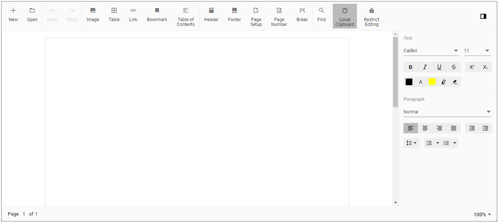

# Getting Started with Blazor DocumentEditor Component in Blazor Server

This section briefly explains about how to include [Blazor DocumentEditor](https://www.syncfusion.com/blazor-components/blazor-word-processor) component in your Blazor Server App using Visual Studio.

## Prerequisites

* [System requirements for Blazor components](https://blazor.syncfusion.com/documentation/system-requirements)

## Create a new Blazor App in Visual Studio

You can create **Blazor Server App** using Visual Studio in one of the following ways,

* [Create a Project using Microsoft Templates](https://learn.microsoft.com/en-us/aspnet/core/blazor/tooling?view=aspnetcore-7.0&pivots=windows)

* [Create a Project using Syncfusion Blazor Extension](https://blazor.syncfusion.com/documentation/visual-studio-integration/template-studio)

## Install Syncfusion Blazor WordProcessor NuGet in the App

Syncfusion Blazor components are available in [nuget.org](https://www.nuget.org/packages?q=syncfusion.blazor). To use Syncfusion Blazor components in the application, add reference to the corresponding NuGet. Refer to [NuGet packages topic](https://blazor.syncfusion.com/documentation/nuget-packages) for available NuGet packages list with component details and [Benefits of using individual NuGet packages](https://blazor.syncfusion.com/documentation/nuget-packages#benefits-of-using-individual-nuget-packages).

To add Blazor DocumentEditor component in the app, open the NuGet package manager in Visual Studio (*Tools → NuGet Package Manager → Manage NuGet Packages for Solution*), search for [Syncfusion.Blazor.WordProcessor](https://www.nuget.org/packages/Syncfusion.Blazor.WordProcessor) and then install it.

## Register Syncfusion Blazor Service

Open **~/_Imports.razor** file and import the Syncfusion.Blazor namespace.




@using Syncfusion.Blazor




Now, register the Syncfusion Blazor Service in the Blazor Server App. Here, Syncfusion Blazor Service is registered by setting [IgnoreScriptIsolation](https://help.syncfusion.com/cr/blazor/Syncfusion.Blazor.GlobalOptions.html#Syncfusion_Blazor_GlobalOptions_IgnoreScriptIsolation) property as true to load the scripts externally in the [next steps](#add-script-reference).

N> From 2022 Vol-1 (20.1) version, the default value of `IgnoreScriptIsolation` is changed to `true`. It is not necessary to set the `IgnoreScriptIsolation` property to refer scripts externally, since the default value has already been changed to true, and this property is obsolete.

* For **.NET 6 and .NET 7** app, open the **~/Program.cs** file and register the Syncfusion Blazor Service.

* For **.NET 5 and .NET 3.X** app, open the **~/Startup.cs** file and register the Syncfusion Blazor Service.




using Microsoft.AspNetCore.Components;
using Microsoft.AspNetCore.Components.Web;
using Syncfusion.Blazor;

var builder = WebApplication.CreateBuilder(args);

// Add services to the container.
builder.Services.AddRazorPages();
builder.Services.AddServerSideBlazor();
builder.Services.AddSyncfusionBlazor();

var app = builder.Build();
....





using Syncfusion.Blazor;

namespace BlazorApplication
{
    public class Startup
    {
        ...
        public void ConfigureServices(IServiceCollection services)
        {
            services.AddRazorPages();
            services.AddServerSideBlazor();
            services.AddSyncfusionBlazor();
        }
        ...
    }
}




## Add Style Sheet

Checkout the [Blazor Themes topic](https://blazor.syncfusion.com/documentation/appearance/themes) to learn different ways ([Static Web Assets](https://blazor.syncfusion.com/documentation/appearance/themes#static-web-assets), [CDN](https://blazor.syncfusion.com/documentation/appearance/themes#cdn-reference) and [CRG](https://blazor.syncfusion.com/documentation/common/custom-resource-generator)) to refer themes in Blazor application, and to have the expected appearance for Syncfusion Blazor components. Here, the theme is referred using [Static Web Assets](https://blazor.syncfusion.com/documentation/appearance/themes#static-web-assets).

To add theme to the app, open the NuGet package manager in Visual Studio (*Tools → NuGet Package Manager → Manage NuGet Packages for Solution*), search for [Syncfusion.Blazor.Themes](https://www.nuget.org/packages/Syncfusion.Blazor.Themes/) and then install it. Then, the theme style sheet from NuGet can be referred as follows,

* For .NET 6 app, add the Syncfusion bootstrap5 theme in the `<head>` of the **~/Pages/_Layout.cshtml** file.

* For .NET 3.X, .NET 5 and .NET 7 app, add the Syncfusion bootstrap5 theme in the `<head>` of the **~/Pages/_Host.cshtml** file.




<head>
    ...
    <link href="_content/Syncfusion.Blazor.Themes/bootstrap5.css" rel="stylesheet" />
</head>





<head>
    ...
    <link href="_content/Syncfusion.Blazor.Themes/bootstrap5.css" rel="stylesheet" />
</head>




## Add Script Reference

Checkout [Adding Script Reference topic](https://blazor.syncfusion.com/documentation/common/adding-script-references) to learn different ways to add script reference in Blazor Application. In this getting started walk-through, the required scripts are referred using [Static Web Assets](https://blazor.syncfusion.com/documentation/common/adding-script-references#static-web-assets) externally inside the `<head>` as follows,

* For **.NET 6** app, Refer script in the `<head>` of the **~/Pages/_Layout.cshtml** file.

* For **.NET 3.X, .NET 5 and .NET 7** app, Refer script in the `<head>` of the **~/Pages/_Host.cshtml** file.




<head>
    ....
    <link href="_content/Syncfusion.Blazor.Themes/bootstrap5.css" rel="stylesheet" />
    
</head>





<head>
    ....
    <link href="_content/Syncfusion.Blazor.Themes/bootstrap5.css" rel="stylesheet" />
    
</head>




In the above example code, we have referred the script which is specific to Document Editor component. If you want to use Document Editor along the other Syncfusion Blazor component like Grid, RTE etc. Refer below topic,

* [Adding script reference](https://blazor.syncfusion.com/documentation/common/adding-script-references)
* [CRG](https://blazor.syncfusion.com/documentation/common/custom-resource-generator)

N> Syncfusion recommends to reference scripts using [Static Web Assets](https://blazor.syncfusion.com/documentation/common/adding-script-references#static-web-assets), [CDN](https://blazor.syncfusion.com/documentation/common/adding-script-references#cdn-reference) and [CRG](https://blazor.syncfusion.com/documentation/common/custom-resource-generator) by [disabling JavaScript isolation](https://blazor.syncfusion.com/documentation/common/adding-script-references#disable-javascript-isolation) for better loading performance of the Blazor application.

## Add Blazor DocumentEditor Component

* Open **~/_Imports.razor** file or any other page under the `~/Pages` folder where the component is to be added and import the **Syncfusion.Blazor.DocumentEditor** namespace.




@using Syncfusion.Blazor
@using Syncfusion.Blazor.DocumentEditor




* Now, add the Syncfusion DocumentEditor component in razor file. Here, the DocumentEditor component is added in the **~/Pages/Index.razor** file under the **~/Pages** folder.




<SfDocumentEditorContainer EnableToolbar=true></SfDocumentEditorContainer>




Note: By default, the SfDocumentEditorContainer component initializes a SfDocumentEditor instance internally. If you like to use the [`events`](https://help.syncfusion.com/cr/blazor/Syncfusion.Blazor.DocumentEditor.DocumentEditorEvents.html) of SfDocumentEditor component, then you can set [`UseDefaultEditor`](https://help.syncfusion.com/cr/blazor/Syncfusion.Blazor.DocumentEditor.SfDocumentEditorContainer.html#Syncfusion_Blazor_DocumentEditor_SfDocumentEditorContainer_UseDefaultEditor) property as false and define your own SfDocumentEditor instance with event hooks in the application (Razor file).

* Press <kbd>Ctrl</kbd>+<kbd>F5</kbd> (Windows) or <kbd>⌘</kbd>+<kbd>F5</kbd> (macOS) to run the application. Then, the Syncfusion `Blazor DocumentEditor` component will be rendered in the default web browser.

## Load existing document

To load an existing document during control initialization, use the following code example, which opens a Word document. Convert it to SFDT and load in the editor.




@using System.IO;
@using Syncfusion.Blazor.DocumentEditor;

<SfDocumentEditorContainer @ref="container" EnableToolbar=true>
    <DocumentEditorContainerEvents Created="OnCreated"></DocumentEditorContainerEvents>
</SfDocumentEditorContainer>

@code {
    SfDocumentEditorContainer container;

    public void OnCreated(object args)
    {
        string filePath = "wwwroot/data/GettingStarted.docx";
        using (FileStream fileStream = new FileStream(filePath, System.IO.FileMode.Open, System.IO.FileAccess.Read))
        {
            WordDocument document = WordDocument.Load(fileStream, ImportFormatType.Docx);
            string json = JsonSerializer.Serialize(document);
            document.Dispose();
            //To observe the memory go down, null out the reference of document variable.
            document = null;
            SfDocumentEditor editor = container.DocumentEditor;
            editor.OpenAsync(json);
            //To observe the memory go down, null out the reference of json variable.
            json = null;
        }
    }
}




N> As per the discussion thread [#30064](https://github.com/dotnet/aspnetcore/issues/30064), null out the reference of streams and other instances when they are no longer required. Using this approach you'll observe the memory go down and become stable.

