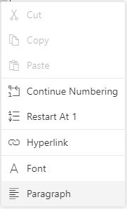

# Working with Lists in Blazor DocumentEditor Component

[Blazor Document Editor](https://www.syncfusion.com/blazor-components/blazor-word-processor) supports both the single-level and multilevel lists. Lists are used to organize data as step-by-step instructions in documents for easy understanding of key points. You can apply list to the paragraph either using supported APIs.

## Create bullet list

Bullets are usually used for unordered lists. To apply bulleted list for selected paragraphs, use `ApplyBullet(bullet, fontFamily)` method of `Editor` instance.

|Parameter|Type|Description|
|---------|----|-----------|
|Bullet|string|Bullet character.|
|fontFamily|string|Bullet font family.|

Refer to the following sample code.

```csharp
documentEditor.Editor.ApplyBullet("\uf0b7", "Symbol");
```

## Create numbered list

Numbered lists are usually used for ordered lists. To apply numbered list for selected paragraphs, use `ApplyNumbering(numberFormat,listLevelPattern)` method of `Editor` instance.

|Parameter|Type|Description|
|---------|----|-----------|
|numberFormat|string|“%n” representations in ‘numberFormat’ parameter will be replaced by respective list level’s value.“%1” will be displayed as “1”|
|listLevelPattern(optional)|string|Default value is 'Arabic'.|

Refer to the following example.

```csharp
documentEditor.Editor.ApplyNumbering("%1)", ListLevelPattern.UpRoman);
```

## Clear list

You can also clear the list formatting applied for selected paragraphs. Refer to the following sample code.

```csharp
documentEditor.Editor.ClearList();
```

## Editing numbered list

Document editor restarts the numbering or continue numbering for a numbered list. These options are found in the built-in context menu, if the list value is selected. Refer to the following screenshot.

