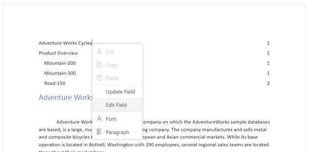

# Table of Contents in Blazor DocumentEditor Component

The table of contents in a document is same as the list of chapters at the beginning of a book. It lists each heading in the document and the page number, where that heading starts with various options to customize the appearance.

## Inserting table of contents

[Blazor Document Editor](https://www.syncfusion.com/blazor-components/blazor-word-processor) exposes an API to insert table of contents at cursor position programmatically. You can specify the settings for table of contents explicitly. Otherwise, the default settings will be applied.

[`TableOfContentsSettings`](https://help.syncfusion.com/cr/blazor/Syncfusion.Blazor.DocumentEditor.TableOfContentsSettings.html) contain the following properties:
* **startLevel**: Specifies the start level for constructing table of contents.
* **endLevel**: Specifies the end level for constructing table of contents.
* **includeHyperlink**: Specifies whether the link for headings is included.
* **includePageNumber**: Specified whether the page number of the headings is included.
* **rightAlign**: Specifies whether the page number is right aligned.
* **tabLeader**: Specifies the tab leader styles such as none, dot, hyphen, and underscore.
* **includeOutlineLevels**: Specifies whether the outline levels are included.

The following code illustrates how to insert table of content in document editor.

```csharp
TableOfContentsSettings tableOfContentsSettings = new TableOfContentsSettings();
tableOfContentsSettings.StartLevel = 1;
tableOfContentsSettings.EndLevel = 3;
tableOfContentsSettings.IncludeHyperlink = true;
tableOfContentsSettings.IncludePageNumber = true;
tableOfContentsSettings.RightAlign = true;
await editor.Editor.InsertTableOfContentsAsync(tableOfContentsSettings);
```

```cshtml
@using Syncfusion.Blazor.DocumentEditor;

<SfDocumentEditorContainer @ref="container" EnableToolbar=true>
    <DocumentEditorContainerEvents Created="OnLoad"></DocumentEditorContainerEvents>
</SfDocumentEditorContainer>

@code {
    SfDocumentEditorContainer container;
    protected async void OnLoad(object args)
    {
        SfDocumentEditor editor = container.DocumentEditor;
        string sfdt = "{\"sections\":[{\"blocks\":[{\"paragraphFormat\":{\"styleName\":\"Heading 1\"},\"inlines\":[{\"text\":\"Headin\"},{\"name\":\"_GoBack\",\"bookmarkType\":0},{\"name\":\"_GoBack\",\"bookmarkType\":1},{\"text\":\"g1\"}]},{\"paragraphFormat\":{\"styleName\":\"Heading 2\"},\"inlines\":[{\"text\":\"Heading2\"}]},{\"paragraphFormat\":{\"styleName\":\"Heading 3\"},\"inlines\":[{\"text\":\"Heading3\"}]},{\"paragraphFormat\":{\"styleName\":\"Heading 4\"},\"inlines\":[{\"text\":\"Heading4\"}]},{\"paragraphFormat\":{\"styleName\":\"Heading 5\"},\"inlines\":[{\"text\":\"Heading5\"}]},{\"paragraphFormat\":{\"styleName\":\"Heading 6\"},\"inlines\":[{\"text\":\"Heading6\"}]},{\"paragraphFormat\":{\"styleName\":\"Normal\"},\"inlines\":[{\"text\":\"Normal\"}]}],\"headersFooters\":{},\"sectionFormat\":{\"headerDistance\":36.0,\"footerDistance\":36.0,\"pageWidth\":612.0,\"pageHeight\":792.0,\"leftMargin\":72.0,\"rightMargin\":72.0,\"topMargin\":72.0,\"bottomMargin\":72.0,\"differentFirstPage\":false,\"differentOddAndEvenPages\":false}}],\"characterFormat\":{\"fontSize\":11.0,\"fontFamily\":\"Calibri\"},\"paragraphFormat\":{\"afterSpacing\":8.0,\"lineSpacing\":1.0791666507720947,\"lineSpacingType\":\"Multiple\"},\"background\":{\"color\":\"#FFFFFFFF\"},\"styles\":[{\"type\":\"Paragraph\",\"name\":\"Normal\",\"next\":\"Normal\"},{\"type\":\"Paragraph\",\"name\":\"Heading 1\",\"basedOn\":\"Normal\",\"next\":\"Normal\",\"link\":\"Heading 1 Char\",\"characterFormat\":{\"fontSize\":16.0,\"fontFamily\":\"Calibri Light\",\"fontColor\":\"#2F5496FF\"},\"paragraphFormat\":{\"beforeSpacing\":12.0,\"afterSpacing\":0.0,\"outlineLevel\":\"Level1\"}},{\"type\":\"Paragraph\",\"name\":\"Heading 2\",\"basedOn\":\"Normal\",\"next\":\"Normal\",\"link\":\"Heading 2 Char\",\"characterFormat\":{\"fontSize\":13.0,\"fontFamily\":\"Calibri Light\",\"fontColor\":\"#2F5496FF\"},\"paragraphFormat\":{\"beforeSpacing\":2.0,\"afterSpacing\":0.0,\"outlineLevel\":\"Level2\"}},{\"type\":\"Paragraph\",\"name\":\"Heading 3\",\"basedOn\":\"Normal\",\"next\":\"Normal\",\"link\":\"Heading 3 Char\",\"characterFormat\":{\"fontSize\":12.0,\"fontFamily\":\"Calibri Light\",\"fontColor\":\"#1F3763FF\"},\"paragraphFormat\":{\"beforeSpacing\":2.0,\"afterSpacing\":0.0,\"outlineLevel\":\"Level3\"}},{\"type\":\"Paragraph\",\"name\":\"Heading 4\",\"basedOn\":\"Normal\",\"next\":\"Normal\",\"link\":\"Heading 4 Char\",\"characterFormat\":{\"italic\":true,\"fontFamily\":\"Calibri Light\",\"fontColor\":\"#2F5496FF\"},\"paragraphFormat\":{\"beforeSpacing\":2.0,\"afterSpacing\":0.0,\"outlineLevel\":\"Level4\"}},{\"type\":\"Paragraph\",\"name\":\"Heading 5\",\"basedOn\":\"Normal\",\"next\":\"Normal\",\"link\":\"Heading 5 Char\",\"characterFormat\":{\"fontFamily\":\"Calibri Light\",\"fontColor\":\"#2F5496FF\"},\"paragraphFormat\":{\"beforeSpacing\":2.0,\"afterSpacing\":0.0,\"outlineLevel\":\"Level5\"}},{\"type\":\"Paragraph\",\"name\":\"Heading 6\",\"basedOn\":\"Normal\",\"next\":\"Normal\",\"link\":\"Heading 6 Char\",\"characterFormat\":{\"fontFamily\":\"Calibri Light\",\"fontColor\":\"#1F3763FF\"},\"paragraphFormat\":{\"beforeSpacing\":2.0,\"afterSpacing\":0.0,\"outlineLevel\":\"Level6\"}},{\"type\":\"Character\",\"name\":\"Default Paragraph Font\"},{\"type\":\"Character\",\"name\":\"Heading 1 Char\",\"basedOn\":\"Default Paragraph Font\",\"characterFormat\":{\"fontSize\":16.0,\"fontFamily\":\"Calibri Light\",\"fontColor\":\"#2F5496FF\"}},{\"type\":\"Character\",\"name\":\"Heading 2 Char\",\"basedOn\":\"Default Paragraph Font\",\"characterFormat\":{\"fontSize\":13.0,\"fontFamily\":\"Calibri Light\",\"fontColor\":\"#2F5496FF\"}},{\"type\":\"Character\",\"name\":\"Heading 3 Char\",\"basedOn\":\"Default Paragraph Font\",\"characterFormat\":{\"fontSize\":12.0,\"fontFamily\":\"Calibri Light\",\"fontColor\":\"#1F3763FF\"}},{\"type\":\"Character\",\"name\":\"Heading 4 Char\",\"basedOn\":\"Default Paragraph Font\",\"characterFormat\":{\"italic\":true,\"fontFamily\":\"Calibri Light\",\"fontColor\":\"#2F5496FF\"}},{\"type\":\"Character\",\"name\":\"Heading 5 Char\",\"basedOn\":\"Default Paragraph Font\",\"characterFormat\":{\"fontFamily\":\"Calibri Light\",\"fontColor\":\"#2F5496FF\"}},{\"type\":\"Character\",\"name\":\"Heading 6 Char\",\"basedOn\":\"Default Paragraph Font\",\"characterFormat\":{\"fontFamily\":\"Calibri Light\",\"fontColor\":\"#1F3763FF\"}}]}";
        await editor.OpenAsync(sfdt);
        TableOfContentsSettings tableOfContentsSettings = new TableOfContentsSettings();
        tableOfContentsSettings.StartLevel = 1;
        tableOfContentsSettings.EndLevel = 3;
        tableOfContentsSettings.IncludeHyperlink = true;
        tableOfContentsSettings.IncludePageNumber = true;
        tableOfContentsSettings.RightAlign = true;
        await editor.Editor.InsertTableOfContentsAsync(tableOfContentsSettings);
    }
}
```

## Update or edit table of contents

You can update or edit the table of contents using the built-in context menu shown up by right-clicking it. Refer to the following screenshot.



* **Update Field**: Updates the headings in table of contents with same settings by searching the entire document.
* **Edit Field**: Opens the built-in table of contents dialog and allows you to modify its settings.

You can also do it programmatically by using the exposed API. Refer to the following sample code.

```csharp
await editor.OpenAsync(''); /*Open any existing document*/
TableOfContentsSettings tableOfContentsSettings = new TableOfContentsSettings();
tableOfContentsSettings.StartLevel = 1;
tableOfContentsSettings.EndLevel = 3;
tableOfContentsSettings.IncludeHyperlink = true;
tableOfContentsSettings.IncludePageNumber = true;
tableOfContentsSettings.RightAlign = true;
await editor.Editor.InsertTableOfContentsAsync(tableOfContentsSettings);

```

N> Same method is used for inserting, updating, and editing table of contents. This will work based on the current element at cursor position and the optional settings parameter. If table of contents is present at cursor position, the update operation will be done based on the optional settings parameter. Otherwise, the insert operation will be done.

You can also explore our [Blazor Word Processor](https://blazor.syncfusion.com/demos/document-editor/default-functionalities) example to know how to render and configure the document editor.
