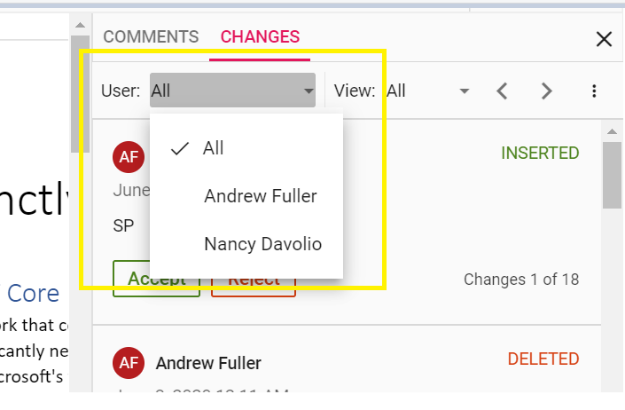
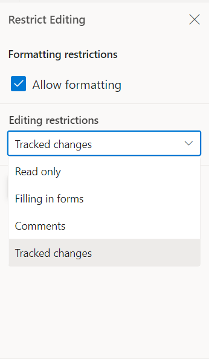

# Track Changes in Blazor DocumentEditor Component

Track Changes allows you to keep a record of changes or edits made to a document. You can then choose to accept or reject the modifications. It is a useful tool for managing changes made by several reviewers to the same document. If track changes option is enabled, all editing operations are preserved as revisions in Document Editor.

## Enable track changes in Document Editor

The following example demonstrates how to enable track changes.

```csharp
<SfDocumentEditorContainer ID="cont" @ref="container" EnableTrackChanges="true" EnableToolbar="true">
</SfDocumentEditorContainer>
```

## Show/Hide Revisions Pane
 
The Show/Hide Revisions Pane feature in the Document Editor allows users to toggle the visibility of the revisions pane, providing flexibility in managing tracked changes within the document.
 
The following example code illustrates how to show/hide the revisions pane.

```typescript

@using Syncfusion.Blazor.DocumentEditor
<SfDocumentEditorContainer @ref="container" EnableToolbar=true EnableTrackChanges=true>
    <DocumentEditorContainerEvents Created="OnLoad"></DocumentEditorContainerEvents>
</SfDocumentEditorContainer>

@code {
    SfDocumentEditorContainer container;
    public async void OnLoad(object args)
    {
        container.DocumentEditor.ShowRevisions=true;
        container.DocumentEditor.ShowRevisions=false;
    }
}

```


## Navigate between the tracked changes

The following example demonstrates how to navigate tracked revision programmatically.

```csharp
/**
 * Navigate to next tracked change from the current selection.
 */
await container.DocumentEditor.Selection.NavigateNextRevisionAsync();

/**
 * Navigate to previous tracked change from the current selection.
 */
await container.DocumentEditor.Selection.NavigatePreviousRevisionAsync();
```

## Filtering changes based on user

In DocumentEditor, we have built-in review panel in which we have provided support for filtering changes based on the user.



## Protect the document in track changes only mode

Document Editor provides support for protecting the document with `RevisionsOnly` protection. In this protection, all the users are allowed to view the document and do their corrections, but they cannot accept or reject any tracked changes in the document. Later, the author can view their corrections and accept or reject the changes.

Document editor provides an option to protect and unprotect document using [`EnforceProtectionAsync`](https://help.syncfusion.com/cr/blazor/Syncfusion.Blazor.DocumentEditor.EditorModule.html#Syncfusion_Blazor_DocumentEditor_EditorModule_EnforceProtectionAsync_System_String_Syncfusion_Blazor_DocumentEditor_ProtectionType_) and [`StopProtectionAsync`](https://help.syncfusion.com/cr/blazor/Syncfusion.Blazor.DocumentEditor.EditorModule.html#Syncfusion_Blazor_DocumentEditor_EditorModule_StopProtectionAsync_System_String_) API.

The following example code illustrates how to enforce and stop protection in Document editor container.

```typescript
@using Syncfusion.Blazor.DocumentEditor

<button @onclick="protectDocument">Protection</button>
<SfDocumentEditorContainer @ref="container" EnableToolbar=true></SfDocumentEditorContainer>

@code {
    SfDocumentEditorContainer container;
    protected async void protectDocument(object args)
    {
        //enforce protection
        await container.DocumentEditor.Editor.EnforceProtectionAsync("123", ProtectionType.RevisionsOnly);
        //stop the document protection
        await container.DocumentEditor.Editor.StopProtectionAsync("123");
    }
}
```

Tracked changes only protection can be enabled in UI by using [Restrict Editing pane](https://blazor.syncfusion.com/documentation/document-editor/restrict-editing)



N> In enforce Protection method, first parameter denotes password and second parameter denotes protection type. Possible values of protection type are `NoProtection |ReadOnly |FormFieldsOnly |CommentsOnly |RevisionsOnly`. In stop protection method, parameter denotes the password.
