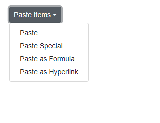

# Add and Remove Items in Blazor Dropdown Menu Component

Dropdown Menu component can dynamically add or remove items using the [AddItems](https://help.syncfusion.com/cr/blazor/Syncfusion.Blazor.SplitButtons.SfDropDownButton.html#Syncfusion_Blazor_SplitButtons_SfDropDownButton_AddItems_System_Collections_Generic_List_Syncfusion_Blazor_SplitButtons_DropDownMenuItem__System_String_System_Boolean_) and [RemoveItems](https://help.syncfusion.com/cr/blazor/Syncfusion.Blazor.SplitButtons.SfDropDownButton.html#Syncfusion_Blazor_SplitButtons_SfDropDownButton_RemoveItems_System_Collections_Generic_List_System_String__System_Boolean_) methods.

The following example illustrates how to add and remove items in Dropdown Menu component.

```cshtml
@using Syncfusion.Blazor.SplitButtons
@using Syncfusion.Blazor.Buttons

<SfDropDownButton Content="Paste Items" @ref="DropDownbuttonRef">
    <DropDownMenuItems>
        <DropDownMenuItem Text="Paste"></DropDownMenuItem>
    </DropDownMenuItems>
</SfDropDownButton>
<div>
    <SfButton Content="Additem" IsPrimary="true" @onclick="addItem"></SfButton>

    <SfButton Content="Removeitem" IsPrimary="true" @onclick="removeItem"></SfButton>
</div>

@code {
    SfDropDownButton DropDownbuttonRef;

    private void addItem()
    {
        DropDownbuttonRef.AddItems(dropdownbtnItems);
    }

    private void removeItem()
    {
        DropDownbuttonRef.RemoveItems(removeItems);
    }
    
    public List<DropDownMenuItem> dropdownbtnItems = new List<DropDownMenuItem>
    {
        new DropDownMenuItem{ Text="Paste Special" },
        new DropDownMenuItem{ Text="Paste as Formula" },
        new DropDownMenuItem{ Text="Paste as Hyperlink" }
    };

    public List<string> removeItems = new List<string>()
    {
       "Paste"
    };
}

```


