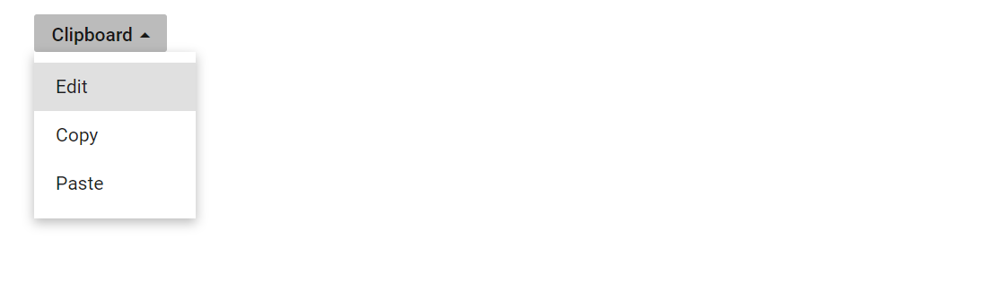

# Change caret icon in Blazor Dropdown Menu Component

The caret icon in the Dropdown Menu component can be customized when the popup opens and closes by handling the [OnOpen](https://help.syncfusion.com/cr/blazor/Syncfusion.Blazor.SplitButtons.DropDownButtonEvents.html#Syncfusion_Blazor_SplitButtons_DropDownButtonEvents_OnOpen) and [OnClose](https://help.syncfusion.com/cr/blazor/Syncfusion.Blazor.SplitButtons.DropDownButtonEvents.html#Syncfusion_Blazor_SplitButtons_DropDownButtonEvents_OnClose) events. These callbacks trigger before the popup is displayed or hidden, providing a convenient place to toggle CSS classes that adjust the caret appearance.

In the following example, the up arrow is updated on popup close and down arrow is updated on popup open using the `OnOpen` and `OnClose` events by adding and removing `e-caret-up` class.

```cshtml
@using Syncfusion.Blazor.SplitButtons

<SfDropDownButton CssClass="@IconCss" Content="Clipboard">
    <DropDownButtonEvents OnOpen="beforeOpen" OnClose="beforeClose"></DropDownButtonEvents>
    <DropDownMenuItems>
        <DropDownMenuItem Text="Edit"></DropDownMenuItem>
        <DropDownMenuItem Text="Copy"></DropDownMenuItem>
        <DropDownMenuItem Text="Paste"></DropDownMenuItem>
    </DropDownMenuItems>
</SfDropDownButton>

@code {
    public string IconCss = "";
    private void beforeOpen(BeforeOpenCloseMenuEventArgs args)
    {
        this.IconCss = "e-caret-up";
        this.StateHasChanged();
    }
    private void beforeClose(BeforeOpenCloseMenuEventArgs args)
    {
        this.IconCss = "";
        this.StateHasChanged();
    }
}

<style>
    .e-caret {
        transform: rotate(0deg);
        transition: transform 200ms ease-in-out;
    }

    .e-caret-up .e-caret {
        transform: rotate(180deg);
    }
</style>

```


