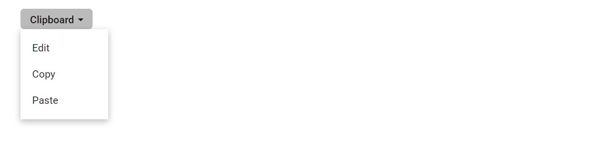

# Create Dropdown Menu with rounded corner in Blazor Dropdown Menu Component

Dropdown Menu with rounded corner can be achieved by adding `border-radius` CSS property to button element.

In the following example, `e-round-corner` class is defined with `5px` `border-radius`
property and added that class to button element using
[`CssClass`](https://help.syncfusion.com/cr/blazor/Syncfusion.Blazor.SplitButtons.SfDropDownButton.html#Syncfusion_Blazor_SplitButtons_SfDropDownButton_CssClass) property.

```cshtml
@using Syncfusion.Blazor.SplitButtons

<SfDropDownButton CssClass="e-round-corner" Content="Clipboard">
    <DropDownMenuItems>
        <DropDownMenuItem Text="Edit"></DropDownMenuItem>
        <DropDownMenuItem Text="Copy"></DropDownMenuItem>
        <DropDownMenuItem Text="Paste"></DropDownMenuItem>
    </DropDownMenuItems>
</SfDropDownButton>

<style>
    .e-round-corner {
        border-radius: 5px;
    }
</style>

```

Output be like

