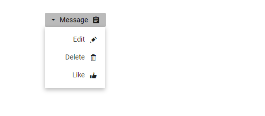

# Create Right-to-left Blazor Dropdown Menu Component

Dropdown Menu component has RTL support. This can be achieved by setting [EnableRtl](https://help.syncfusion.com/cr/blazor/Syncfusion.Blazor.SplitButtons.SfDropDownButton.html#Syncfusion_Blazor_SplitButtons_SfDropDownButton_EnableRtl) as true.

The following example illustrates how to enable right-to-left support in Dropdown Menu component.

```cshtml
@using Syncfusion.Blazor.SplitButtons

<SfDropDownButton Content="Message" IconCss="e-icons e-message" EnableRtl="true">
    <DropDownMenuItems>
        <DropDownMenuItem IconCss="e-icons e-edit" Text="Edit"></DropDownMenuItem>
        <DropDownMenuItem IconCss="e-icons e-delete" Text="Delete"></DropDownMenuItem>
        <DropDownMenuItem IconCss="e-icons e-like" Text="Like"></DropDownMenuItem>
    </DropDownMenuItems>
</SfDropDownButton>

<style>
    .e-message::before {
        content: '\e7cb';
    }

    .e-edit::before {
        content: '\e78f';
    }

    .e-delete::before {
        content: '\e773';
    }

    .e-like::before {
        content: '\e682';
    }

</style>

```

