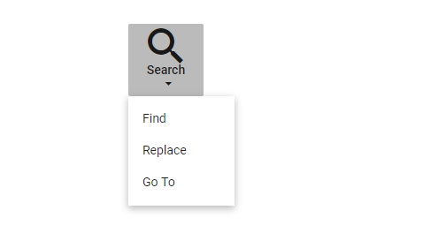

# Customize Icon and width in Blazor Dropdown Menu Component

Width of the Dropdown Menu can be customized by setting required width to the dropdown element.

The following UI can be achieved by setting [IconPosition](https://help.syncfusion.com/cr/blazor/Syncfusion.Blazor.SplitButtons.SfDropDownButton.html#Syncfusion_Blazor_SplitButtons_SfDropDownButton_IconPosition) as `Top`, width as `85px` and size of the font icon as `40px` by adding `e-custom` class.

```cshtml
@using Syncfusion.Blazor.SplitButtons

<SfDropDownButton IconCss="e-icons e-search" CssClass="e-custom" IconPosition ="SplitButtonIconPosition.Top" Content="Search">
  <DropDownMenuItems>
      <DropDownMenuItem Text="Find"></DropDownMenuItem>
      <DropDownMenuItem Text="Replace"></DropDownMenuItem>
      <DropDownMenuItem Text="Go To"></DropDownMenuItem>
  </DropDownMenuItems>
</SfDropDownButton>

<style>

.e-search::before {
  content: '\e724';
}

.e-dropdown-btn.e-custom {
  width: 85px;
}

.e-dropdown-btn.e-custom .e-search::before {
  font-size: 40px;
}
</style>
```

Output be like

