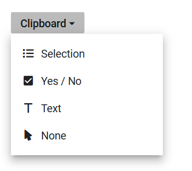

# Customize popup width in Blazor Dropdown Menu Component

Customize the width of the Dropdown Menu popup by assigning a value to the [PopupWidth](https://help.syncfusion.com/cr/blazor/Syncfusion.Blazor.SplitButtons.SfDropDownButton.html#Syncfusion_Blazor_SplitButtons_SfDropDownButton_PopupWidth) property of the DropDownButton component. By default, the popup's width adjusts based on the content. However, this property allows setting a specific width, ensuring consistency and alignment with design requirements. The width can be specified using common CSS units or as a raw pixel value.

```cshtml
@using Syncfusion.Blazor.SplitButtons

<SfDropDownButton CssClass="custom-icon-css" Content="Clipboard" PopupWidth="200px" Open="beforeOpen" Close="beforeClose">
    <DropDownMenuItems>
        <DropDownMenuItem Text="Selection" IconCss="e-icons e-list-unordered"></DropDownMenuItem>
        <DropDownMenuItem Text="Yes / No" IconCss="e-icons e-check-box"></DropDownMenuItem>
        <DropDownMenuItem Text="Text" IconCss="e-icons e-caption"></DropDownMenuItem>
        <DropDownMenuItem Text="None" IconCss="e-icons e-mouse-pointer"></DropDownMenuItem>
    </DropDownMenuItems>
</SfDropDownButton>

```


