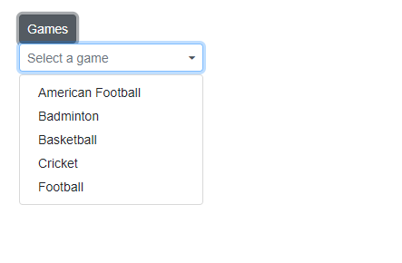

# Create Dropdown List in Popup of Blazor Dropdown Menu Component

We have render the [DropDownList](https://help.syncfusion.com/cr/blazor/Syncfusion.Blazor.DropDowns.SfDropDownList-2.html) component in [DropDownMenu](https://help.syncfusion.com/cr/blazor/Syncfusion.Blazor.SplitButtons.SfDropDownButton.html) popup using [PopupContent](https://help.syncfusion.com/cr/blazor/Syncfusion.Blazor.SplitButtons.SfDropDownButton.html#Syncfusion_Blazor_SplitButtons_SfDropDownButton_PopupContent) property.

In the following example, render [DropDownList](https://help.syncfusion.com/cr/blazor/Syncfusion.Blazor.DropDowns.SfDropDownList-2.html) component in popup.

```cshtml

@using Syncfusion.Blazor.SplitButtons
@using Syncfusion.Blazor.DropDowns

<SfDropDownButton CssClass="e-caret-hide" Content="Games">
    <PopupContent>
        <div id="dropDownFilterExpenses">
            <SfDropDownList TValue="string" TItem="GameFields" PopupHeight="230px" Placeholder="Select a game" DataSource="@Games">
                <DropDownListFieldSettings Text="Text" Value="ID"></DropDownListFieldSettings>
                <DropDownListEvents Opened="OpenPopup" OnClose="beforeClose" TValue="string" TItem="GameFields"></DropDownListEvents>
            </SfDropDownList>
        </div>
    </PopupContent>
    <ChildContent>
        <DropDownButtonEvents OnClose="popupClose"></DropDownButtonEvents>
    </ChildContent>
</SfDropDownButton>


@code {

    private bool ispopUp = false;

    private void popupClose(BeforeOpenCloseMenuEventArgs args)
    {
        args.Cancel = this.ispopUp;
    }

    private void OpenPopup(PopupEventArgs args)
    {
        this.ispopUp = true;
    }

    private void beforeClose(PopupEventArgs args)
    {
        this.ispopUp = false;
    }

    public class GameFields
    {
        public string ID { get; set; }
        public string Text { get; set; }
    }
    private List<GameFields> Games = new List<GameFields>() {
        new GameFields(){ ID= "Game1", Text= "American Football" },
        new GameFields(){ ID= "Game2", Text= "Badminton" },
        new GameFields(){ ID= "Game3", Text= "Basketball" },
        new GameFields(){ ID= "Game4", Text= "Cricket" },
        new GameFields(){ ID= "Game5", Text= "Football" }
     };

}

<style>
    .e-dropdown-popup.e-transparent div {
        display: none;
    }
</style>


```


