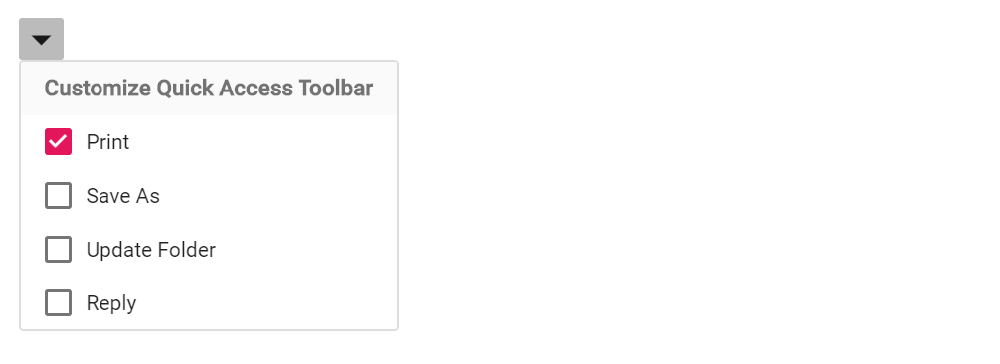

# Group dropdown listview items in Blazor Dropdown Menu Component

Header sections within the Dropdown Menu popup can be created by templating the popup with the ListView component. Assign a ListView instance (identified by its [ID](https://help.syncfusion.com/cr/blazor/Syncfusion.Blazor.Lists.SfListView-1.html#Syncfusion_Blazor_Lists_SfListView_1_ID)) to the [PopupContent](https://help.syncfusion.com/cr/blazor/Syncfusion.Blazor.SplitButtons.SfDropDownButton.html#Syncfusion_Blazor_SplitButtons_SfDropDownButton_PopupContent) property of the Dropdown Menu component, and configure field mappings to group the items.

In the following example, the ListView is provided as PopupContent for the Dropdown Menu, and the [GroupBy](https://help.syncfusion.com/cr/blazor/Syncfusion.Blazor.Lists.ListViewFieldSettings-1.html#Syncfusion_Blazor_Lists_ListViewFieldSettings_1_GroupBy) property of the ListView field settings generates grouped headers based on the `Category` field. The `ShowCheckBox` option enables multi-selection within each group.

```cshtml

@using Syncfusion.Blazor.SplitButtons
@using Syncfusion.Blazor.Lists
<SfDropDownButton CssClass="e-caret-hide" IconCss="e-icons e-down">
        <PopupContent>
            <SfListView ID="listview" DataSource="@Data" ShowCheckBox="true">
                <ListViewFieldSettings Text="Text" GroupBy="Category" TValue="ListData"></ListViewFieldSettings>
            </SfListView>
        </PopupContent>
    </SfDropDownButton>

@code {
    public List<ListData> Data = new List<ListData>{
        new ListData{ Class = "data", Text = "Print", Id = "data1", Category = "Customize Quick Access Toolbar" },
        new ListData{ Class = "data", Text = "Save As", Id = "data2", Category = "Customize Quick Access Toolbar" },
        new ListData{ Class = "data", Text = "Update Folder", Id = "data3", Category = "Customize Quick Access Toolbar"},
        new ListData{ Class = "data", Text = "Reply", Id = "data4", Category = "Customize Quick Access Toolbar" }
};

    public class ListData
    {
        public string Text { get; set; }
        public string Id { get; set; }
        public string Class { get; set; }
        public string Category { get; set; }
    }
}

<style>
    .e-down::before {
    content: '\e969'; /* Referred this icon from material theme */
    }
</style>

```


