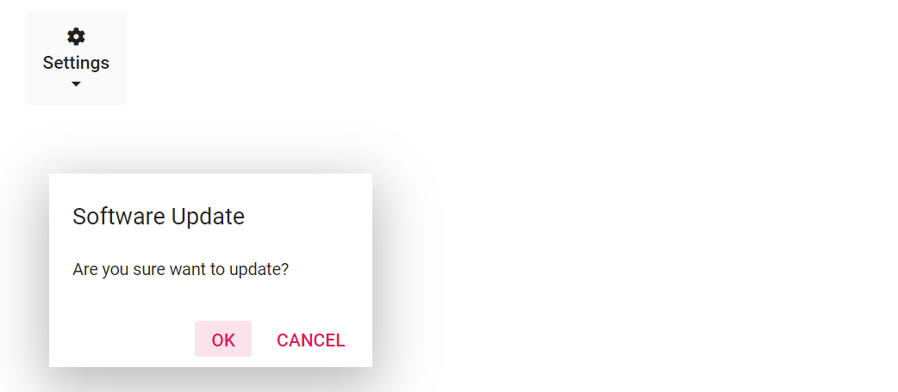

# Open a Dialog on Popup Item Click in Blazor Dropdown Menu Component

This section explains how to open a dialog when a Dropdown Menu popup item is selected. This can be achieved by handling the [ItemSelected](https://help.syncfusion.com/cr/blazor/Syncfusion.Blazor.SplitButtons.DropDownButtonEvents.html#Syncfusion_Blazor_SplitButtons_DropDownButtonEvents_ItemSelected) event of the Dropdown Menu.

In the following example, Dialog will open while selecting `Other Folder...` item.

```cshtml

@using Syncfusion.Blazor.SplitButtons
@using Syncfusion.Blazor.Popups
@using Syncfusion.Blazor.Buttons

<SfDropDownButton Content="Settings" IconCss="e-icons e-setting-icon" CssClass="e-vertical" IconPosition="SplitButtonIconPosition.Top">
    <DropDownButtonEvents ItemSelected="select"></DropDownButtonEvents>
    <DropDownMenuItems>
        <DropDownMenuItem Text="Help"></DropDownMenuItem>
        <DropDownMenuItem Text="About"></DropDownMenuItem>
        <DropDownMenuItem Text="Update"></DropDownMenuItem>
    </DropDownMenuItems>
</SfDropDownButton>
<SfDialog Content="@Content" Header="@Header" Width="250px" Height="150px" Visible="false" @ref="DialogObj" >
    <DialogPositionData X="300" Y="200"></DialogPositionData>
    <DialogButtons>
       <DialogButton Content="OK" IsPrimary="true" OnClick="@click"></DialogButton>
       <DialogButton Content="Cancel" OnClick="@click"></DialogButton>
    </DialogButtons>
</SfDialog>

@code  {
    SfDialog DialogObj;
    public string Content = "Are you sure want to update?";
    public string Header = "Software Update";

    private void click(object args)
    {
        DialogObj.Hide();
    }

    private void select(MenuEventArgs args)
    {
        if (args.Item.Text == "Update")
        {
            DialogObj.Show();
        }
    }
}

<style>
    .e-setting-icon::before {
        content: '\e679';
    }
</style>

```

