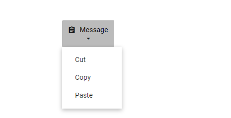

# Icons in Blazor Dropdown Menu Component

## Dropdown Menu icons

Icons help communicate each action in the Dropdown Menu more effectively. Apply an icon by setting the [IconCss](https://help.syncfusion.com/cr/blazor/Syncfusion.Blazor.SplitButtons.SfDropDownButton.html#Syncfusion_Blazor_SplitButtons_SfDropDownButton_IconCss) property to the required CSS class (for example, `e-icons e-message`). Syncfusion’s built-in icon font is added automatically when the Syncfusion theme stylesheet is referenced. By default, the icon appears on the left side of the button (IconPosition = `Left`). Change the placement using the [IconPosition](https://help.syncfusion.com/cr/blazor/Syncfusion.Blazor.SplitButtons.SfDropDownButton.html#Syncfusion_Blazor_SplitButtons_SfDropDownButton_IconPosition) property.

The following example renders one Dropdown Menu with the default icon position and another with the icon positioned above the content:

```cshtml
@using Syncfusion.Blazor.SplitButtons

<SfDropDownButton IconCss="e-icons e-message" content="Message">
    <DropDownMenuItems>
        <DropDownMenuItem Text="Edit"></DropDownMenuItem>
        <DropDownMenuItem Text="Delete"></DropDownMenuItem>
        <DropDownMenuItem Text="Mark as Read"></DropDownMenuItem>
        <DropDownMenuItem Text="Like Message"></DropDownMenuItem>
    </DropDownMenuItems>
</SfDropDownButton>
<SfDropDownButton IconCss="e-icons e-message" IconPosition="SplitButtonIconPosition.Top" Content="Message">
    <DropDownMenuItems>
        <DropDownMenuItem Text="Edit"></DropDownMenuItem>
        <DropDownMenuItem Text="Delete"></DropDownMenuItem>
        <DropDownMenuItem Text="Mark as Read"></DropDownMenuItem>
        <DropDownMenuItem Text="Like Message"></DropDownMenuItem>
    </DropDownMenuItems>
</SfDropDownButton>

<style>
    .e-message::before {
        content: '\e7cb';
    }
</style>

```


The [IconCss](https://help.syncfusion.com/cr/blazor/Syncfusion.Blazor.SplitButtons.SfDropDownButton.html#Syncfusion_Blazor_SplitButtons_SfDropDownButton_IconCss) property also supports third-party icon libraries. Ensure the corresponding icon font or stylesheet is available in the application.

### Vertical button

Create a vertical layout by applying the `e-vertical` class through the [CssClass](https://help.syncfusion.com/cr/blazor/Syncfusion.Blazor.SplitButtons.SfDropDownButton.html#Syncfusion_Blazor_SplitButtons_SfDropDownButton_CssClass) property. This stacks the icon above the text without changing the default IconPosition.

```cshtml
@using Syncfusion.Blazor.SplitButtons

<SfDropDownButton IconCss="e-icons e-message" CssClass="e-vertical" Content="Message">
    <DropDownMenuItems>
        <DropDownMenuItem Text="Cut"></DropDownMenuItem>
        <DropDownMenuItem Text="Copy"></DropDownMenuItem>
        <DropDownMenuItem Text="Paste"></DropDownMenuItem>
    </DropDownMenuItems>
</SfDropDownButton>

<style>
    .e-message::before {
        content: '\e7cb';
    }
</style>

```



## See also

* [Dropdown popup with icons](./popup-items#icons)
* [Customized icon size](./how-to/customize-icon-and-width)