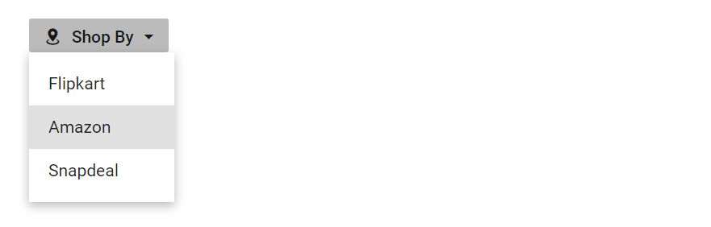
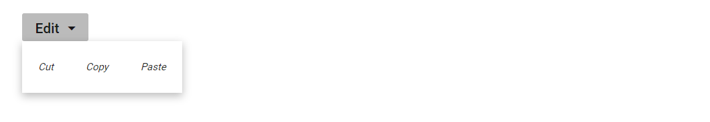
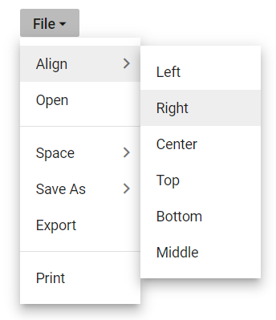

# Popup Items in Blazor Dropdown Menu Component

## Icons

Popup action items can display an icon or image to visually represent the action. To add an icon to a popup item, set the [IconCss](https://help.syncfusion.com/cr/blazor/Syncfusion.Blazor.SplitButtons.SfDropDownButton.html#Syncfusion_Blazor_SplitButtons_SfDropDownButton_IconCss) property to `e-icons` with the required icon CSS. By default, the icon is positioned to the left side of the popup action item.

In the following sample, the icons for edit, delete, mark as read and like message menu items are added using the `IconCss` property.

```cshtml
@using Syncfusion.Blazor.SplitButtons

<SfDropDownButton Content="Message" IconCss="e-icons e-message">
    <DropDownMenuItems>
        <DropDownMenuItem IconCss="e-icons e-edit" Text="Edit"></DropDownMenuItem>
        <DropDownMenuItem IconCss="e-icons e-delete" Text="Delete"></DropDownMenuItem>
        <DropDownMenuItem IconCss="e-icons e-like" Text="Like"></DropDownMenuItem>
    </DropDownMenuItems>
</SfDropDownButton>

<style>
    .e-message::before {
        content: '\e7cb';
    }

    .e-edit::before {
        content: '\e78f';
    }

    .e-delete::before {
        content: '\e773';
    }

    .e-like::before {
        content: '\e682';
    }

</style>

```


## Separator

Separators are horizontal lines used to group and visually separate the popup items. Separators are not selectable. You can enable separators to group the popup items using the [Separator](https://help.syncfusion.com/cr/blazor/Syncfusion.Blazor.SplitButtons.DropDownMenuItem.html#Syncfusion_Blazor_SplitButtons_DropDownMenuItem_Separator) property.

In the following sample, cut, copy, and paste popup items are grouped using the separator property:

```cshtml

@using Syncfusion.Blazor.SplitButtons

<SfDropDownButton Content="Clipboard">
    <DropDownMenuItems>
        <DropDownMenuItem Text="Cut"></DropDownMenuItem>
        <DropDownMenuItem Text="Copy"></DropDownMenuItem>
        <DropDownMenuItem Text="Paste"></DropDownMenuItem>
        <DropDownMenuItem Separator=true></DropDownMenuItem>
        <DropDownMenuItem Text="Font"></DropDownMenuItem>
        <DropDownMenuItem Text="Paragraph"></DropDownMenuItem>
    </DropDownMenuItems>
</SfDropDownButton>

```


## Navigations

Actions in Dropdown Menu can navigate to another web page when an action item is clicked. This can be achieved by providing a link to the action item using the [Url](https://help.syncfusion.com/cr/blazor/Syncfusion.Blazor.SplitButtons.DropDownMenuItem.html#Syncfusion_Blazor_SplitButtons_DropDownMenuItem_Url) property.

In the following sample, navigation URL for Flipkart, Amazon, and Snapdeal action items are added using the url property:

```cshtml

@using Syncfusion.Blazor.SplitButtons

<SfDropDownButton IconCss="e-icons e-shopping" Content="Shop By">
    <DropDownMenuItems>
        <DropDownMenuItem Text="Flipkart" Url="https://www.google.co.in/search?q=flipkart"></DropDownMenuItem>
        <DropDownMenuItem Text="Amazon" Url="https://www.google.co.in/search?q=amazon"></DropDownMenuItem>
        <DropDownMenuItem Text="Snapdeal" Url="https://www.google.co.in/search?q=snapdeal"></DropDownMenuItem>
    </DropDownMenuItems>
</SfDropDownButton>

<style>

.e-shopping::before {
    content: '\e7d0';
}

</style>

```



## Template

### Item Templating

Popup items can be customized using the [CssClass](https://help.syncfusion.com/cr/blazor/Syncfusion.Blazor.SplitButtons.SfDropDownButton.html#Syncfusion_Blazor_SplitButtons_SfDropDownButton_CssClass) property. The following example demonstrates customizing items with CSS:

```cshtml

<SfDropDownButton Content="Edit" CssClass="custom">
    <DropDownMenuItems>
        <DropDownMenuItem Text="Cut"></DropDownMenuItem>
        <DropDownMenuItem Text="Copy"></DropDownMenuItem>
        <DropDownMenuItem Text="Paste"></DropDownMenuItem>
    </DropDownMenuItems>
</SfDropDownButton>

<style>
  
    .custom li {
        float: left;
        font-size: 10px;
        padding-left: 50px;
        font-style: oblique;
    }
</style>

```



## Populate multilevel sub menu items

Populate multilevel submenu items in the Dropdown Menu by hosting a Context Menu component within the [PopupContent](https://help.syncfusion.com/cr/blazor/Syncfusion.Blazor.SplitButtons.SfDropDownButton.html#Syncfusion_Blazor_SplitButtons_SfDropDownButton_PopupContent) directive tag. This approach requires the Syncfusion.Blazor.Navigations package to use SfContextMenu.

```cshtml
@using Syncfusion.Blazor.Navigations
@using Syncfusion.Blazor.SplitButtons

<SfDropDownButton @ref="FileButton" Id="btnFileMenu" Content="File" CssClass="e-dropDown-button">
    <ChildContent>
        <DropDownButtonEvents Opened="Opened" Closed="Closed"></DropDownButtonEvents>
    </ChildContent>
    <PopupContent>
        <SfContextMenu @ref="ContextMenu" Items="FileMenuItems" TValue="ContextMenuItemModel" ShowItemOnClick="true">
            <MenuFieldSettings Text="Content"></MenuFieldSettings>
            <MenuEvents TValue="ContextMenuItemModel" OnClose="BeforeClose" Created="OnMenuCreated"></MenuEvents>
        </SfContextMenu>
    </PopupContent>
</SfDropDownButton>

@code {
    SfDropDownButton FileButton;
    SfContextMenu<ContextMenuItemModel> ContextMenu;

    private void BeforeClose(BeforeOpenCloseMenuEventArgs<ContextMenuItemModel> args)
    {
        if (args.ParentItem == null)
        {
            FileButton.Toggle();
        }
    }
    public class ContextMenuItemModel
    {
        public List<ContextMenuItemModel> Items { get; set; }
        public string Content { get; set; }
        public string Id { get; set; }
        public string IconCss { get; set; }
        public Boolean Separator { get; set; }
    }
    private List<ContextMenuItemModel> FileMenuItems = new List<ContextMenuItemModel>{
        new ContextMenuItemModel {Id ="FileMenuItemsNew", Content = "Align" , Items = new List<ContextMenuItemModel> {
            new ContextMenuItemModel { Content="Left" },
            new ContextMenuItemModel { Content="Right" },
            new ContextMenuItemModel { Content="Center" },
            new ContextMenuItemModel { Content="Top"},
            new ContextMenuItemModel { Content="Bottom" },
            new ContextMenuItemModel { Content="Middle"}
        }},
        new ContextMenuItemModel {Id ="FileMenuItemsOpen", Content = "Open" },
        new ContextMenuItemModel { Separator = true },
        new ContextMenuItemModel { Id ="FileMenuItemsSave",Content = "Space", Items = new List<ContextMenuItemModel> {
            new ContextMenuItemModel { Content="Double" },
            new ContextMenuItemModel { Content="Single" },
            new ContextMenuItemModel { Content="Small" },
            new ContextMenuItemModel { Content="Big"},
            new ContextMenuItemModel { Content="Large" },
        }},
        new ContextMenuItemModel { Id ="FileMenuItemsSaveAs",Content = "Save As", Items = new List<ContextMenuItemModel> {
            new ContextMenuItemModel { Content="PDF" },
            new ContextMenuItemModel { Content="Excel" },
            new ContextMenuItemModel { Content="Word" },
            new ContextMenuItemModel { Content=".XLS"},
        } },
        new ContextMenuItemModel {Id ="FileMenuItemsExport", Content = "Export"},
        new ContextMenuItemModel { Separator = true},
        new ContextMenuItemModel { Id ="FileMenuItemsPrint",Content = "Print" }
    };

    public async Task OnMenuCreated()
    {
        await ContextMenu.OpenAsync();
    }

    private void Opened()
    {
        
    }

    private void Closed()
    {

    }
}

```



N> [View Sample in GitHub](https://github.com/SyncfusionExamples/Populate-multilevel-sub-menu-items-in-Blazor-Dropdown-Menu)