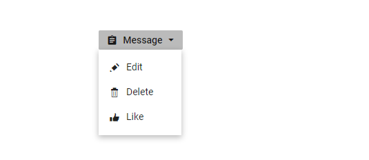
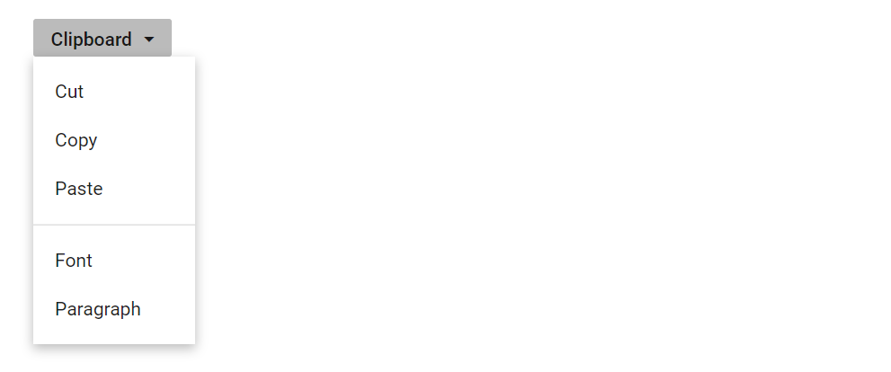

# Popup Items in Blazor Dropdown Menu Component

## Icons

The popup action item have an icon or image to provide visual representation of the action. To place the icon on a popup item, set the [`IconCss`](https://help.syncfusion.com/cr/blazor/Syncfusion.Blazor.SplitButtons.SfDropDownButton.html#Syncfusion_Blazor_SplitButtons_SfDropDownButton_IconCss) property to `e-icons` with the required icon CSS. By default, the icon is positioned to the left side of the popup action item.

In the following sample, the icons for edit, delete, mark as read  and like message menu items are added using the `IconCss` property.

```cshtml
@using Syncfusion.Blazor.SplitButtons

<SfDropDownButton Content="Message" IconCss="e-icons e-message">
    <DropDownMenuItems>
        <DropDownMenuItem IconCss="e-icons e-edit" Text="Edit"></DropDownMenuItem>
        <DropDownMenuItem IconCss="e-icons e-delete" Text="Delete"></DropDownMenuItem>
        <DropDownMenuItem IconCss="e-icons e-like" Text="Like"></DropDownMenuItem>
    </DropDownMenuItems>
</SfDropDownButton>

<style>
    .e-message::before {
        content: '\e7cb';
    }

    .e-edit::before {
        content: '\e78f';
    }

    .e-delete::before {
        content: '\e773';
    }

    .e-like::before {
        content: '\e682';
    }

</style>

```

Output be like



## Separator

The Separators are the horizontal lines that are used to separate the popup items. You `cannot` select the separators. You can enable separators to group the popup items using the [`Separator`](https://help.syncfusion.com/cr/blazor/Syncfusion.Blazor.SplitButtons.DropDownMenuItem.html#Syncfusion_Blazor_SplitButtons_DropDownMenuItem_Separator) property.

In the following sample, cut, copy, and paste popup items are grouped using the separator property:

```cshtml

@using Syncfusion.Blazor.SplitButtons

<SfDropDownButton Content="Clipboard">
    <DropDownMenuItems>
        <DropDownMenuItem Text="Cut"></DropDownMenuItem>
        <DropDownMenuItem Text="Copy"></DropDownMenuItem>
        <DropDownMenuItem Text="Paste"></DropDownMenuItem>
        <DropDownMenuItem Separator=true></DropDownMenuItem>
        <DropDownMenuItem Text="Font"></DropDownMenuItem>
        <DropDownMenuItem Text="Paragraph"></DropDownMenuItem>
    </DropDownMenuItems>
</SfDropDownButton>

```

Output be like



## Navigations

Actions in Dropdown Menu can be used to navigate to the other web page when action item is clicked. This can be achieved by providing link to the action item using [`url`](https://help.syncfusion.com/cr/blazor/Syncfusion.Blazor.SplitButtons.DropDownMenuItem.html#Syncfusion_Blazor_SplitButtons_DropDownMenuItem_Url) property.

In the following sample, navigation URL for Flipkart, Amazon, and Snapdeal action items are added using the url property:

```cshtml

@using Syncfusion.Blazor.SplitButtons

<SfDropDownButton IconCss="e-icons e-shopping" Content="Shop By">
    <DropDownMenuItems>
        <DropDownMenuItem Text="Flipkart" Url="https://www.google.co.in/search?q=flipkart"></DropDownMenuItem>
        <DropDownMenuItem Text="Amazon" Url="https://www.google.co.in/search?q=amazon"></DropDownMenuItem>
        <DropDownMenuItem Text="Snapdeal" Url="https://www.google.co.in/search?q=snapdeal"></DropDownMenuItem>
    </DropDownMenuItems>
</SfDropDownButton>

<style>

.e-shopping::before {
    content: '\e7d0';
}

</style>

```

Output be like


## Template

### Item Templating

Popup items can be customized using the `CssClass` property. We have customize the items using CSS style.

```cshtml

<SfDropDownButton Content="Edit" CssClass="custom">
    <DropDownMenuItems>
        <DropDownMenuItem Text="Cut"></DropDownMenuItem>
        <DropDownMenuItem Text="Copy"></DropDownMenuItem>
        <DropDownMenuItem Text="Paste"></DropDownMenuItem>
    </DropDownMenuItems>
</SfDropDownButton>

<style>
  
    .custom li {
        float: left;
        font-size: 10px;
        padding-left: 50px;
        font-style: oblique;
    }
</style>

```

Output be like

