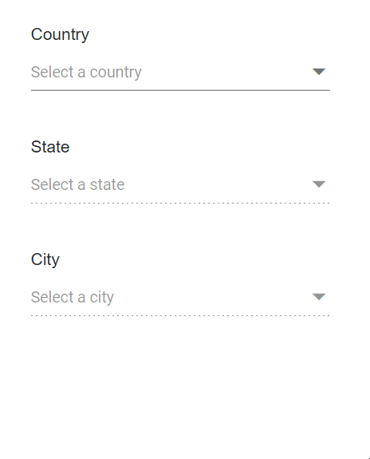

# Cascading in Dropdown List

Cascading refers to configuring two or more DropDownList components so that the available options in a child list depend on the selected value of its parent. This pattern is commonly used for parent–child lookups such as Country → State/Province → City.

In the [ValueChange](https://help.syncfusion.com/cr/blazor/Syncfusion.Blazor.DropDowns.DropDownListEvents-2.html#Syncfusion_Blazor_DropDowns_DropDownListEvents_2_ValueChange) event handler of the first DropDownList, load the data for the second DropDownList based on the selected value of the first DropDownList. Apply the same approach between the second and third DropDownLists.

To get started quickly with cascading in the Blazor DropDown List component, you can check the video below.



In the following sample, selecting a country in the first DropDownList loads its states into the second list, and selecting a state loads its cities into the third list.







N> [View Sample in Demo](https://blazor.syncfusion.com/demos/dropdown-list/cascading?theme=bootstrap5).