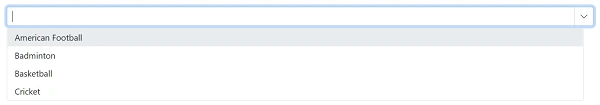

# Customization in Blazor Dropdown List

## Open Dropdown list dropdown on focus

Automatically open the dropdown by using [ShowPopupAsync()](https://help.syncfusion.com/cr/blazor/Syncfusion.Blazor.DropDowns.SfDropDownList-2.html#Syncfusion_Blazor_DropDowns_SfDropDownList_2_ShowPopupAsync) method on [Focus](https://help.syncfusion.com/cr/blazor/Syncfusion.Blazor.DropDowns.DropDownListEvents-2.html#Syncfusion_Blazor_DropDowns_DropDownListEvents_2_Focus) event. The `ShowPopupAsync()` method opens the popup that displays the list of items.

```cshtml
@using Syncfusion.Blazor.DropDowns

<SfDropDownList @ref=@popup TItem="GameFields" TValue="string" DataSource="@Games">
    <DropDownListEvents  TItem="GameFields" TValue="string" Focus="@FocusHandler"></DropDownListEvents>
    <DropDownListFieldSettings Text="Text" Value="ID"></DropDownListFieldSettings>
</SfDropDownList>

@code {
    public class GameFields
    {
        public string ID { get; set; }
        public string Text { get; set; }
    }
    SfDropDownList<string, GameFields> popup;
    private List<GameFields> Games = new List<GameFields>() {
        new GameFields(){ ID= "Game1", Text= "American Football" },
        new GameFields(){ ID= "Game2", Text= "Badminton" },
        new GameFields(){ ID= "Game3", Text= "Basketball" },
        new GameFields(){ ID= "Game4", Text= "Cricket" },
     };

    private void FocusHandler()
    {
        popup.ShowPopupAsync();
       
    }
}
```



## Render popup in a custom container

Use the `AppendTo` property to render the DropDownList popup inside a specific container instead of the default `document.body`. This is useful when the component is placed inside dialogs, side panels, containers with overflow restrictions, or custom stacking contexts.

Specify a valid CSS selector in the `AppendTo` property. When the selector matches an element, the popup is appended to that element. If the selector is null, empty, or no matching element is found, the popup is rendered in the default location.



<div id="popupHost"></div>

<SfDropDownList TValue="string"
                TItem="GameFields"
                DataSource="@Games"
                AppendTo="#popupHost"
                Placeholder="Select a game">
    <DropDownListFieldSettings Text="Text" Value="ID"></DropDownListFieldSettings>
</SfDropDownList>

@code {
    public class GameFields
    {
        public string ID { get; set; }
        public string Text { get; set; }
    }

    private List<GameFields> Games = new()
    {
        new GameFields { ID = "Game1", Text = "American Football" },
        new GameFields { ID = "Game2", Text = "Badminton" },
        new GameFields { ID = "Game3", Text = "Basketball" },
        new GameFields { ID = "Game4", Text = "Cricket" }
    };
}



N> The `AppendTo` property accepts a CSS selector such as `#elementId` or `.container`. If the specified element is not found, the popup is rendered in `document.body`.