# Data Binding in Dropdown List

The DropDown List component supports binding data from local collections and remote services. Use the [DataSource](https://help.syncfusion.com/cr/blazor/Syncfusion.Blazor.DropDowns.SfDropDownBase-1.html#Syncfusion_Blazor_DropDowns_SfDropDownBase_1_DataSource) property to bind local data or configure a [DataManager](https://help.syncfusion.com/cr/blazor/Syncfusion.Blazor.DataManager.html) for remote data operations. Map fields using the component’s FieldSettings to specify which properties supply item text and value.

* **TItem** - Specifies the type of the data items bound to the component (the model of each item). Use TValue to specify the value type selected by the component. Configure Fields to map Text and Value from the data model.

## Binding local data

The DropDown List loads data from local sources through the [DataSource](https://help.syncfusion.com/cr/blazor/Syncfusion.Blazor.DropDowns.SfDropDownBase-1.html#Syncfusion_Blazor_DropDowns_SfDropDownBase_1_DataSource) property. Supported types include `Array of primitive type`, `Array of object`, `List of primitive type`, `List of object`, `ObservableCollection`, `ExpandoObject`, and `DynamicObject`. Map data fields via FieldSettings when binding objects.







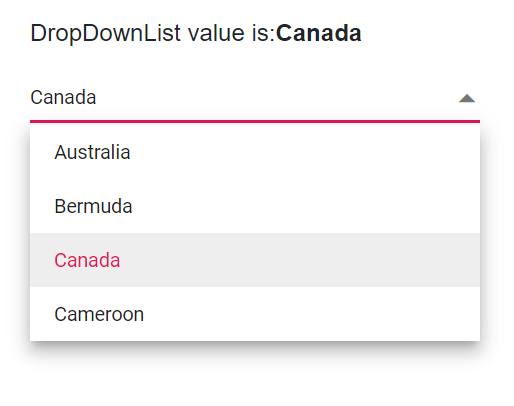

### DataBound event

The [DataBound](https://help.syncfusion.com/cr/blazor/Syncfusion.Blazor.DropDowns.DropDownListEvents-2.html#Syncfusion_Blazor_DropDowns_DropDownListEvents_2_DataBound) event triggers after the data source is populated and the popup list is ready. This is useful for post-load logic such as selecting a default item or updating UI state.







### Primitive type

Bind arrays or lists of `string`, `int`, `double`, or `bool` directly. In these cases, Text and Value map to the primitive values.

The following code demonstrates an array of string values bound to the DropDown List component.







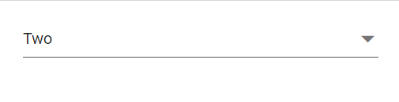

The following code demonstrates an array of integer values bound to the DropDown List component.








### Complex data type

Bind arrays or lists of complex objects and map object properties to display text and value using [Fields](https://help.syncfusion.com/cr/blazor/Syncfusion.Blazor.DropDowns.FieldSettingsModel.html). Nested properties can be mapped as needed.

In the following example, `Code.ID` is mapped to [DropDownListFieldSettings.Value](https://help.syncfusion.com/cr/blazor/Syncfusion.Blazor.DropDowns.FieldSettingsModel.html#Syncfusion_Blazor_DropDowns_FieldSettingsModel_Value) and `Country.CountryID` is mapped to [DropDownListFieldSettings.Text](https://help.syncfusion.com/cr/blazor/Syncfusion.Blazor.DropDowns.FieldSettingsModel.html#Syncfusion_Blazor_DropDowns_FieldSettingsModel_Text).







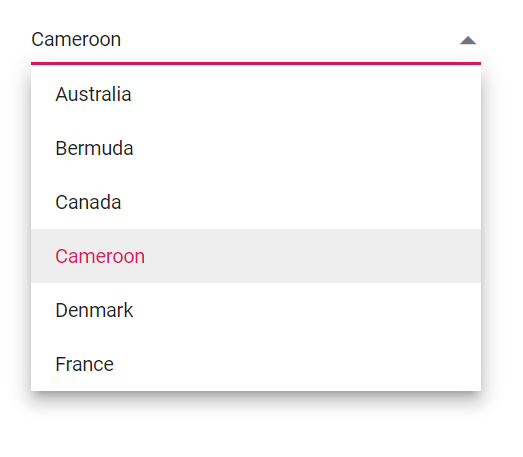

### Expando object binding

Bind [ExpandoObject](https://learn.microsoft.com/en-us/dotnet/api/system.dynamic.expandoobject?view=net-8.0) data to the DropDown List component. Ensure the dynamic member names match the field mappings configured in FieldSettings.







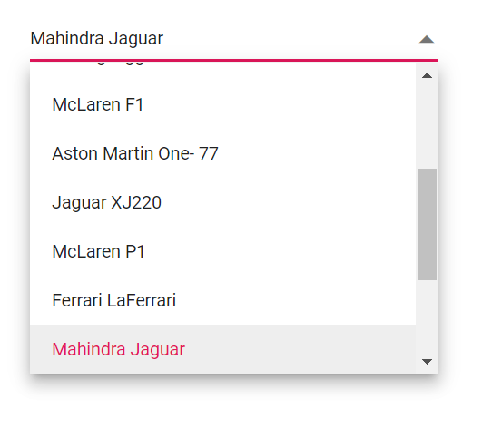

### Observable collection binding

Bind an [ObservableCollection](https://blazor.syncfusion.com/documentation/common/data-binding/data-updates#observable-collection) to reflect add/remove updates in the DropDown List automatically. This is useful when items change over time and the UI must stay in sync.







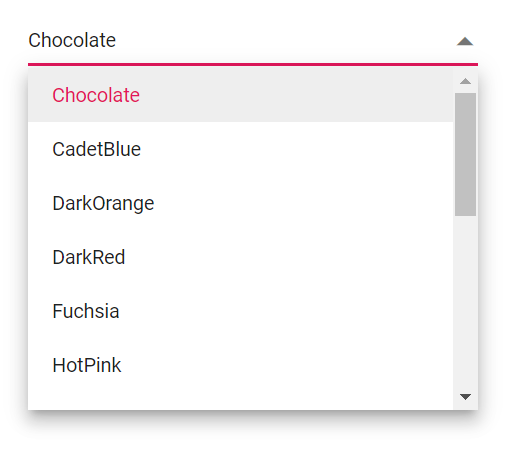

### Dynamic object binding

Bind [DynamicObject](https://learn.microsoft.com/en-us/dotnet/api/system.dynamic.dynamicobject?view=net-8.0) data to the DropDown List component. As with ExpandoObject, ensure member names correspond to the mapped Text and Value fields.







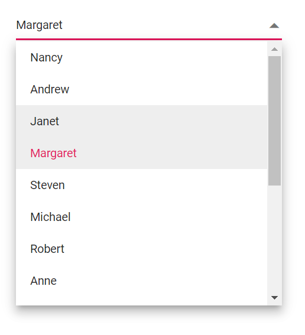

### Enum data binding

Bind enum values to the DropDown List. The following example shows how to display a description for each enumeration value.







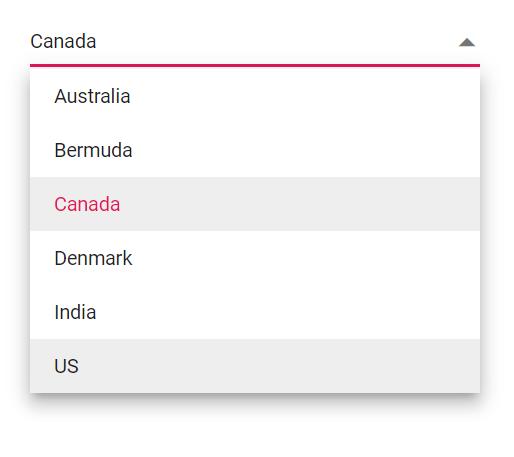

### ValueTuple data binding

Bind [ValueTuple](https://learn.microsoft.com/en-us/dotnet/api/system.valuetuple-2?view=net-8.0) data to the DropDown List component. The following example shows retrieving a string value from enumeration data using a `ValueTuple`.







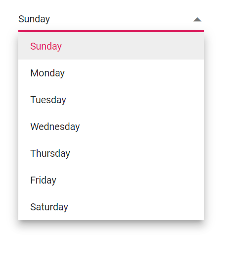

## Binding remote data 

The DropDown List can load data from remote services using the [DataSource](https://help.syncfusion.com/cr/blazor/Syncfusion.Blazor.DropDowns.SfDropDownBase-1.html#Syncfusion_Blazor_DropDowns_SfDropDownBase_1_DataSource) property in combination with [DataManager](https://blazor.syncfusion.com/documentation/data/getting-started). Use the [Query](https://help.syncfusion.com/cr/blazor/Syncfusion.Blazor.DropDowns.SfDropDownBase-1.html#Syncfusion_Blazor_DropDowns_SfDropDownBase_1_Query) property to shape, filter, sort, and page data from the service.

* [DataManager.Url](https://help.syncfusion.com/cr/blazor/Syncfusion.Blazor.DataManager.html#Syncfusion_Blazor_DataManager_Url) - Defines the service endpoint used to fetch data.
* [DataManager.Adaptor](https://help.syncfusion.com/cr/blazor/Syncfusion.Blazor.DataManager.html#Syncfusion_Blazor_DataManager_Adaptor) - Defines how requests and responses are processed. By default, the [ODataAdaptor](https://blazor.syncfusion.com/documentation/data/adaptors#odata-adaptor) is used for remote binding.
* [Syncfusion.Blazor.Data](https://www.nuget.org/packages/Syncfusion.Blazor.Data/) provides built-in adaptors to interact with specific service endpoints.

### OnActionBegin event

The [OnActionBegin](https://help.syncfusion.com/cr/blazor/Syncfusion.Blazor.DropDowns.DropDownListEvents-2.html#Syncfusion_Blazor_DropDowns_DropDownListEvents_2_OnActionBegin) event triggers before a remote request is initiated. Use it to adjust the query or set a loading indicator.







### OnActionComplete event

The [OnActionComplete](https://help.syncfusion.com/cr/blazor/Syncfusion.Blazor.DropDowns.DropDownListEvents-2.html#Syncfusion_Blazor_DropDowns_DropDownListEvents_2_OnActionComplete) event triggers after data is fetched successfully. Handle it to apply post-load logic or update UI state.







### OnActionFailure event

The [OnActionFailure](https://help.syncfusion.com/cr/blazor/Syncfusion.Blazor.DropDowns.DropDownListEvents-2.html#Syncfusion_Blazor_DropDowns_DropDownListEvents_2_OnActionFailure) event triggers when a remote request fails. Use it to log errors and provide fallback messaging (for example, show NoRecordsTemplate content).







### OData v4 services

The [OData v4 Adaptor](https://blazor.syncfusion.com/documentation/data/adaptors#odatav4-adaptor) enables consumption and manipulation of OData v4 services. The following sample displays the first six customer records from the `Customers` table of the `Northwind` data service.







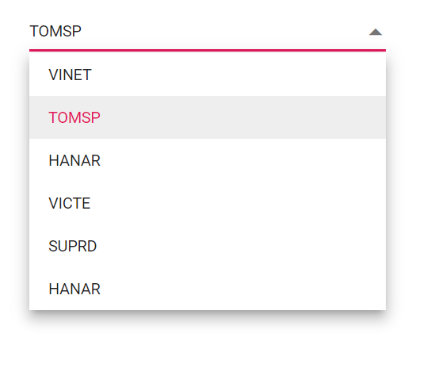

### Web API adaptor

The [Web API Adaptor](https://blazor.syncfusion.com/documentation/data/adaptors#web-api-adaptor) interacts with Web API endpoints that follow OData query semantics. `WebApiAdaptor` extends the [ODataAdaptor](https://blazor.syncfusion.com/documentation/data/adaptors#odata-adaptor), so the endpoint must understand OData-formatted queries.







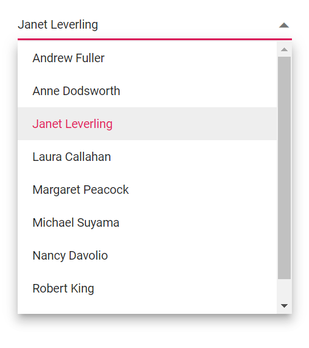

### Custom adaptor

The [SfDataManager](https://help.syncfusion.com/cr/aspnetcore-blazor/Syncfusion.Blazor.Data.SfDataManager.html) has custom adaptor support which allows you to perform manual operations on the data. This can be utilized for implementing customize data binding and editing operations in the DropDownList component.

For implementing custom data binding in the DropDownList, the `DataAdaptor` class is used. This abstract class acts as a base class for the custom adaptor.

The `DataAdaptor` abstract class has both synchronous and asynchronous method signatures, which can be overridden in the custom adaptor. Following are the method signatures present in this class.

```csharp
public abstract class DataAdaptor
{
    /// <summary>
    /// Performs data Read operation synchronously.
    /// </summary>
    public virtual object Read(DataManagerRequest dataManagerRequest, string key = null)

    /// <summary>
    /// Performs data Read operation asynchronously.
    /// </summary>
    public virtual Task<object> ReadAsync(DataManagerRequest dataManagerRequest, string key = null)
}
```

In a custom adaptor, return the data collection (and count when needed) based on the incoming `DataManagerRequest`. This approach is useful for custom back ends or complex filtering/paging scenarios.







### Offline mode

To reduce network requests, load all data at initialization and process actions on the client by setting the `Offline` property on `DataManager`. Use this for datasets that fit in memory and do not change frequently.








### Entity Framework

Follow these steps to consume data from the [Entity Framework](https://blazor.syncfusion.com/documentation/common/data-binding/bind-entity-framework) in the DropDown List component.

#### Create DBContext class

Create a DbContext class (`OrderContext`) to connect to Microsoft SQL Server.

```csharp
using Microsoft.EntityFrameworkCore;
using System;
using System.Collections.Generic;
using System.Linq;
using System.Threading.Tasks;
using EFDropDown.Shared.Models;

namespace EFDropDown.Shared.DataAccess
{
    public class OrderContext : DbContext
    {
        public virtual DbSet<Shared.Models.Order> Orders { get; set; }

        protected override void OnConfiguring(DbContextOptionsBuilder optionsBuilder)
        {
            if (!optionsBuilder.IsConfigured)
            {
                optionsBuilder.UseSqlServer(@"Data Source=(LocalDB)\MSSQLLocalDB;AttachDbFilename=D:\Blazor\DropDownList\EFDropDown\Shared\App_Data\NORTHWND.MDF;Integrated Security=True;Connect Timeout=30");
            }
        }
    }
}
```

#### Create data access layer to perform data operation

Create a data access class (`OrderDataAccessLayer`) to retrieve records from the database.

```csharp
using Microsoft.EntityFrameworkCore;
using System;
using System.Collections.Generic;
using System.Linq;
using System.Threading.Tasks;
using EFDropDown.Shared.Models;

namespace EFDropDown.Shared.DataAccess
{
    public class OrderDataAccessLayer
    {
        OrderContext db = new OrderContext();

        //To Get all Orders details
        public DbSet<Order> GetAllOrders()
        {
            try
            {
                return db.Orders;
            }
            catch
            {
                throw;
            }
        }
    }
}
```

#### Creating web API controller

Create a Web API controller to expose the data for the DropDown List to consume.

```csharp
using EFDropDown.Shared.DataAccess;
using EFDropDown.Shared.Models;
using Microsoft.AspNetCore.Mvc;
using Microsoft.Extensions.Primitives;
using System;
using System.Collections.Generic;
using System.Linq;
using System.Threading.Tasks;
using System.Web;
using Microsoft.AspNetCore.Http;

namespace EFDropDown.Controllers
{
    [Route("api/[controller]")]
    [ApiController]
    //TreeGrid
    public class DefaultController : ControllerBase
    {
        OrderDataAccessLayer db = new OrderDataAccessLayer();
        [HttpGet]
        public object Get()
        {
            IQueryable<Order> data = db.GetAllOrders().AsQueryable();
            var count = data.Count();
            var queryString = Request.Query;
            if (queryString.Keys.Contains("$inlinecount"))
            {
                StringValues Skip;
                StringValues Take;
                int skip = (queryString.TryGetValue("$skip", out Skip)) ? Convert.ToInt32(Skip[0]) : 0;
                int top = (queryString.TryGetValue("$top", out Take)) ? Convert.ToInt32(Take[0]) : data.Count();
                return new { Items = data.Skip(skip).Take(top), Count = count };
            }
            else
            {
                return data;
            }
         }
    }
}
```

### Configure DropDownList component using Web API adaptor

Configure the DropDown List to interact with the Web API using [SfDataManager](https://blazor.syncfusion.com/documentation/data/getting-started) and the [WebApiAdaptor](https://blazor.syncfusion.com/documentation/data/adaptors#web-api-adaptor). Ensure the API supports OData-style query parameters.







## Adding new items

Use [AddItemsAsync](https://help.syncfusion.com/cr/blazor/Syncfusion.Blazor.DropDowns.SfDropDownBase-1.html#Syncfusion_Blazor_DropDowns_SfDropDownBase_1_AddItemsAsync_System_Collections_Generic_IEnumerable__0__System_Nullable_System_Int32__) to add new items to the popup list without altering the underlying data source. To persist new items, also update your bound collection or remote data source.







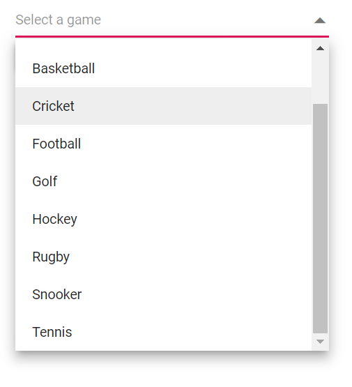

## Getting datasource of dropdown list

### Getting datasource using instance

To retrieve the data source from a Syncfusion<sup style="font-size:70%">&reg;</sup> Blazor DropDownList component, you can access the `DataSource` property of the component instance. An example of how this can be done is by binding the component to a list of objects as its data source and then, in the button click event, calling the `GetDataSource` method which in turn retrieves the data source by accessing the DataSource property of the DropDownList instance.







### Getting datasource using variable

To obtain the data source for a Syncfusion<sup style="font-size:70%">&reg;</sup> Blazor DropDownList using a variable, you can define a variable in your component to hold the data source, and then use this variable to access the data source. In this example, the `GetDataSource` method is triggered when the button is clicked. This method retrieves the data source for the DropDownList by accessing the Countries variable, which holds the list of countries for the DropDownList.





