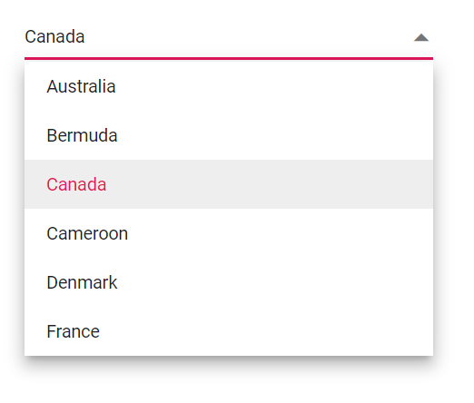
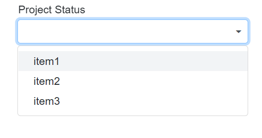

# Data Binding in Blazor DropDown List Component

Data binding can be achieved by using the `bind-Value` attribute and it supports string, int, Enum and bool types. If component value has been changed, it will affect all the places where you bind the variable for the **bind-value** attribute.

```cshtml
@using Syncfusion.Blazor.DropDowns

<p>DropDownList value is:<strong>@DropVal</strong></p>

<SfDropDownList TValue="string" Placeholder="e.g. Australia" TItem="Country" @bind-Value="@DropVal" DataSource="@Countries">
    <DropDownListFieldSettings Value="Name"></DropDownListFieldSettings>
</SfDropDownList>

@code {

    public string DropVal;

    public class Country
    {
        public string Name { get; set; }

        public string Code { get; set; }
    }

    List<Country> Countries = new List<Country>
{
        new Country() { Name = "Australia", Code = "AU" },
        new Country() { Name = "Bermuda", Code = "BM" },
        new Country() { Name = "Canada", Code = "CA" },
        new Country() { Name = "Cameroon", Code = "CM" },
    };
}
```

## Index Value Binding

Index value binding can be achieved by using `bind-Index` attribute and it supports int and int nullable types. By using this attribute you can bind the values respective to its index.

```cshtml
@using Syncfusion.Blazor.DropDowns

<SfAutoComplete TValue="string" Placeholder="e.g. Australia" TItem="Country" @bind-Index="@ddlIndex" DataSource="@Countries">
    <AutoCompleteFieldSettings Value="Name"></AutoCompleteFieldSettings>
</SfAutoComplete>

@code {

    private int? ddlIndex { get; set; } = 1;

    public class Country
    {
        public string Name { get; set; }

        public string Code { get; set; }
    }

    List<Country> Countries = new List<Country>
{
        new Country() { Name = "Australia", Code = "AU" },
        new Country() { Name = "Bermuda", Code = "BM" },
        new Country() { Name = "Canada", Code = "CA" },
        new Country() { Name = "Cameroon", Code = "CM" },
    };
}
```

## Get the datasource of dropdown list

You can get the datasource from the component instance. In the below sample rendered with button click in which you will get the data form component instance.







## Events

### DataBound

The [DataBound](https://help.syncfusion.com/cr/blazor/Syncfusion.Blazor.DropDowns.DropDownListEvents-2.html#Syncfusion_Blazor_DropDowns_DropDownListEvents_2_DataBound) event triggers when the data source is populated in the popup list. After datasource is loaded databound event is triggered







### OnActionBegin

The [OnActionBegin](https://help.syncfusion.com/cr/blazor/Syncfusion.Blazor.DropDowns.DropDownListEvents-2.html#Syncfusion_Blazor_DropDowns_DropDownListEvents_2_OnActionBegin) event triggers before fetching data from the remote server.







### OnActionComplete

The [OnActionComplete](https://help.syncfusion.com/cr/blazor/Syncfusion.Blazor.DropDowns.DropDownListEvents-2.html#Syncfusion_Blazor_DropDowns_DropDownListEvents_2_OnActionComplete) event triggers after data is fetched successfully from the remote server. After datasource is loaded databound event is triggered







### OnActionFailure

The [OnActionFailure](https://help.syncfusion.com/cr/blazor/Syncfusion.Blazor.DropDowns.DropDownListEvents-2.html#Syncfusion_Blazor_DropDowns_DropDownListEvents_2_OnActionFailure) event triggers when the data fetch request from the remote server fails.








### Complex data type

#### Customizing TItem using action keyword

In the following code snippet, action keyword is using in the TItem of the dropdown list.









#### Injectable datasource on OnInitialized

The following code demonstratesto fetch the datasource from the service in the [OnInitialized]([OnInitializedAsync](https://learn.microsoft.com/en-us/aspnet/core/blazor/components/lifecycle?view=aspnetcore-6.0#component-initialization-oninitializedasync)) lifecycle method.










    public class CountryService
    {
        public async Task<List<string>> GetDataAsync() {
            List<string> Values = new List<string> { "item1", "item2", "item3" };

            return await Task.FromResult(Values);
        }
    }







