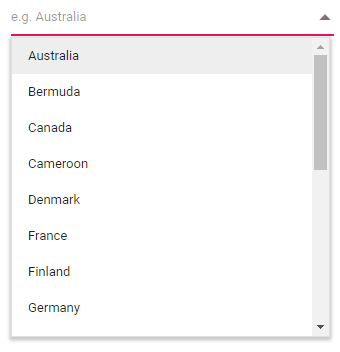
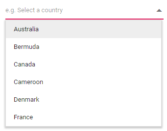
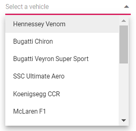
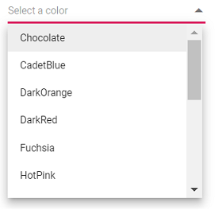
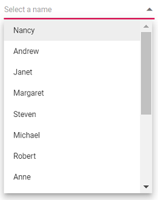
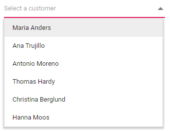
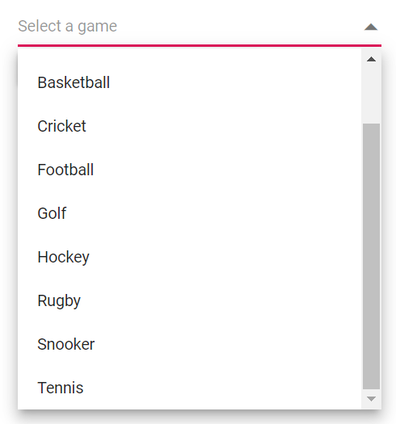

# Data Binding in Blazor DropDown List Component

The DropDownList loads the data either from local data sources or remote data services using the [DataSource](https://help.syncfusion.com/cr/blazor/Syncfusion.Blazor.DropDowns.SfDropDownBase-1.html#Syncfusion_Blazor_DropDowns_SfDropDownBase_1_DataSource) property. It supports the data type of `array` or [DataManager](https://help.syncfusion.com/cr/blazor/Syncfusion.Blazor.DataManager.html).

The **TValue** used to specifies the type of the type parameter TValue for the DropDownList component. The **TItem** used to specifies the type of the type parameter TItem for the DropDownList component. The 

The DropDownList also supports different kinds of data services such as OData, OData V4, and Web API, and data formats such as XML, JSON, and JSONP with the help of [DataManager](https://help.syncfusion.com/cr/aspnetcore-js2) adaptors.

| Fields | Type | Description |
|------|------|-------------|
| Text |  `string` | Specifies the display text of each list item. |
| Value |  `int or string` | Specifies the hidden data value mapped to each list item that should contain a unique value. |
| GroupBy |  `string` | Specifies the category under which the list item has to be grouped. |
| IconCss |  `string` | Specifies the icon class of each list item. |

> When binding complex data to the DropDownList, fields should be mapped correctly. Otherwise, the selected item remains undefined.

## Binding local data

You can bind the local data to the DropDownList component as mentioned in the below way.

### Array of JSON data

The DropDownList can generate its list items through an array of complex data. For this, the appropriate columns should be mapped to the [Fields](https://help.syncfusion.com/cr/blazor/Syncfusion.Blazor.DropDowns.FieldSettingsModel.html) property.

In the following example, `Name` column from complex data has been mapped to the `Value` field.







The output will be as follows.



## Primitive type

You can bind the data to the DropDownList as a list of string, int, double and bool type items.

The following code demonstrates array of string and integer values to the DropDownList component.













## Complex data type

The DropDownList can generate its list items through an array of complex data. For this, the appropriate columns should be mapped to the [Fields](https://help.syncfusion.com/cr/blazor/Syncfusion.Blazor.DropDowns.FieldSettingsModel.html) property.

In the following example, `Code.ID` column and `Country.CountryID` column from complex data have been mapped to the `Value` field and `Text` field, respectively.







The output will be as follows.



## Expando object binding

You can bind [ExpandoObject](https://docs.microsoft.com/en-us/dotnet/api/system.dynamic.expandoobject?view=net-5.0) data to the DropDownList component. The following example `ExpandoObject` is bound to the collection of vehicles data.







The output will be as follows,



## Observable collection binding

You can bind [ObservableCollection](https://docs.microsoft.com/en-us/dotnet/api/system.collections.objectmodel.observablecollection-1?view=net-5.0) data to the DropDownList component. In the following example, `Observable Data` is bound to a collection of colors data.







The output will be as follows,



## Dynamic object binding

You can bind [DynamicObject](https://docs.microsoft.com/en-us/dotnet/api/system.dynamic.dynamicobject?view=net-5.0) data to the DropDownList component. The following example `DynamicObject` is bound to the collection of customers data.







The output will be as follows,



## Enum data binding

You can bind enum data to DropDownList component. The following code helps you get a description value from the enumeration data.







The output will shown as follows,


## ValueTuple data binding

You can bind [ValueTuple](https://docs.microsoft.com/en-us/dotnet/api/system.valuetuple-2?view=net-5.0) data to the DropDownList component. The following code helps you to get a string value from the enumeration data by using [ValueTuple](https://docs.microsoft.com/en-us/dotnet/api/system.valuetuple-2?view=net-5.0).





@using Syncfusion.Blazor.DropDowns;

<SfDropDownList TItem="(DayOfWeek, string)" Width="250px" TValue="DayOfWeek"
                DataSource="@(Enum.GetValues<DayOfWeek>().Select(e => (e, e.ToString())))">
    <DropDownListFieldSettings Value="Item1" Text="Item2" />
</SfDropDownList>




The output will be as follows,


## Binding Remote data

The DropDownList supports retrieval of data from remote data services with the help of [DataManager](https://help.syncfusion.com/cr/aspnetcore-blazor/Syncfusion.Blazor.DataManager.html) control. The [Query](https://help.syncfusion.com/cr/blazor/Syncfusion.Blazor.DropDowns.SfDropDownBase-1.html#Syncfusion_Blazor_DropDowns_SfDropDownBase_1_Query) property is used to fetch data from the database and bind it to the DropDownList.

### OData v4 services

[OData v4 Adaptor](https://help.syncfusion.com/cr/blazor/Syncfusion.Blazor.Adaptors.html#Syncfusion_Blazor_Adaptors_ODataV4Adaptor) provies ability to consume and manipulate data from OData v4 services. The following sample displays the first 6 contacts from **Customers** table of the `Northwind` Data Service.







The output will be as follows.



### Web API Adaptor

You can use the [WebApiAdaptor](https://help.syncfusion.com/cr/blazor/Syncfusion.Blazor.Adaptors.html#Syncfusion_Blazor_Adaptors_WebApiAdaptor) to interact with Web APIs created with OData endpoint. The WebApiAdaptor is extended from the ODataAdaptor. Hence to use WebApiAdaptor, the endpoint should understand the OData formatted queries sent along with request. 







The output will be as follows.


### Custom Adaptor

The [SfDataManager](https://help.syncfusion.com/cr/aspnetcore-blazor/Syncfusion.Blazor.Data.SfDataManager.html) has [custom adaptor support](https://help.syncfusion.com/cr/blazor/Syncfusion.Blazor.Adaptors.html#Syncfusion_Blazor_Adaptors_CustomAdaptor) which allows you to perform manual operations on the data. This can be utilized for implementing custom data binding and editing operations in the DropDownList component.

For implementing custom data binding in DropDownList, the `DataAdaptor` class is used. This abstract class acts as a base class for the custom adaptor.

The `DataAdaptor` abstract class has both synchronous and asynchronous method signatures which can be overridden in the custom adaptor. Following are the method signatures present in this class,

```csharp
public abstract class DataAdaptor
{
    /// <summary>
    /// Performs data Read operation synchronously.
    /// </summary>
    public virtual object Read(DataManagerRequest dataManagerRequest, string key = null)

    /// <summary>
    /// Performs data Read operation asynchronously.
    /// </summary>
    public virtual Task<object> ReadAsync(DataManagerRequest dataManagerRequest, string key = null)
}
```

The custom data binding can be performed in the DropDownList component by providing the custom adaptor class and overriding the Read or ReadAsync method of the DataAdaptor abstract class.

The following sample code demonstrates implementing custom data binding using custom adaptor,







### Offline mode

To avoid post back for every action, set the DropDownList to load all data on initialization and make the actions process in client-side. To enable this behavior, use the `Offline` property of `DataManager`.

The following example for remote data binding and enabled offline mode.







The output will be as follows.


## Entity Framework

Entity Framework is an open-source object-relational mapper (O/RM) from Microsoft. Entity Framework works with many databases. But here, we are going to discuss the step-by-step procedure to create an Entity Framework using the MS SQL Server database and connect it to the DropDownList component to perform operations in a Blazor Server Application. Please refer [this](https://blazor.syncfusion.com/documentation/common/data-binding/bind-entity-framework) documentation to know more about Entity framework.

You need to follow the below steps to consume data from the **Entity Framework** in the DropDownList component.

### Create DBContext class

The first step is to create a DBContext class called **OrderContext** to connect to a Microsoft SQL Server database.

```csharp
using Microsoft.EntityFrameworkCore;
using System;
using System.Collections.Generic;
using System.Linq;
using System.Threading.Tasks;
using EFDropDown.Shared.Models;

namespace EFDropDown.Shared.DataAccess
{
    public class OrderContext : DbContext
    {
        public virtual DbSet<Shared.Models.Order> Orders { get; set; }

        protected override void OnConfiguring(DbContextOptionsBuilder optionsBuilder)
        {
            if (!optionsBuilder.IsConfigured)
            {
                optionsBuilder.UseSqlServer(@"Data Source=(LocalDB)\MSSQLLocalDB;AttachDbFilename=D:\Blazor\DropDownList\EFDropDown\Shared\App_Data\NORTHWND.MDF;Integrated Security=True;Connect Timeout=30");
            }
        }
    }
}
```

### Create data access layer

Now, you need to create a class named **OrderDataAccessLayer**, which act as data access layer for retrieving the records from the database table.

```csharp
using Microsoft.EntityFrameworkCore;
using System;
using System.Collections.Generic;
using System.Linq;
using System.Threading.Tasks;
using EFDropDown.Shared.Models;

namespace EFDropDown.Shared.DataAccess
{
    public class OrderDataAccessLayer
    {
        OrderContext db = new OrderContext();

        //To Get all Orders details
        public DbSet<Order> GetAllOrders()
        {
            try
            {
                return db.Orders;
            }
            catch
            {
                throw;
            }
        }
    }
}
```

### Create Web API Controller

 A Web API Controller has to be created which allows DropDownList directly to consume data from the Entity framework.

```csharp
using EFDropDown.Shared.DataAccess;
using EFDropDown.Shared.Models;
using Microsoft.AspNetCore.Mvc;
using Microsoft.Extensions.Primitives;
using System;
using System.Collections.Generic;
using System.Linq;
using System.Threading.Tasks;
using System.Web;
using Microsoft.AspNetCore.Http;

namespace EFDropDown.Controllers
{
    [Route("api/[controller]")]
    [ApiController]
    //DropDownList
    public class DefaultController : ControllerBase
    {
        OrderDataAccessLayer db = new OrderDataAccessLayer();
        [HttpGet]
        public object Get()
        {
            IQueryable<Order> data = db.GetAllOrders().AsQueryable();
            var count = data.Count();
            var queryString = Request.Query;
            if (queryString.Keys.Contains("$inlinecount"))
            {
                StringValues Skip;
                StringValues Take;
                int skip = (queryString.TryGetValue("$skip", out Skip)) ? Convert.ToInt32(Skip[0]) : 0;
                int top = (queryString.TryGetValue("$top", out Take)) ? Convert.ToInt32(Take[0]) : data.Count();
                return new { Items = data.Skip(skip).Take(top), Count = count };
            }
            else
            {
                return data;
            }
         }
    }
}
```

### Configure DropDownList component 

Now, you can configure the DropDownList using the [**'SfDataManager'**](https://help.syncfusion.com/cr/aspnetcore-blazor/Syncfusion.Blazor.Data.SfDataManager.html) to interact with the created Web API and consume the data appropriately. To interact with web api, you need to use [WebApiAdaptor](https://help.syncfusion.com/cr/blazor/Syncfusion.Blazor.Adaptors.html#Syncfusion_Blazor_Adaptors_WebApiAdaptor).



@using Syncfusion.Blazor.Data
@using Syncfusion.Blazor.DropDowns

<SfDropDownList TValue="string" TItem="Order" Placeholder="Select a Country">
    <SfDataManager Url="api/Default" Adaptor="Adaptors.WebApiAdaptor" CrossDomain="true"></SfDataManager>
    <DropDownListFieldSettings Text="ShipCountry" Value="OrderID"></DropDownListFieldSettings>
</SfDropDownList>

@code{
    public class Order
    {
        public int? OrderID { get; set; }
        public string ShipCountry { get; set; }
    }
}



## Adding New Items

You can add the new item in the popup with help of using [AddItemsAsync](https://help.syncfusion.com/cr/blazor/Syncfusion.Blazor.DropDowns.SfDropDownBase-1.html#Syncfusion_Blazor_DropDowns_SfDropDownBase_1_AddItemsAsync_System_Collections_Generic_IEnumerable__0__System_Nullable_System_Int32__) public method. This method will add a mentioned item in the DropDownList popup without affecting the data source items.







The output will be as follows.



## OnActionBegin Event

The [OnActionBegin](https://help.syncfusion.com/cr/blazor/Syncfusion.Blazor.DropDowns.DropDownListEvents-2.html#Syncfusion_Blazor_DropDowns_DropDownListEvents_2_OnActionBegin) event will trigger before fetching data from the remote server. By using the respective event we can perform required things when the component before fetching data in it. The below code example demosntrates the usage of OnActionBegin event.







## OnActionComplete Event

The [OnActionComplete](https://help.syncfusion.com/cr/blazor/Syncfusion.Blazor.DropDowns.DropDownListEvents-2.html#Syncfusion_Blazor_DropDowns_DropDownListEvents_2_OnActionComplete) event will trigger after data is fetched successfully from the remote server. By using the respective event we can perform required things when the component after fetching data in it. The below code example demosntrates the usage of OnActionComplete event.







## OnActionFailure Event

The [OnActionFailure](https://help.syncfusion.com/cr/blazor/Syncfusion.Blazor.DropDowns.DropDownListEvents-2.html#Syncfusion_Blazor_DropDowns_DropDownListEvents_2_OnActionFailure) event will trigger when the data fetch request from the remote server fails. The below code example demosntrates the usage of OnActionFailure event.






