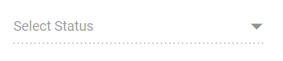

# Disabled Items in Blazor DropDownList Component

The [DropDownList](https://help.syncfusion.com/cr/blazor/Syncfusion.Blazor.DropDowns.SfDropDownList-2.html) provides options for individual items to be either in an enabled or disabled state for specific scenarios. The category of each list item can be mapped through the [Disabled](https://help.syncfusion.com/cr/blazor/Syncfusion.Blazor.DropDowns.DropDownListFieldSettings.html#Syncfusion_Blazor_DropDowns_DropDownListFieldSettings_Disabled) field in the data table. Once an item is disabled, it cannot be selected as a value for the component. To configure the disabled item columns, use the `DropDownListFieldSettings.Disabled` property.

In the following sample, State are grouped according on its category using `Disabled` field.









## Disable Item Method

The disableItem method can be used to handle dynamic changing in disable state of a specific item. Only one item can be disabled in this method. To disable multiple items, this method can be iterated with the items list or array. The disabled field state will to be updated in the [DataSource](https://help.syncfusion.com/cr/blazor/Syncfusion.Blazor.DropDowns.SfDropDownBase-1.html#Syncfusion_Blazor_DropDowns_SfDropDownBase_1_DataSource), when the item is disabled using this method. If the selected item is disabled dynamically, then the selection will be cleared.

| Parameter | Type | Description |
|------|------|------|
| itemValue | <code>string</code> \| <code>number</code> \| <code>boolean</code> \| <code>object</code> | It accepts the string, number, boolean and object type value of the item to be removed. |
| itemIndex | <code>number</code> | It accepts the index of the item to be removed. |

## Enabled

If you want to disabled the overall component to set the [Enabled](https://help.syncfusion.com/cr/blazor/Syncfusion.Blazor.DropDowns.SfDropDownList-2.html#Syncfusion_Blazor_DropDowns_SfDropDownList_2_Enabled) property to false.

